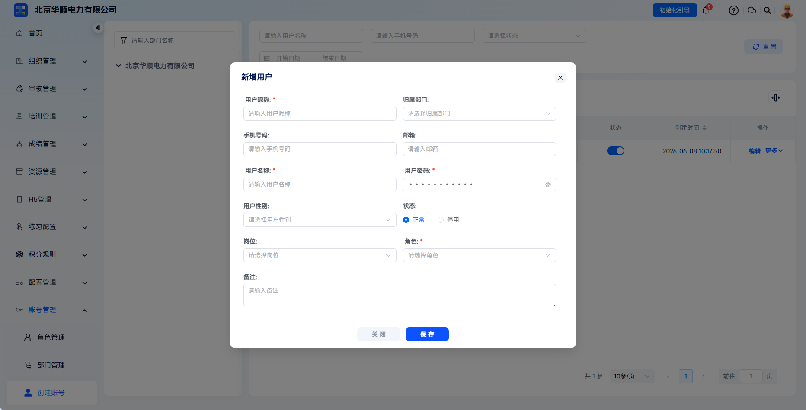

# 创建账号

用于维护企业内部用户的登录身份。管理员可为员工创建账号，配置所属部门、联系方式、岗位、账号状态和角色权限，从而建立完整的账号体系。

本文档通常用于以下场景：

- 为新管理员创建账号；
- 需要为培训、考试、组织管理等业务角色开通后台权限。
 
 

## 操作流程

### 进入创建账号页面

在左侧导航栏中，选择【账号管理】-【创建账号】，进入账号列表页面。

 

### 新增用户

点击页面上的【新增】按钮，打开【新增用户】弹窗。

 

### 填写账号信息

按照页面要求填写账号信息：

<table className="account-info-table">
  <colgroup>
    <col className="account-info-table__field" />
    <col className="account-info-table__required" />
    <col />
  </colgroup>
  <thead>
    <tr>
      <th>字段</th>
      <th>是否必填</th>
      <th>填写说明</th>
    </tr>
  </thead>
  <tbody>
    <tr>
      <td>用户昵称</td>
      <td>是</td>
      <td>用户在系统左上角的显示名称，如“行政管理处”。</td>
    </tr>
    <tr>
      <td>归属部门</td>
      <td>否</td>
      <td>选择用户所属部门，影响后续数据权限范围。</td>
    </tr>
    <tr>
      <td>手机号码</td>
      <td>否</td>
      <td>输入 11 位手机号，可用于登录验证和找回密码。</td>
    </tr>
    <tr>
      <td>邮箱</td>
      <td>否</td>
      <td>输入用户邮箱，作为用户可选联系方式。</td>
    </tr>
    <tr>
      <td>用户名称</td>
      <td>是</td>
      <td>登录账号名，创建后不可修改，需保证唯一。</td>
    </tr>
    <tr>
      <td>用户密码</td>
      <td>是</td>
      <td>设置初始密码，建议包含大小写字母、数字和特殊字符。</td>
    </tr>
    <tr>
      <td>用户性别</td>
      <td>否</td>
      <td>按实际情况选择。</td>
    </tr>
    <tr>
      <td>状态</td>
      <td>是</td>
      <td>选择【正常】或【停用】。正常状态下账号可登录，停用状态下无法登陆。</td>
    </tr>
    <tr>
      <td>岗位</td>
      <td>否</td>
      <td>选择岗位，岗位信息需在【组织管理】-【员工管理】中的岗位树部分完善。</td>
    </tr>
    <tr>
      <td>角色</td>
      <td>是</td>
      <td>选择已配置角色，决定用户可访问的功能权限。</td>
    </tr>
    <tr>
      <td>备注</td>
      <td>否</td>
      <td>填写补充说明，便于后续管理。</td>
    </tr>
  </tbody>
</table>

 

### 保存账号

确认信息无误后，点击【保存】。系统完成账号创建，并返回用户列表。

创建成功后，建议管理员同步告知用户：

- 登录地址
- 登录账号
- 初始密码
- 首次登录后需更新账号密码
 

### 配置建议

- 用户名称创建后不可修改，建议使用统一命名规范，例如手机号、工号或企业统一账号；
- 角色建议按岗位职责配置，不建议无差别赋予过高权限；
- 对临时账号或外部协作账号，建议设置清晰备注，并定期检查状态；
- 如用户暂时不需要登录，优先选择【停用】状态而不是删除。

 
 

## 常见问题

**Q：用户名称创建后可以修改吗？**

A：不可以。用户名称是登录账号名，创建后固定不可修改。如需变更，建议新建账号并停用旧账号。

---

**Q：新建账号后为什么登录看不到菜单？**

A：请检查账号状态是否为【正常】、是否已分配角色、角色是否启用，以及角色是否配置了对应菜单权限。

---

**Q：一个账号可以分配多个角色吗？**

A：可以。一个账号可拥有多个角色，系统权限按并集生效。建议避免多个角色之间权限边界不清。

---
