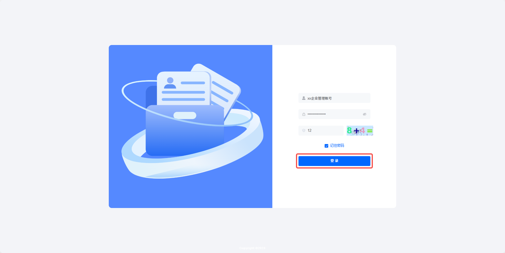

# 登录平台

本文介绍如何登录全员培训管理端。管理员完成登录后，可进入后台进行账号、组织、角色、培训、考试等模块的配置与管理。

## 功能简介

全员培训管理端面向企业管理员和业务管理人员使用。管理员通过账号、密码与验证码完成身份校验后，即可进入系统后台，根据已分配的角色权限访问对应功能菜单与数据范围。

适用场景包括：

- 首次进入全员培训管理端；
- 管理员日常维护培训、考试、账号与权限配置；
- 因登录状态失效、浏览器更换或 Cookie 清理后重新登录。

## 操作前提

开始登录前，请确认：

1. 已获得有效的管理员账号和初始密码；
2. 当前账号状态为「正常」；
3. 当前浏览器可正常访问全员培训管理端；
4. 如需接收验证码，请确保验证码图片或验证服务可正常加载。

## 操作流程

### 1. 打开管理端

在浏览器中打开全员培训管理端地址：

[https://qypxb.guangl.cn/](https://qypxb.guangl.cn/)

系统将进入登录页面。

> 图片占位：登录页截图，建议展示账号输入框、密码输入框、验证码输入框和「登录」按钮。

### 2. 输入登录信息

在登录页面依次填写：

| 字段 | 填写说明 |
| --- | --- |
| 管理员账号 | 输入系统分配的登录账号。 |
| 密码 | 输入账号对应密码。 |
| 验证码 | 根据页面展示的验证码内容填写。 |

填写完成后，点击「登录」。

### 3. 进入管理端首页

登录成功后，系统进入全员培训管理端首页。管理员可根据左侧导航栏进入账号管理、组织管理、培训任务、学习中心、积分规则等模块。

[管理端首页占位图]

> 图片占位：登录成功后的管理端首页截图，建议展示左侧导航栏和首页主体区域。

## 退出登录

如需退出当前账号，可在页面右上角找到账号入口，点击后选择「退出登录」。退出后，系统将回到登录页面。

## 常见问题

### Q：输入账号密码后无法登录怎么办？

A：请依次检查账号、密码、验证码是否填写正确；如仍无法登录，请联系管理员确认账号状态是否为「正常」，或通过重置密码后再次尝试。

### Q：为什么登录后看不到某些菜单？

A：菜单展示由账号关联的角色权限决定。请确认账号已分配角色，且角色处于启用状态并配置了对应菜单权限。

### Q：账号停用后还能登录吗？

A：不能。账号状态为「停用」时将无法登录系统，需由管理员将账号恢复为「正常」后再使用。