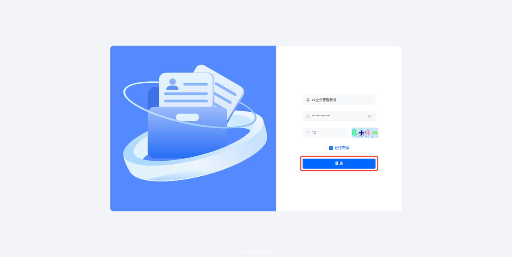
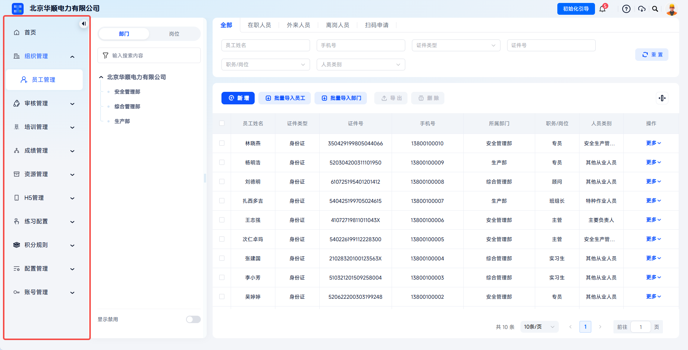
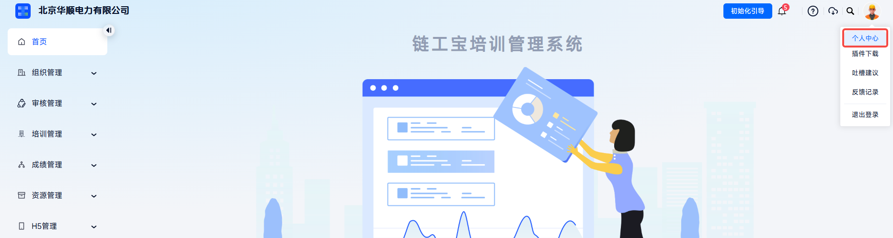
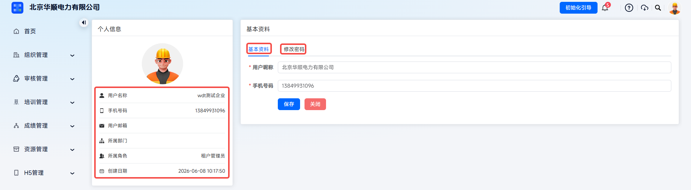
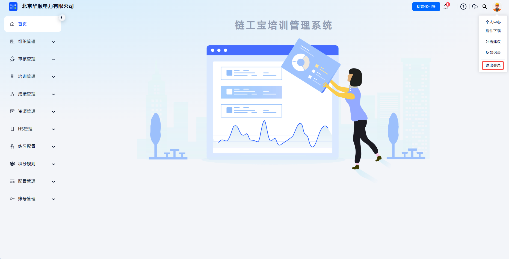

# 登录平台

全员培训管理端面向企业管理员和业务管理人员使用。管理员通过账号、密码与验证码完成身份校验后，即可进入系统后台，根据登录账号的角色权限访问对应功能菜单与数据范围。

本文档适用场景包括：

- 首次进入全员培训管理端；
- 管理员日常维护培训、考试、账号与权限配置；
- 因登录状态失效、浏览器更换或 Cookie 清理后重新登录。

 
 

## 操作流程

### 打开管理端

在浏览器中打开全员培训管理端地址：

[https://qypxb.guangl.cn/](https://qypxb.guangl.cn/)

系统将进入登录页面。

管理端登录页面用于输入企业管理员账号、密码和验证码。

 

### 输入登录信息

在登录页面依次填写：

| 字段 | 填写说明 |
| --- | --- |
| 账号 | 输入管理员登录账号。 |
| 密码 | 输入账号对应密码。 |
| 验证码 | 根据页面展示的验证码内容填写。 |

填写完成后，点击【登录】。

登录信息填写时请注意：

- 账号为管理员登录账号，通常为超管账号，或由系统管理员在【账号管理】-【创建账号】中创建；
- 密码需与账号对应，若忘记密码，可联系管理员在账号列表中重置；
- 验证码需按页面展示内容填写，验证码错误会导致登录失败。

 

### 进入管理端首页

登录成功后，系统进入全员培训管理端首页。

进入首页后，可先通过左侧菜单确认当前账号可访问的功能范围。若需要进行组织架构、员工、培训、考试、账号权限等维护，应确保当前账号已具备对应菜单权限与数据权限。

---

左侧为核心功能导航栏，管理员可根据导航栏点击进入相应功能模块。

左侧导航栏展示账号可访问的功能菜单，实际菜单范围受角色权限控制。

---

左上角显示账号用户名，logo支持点击自定义上传。

---

如您首次接触链工宝培训平台，或此账号缺乏初始化配置，可点击【初始化引导】进入引导页面，根据指引内容逐步完成基础配置与核心功能使用教学。

---

如需对功能进行搜索，可点击右上方【搜索】，即可在框内输入进行搜索。

列表筛选区可按关键字或条件查询目标数据。

---

点击右上角头像进入个人中心，可支持查看账号信息、编辑基础资料、修改密码和更改头像。

个人中心入口用于查看当前登录账号信息和基础设置。

 

### 退出登录

如需退出当前账号，可点击右上方头像，选择【退出登录】。退出后，系统将回到登录页面。

 
 

## 常见问题

**Q：输入账号密码后无法登录怎么办？**

A：请依次检查账号、密码、验证码是否填写正确；如仍无法登录，请联系管理员确认账号状态是否为「启用中」，或通过重置密码后再次尝试。

---

**Q：为什么登录后看不到某些菜单？**

A：菜单展示由账号关联的角色权限决定。请确认账号已分配角色，且角色处于启用状态并配置了对应菜单权限。

---

**Q：账号停用后还能登录吗？**

A：不能。账号状态为「停用」时将无法登录系统，需由管理员将账号恢复为「启用中」后再使用。
