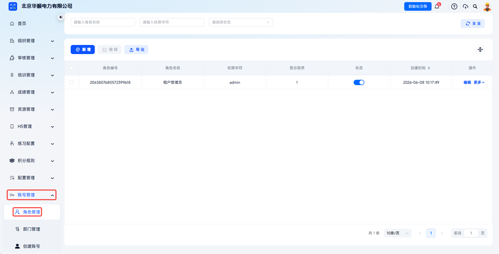
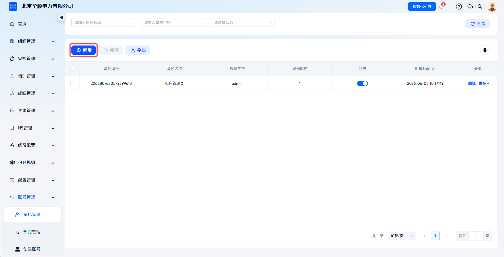
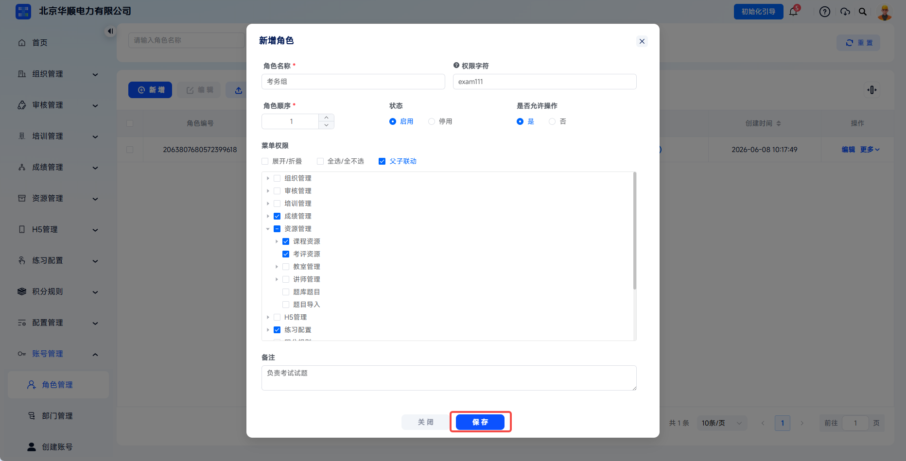
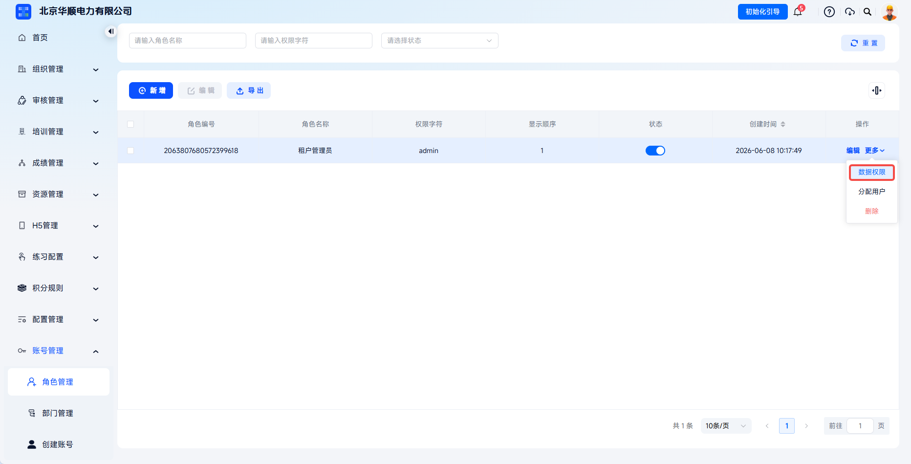
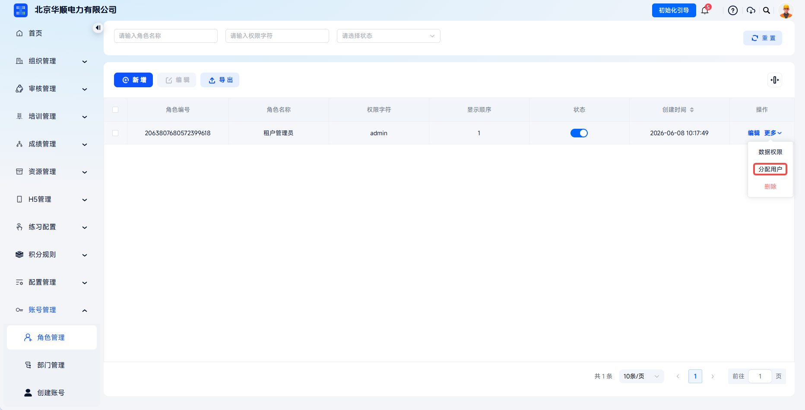
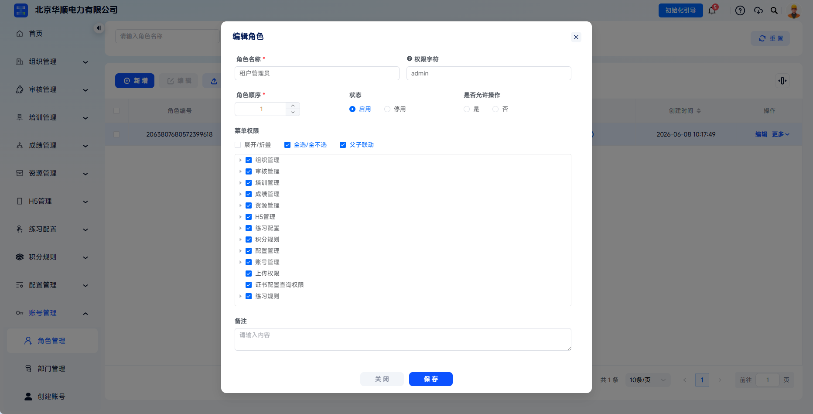
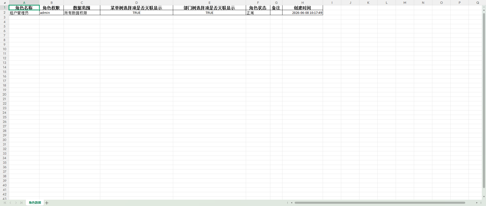

# 角色管理

支持自定义配置系统角色，通过“角色定义→菜单授权→数据授权→用户分配”四步流程，实现基于角色的访问控制。系统既支持按功能模块分配菜单权限，也支持按组织架构分配数据权限，满足企业分级管理、权限隔离、安全合规的管理需求。

本文档通常用于以下场景：

- 新增系统角色；
- 配置菜单权限；
- 配置数据权限；
- 将角色分配给用户；
- 编辑、导出或删除已有角色。

 
 

## 操作流程

### 进入角色管理

点击【账号管理】-【角色管理】，进入角色列表页。列表显示现有角色信息，包括角色编号、角色名称、权限字符、显示顺序、状态、创建时间。

角色管理列表展示已有角色及状态，是新增角色和维护权限的入口。

 

### 新增角色

点击【新增】按钮，打开【新增角色】弹窗，填写角色名称、权限字符、角色顺序、状态、是否允许操作、备注等信息。

点击【新增】后进入新增角色页面，开始配置角色基础信息。

---

| 字段 | 填写说明 |
| --- | --- |
| 角色名称 | 建议体现岗位具体职责，如“培训管理员”“考试监考员”。 |
| 权限字符 | 系统代码级权限标识，如 `admin`、`training_mgr`，需保证唯一。 |
| 角色顺序 | 控制角色在列表中的排序，数字越小越靠前。 |
| 状态 | 选择【启用】或【停用】；停用后该角色下用户无法使用对应权限。 |
| 是否允许操作 | 控制该角色是否允许进行业务操作。 |
| 备注 | 可填写角色用途、适用岗位或权限边界，便于后续审计。 |

 

### 配置菜单权限

在【菜单权限】区域，勾选该角色可访问的功能模块。支持展开/折叠菜单树、全选/全不选、父子联动，并可按模块勾选角色对应功能模块。

建议遵循“最小权限原则”，仅勾选该岗位必需的功能模块。

---
菜单权限可按功能模块配置，例如审核管理、培训管理、考试管理、成绩管理、资源管理、统计分析、配置管理、账号管理等。点击菜单树展开箭头后，可继续勾选更下层级功能。

启用【父子联动】时，勾选父级菜单会自动勾选全部子菜单；取消父级菜单会自动取消全部子菜单，适合快速维护整组权限。

 

### 保存角色

确认角色基础信息和菜单权限无误后，点击【保存】，角色创建成功。

角色基础信息和菜单权限确认无误后点击【保存】完成角色创建。

 

### 配置数据权限

点击目标角色【更多】-【数据权限】处，打开分配数据权限弹窗。

系统提供全部数据权限、自定数据权限、本部门数据权限、本部门及以下数据权限、仅本人数据权限五种范围，可根据账号管理信息权限进行分配。

数据权限配置用于控制该角色可查看的数据范围。

---

其中自定数据权限需在当前全部部门中勾选可管理部分。

---
五种数据权限适用范围：

| 数据权限 | 适用说明 |
| --- | --- |
| 全部数据权限 | 可查看和操作全量数据，不受组织架构限制，建议仅超管使用。 |
| 自定数据权限 | 自定义选择可查看的部门范围。 |
| 本部门数据权限 | 仅可查看账号所在部门的数据。 |
| 本部门及以下数据权限 | 可查看本部门及所有下级部门数据，适合部门负责人。 |
| 仅本人数据权限 | 仅可查看本人创建或关联的数据，适合数据敏感性高的岗位。 |

 

### 分配用户

点击目标角色操作栏【更多】-【分配用户】按钮，进入分配用户页面。

点击【新增】，勾选目标账号并【保存】，即成功为账号分配当前角色。

---
点击【新增】打开用户选择弹窗，准备为角色添加账号。

---

在角色账号列表勾选或直接点击【取消授权】，对应账号不再属于当前角色，失去对应角色权限。

---
确认用户选择后点击保存，完成角色与账号的绑定。

 

### 管理已有角色

已有角色可进行：

- 角色状态：选择启用或停用；

- 编辑角色：修改角色名称、权限字符、菜单权限等配置；

- 导出角色：下载角色信息清单；

角色状态切换会影响该角色下账号是否可继续使用对应权限。

---

- 删除角色：移除角色。角色下存在已分配用户时，需先取消所有用户授权或转移用户至其他角色。

编辑角色后，已分配用户的权限会自动更新并即时生效。导出角色可下载角色信息清单，便于审计和备份。删除角色前需先取消所有用户授权；否则用户会失去该角色对应的菜单权限和数据权限，可能导致功能访问异常。

 
 

## 常见问题

**Q：为什么用户登录后看不到某些菜单？**

A：请检查用户是否已分配角色、角色是否已启用、角色的菜单权限是否勾选了对应功能模块。

---

**Q：菜单权限和数据权限有什么区别？**

A：菜单权限控制能看到哪些功能页面；数据权限控制能看到哪些部门的数据，两者叠加生效。

---

**Q：一个用户可以同时拥有多个角色吗？**

A：支持。一个用户可分配多个角色，权限取并集。

---

**Q：角色删除后，原分配用户会怎样？**

A：角色删除前需先取消所有用户授权。角色删除后，用户将失去该角色对应的所有权限。
