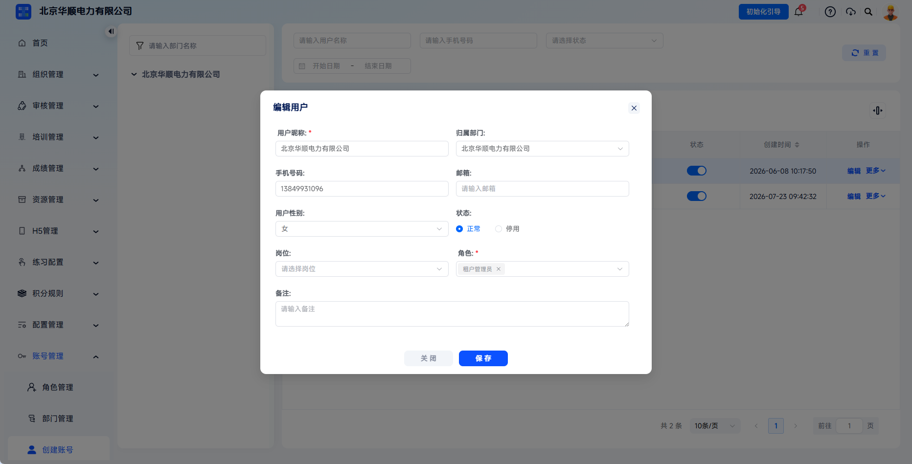
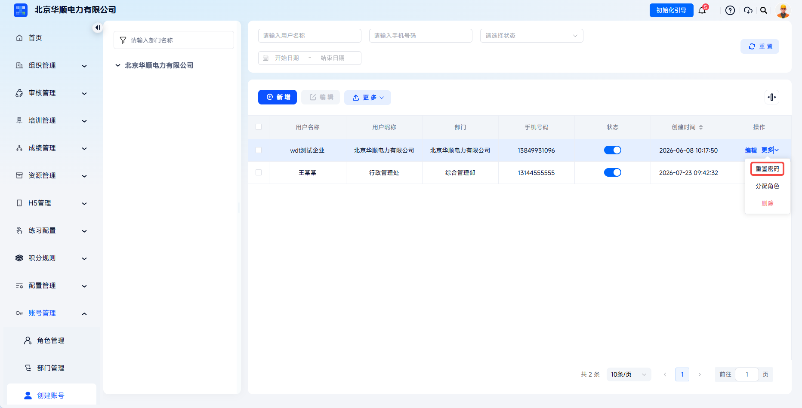
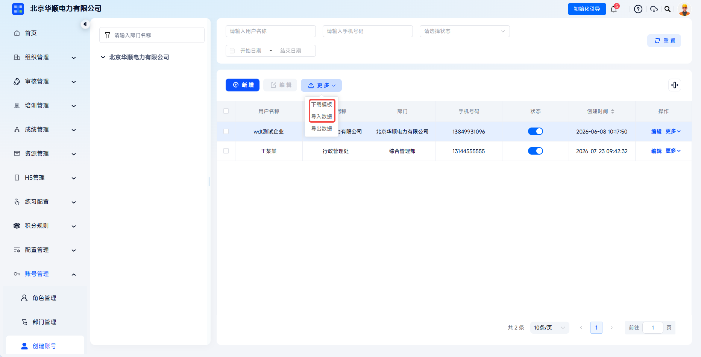
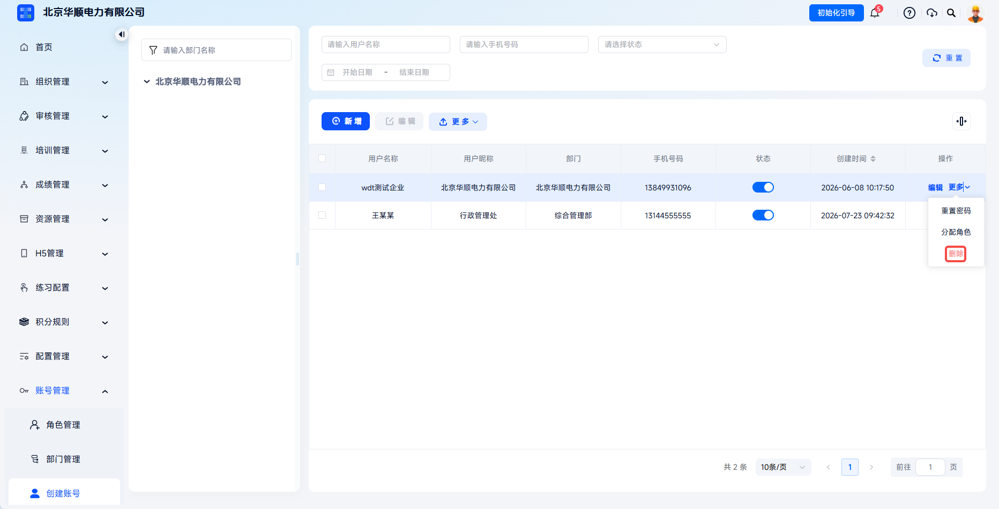

# 账号管理

通过账号与角色体系联动，管理员可精准控制每个登录账号的功能访问范围和数据查看范围，满足企业分级管理、权限隔离、安全合规的管理需求，确保系统访问安全可控。

本文档通常用于以下场景：

- 查看与新建登录账号；
- 编辑账号基础信息；
- 重置密码；
- 分配角色；
- 批量导入或删除账号。

 
 

## 操作流程

### 查看账号

点击【账号管理】-【创建账号】，可查看当前组织用户列表。点击状态栏可切换账号启用/停用状态，点击【新增】可创建新账号。

账号列表通常用于查看用户编号、用户名称、用户昵称、归属部门、手机号码、邮箱、状态、岗位、角色和创建时间等信息。用户编号由系统自动生成，不可编辑；创建时间可用于后续审计追溯。

 

### 编辑账号

点击目标账号【编辑】按钮，打开【编辑用户】弹窗。可修改用户昵称、归属部门、手机号码、邮箱、用户性别、状态、岗位、角色、备注；不可修改用户名称。

点击账号操作栏【编辑】可打开编辑用户弹窗。

---

通过【编辑】修改“归属部门”后，账号的数据权限会按新部门重新生效。例如原角色配置为【本部门数据权限】时，保存后将查看新归属部门范围内的数据。

 

### 分配角色

点击目标账号操作栏【更多】-【分配角色】，进入分配角色页面，页面显示当前已分配角色和可选角色列表。勾选目标角色并点击【提交】，即可为账号分配新角色；取消勾选角色并点击【提交】，即可将该角色从本账号移除。

分配角色页面展示当前账号已分配角色和可选角色列表。

---

勾选或取消角色后点击提交，账号权限会按角色配置重新生效。

 

### 重置密码

点击目标账号【更多】-【重置密码】，输入新密码并保存。

点击【重置密码】后打开密码设置弹窗。

---

重置密码适用于用户忘记密码或密码疑似泄露的场景。管理员重置后无需验证原密码，建议同步提醒用户尽快使用新密码登录并妥善保管。

 

### 导入账号数据

点击上方【更多】-【下载模板】下载模板并填写，点击导入数据并上传即可批量导入账号信息。

通过【更多】-【下载模板】获取账号导入模板。

---

账号数据也可通过【更多】-【导出数据】下载用户信息清单，便于权限审计、账号盘点和备份。批量导入前建议先确认模板字段、部门名称和角色名称与系统内现有配置一致。

### 删除账号
点击【更多】-【删除】可移除该账号。

删除会永久移除账号及关联数据，操作不可逆。对离职、临时停用或暂不使用的账号，建议优先切换为【停用】状态，保留历史数据和操作记录。

 
 

## 常见问题

**Q：用户名称创建后可以修改吗？**

A：不可以。用户名称是登录账号名，创建后固定不可修改，如需变更建议新建账号并停用旧账号。

---

**Q：一个账号可以分配多个角色吗？**

A：支持。在【分配角色】页面勾选多个角色即可，权限自动取并集。

---

**Q：忘记密码如何找回？**

A：可联系超管在【创建账号】列表中找到该用户，点击【重置密码】设置新密码。

---

**Q：账号停用和删除有什么区别？**

A：停用后账号无法登录，但账号本身数据和操作记录保留，可随时恢复启用状态；删除会永久清除账号及关联数据，不可恢复。建议优先对账号使用停用。

---

**Q：为什么新创建的账号登录后看不到菜单？**

A：请检查账号状态是否为正常、是否已分配角色、角色是否已启用，以及角色的菜单权限是否已配置。
