---
title: 一人一档
sidebar_position: 1
---

# 一人一档

支持为每位学员生成完整的培训档案，整合学员基本信息、培训记录、学习轨迹、考试成绩、证书信息、奖惩记录等全生命周期数据，形成标准化电子档案。

> 《安全生产法》第二十八条、第三十条规定生产经营单位应当建立安全生产教育和培训档案，如实记录安全生产教育和培训的时间、内容、参加人员以及考核结果等情况。

本文档通常用于以下场景：

- 在任务学时管理中生成学员一人一档；
- 在档案管理中查看员工档案；
- 批量导出员工一人一档；
- 用于纸质档案留存或监管备案。

 
 

## 操作流程

首先请确认您需生成的一人一档内容。

如需员工在某任务中的档案信息，请查看**任务一人一档**部分。

如需员工培训信息汇总，请查看**一人一档档案管理**部分。

 

### 任务一人一档

进入目标任务的学时管理页面，勾选目标学员，点击顶部【生成一人一档】下拉按钮，系统自动为当前任务所有勾选学员批量生成培训档案。

进入任务管理：点击【培训管理-任务管理】，进入任务管理列表页，在目标任务操作栏，点击【更多】下拉菜单，选择【学时管理】进入该任务的学员学时管理页面。

---

生成一人一档：在学时管理页面，勾选目标学员，点击顶部【生成一人一档】下拉按钮，系统自动为当前任务所有勾选学员批量生成培训档案。

---

文档将在右上角【下载内容】部分进行任务生成，成功任务可以直接点击【下载】将文件下载至本地。

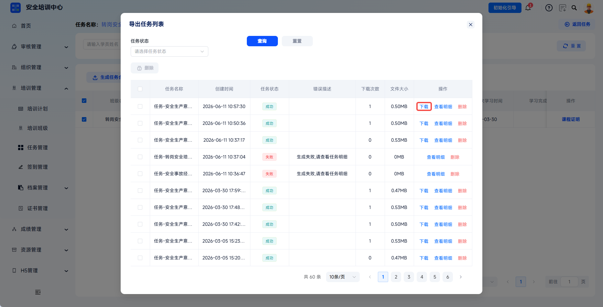

---

失败任务可以点击【查看明细】查看错误描述。

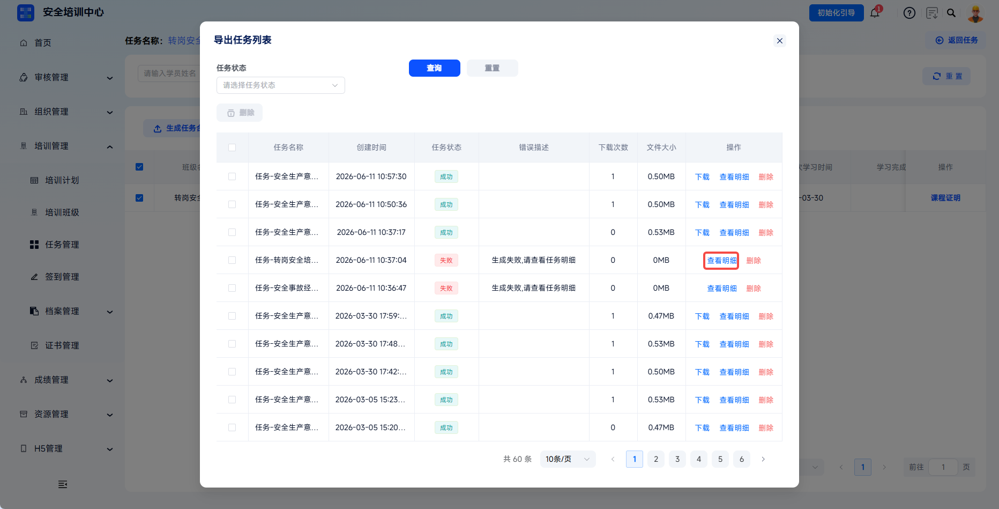
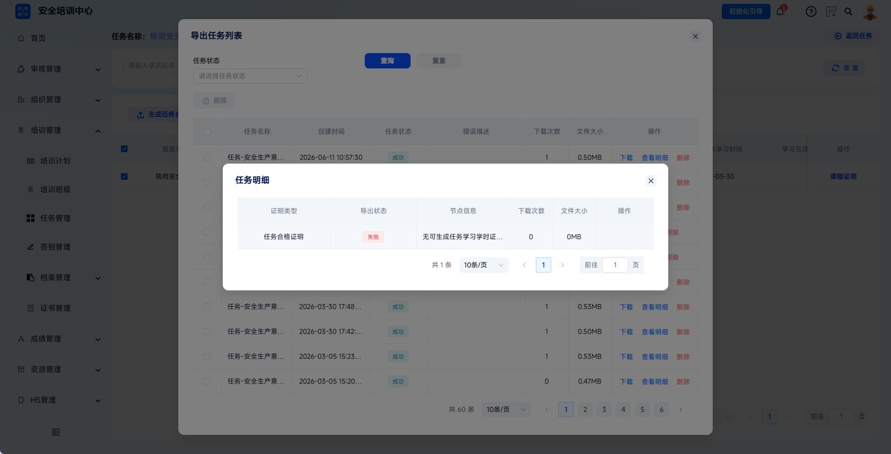

 

### 一人一档档案管理

点击【培训管理】-【档案管理】，点击【一人一档】，可查看一人一档档案汇总列表。

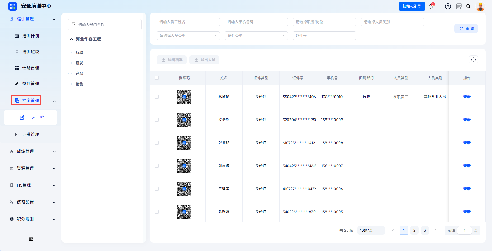

#### 查看档案内容

员工档案包含材料信息、工作经历、转岗记录、培训信息等内容。材料信息可查看证件照、身份证正反面、学历证书、从业证书、体检报告、工伤保险证明及近照等；培训信息展示员工参与的培训任务记录和订阅课程学习情况。

基本信息：查看员工的个人基础信息，包括姓名、证件号、联系方式、民族、学历、毕业院校、专业等基础人事资料。

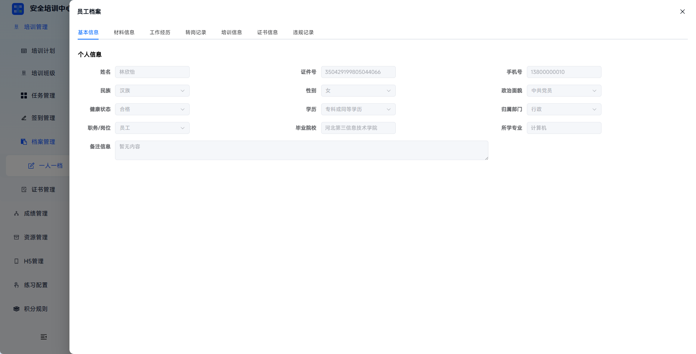

---

材料信息：查看员工的各类证件材料电子版，包括证件照、身份证正反面、学历证书、从业证书、体检报告、工伤保险证明及近照等。

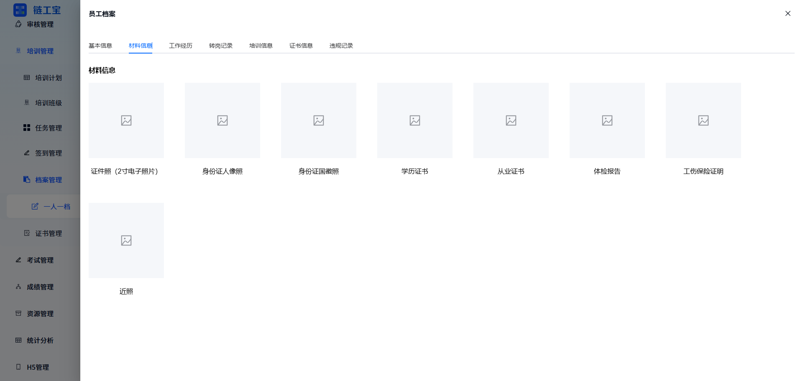

---

工作经历：以表格形式展示员工的历史工作单位、在职时间、所属部门及岗位职责等职业履历信息。

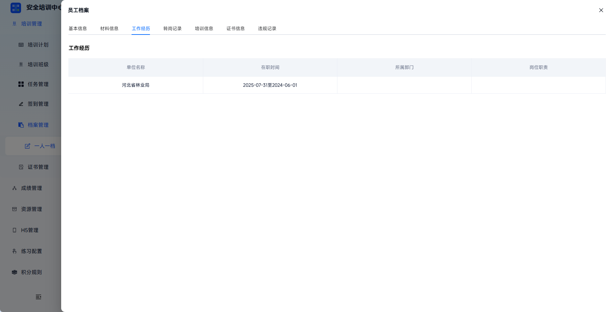

---

转岗记录：以时间轴形式展示员工的岗位变动历史，包括入职时间及各次调岗记录（显示原岗位与新岗位的变更信息及操作时间）。

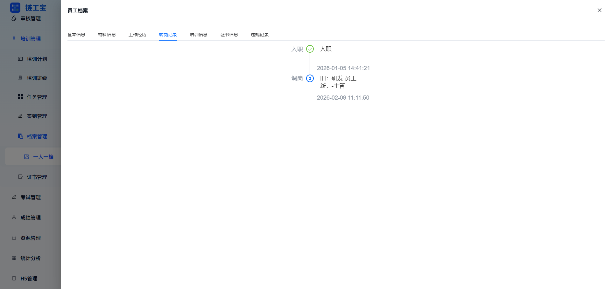

---

培训信息：展示员工参与的培训任务记录（含课程名称、培训类型、起止时间、任务状态及操作入口）以及订阅课程的学习情况。

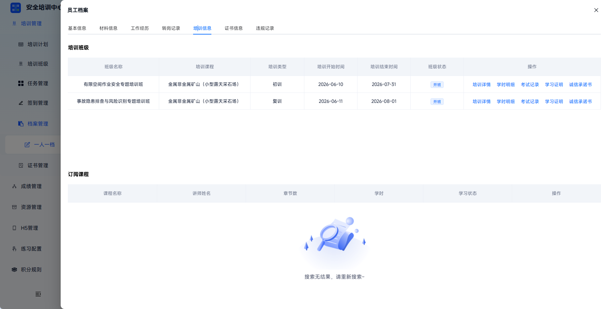

---

证书信息：展示员工持有的各类职业资格证书信息，包括证书编号、类型、签发机关、初领时间、有效期限及状态，并支持查看证书详情。

---

违规记录：记录员工的违规行为信息，包括违规名称、发生日期、情况描述、处理结果及相关图片凭证。

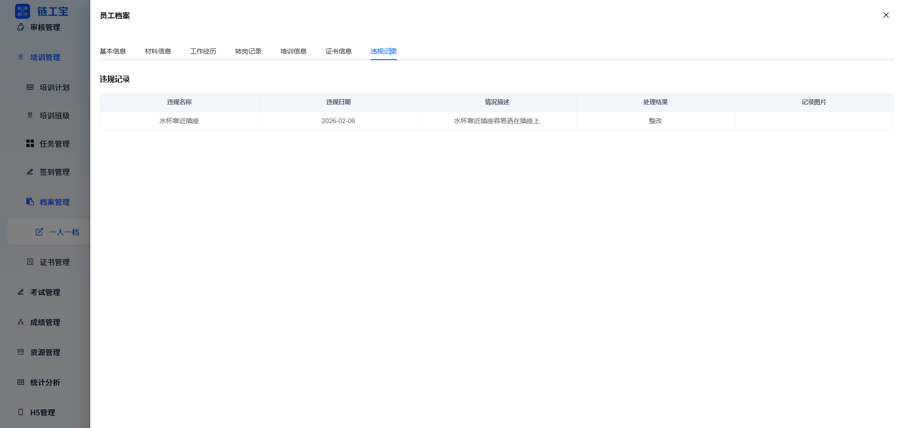

 

### 档案管理导出

在档案管理中勾选目标员工，点击【导出档案】，下载所有选中员工一人一档到本地。

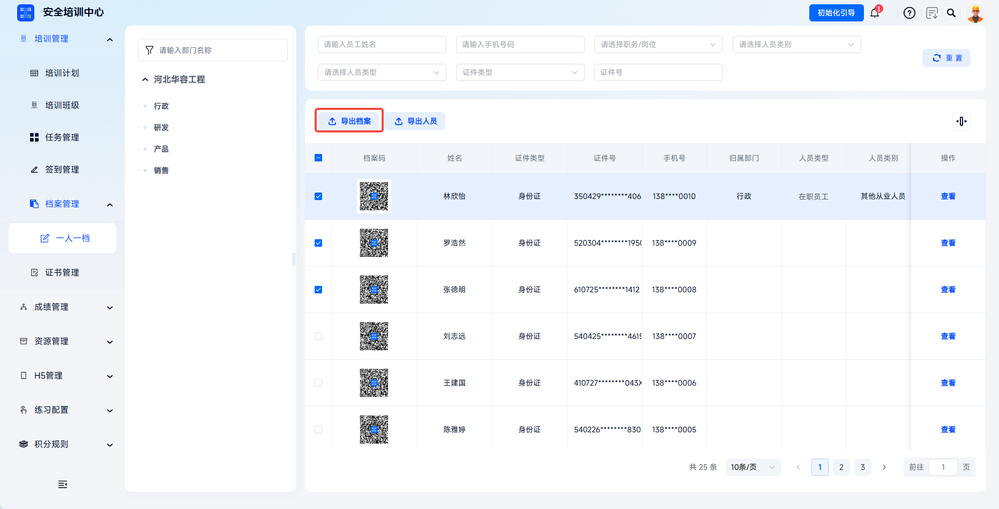
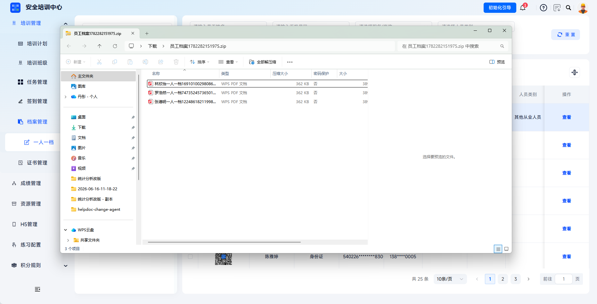
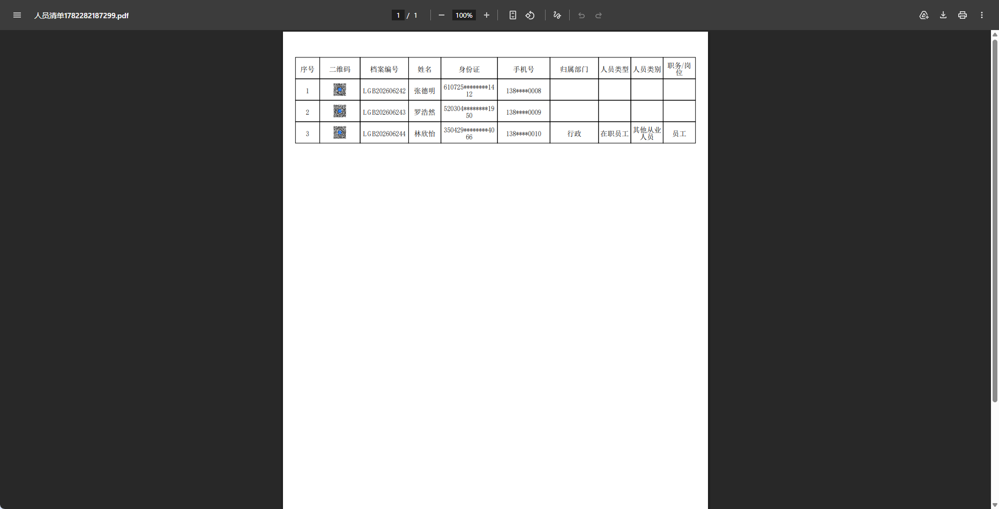

 
 

## 常见问题

**Q：为什么点击【生成一人一档】后导出任务状态显示为失败？**

A：请检查学员是否存在相关任务数据与学习记录。

---

**Q：当需要导出某员工一人一档时，应选择在哪个功能页面进行生成？**

A：建议选择在档案管理处生成并导出。如需要此员工在某任务中更详细的信息，则可以在目标任务中进行一人一档的生成与导出。

---

**Q：档案内容可以直接修改吗？**

A：档案内容来源于系统学习记录，不可直接修改。如需更正，需先修正学员的学习记录，然后重新生成档案。
