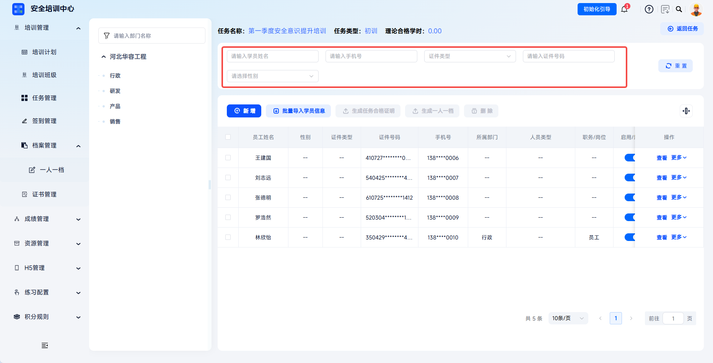
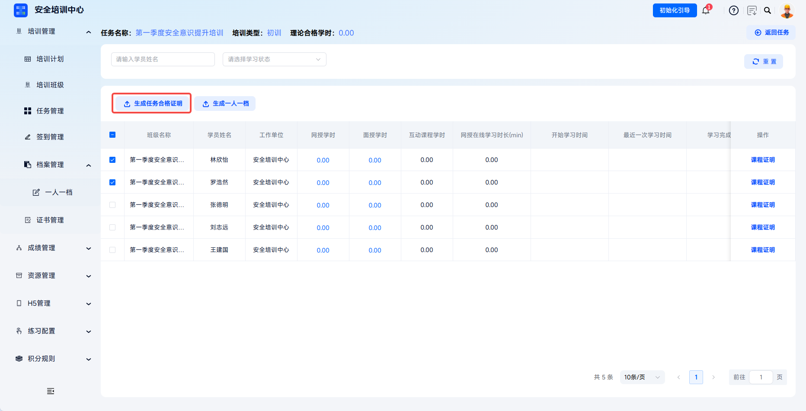
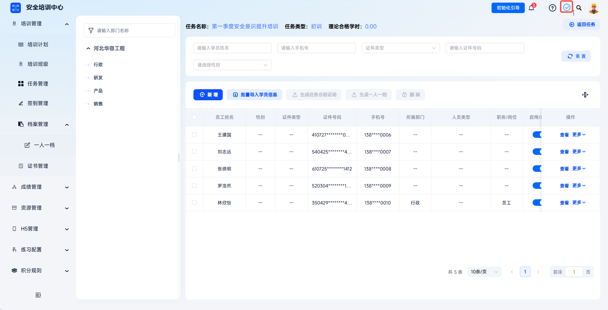
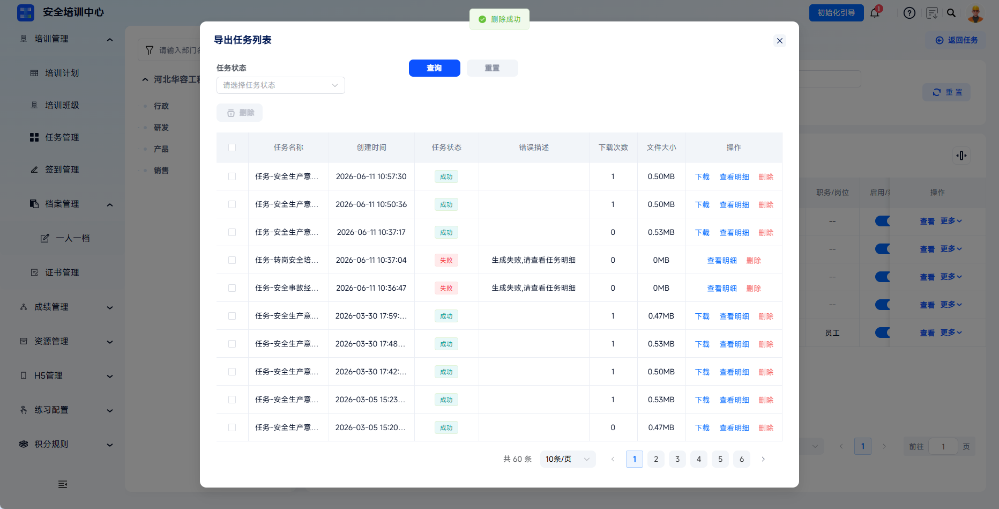
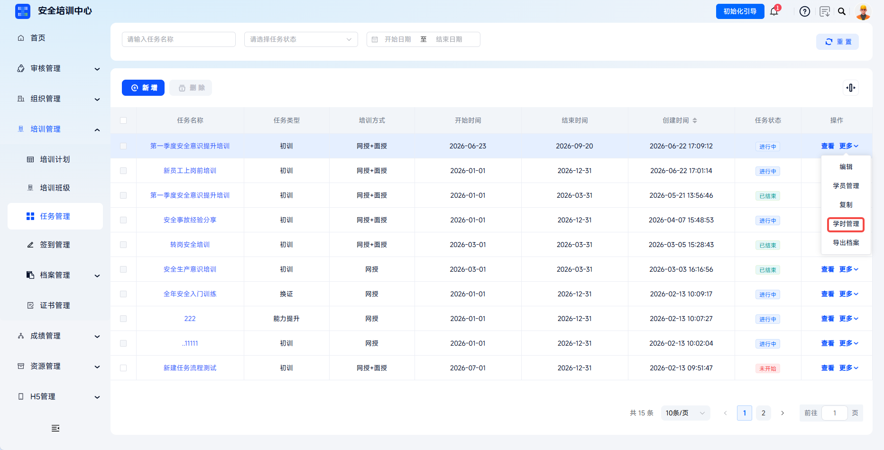

---
title: 任务合格证明
sidebar_position: 2
---

# 任务合格证明

支持为完成培训任务的学员生成合格证明，涵盖任务维度合格证明和课程维度证明，实现“任务→学习→考核→证明”的闭环管理。

本文档通常用于以下场景：

- 为完成培训且考核达标的学员生成任务合格证明；
- 批量生成证明；
- 下载生成成功的证明文件；
- 已结束任务中通过学时管理生成证明。

 
 

## 操作流程

### 生成任务合格证明

点击【培训管理-任务管理】，点击目标任务【学员管理】或【学时管理】。

---

筛选并勾选需要生成证明的学员，点击【生成任务合格证明】，系统自动为选中学员批量生成此任务维度下的任务合格证明。

---

如有地方模板需求，需提前在【配置管理-证书模板管理】处进行配置，在“选择模板”弹窗中选中，系统将按照选中模板进行生成。

 

### 导出任务合格证明

系统开始生成文件，根据数据量大小可能需要几秒至几分钟；在平台右上角【下载内容】处可以找到下载的档案内容。

---

生成成功的导出任务可点击【下载】将任务合格证明下载至本地。

 

### 已结束任务证明生成

已结束任务操作栏没有【学员管理】选项，仅可通过【学时管理】生成任务合格证明。

 
 

## 常见问题

**Q：为什么点击【生成任务合格证明】后导出任务列表显示任务状态为失败？**

A：建议点击失败导出任务操作栏的【查看明细】查看失败原因。如果系统中没有学员的任务数据时，系统不允许生成合格证明。

---

**Q：任务合格证明和课程证明有什么区别？**

A：任务合格证明涵盖整个培训任务，包含任务内所有课程和考核的综合结论；课程证明针对单门课程，可单独证明某课程的学时或考试情况。

---

**Q：证明生成后可以修改内容吗？**

A：证明内容来源于系统学习记录，不可直接修改。

---

**Q：已结束的任务还能生成证明吗？**

A：可以。任务结束后，学员的历史学习记录仍保留，管理员仍可在【学时管理】页面中为已完成学习的学员生成证明。
