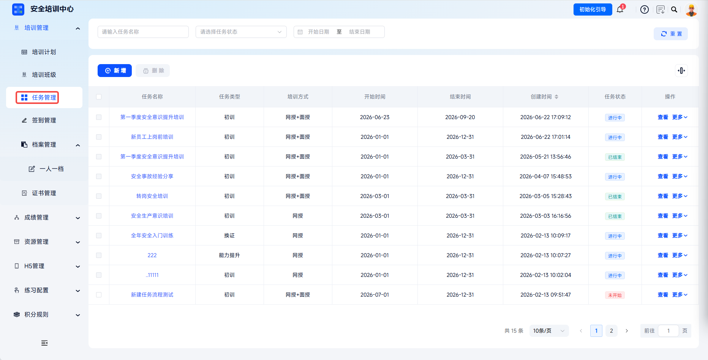
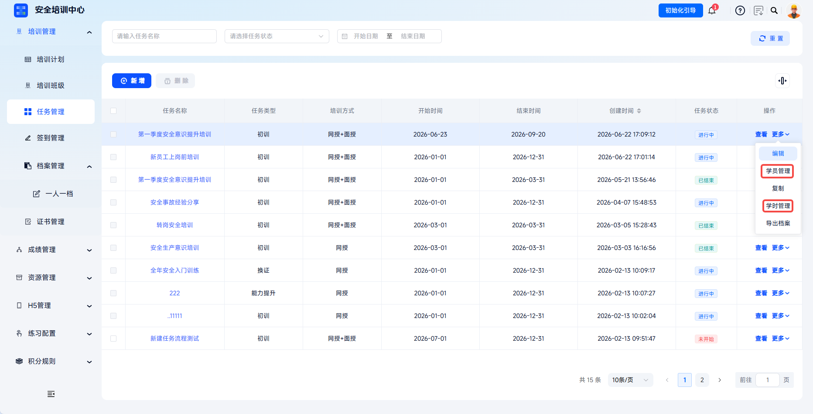
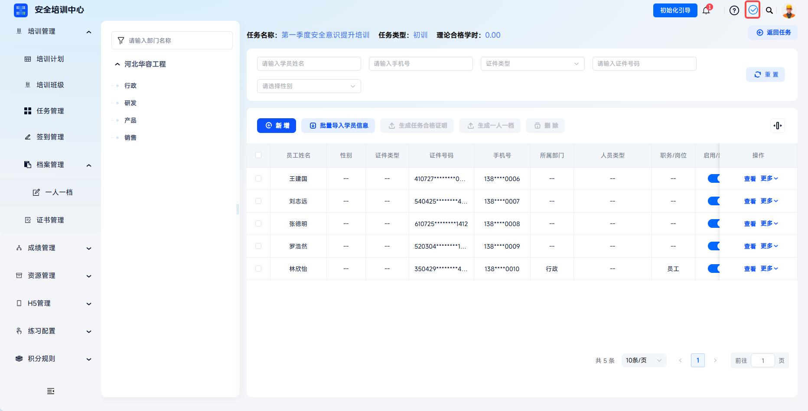

---
title: 学时证明
sidebar_position: 3
---

# 学时证明

学时证明是记录学员完成培训课程学习时长的重要凭证，用于证明学员已完成规定学时的安全培训学习。平台支持培训任务生成学时证明，满足安全培训业务场景下的合规存档需求。

本文档通常用于以下场景：

- 为学员生成课程级学时证明；
- 下载生成成功的证明文件。

 
 

## 操作流程

### 生成证明

进入任务管理：点击【培训管理-任务管理】，进入任务列表页面。

---

选择目标任务：找到需要生成学时证明的培训任务，点击操作栏【更多-学员管理】，进入任务学员管理页面。如果任务已结束无法打开任务学员管理页面，可点击【更多-学时管理】进入学时管理界面进行生成。

---

在学员列表中，找到需要生成证明的学员，点击操作栏【更多】-【课程证明】，打开【生成课程证明】弹窗。

---

学时证明导出：勾选需要生成证明的课程（支持多选），点击【生成课程学时证明】，系统开始创建新导出任务。

---

如有地方模板需求，需提前在【配置管理-证书模板管理】处进行配置，在“选择模板”弹窗中选中，系统将按照选中模板进行生成。点击【下载】即完成证明生成。

 

### 下载证明

在平台右上角【下载内容】处可以找到下载的档案内容，生成成功的导出任务可点击【下载】将证明下载至本地。

---

生成成功的导出任务可点击【下载】将任务合格证明下载至本地。

 
 

## 常见问题

**Q：哪些学员可以生成学时证明？**

A：目标培训任务需存在学员学习记录，且学员已完成对应课程的学习任务。

---

**Q：任务已结束还能生成学时证明吗？**

A：可以通过【更多】-【学时管理】进入学时管理界面进行生成。

---

**Q：学时证明内容可以直接修改吗？**

A：证明内容来源于系统学习记录，不可直接修改。
