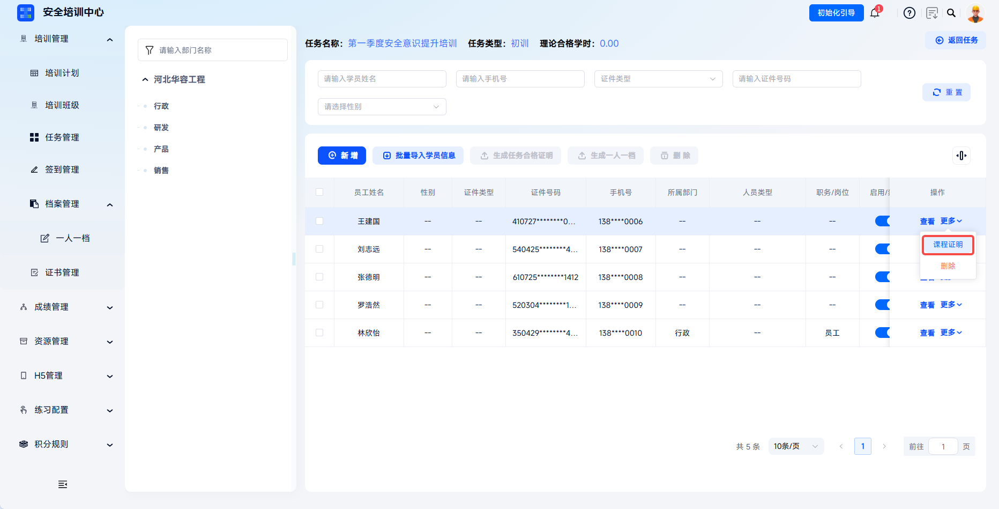
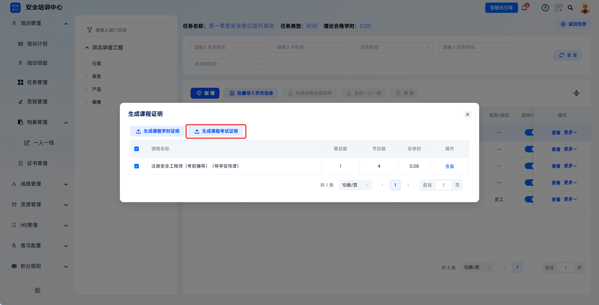
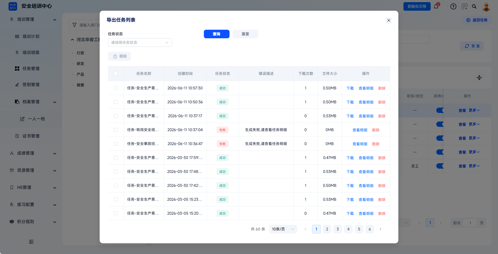

---
title: 课程考试证明
sidebar_position: 4
---

# 课程考试证明

课程考试证明用于记录学员在课程维度的考试合格情况，是学员相关档案中的一种证明材料。平台可在任务学员管理或学时管理中按课程生成考试证明。

本文档通常用于以下场景：

- 为学员生成课程级考试证明；
- 下载生成成功的课程考试证明。

 
 

## 操作流程

### 生成证明

进入任务管理：点击【培训管理-任务管理】，进入任务列表页面。

---

选择目标任务：找到需要生成档案的培训任务，点击操作栏【更多-学员管理】，进入任务学员管理页面。如果任务已结束无法打开任务学员管理页面，可点击【更多-学时管理】进入学时管理界面进行生成。

---

选择目标学员：在学员列表中，找到需要生成证明的学员，点击操作栏【更多-课程证明】，打开"生成课程证明"弹窗。

---

考试证明导出：勾选需要生成证明的课程（支持多选），点击【生成课程考试证明】，系统创建新导出任务成功。

如有地方模板需求，需提前在【配置管理-证书模板管理】处进行配置，在“选择模板”弹窗中选中，系统将按照选中模板进行生成。

 

### 下载证明

在平台右上角【下载内容】处可以找到下载的档案内容。

---

生成成功的导出任务可点击【下载】将任务合格证明下载至本地。

 
 

## 常见问题

**Q：课程考试证明和任务合格证明有什么区别？**

A：课程考试证明针对单门课程的考试合格情况；任务合格证明涵盖整个培训任务，包含任务内所有课程和考核的综合结论。

---

**Q：哪些学员可以生成课程考试证明？**

A：目标培训任务需存在学员学/考培训环节记录，且学员已完成相应课程考试。

---

**Q：证明生成后可以修改内容吗？**

A：证明内容来源于系统学习记录，不可直接修改。如需更正，需先修正学员的学习记录，然后重新生成证明。
