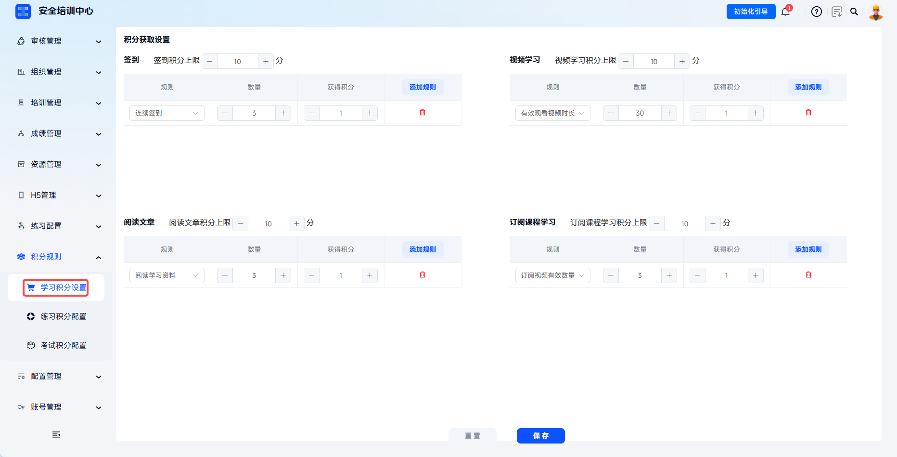
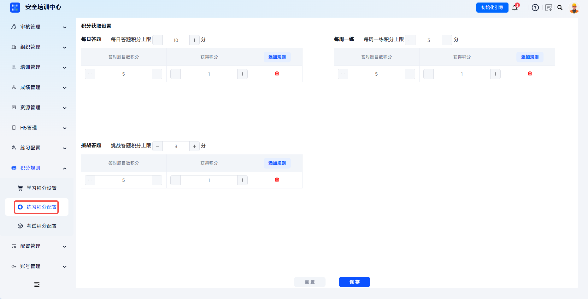

---
title: 积分规则配置
sidebar_position: 1
---

# 积分规则配置

积分是平台激励学员参与学习、考试、练习的重要机制，通过“行为→积分→激励”的闭环设计，提升学员学习积极性和培训完成率。系统支持学习积分、练习积分、考试积分三大维度，覆盖签到、视频学习、阅读文章、订阅课程、每日一练、每周一练、挑战答题、每月一考、在线考试、季度考试等场景。

本文档通常用于配置学习、练习、考试积分，设置积分上限和获取规则。

 

## 操作流程

### 积分体系一览

| 积分类型 | 适用场景 | 积分维度 |
| --- | --- | --- |
| **学习积分** | 日常学习行为激励 | 签到、视频学习、阅读文章、订阅课程学习 |
| **练习积分** | 日常练习行为激励 | 每日一练、每周一练、挑战答题 |
| **考试积分** | 考试达标激励 | 每月一考、在线考试、季度考试 |

学员可在个人中心查看积分明细和排名。积分可用于参与抽奖、参与排名等，管理员可在【统计分析】中查看积分排行和学员排行分析。

### 学习积分配置
点击【积分规则-学习积分设置】，进入学习积分配置页。

设置积分上限：
- 签到积分上限：设置学员通过签到可获得的最大积分（"-"减少，"+"增加，支持手动输入）
- 视频学习积分上限：设置学员通过观看视频可获得的最大积分
- 阅读文章积分上限：设置学员通过阅读文章可获得的最大积分
- 订阅课程学习积分上限：设置学员通过学习订阅课程可获得的最大积分

---

添加积分规则：在各模块下方点击【添加规则】按钮即可配置规则参数。
规则：定义触发积分的行为条件
- 签到：每日签到、连续签到
- 视频学习：有效观看视频时长、观看视频数量
- 阅读文章：阅读安全资讯、阅读通知公告、阅读学习资料
- 订阅课程学习：订阅视频有效数量、订阅视频有效时长

---

数量：设置行为发生的次数或时长

获得积分：设置满足条件后获得的积分值

 

### 练习积分配置

点击【积分规则-练习积分配置】，进入练习积分配置页。

设置积分上限：
- 每日一练积分上限：设置每日答题练习可获得的最大积分
- 每周一练积分上限：设置每周答题练习可获得的最大积分
- 挑战答题积分上限：设置挑战答题模式可获得的最大积分

---

添加积分规则：在各模块下方点击【添加规则】按钮即可配置规则参数。
- 规则：答对题目数__题可获取__积分

 

### 考试积分配置

点击【积分规则】-【考试积分配置】，进入考试积分配置页。

设置积分上限：
- 每月一考积分上限：设置月度考试可获得的最大积分
- 在线考试积分上限：设置在线考试可获得的最大积分
- 季度考试积分上限：设置季度考试可获得的最大积分

---

添加积分规则：在各模块下方点击【添加规则】按钮即可配置规则参数。
- 规则：考试达到合格__次可获取__积分

 
 

## 常见问题

**Q：积分规则设置后何时生效？**

A：点击【保存】后即时生效，学员后续的行为将按新规则计算积分。历史已获得的积分不会回溯调整。

---

**Q：学员积分可以手动修改吗？**

A：系统通常不支持管理员手动修改学员积分，以保证公平性。

---

**Q：为什么设置了积分规则但学员没有获得积分？**

A：请检查规则是否已保存、学员行为是否满足规则条件、积分是否已达上限、学员账号状态是否正常。

---

**Q：考试积分是按考试次数还是合格次数计算？**

A：根据附件内容，考试积分按考试达到合格次数计算。
