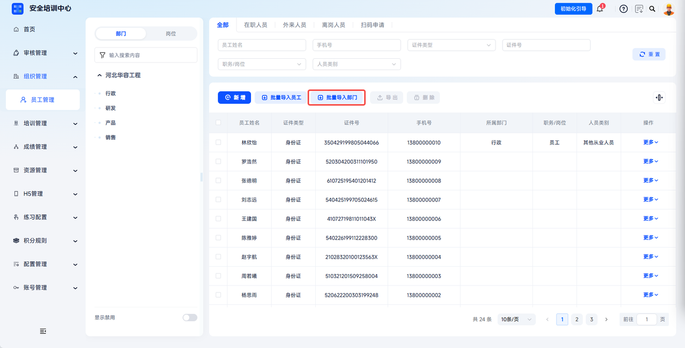
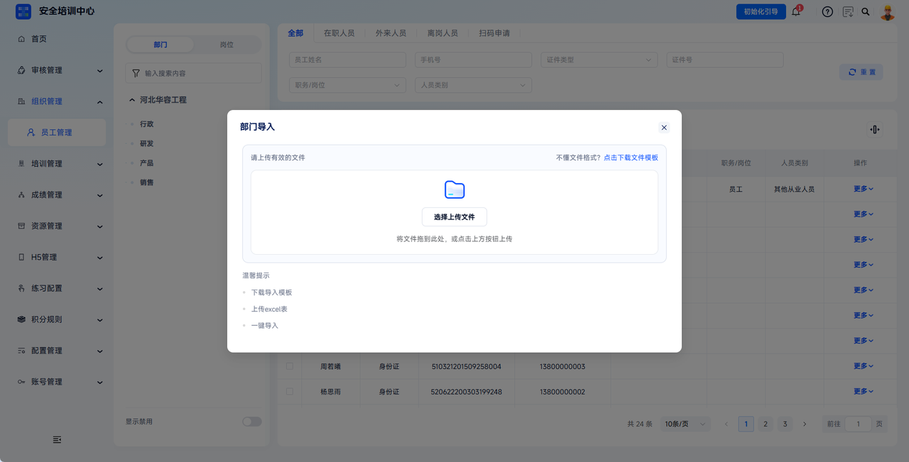
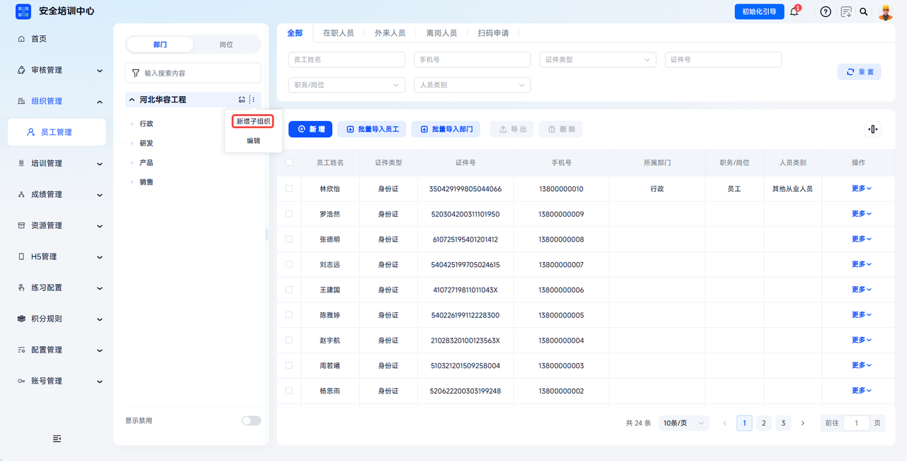
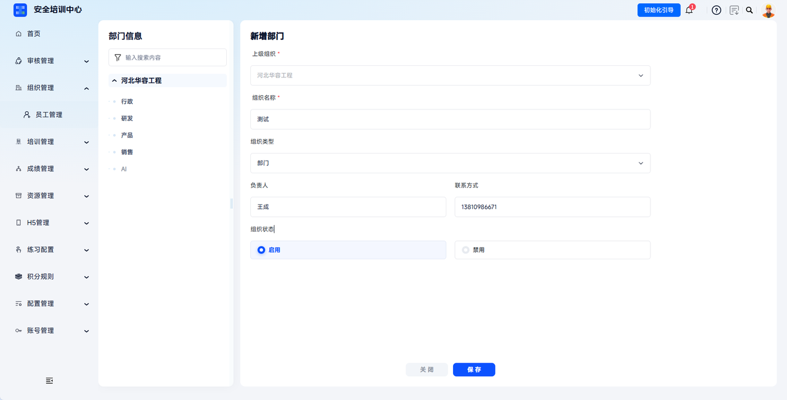
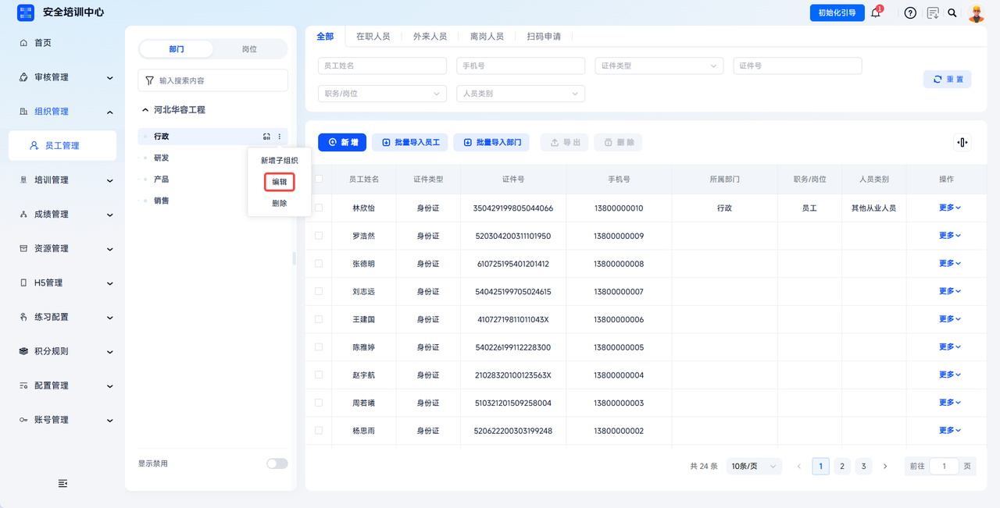
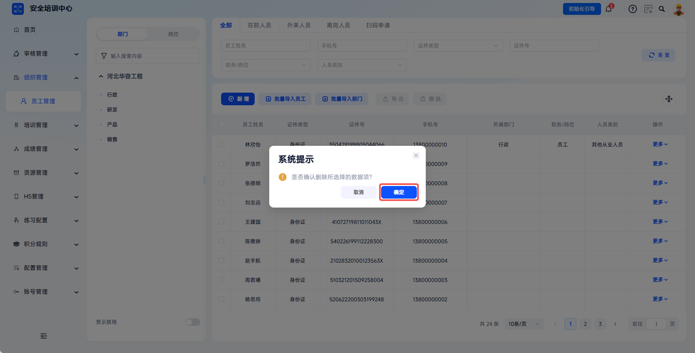

# 如何维护企业组织架构

:::info 适用角色
**管理员**
:::

## 功能说明

用于自定义企业（集团 → 公司 → 部门 → 班组）多级层级，生成部门唯一"企业码"，支持员工扫码快速入职，为后续培训、考试、统计提供组织维度。

:::note 合规依据
《安全生产法》第四条、第二十八条明确，生产经营单位必须建立全员安全生产责任制，落实"管业务必须管安全"到各个岗位和部门。平台通过可视化组织架构树将安全责任逐级分解到部门/岗位，满足监管对"责任到部门、到岗位"的核查要求。
:::

---

## 操作前提

1. 当前账号拥有【组织管理】-【员工管理】的**查看、新建与编辑**权限；
2. 建议操作前先梳理好企业内部的层级关系（如：总公司 → 分公司 → 部门 → 班组）。

---

## 操作步骤

### 1. 批量导入部门

点击【组织管理 - 员工管理】，点击【批量导入部门】，下载模板填写后上传，可大批量导入组织信息。

---

### 2. 新增子组织

如需单独新增组织或子组织，在左侧部门树中，悬停目标父组织，点击【新增子组织】，填写相应字段后保存。

---

### 3. 填写组织信息

弹出新增部门页面后，填写弹窗内各字段（`*` 为必填），完成后点击【保存】即新增成功。

---

### 4. 编辑组织信息

点击【组织管理 - 员工管理】，在部门树中点击目标部门对应的【编辑】，在弹窗中修改信息后点击【确定】完成修改。

---

### 5. 删除部门

点击【组织管理 - 员工管理】，在部门树中点击目标部门对应的【删除】，在确认弹窗中点击【确定】完成删除。

:::warning 注意
删除操作完成后会影响该部门下所有员工的数据，请谨慎操作！  
若部门下存在员工或子部门，系统将禁止删除，请先完成人员迁移后再操作。
:::

---

## 关键字段说明

| 字段名称 | 说明 |
|---|---|
| 上级组织 | 决定该部门在架构树中的层级位置。通过【新增子组织】添加时，上级组织自动确定，无需手动选择。 |
| 组织类型 | 根据规模与所属关系，可选【集团】、【单位】或【部门】。 |
| 组织名称 | 组织的正式名称。在架构树中可点击展开符号对下属组织进行展开/折叠。 |
| 负责人/联系方式 | 保存负责人及联系方式，便于事前联系。 |
| 组织状态 | 显示组织当前是否启用。禁用后，新员工无法通过手动添加或扫码方式加入该部门，且该部门下无法再添加子部门。 |
| 企业码 | 所有启用组织均可生成企业码。员工在有效期内用 H5 端扫码，填写个人信息后即可申请加入部门。如开启【扫码后需要审核】，则需管理员审核通过后方可加入。 |
| 筛选 | 可通过"组织名称"、"组织类型"、"状态"筛选组织列表。 |

---

## 常见问题

**Q：为什么我无法删除某个部门？**

A：为了保证数据安全，若该部门下存在员工或子部门，系统将禁止删除。请先完成人员迁移后再操作。

---

**Q：部门名称修改后，之前的培训记录会受影响吗？**

A：不会。系统采用唯一 ID 追踪部门，名称变更仅影响展示，不影响历史数据的统计和合规证明的生成。

---

**Q：员工扫码加入时，如何确保他们进入了正确的部门？**

A：管理员可生成"部门专用码"（针对特定部门的二维码），或在开启审核模式后，在审核时手动指派员工的最终所属部门。
