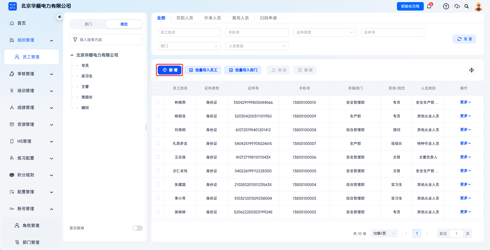
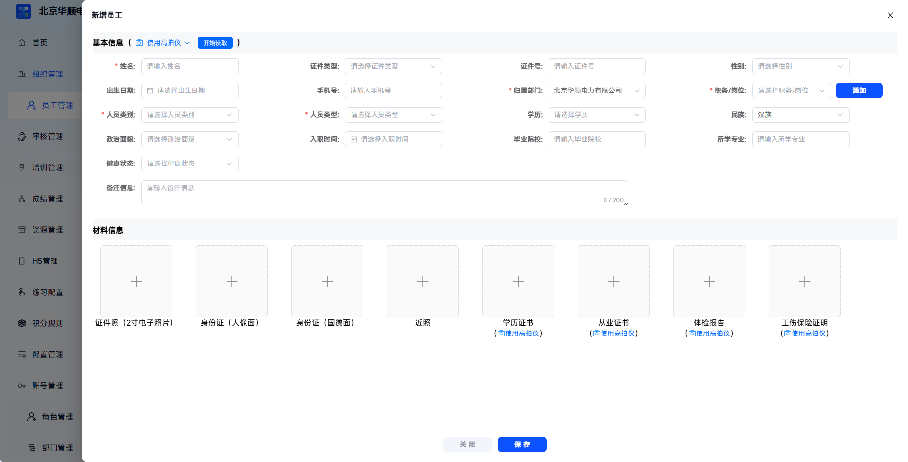
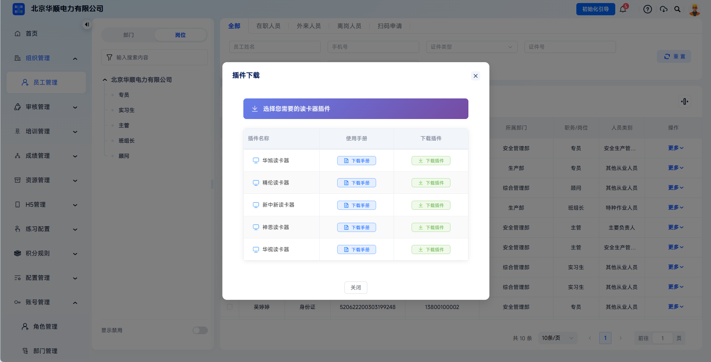
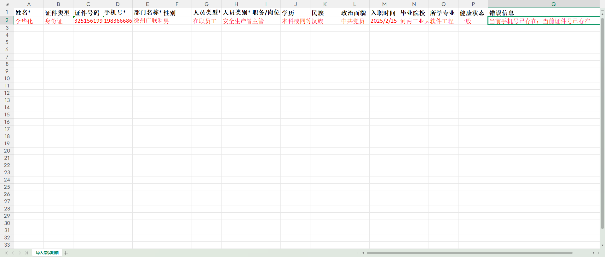
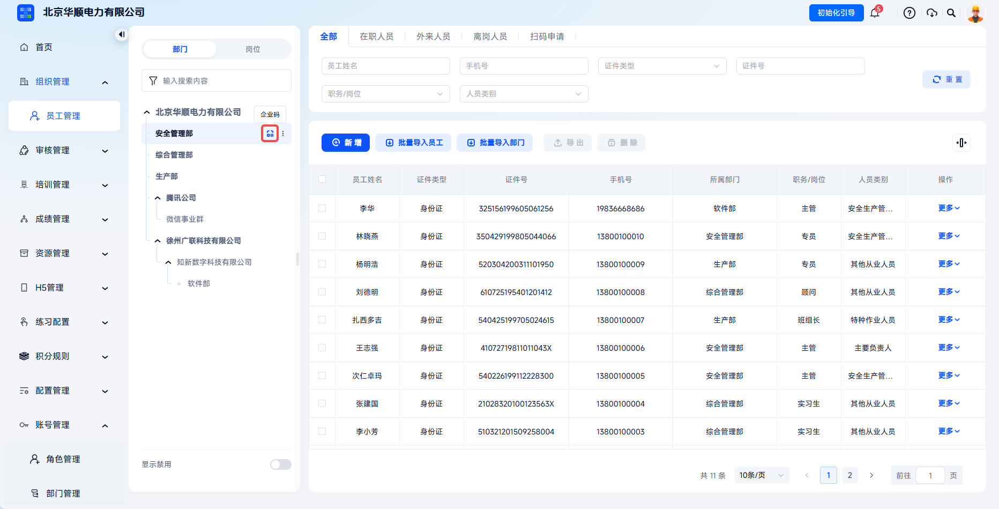
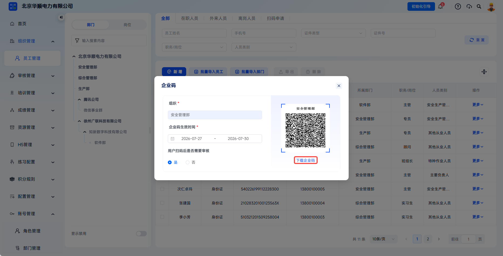
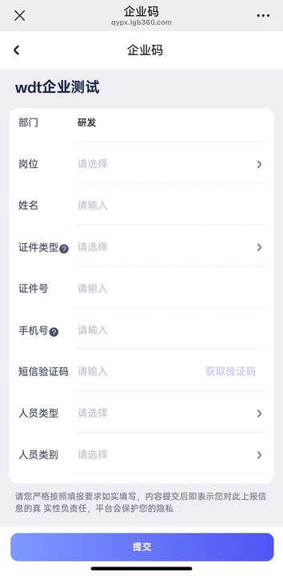
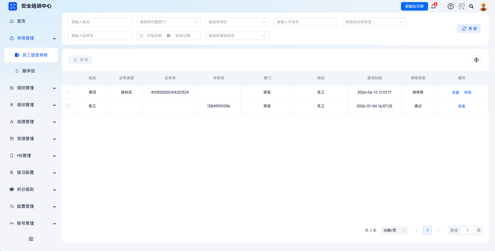

# 员工导入

用于通过新增、批量导入或企业码扫码申请的方式维护员工信息。员工信息是培训任务分配、学时统计、档案生成的核心依据，需确保准确性和时效性。

本文档通常用于以下场景：

- 零星入职、补录或临时用工，需要单条录入员工；
- 通过 Excel 模板一次性导入大批量员工；
- 员工扫码自助填写信息，由管理员审核后入职。

 
 

## 操作流程

### 单个新增员工

点击【组织管理】-【员工管理】，点击【新增】，打开新增员工弹窗。

按照页面要求录入基本信息，包括姓名、性别、出生日期、民族、政治面貌、学历、毕业院校、所学专业、健康状态、证件类型、证件号、手机号、归属部门、职务/岗位、人员类别、人员类型等。

| 字段 | 填写说明 |
| --- | --- |
| 姓名 | 应与身份证件保持一致。 |
| 证件类型/证件号 | 支持身份证、军官证、护照、其他等；选择证件类型后，应填写对应合法号码。 |
| 手机号 | 输入 11 位号码，手机号需保持唯一。 |
| 归属部门 | 选择启用状态部门，影响培训任务分配范围和统计口径。 |
| 职务/岗位 | 与岗位管理联动，需选择已启用岗位。 |
| 人员类型 | 可按员工管理、新员工、外来员工等用工维度选择。 |
| 人员类别 | 可按主要负责人、安全生产管理人员、特种作业人员、班组长、其他从业人员等职责维度选择。 |

---

如需使用读卡器，可点击右上角账号头像并点击【插件下载】，根据所需读卡器类型下载使用手册与插件。提前安装读卡器插件能够更便捷地录入员工信息。

如需使用读卡器，可从账号头像处进入插件下载入口。

---

根据读卡器类型下载并安装对应插件或使用手册。

---

材料信息可按需上传证件照、身份证人像面、身份证国徽面、近照、学历证书、从业证书、体检报告、工伤保险证明等。支持使用高拍仪，也可手动上传本地图片。

使用高拍仪时，可通过【使用高拍仪】自动拍照并识别文字，系统会将识别结果回填到对应基本信息栏。手动上传时，可点击各材料槽位的【上传】图标选择本地图片，并按需裁剪或旋转。

 

### 批量导入员工

点击【组织管理】-【员工管理】，点击【批量导入员工】，保存导入员工信息模板至本地。

点击【批量导入员工】进入员工批量导入流程。

---

填写模板时需注意：

- 请勿修改模板表头名称、顺序或合并单元格；
- 标 `*` 列为必填，其余可选填；
- 手机号、证件号不可重复。

| 字段 | 填写要求 | 常见错误 |
| --- | --- | --- |
| 姓名 | 与身份证一致，不含空格。 | 前后空格导致系统提示姓名不符。 |
| 证件类型 | 下拉选择身份证、军官证、护照或其他。 | 手动输入“居民身份证”可能无法识别。 |
| 证件号码 | 与证件类型匹配；身份证末位 `X` 需大写。 | 未输入对应证件类型的正确证件号码。 |
| 手机号 | 11 位数字，全局唯一。 | 一行填写 2 个号码或用逗号分隔。 |
| 部门名称 | 需与部门树中名称完全一致，支持用 `/` 表示多级，如“总部/生产部/一班”。 | 部门名称与系统内不完全一致。 |
| 职务/岗位 | 需在岗位树中已创建且启用。 | 填写未创建或已禁用岗位。 |
| 人员类型、人员类别 | 按模板选项填写，为必填项。 | 填写不在选项范围内的内容。 |

填写完成后从弹窗上传系统，上传文件后系统先进行校验。

全部员工信息导入成功时，系统提示导入成功并刷新员工列表，新员工信息出现在员工管理页面中。

---
部分或全部失败时，无误行会正常导入，失败信息可点击弹窗中【导出错误信息】导出并查看错误详情，可根据错误信息进行修改并重新导入。

---
导入失败时可查看错误信息并定位需要修改的数据。

---

导入完成后建议抽查 5-10 条数据，确认部门、岗位等相关信息无误。导入过程目前不支持中断或撤销，批量操作前请先核对模板内容。

 

### 企业码扫码申请

在左侧部门树找到目标部门，点击对应【企业码】按钮，设置企业码生效时间、审核模式等参数。

企业码入口用于为指定部门生成员工扫码加入二维码。

---

企业码适用于新员工批量入职、临时人员快速登记、多分支机构分散入职等场景。配置时需注意：

| 配置项 | 说明 |
| --- | --- |
| 企业码生效时间 | 选择二维码有效期限，过期后扫码将提示二维码失效，需重新生成。 |
| 审核模式 | 默认为开启审核；开启后需管理员在【审核管理】-【员工信息审核】中确认，关闭后员工提交即自动加入员工清单。 |
| 使用范围 | 建议根据部门、有效期和审核要求明确分发对象，避免员工进入错误部门。 |

配置完成后，点击【下载企业码】，系统生成二维码图片。

开启审核后，员工扫码提交的信息需管理员审核通过后才会入库。

---

员工使用微信或浏览器扫描企业码，进入 H5 信息填写页面，填写岗位、姓名、证件类型、证件号、手机号、短信验证码、人员类型、人员类别等信息后提交。

---

开启审核时，员工提交信息后需在【审核管理】-【员工信息审核】中审核；关闭审核时，员工提交后系统自动通过并加入员工清单。

员工扫码提交后，系统会根据是否开启审核提示“提交成功，等待审核”或“加入成功”。开启审核时，管理员可在审核页面核对并调整员工部门、岗位等字段，确认无误后再通过。

 
 

## 常见问题

**Q：模板里可以新增自定义列吗？**

A：不可以。系统只识别预设表头，新增列会被忽略；如需保存额外信息，请在导入后再进行【编辑】操作。

---

**Q：同一次导入部分成功、部分失败，会不会产生错误数据？**

A：不会。成功的行立即写入，失败的行整行拒绝，不会留下错误记录。

---

**Q：员工扫码加入时，如何确保他们进入了正确的部门？**

A：管理员可以生成部门专用企业码，或在开启审核模式后，在审核时手动指派其最终部门。

---

**Q：员工扫码时提示“二维码已失效”怎么办？**

A：可能是企业码超过有效期，请联系管理员重新生成企业码。

---

**Q：新增员工后，为何在培训任务里找不到此人？**

A：新增成功后需满足：员工状态为在职，且任务关联的部门/岗位范围包含该员工。确认以上条件后，在任务【学员管理】点击【新增学员】即可搜索添加。
