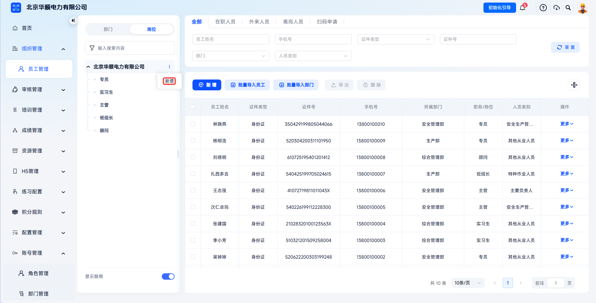
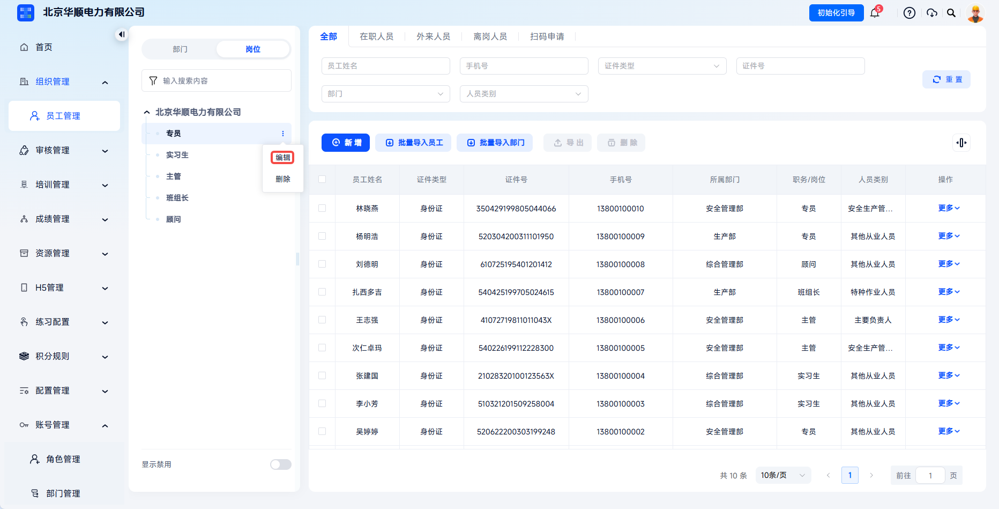
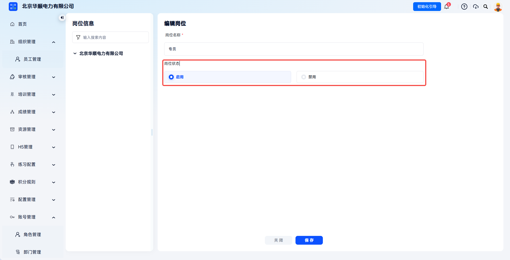
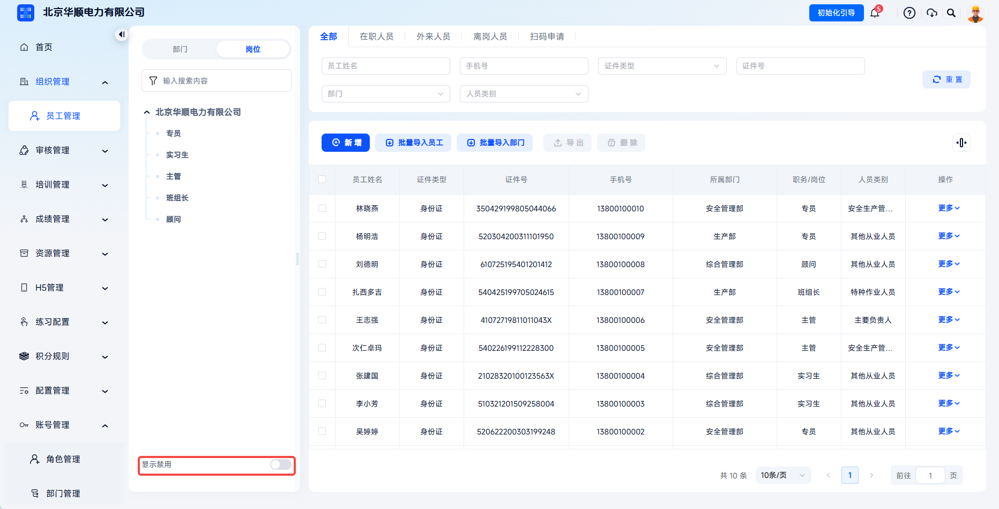

# 岗位管理

用于维护企业统一、标准化的岗位字典，是系统派课、统计、证书复审、安全责任追溯的重要维度之一，一处维护、全平台生效。

> 《安全生产法》第四条、第二十一与第二十二条明确生产经营单位必须建立“全员安全生产责任制”，将安全责任分解到岗位。平台满足应急管理部门对岗位分级培训、责任到人的执法检查要求。

本文档通常用于以下场景：

- 新增企业岗位；
- 编辑岗位名称或启用状态；
- 禁用暂不使用的岗位；
- 删除未被员工引用的岗位。

 
 

## 操作流程

### 进入岗位管理

点击【组织管理】-【员工管理】，切换左侧显示为岗位，页面展示当前岗位列表。

岗位列表以树形结构展示已维护岗位，是新增和管理岗位的入口。

 

### 新增岗位

点击企业旁的【新增】，在新增页面填写岗位信息并点击【保存】，岗位立即生效。

选择上级节点后点击新增，可创建新的岗位分类或岗位。

---

| 字段 | 填写说明 |
| --- | --- |
| 岗位名称 | 必填，需保持全局唯一。 |
| 岗位状态 | 选择启用或禁用，禁用后无法在添加员工时选中。 |

岗位创建后立即生效。新增员工时，职务/岗位通常与所选部门联动，只展示当前可用岗位；如目标岗位不存在或已禁用，需先在岗位管理中维护。

 

### 管理岗位

岗位创建后，可根据实际情况维护：

- 【编辑】：可修改名称、状态；若岗位已被员工引用，名称修改实时同步；

- 【禁用】：已有员工继续保留该岗位，但新增员工时下拉框不再出现；

- 【显示禁用】：可让禁用岗位在岗位树中显示；

- 【删除】：移除岗位前需确保无员工引用该岗位。

岗位被员工引用时，系统会限制删除，避免历史数据丢失。禁用岗位后可通过【显示禁用】在岗位树中查看，并可根据业务需要重新启用。

 
 

## 常见问题

**Q：岗位名称能否重复？**

A：不能。岗位名称需保持全局唯一。

---

**Q：禁用岗位后，已关联员工会怎样？**

A：员工继续保留原岗位，可正常培训、考试；下次转岗或编辑时必须选择启用岗位。

---

**Q：岗位删除失败是什么原因？**

A：只要有员工引用该岗位，系统即禁止删除，避免历史数据丢失。需先将相关人员转岗后再进行删除。

---

**Q：岗位与人员类别、人员类型的区别是？**

A：岗位描述工作职务，用于明确工作定位、责任追溯；人员类别是合规职责维度，包含主要负责人、安全生产管理人员、特种作业人员、班组长、其他从业人员等。

