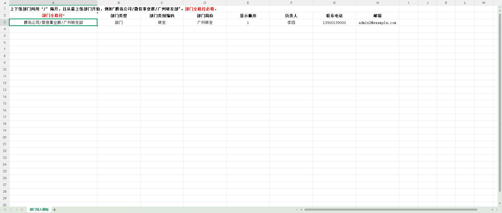
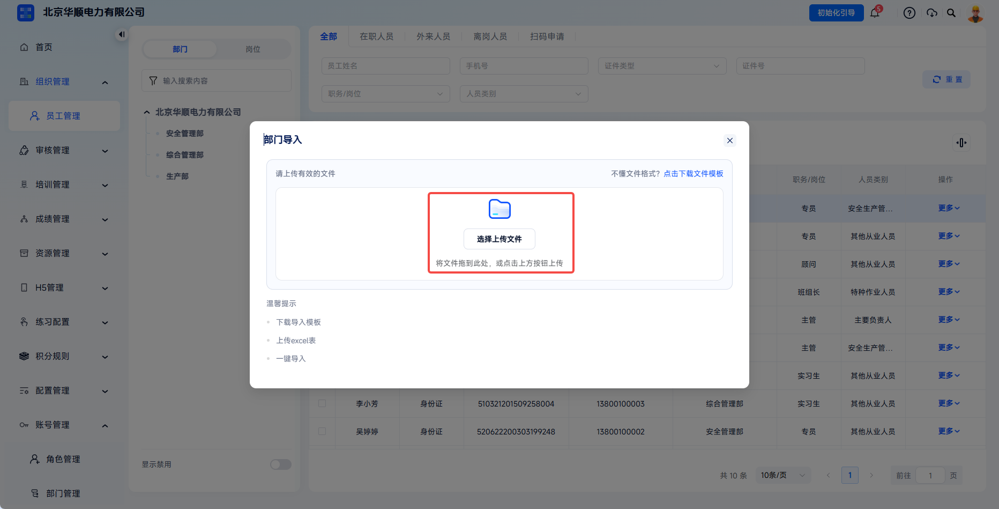
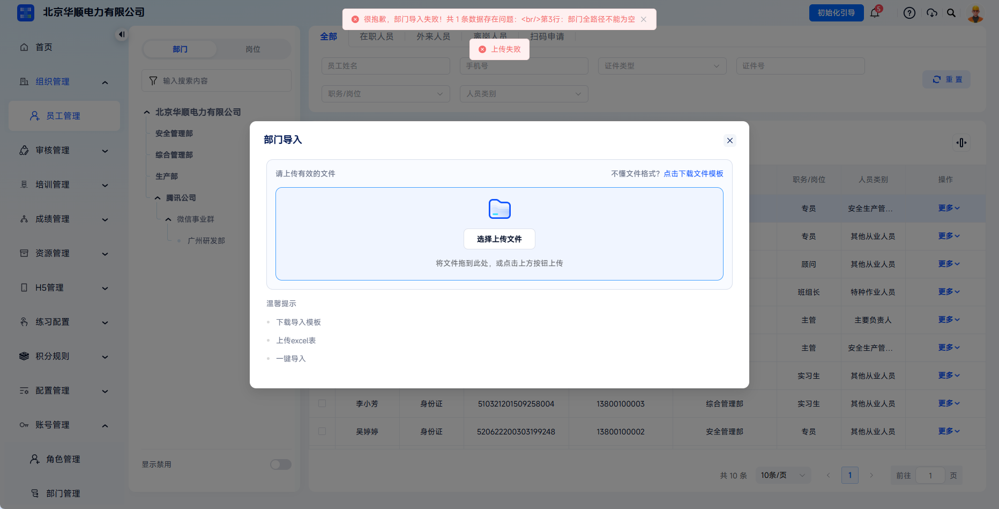
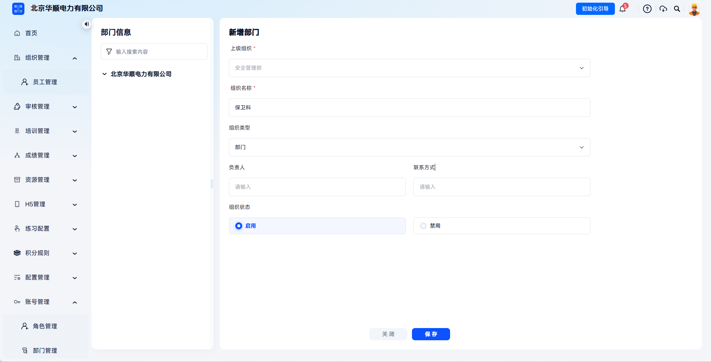
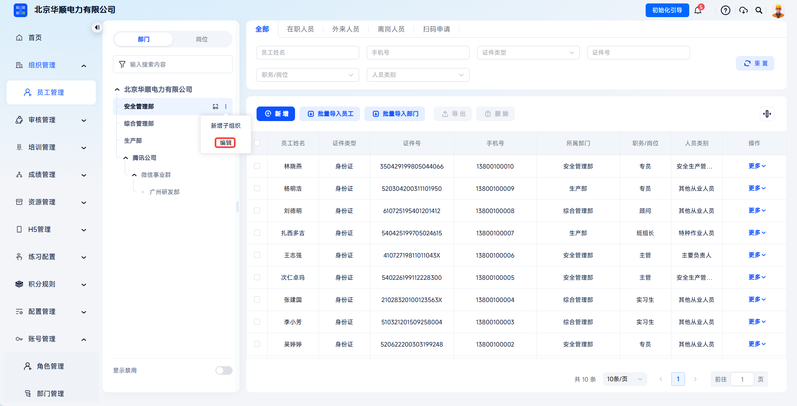
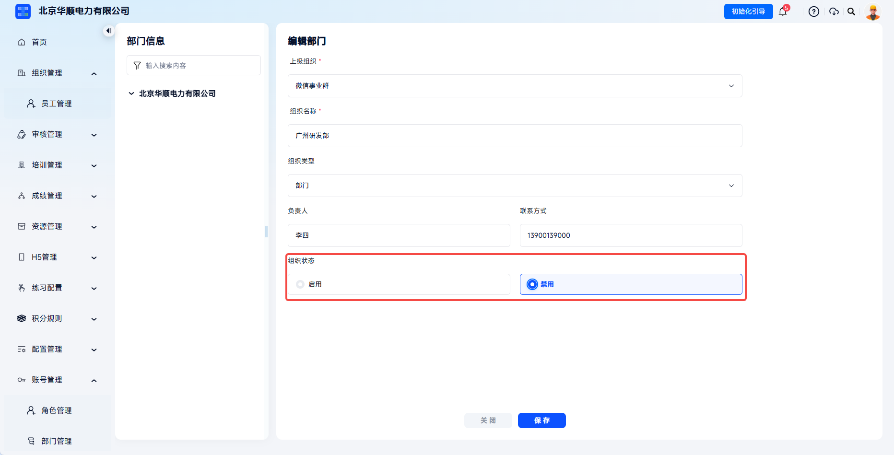
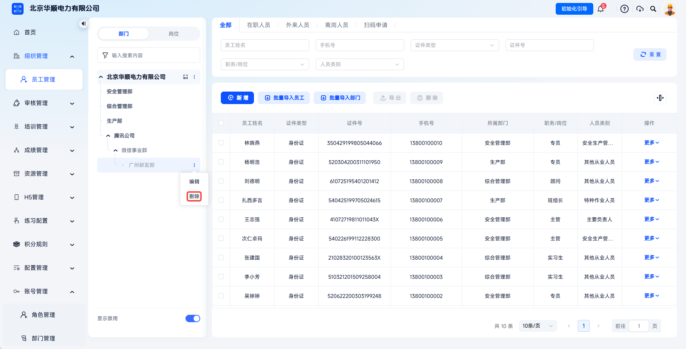

# 部门管理

用于自定义企业（集团-公司-部门-班组）多级层级，生成部门唯一企业码，支持员工扫码快速入职，并为后续培训、考试、统计提供组织维度。

> 《安全生产法》第四条、第二十八条明确生产经营单位必须建立全员安全生产责任制，落实“管业务必须管安全”到各个岗位和部门。平台通过可视化组织架构树将安全责任逐级分解到部门/岗位，满足监管对“责任到部门、到岗位”的核查要求。

本文档通常用于以下场景：

- 初次搭建企业组织架构；
- 需要新增、编辑或删除部门；
- 需要通过模板批量导入部门信息；
- 需要为员工扫码入职生成部门企业码。

 
 

## 操作流程

### 进入员工管理页面

点击【组织管理】-【员工管理】，进入组织架构维护页面。左侧部门树用于查看与维护企业组织层级。

| 字段 | 说明 |
| --- | --- |
| 组织名称 | 企业部门或分支机构名称，支持多级层级结构。 |
| 组织类型 | 可按企业规模与所属关系选择【集团】、【单位】、【部门】等类型。 |
| 上级组织 | 决定该部门在架构树中的层级位置；通过【新增子组织】添加时，上级组织自动确定。 |
| 负责人/联系方式 | 保存负责人及联系方式，便于事前联系。 |
| 组织状态 | 控制组织是否启用；禁用后新增员工和企业码加入时不再可选。 |
| 企业码 | 基于组织生成的二维码，员工可在有效期内扫码填写个人信息并提交。 |

 

### 批量导入部门

点击【批量导入部门】，在弹窗中下载模板。

点击【批量导入部门】进入部门模板下载与上传流程。

---

下载完成后，严格按照模板格式填写部门信息。

---
批量导入适合初始大批量创建组织架构。填写模板时建议保持表头名称、顺序和层级关系不变，并确保部门名称与企业内部实际层级一致。

---
在弹窗内上传模板文件，成功上传后部门信息出现在左侧部门树中。

上传填写完成的部门模板，系统会先进行格式和字段校验。

---

上传失败将提示失败原因，修改文件后可再次上传。

---
导入失败时可查看失败原因，修改模板后重新上传。

 

### 新增部门

如需单独新增部门或子部门，在左侧部门树找到目标上级部门，点击【新增子组织】。

填写页面内字段，带 `*` 的字段为必填项，填写完成后点击【保存】，即新增部门成功。

---
启用状态的组织可继续添加员工、生成企业码并作为培训、考试、统计的组织维度。若部门后续需要暂停使用，可通过编辑组织状态进行禁用。

 

### 编辑信息

点击【组织管理】-【员工管理】，点击需要修改的部门对应【编辑】操作，在编辑弹窗中输入需要修改的信息后，点击【确定】即可完成修改操作。

点击目标部门操作栏【编辑】可修改部门基础信息。

---

在编辑弹窗中调整部门信息后点击【确定】保存修改。

 

### 禁用部门

点击【组织管理】-【员工管理】，点击需要修改的部门对应【编辑】操作，将组织状态切换为【禁用】即可。禁用部门仅在打开部门树下方【显示禁用】功能时在部门树中显示。禁用后部门将无法在部门信息框中出现。

注意！当部门下有员工或未停用子部门时禁用操作无法完成。

禁用部门需进入部门编辑操作，并将组织状态切换为禁用。

---

部门下存在员工或启用子部门时，禁用操作可能无法完成。

 

### 删除部门

在禁用部门后，点击目标部门【删除】操作可删除部门。

部门禁用后可执行删除操作，删除前需确认无在职人员和启用子部门。

 
 

## 常见问题

**Q：为什么我无法删除某个部门？**

A：为了保证数据安全，需首先禁用部门才能删除。若该部门下存在员工或启用子部门，系统将禁止禁用。请先完成人员迁移与禁用操作后再进行删除操作。

---

**Q：部门名称修改后，之前的培训记录会受影响吗？**

A：不会。系统采用唯一 ID 追踪部门，名称变更仅影响展示，不影响历史数据的统计和合规证明的生成。

---

:::info 新增内容
**Q：员工扫码加入时，如何确保他们进入了正确的部门？**

A：管理员可以生成部门专用企业码，或在开启审核模式后，在审核时手动指派员工最终部门。
:::
