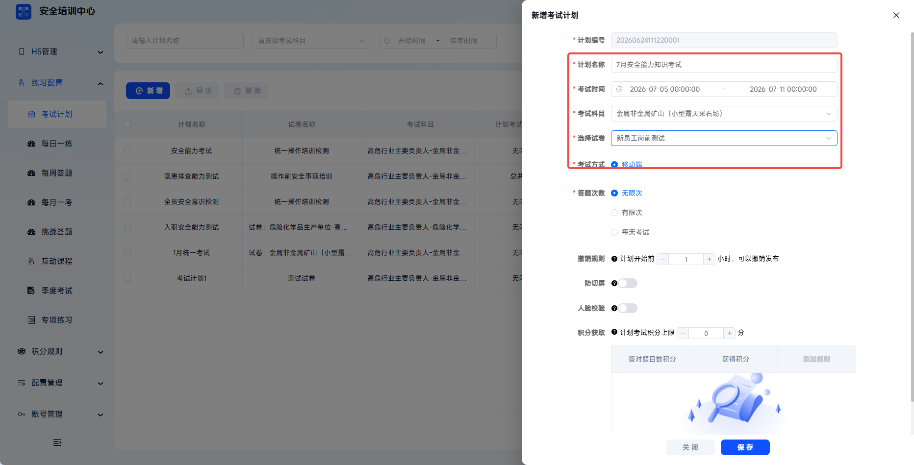
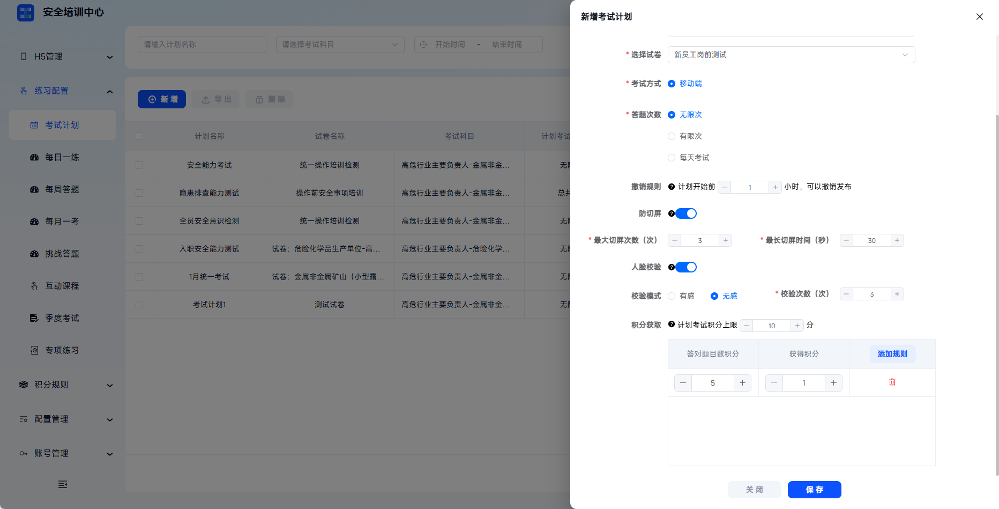
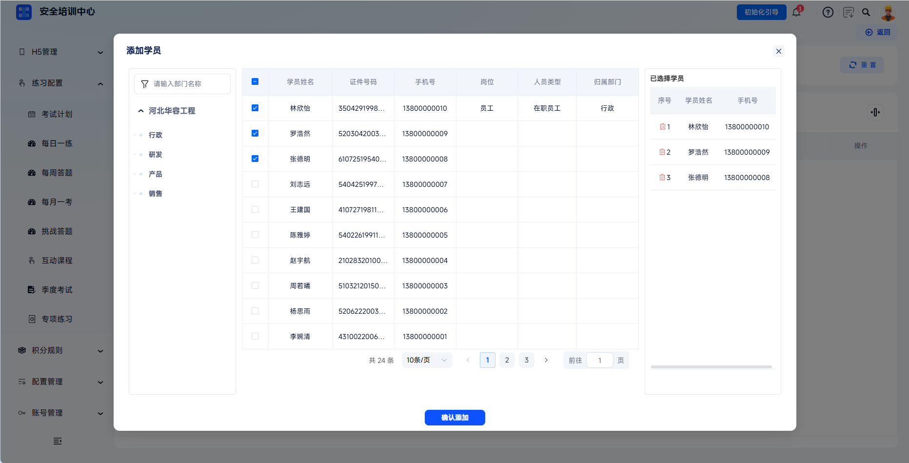
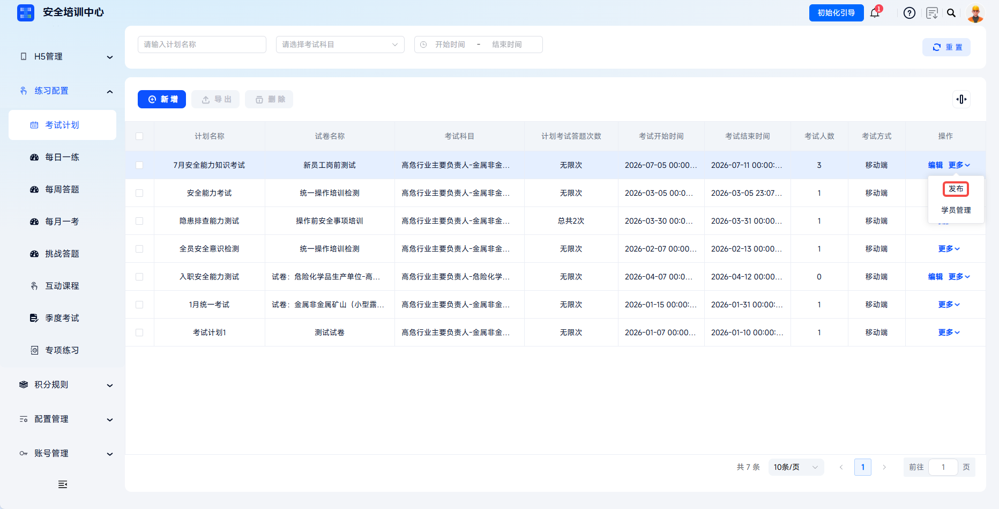

# 创建考试计划

支持移动端、机考两种考试方式，灵活配置考试时间、答题次数、防作弊规则及积分获取策略，实现“计划→学员→考试→成绩”的闭环管理。通过考试计划功能，管理员可精准控制考试开放时间、参与人员、答题权限，满足企业定期考核、入职测评、专项检测等多场景需求。

> 《安全生产法》第二十八条要求生产经营单位必须对从业人员进行安全生产教育和培训，未经培训合格不得上岗；考试计划功能可确保考核过程可控、结果可追溯。

本文档通常用于以下场景：

- 新增考试计划；
- 配置移动端或机考考试方式；
- 设置防切屏、人脸校验、积分规则；
- 添加考试学员并发布考试计划。

 
 

## 操作流程

### 新增考试计划

点击【练习配置】-【考试计划】，点击【新增】，打开【新增考试计划】弹窗。

 

### 填写基础信息

按页面要求填写计划名称、考试时间、考试科目、考试方式等信息。

| 字段 | 填写说明 |
| --- | --- |
| 计划名称 | 必填，建议包含考试类型和时间范围，便于识别。 |
| 考试时间 | 必填，设置考试计划开始时间和结束时间，考生仅在此时间段内可进入考试。 |
| 考试科目 | 必填，下拉选择对应工种或培训科目，决定可关联的试卷范围。 |
| 考试方式 | 必填，可选择移动端或机考。移动端支持手机 APP/小程序考试，机考需配合考场管理使用。 |

 

### 配置移动端考试

移动端考试支持配置答题次数、撤销规则、防切屏、人脸校验和积分获取。

| 配置项 | 说明 |
| --- | --- |
| 答题次数 | 可选择无限次、有限次或每天考试。 |
| 撤销规则 | 设置计划开始前多少小时可以撤销发布，最低为计划开始前 1 小时。 |
| 防切屏 | 开启后，考生离开考试页面会计入切屏行为，可设置最大切屏次数与最大切屏时间。 |
| 最大切屏次数 | 超过次数限制判定为抄袭。 |
| 最大切屏时间 | 超过时间限制判定为抄袭。 |
| 人脸校验 | PC 端参加考试并开启人脸校验时，统一采用学员手机扫码方式进行身份验证。 |
| 校验模式 | 可选择有感或无感。 |
| 校验次数 | 设置考试期间出现人脸校验的次数。 |
| 积分获取 | 设置计划考试积分上限，并可添加答对题目数积分或获得积分规则。 |

点击【保存】即创建新考试计划。

 

### 添加学员

在考试计划列表中，点击对应计划的【更多】-【学员管理】进入学员管理页面。

---

点击【新增】勾选并添加参考学员，点击【删除】移除学员。

---

学员列表支持通过考生姓名、证件号、准考证号筛选查询已分配学员，并展示考生姓名、准考证号、证件号、手机号等信息。

 

### 保存并发布

点击【保存】保存考试计划，状态为未发布。返回列表页后，点击对应计划的【发布】按钮正式发布。只有计划下有学员时才可发布。

发布后考试计划生效并推送至学员端，考生可在设置的考试时间内参与考试。

 

### 管理考试计划

已发布计划可在撤销规则允许的时间范围内撤销发布；计划过期或点击【作废】后，状态变更为已作废，考生不可再参与，计划不可再编辑。

---

未发布计划可编辑全部信息；已发布计划如需编辑，需要先撤销发布。点击【导出】可导出勾选考试计划相关基础信息；【删除】仅支持删除未发布且无学员关联的计划。

| 操作 | 说明 |
| --- | --- |
| 撤销发布 | 已发布计划可在撤销规则允许范围内撤销，回到未发布状态。 |
| 作废 | 计划过期或点击作废后，状态变为已作废，考生不可再参与。 |
| 编辑 | 未发布计划可编辑全部信息；已发布计划需先撤销发布。 |
| 导出 | 导出勾选考试计划相关基础信息。 |
| 删除 | 仅支持删除未发布且无学员关联的计划。 |

 
 

## 常见问题

**Q：为什么发布后考生看不到考试？**

A：请检查考试计划状态是否为已发布、当前时间是否在设置的考试时间范围内、考生是否在【学员管理】名单中。

---

**Q：如何修改已发布考试计划的时间？**

A：在撤销规则允许的时间范围内，先点击【撤销发布】，修改考试时间后重新发布。如已超过撤销时间，建议作废原计划后新建。

---

**Q：机考和移动端考试有什么区别？**

A：机考需配合【考场管理】分配机房或座位，考生到指定场所通过电脑答题，适合集中监控；移动端考试考生通过手机自主参与，不受地点限制，适合灵活考核。

---

**Q：防切屏和人脸校验同时开启会有什么效果？**

A：考生进入考试前需通过人脸核验身份；考试过程中如切换屏幕将触发防切屏机制。开启人脸校验需确保考生已录入人脸信息。

---

**Q：考试计划可以关联多个试卷吗？**

A：一个考试计划仅支持关联一个试卷。如需多科目考核，建议创建多个考试计划分别配置。
