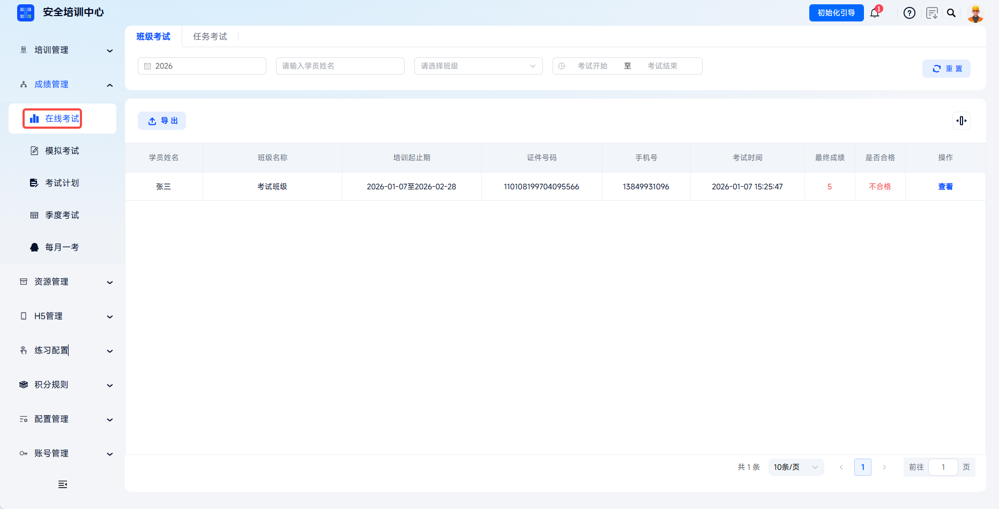
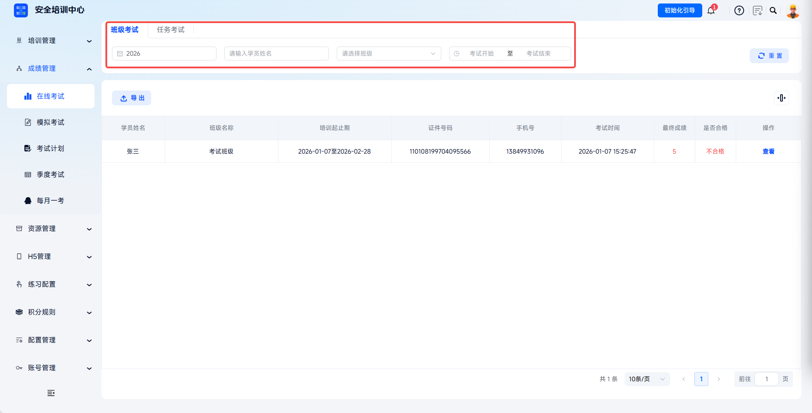
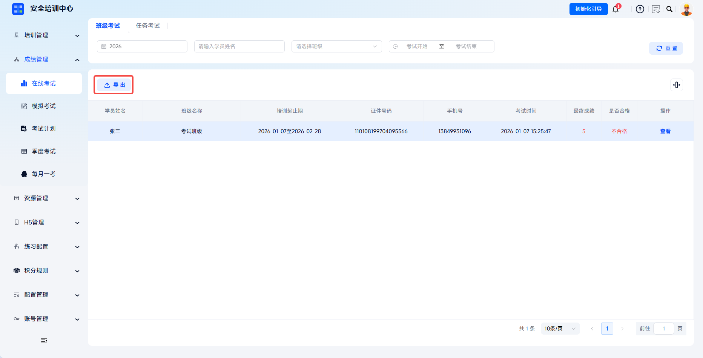
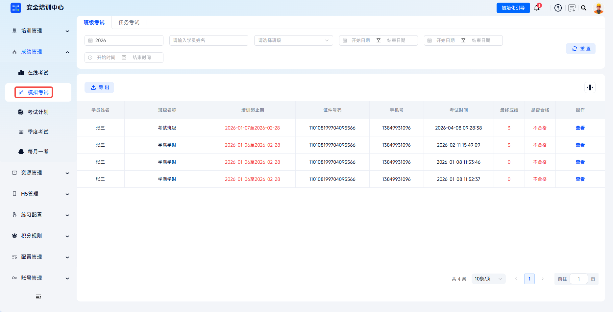
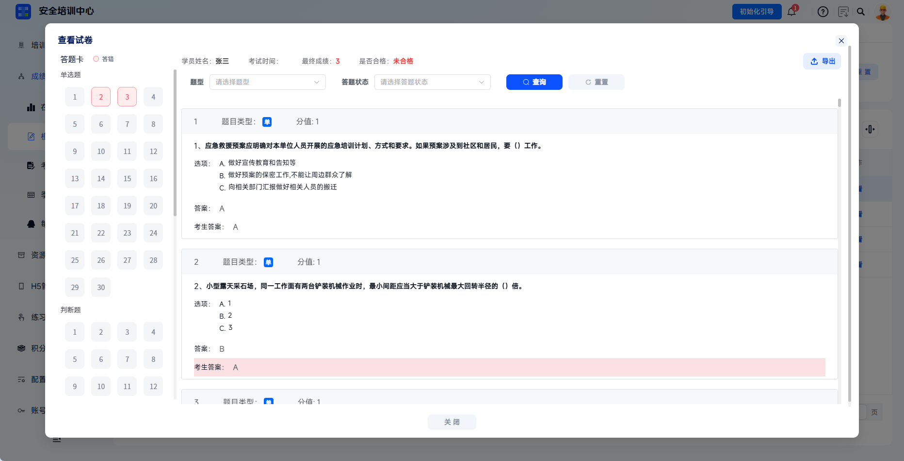
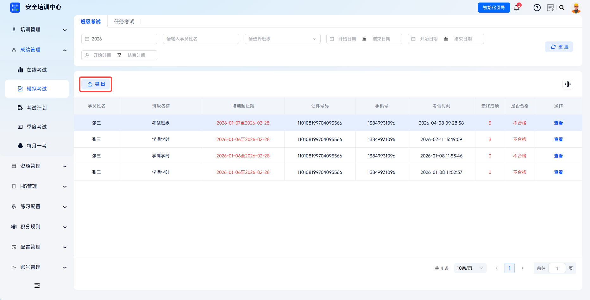
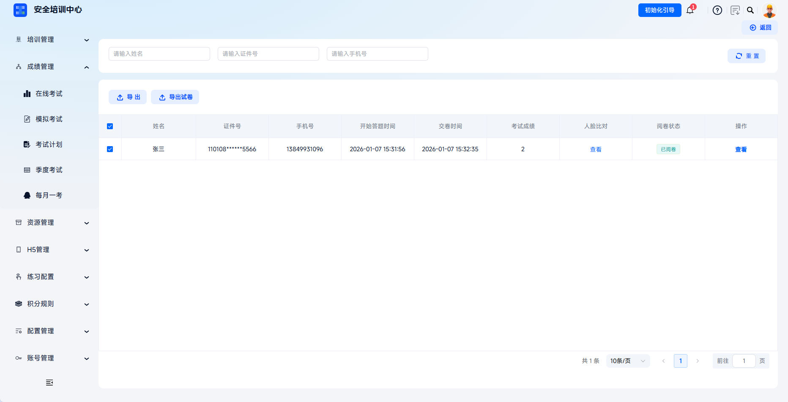
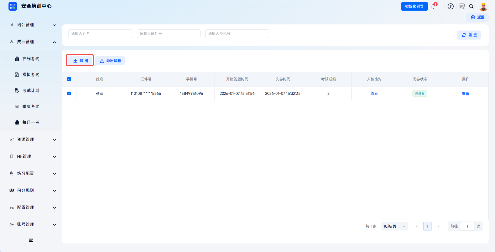
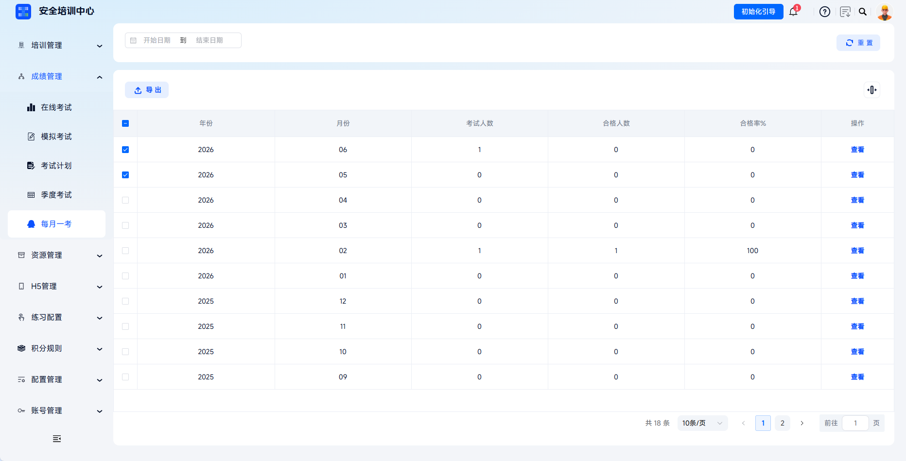

# 查看考试成绩

支持多维度、多层级查询学员考试成绩，涵盖在线考试、模拟考试、考试计划、每月一考、季度考试等多种考试结果汇总，实现“考试→阅卷→成绩→分析”的全流程闭环。管理员可通过筛选条件快速定位目标成绩，查看详细答题记录，导出成绩报表，满足企业内部考核、合规检查、培训效果评估等多场景需求。

本文档通常用于以下场景：

- 查看在线考试或模拟考试成绩；
- 查看考试计划结果；
- 查看每月一考、季度考试结果；
- 导出成绩报表或试卷详情。

 
 

## 操作流程

### 进入成绩管理

在线考试、模拟考试、考试计划、季度考试与每月一考的考试结果均汇总在【成绩管理】目录中。

 

### 查看在线考试成绩

点击【在线考试】查看考试结果列表，根据任务选择目标列表进行查看。通过年度、学员姓名、任务名称、培训开始日期、培训结束日期、考试时间等条件可快速锁定目标学员信息。

| 筛选项 | 说明 |
| --- | --- |
| 年度 | 选择统计年份。 |
| 学员姓名 | 输入参考学员姓名精准查询。 |
| 任务名称 | 下拉选择所属培训班次。 |
| 培训开始日期/培训结束日期 | 设置培训时间范围。 |
| 考试时间 | 设置具体考试日期范围。 |

---

列表展示学员姓名、任务名称、培训起止期、证件号码、手机号、考试时间、最终成绩、是否合格等信息。是否合格根据试卷设置的合格分数线自动判定。

---

点击操作栏【查看】，打开“查看试卷”弹窗。

| 区域 | 说明 |
| --- | --- |
| 答题卡 | 左侧显示题目序号导航，红色表示答错。 |
| 题型切换 | 支持按单选题、判断题等题型快速定位。 |
| 答题详情 | 右侧显示题目内容、选项、正确答案、考生答案。 |
| 筛选功能 | 可通过题型、答题状态筛选题目。 |

---

点击右上角【导出】可下载该学员试卷详情。

---

点击列表上方【导出】按钮，可批量导出当前列表成绩数据。

 

### 查看模拟考试成绩

点击【模拟考试】查看考试结果列表，根据任务选择目标列表进行查看。查询方式与在线考试相同，支持年度、学员姓名、任务名称、日期等多维度筛选。

---

列表显示学员模拟考试记录，点击【查看】查询目标学员在目标任务中的考试结果。

---

点击列表上方【导出】按钮，可批量导出当前列表成绩数据。

 

### 查看考试计划结果

点击【考试计划】查看考试结果列表，根据计划名选择目标列表进行查看。

| 汇总字段 | 说明 |
| --- | --- |
| 计划名称、试卷名称、试卷分类 | 展示考试计划与试卷基础信息。 |
| 考试人数、学员通过数、学员通过率 | 展示计划整体考试结果。 |
| 考试日期、考试方式、待阅卷人数 | 展示考试安排和阅卷状态。 |

---

点击操作栏【查看】进入考生详情页面，查看该计划下所有参考学员列表。列表包含姓名、证件号、手机号、开始答题时间、交卷时间、考试成绩、人脸比对、阅卷状态等信息。人脸比对处点击【查看】可查看考试过程中的抓拍照片及比对结果，查看试卷处点击【查看】可查看该学员答题详情。

---

支持【导出】勾选学员成绩列表和【导出试卷】批量下载勾选考生答卷。点击列表上方【导出】按钮，可批量导出选中计划的成绩数据。

 

### 查看每月一考

点击【每月一考】查看考试结果列表，根据目标年份与月份选择目标信息。支持通过日期筛选器选择起止月份，列表展示年份、月份、考试人数、合格人数、合格率。

---

点击目标年份与月份【查看】，查看每月一考参考人员详情考试信息。点击列表上方【导出】按钮，可批量导出选中计划的成绩数据。

 

### 查看季度考试

点击【季度考试】查看考试结果列表，根据目标年份与季度选择目标信息。列表展示年份、月份、考试人数、合格人数、合格率，点击【查看】可进入参考人员详情。

 
 

## 常见问题

**Q：为什么有些考试显示“待阅卷”状态？**

A：该考试试卷需管理员或考官在阅卷管理中完成人工评分后，成绩才会更新为已阅卷并显示最终得分。

---

**Q：发现成绩异常如何复核？**

A：在成绩列表点击该学员【查看】进入试卷详情，可逐题核对答题记录；如确认系统计分错误，请联系技术支持并提供考试编号、学员信息以便核查。

---

**Q：为什么查询不到某学员的成绩？**

A：请检查学员是否实际参加了考试、考试是否已结束、筛选条件是否设置正确，以及学员是否使用了正确的证件信息登录考试。
