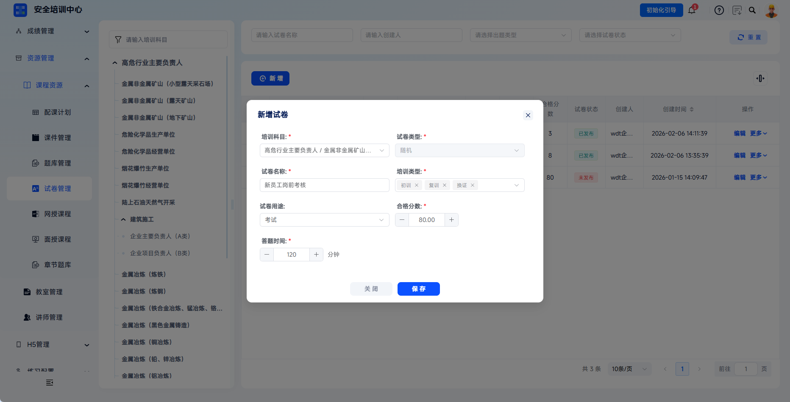
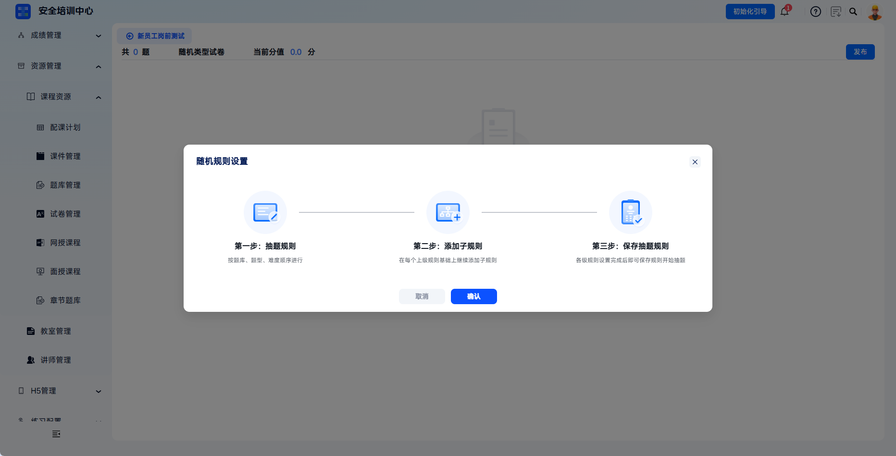
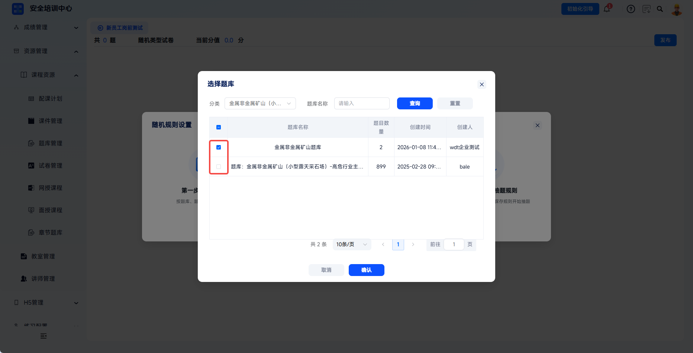
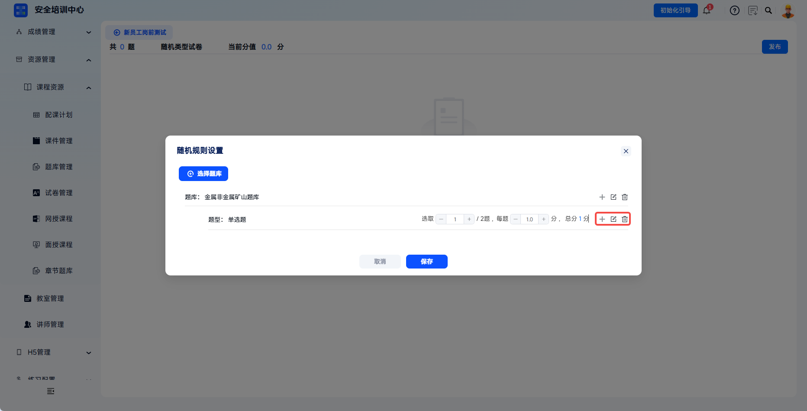
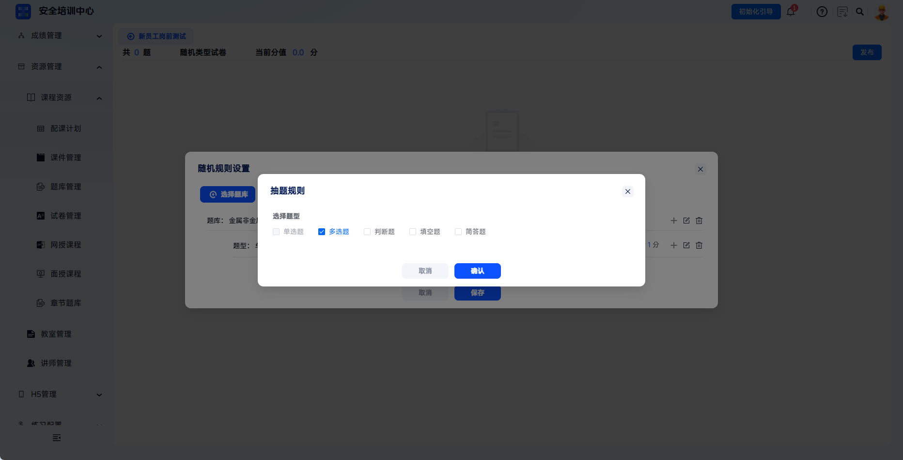
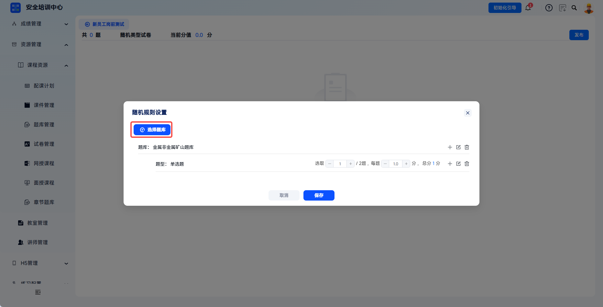
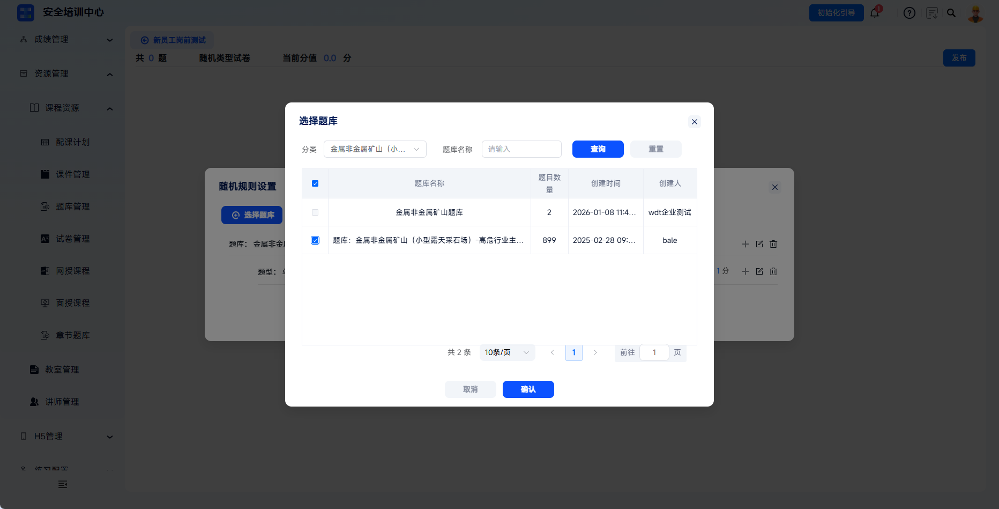
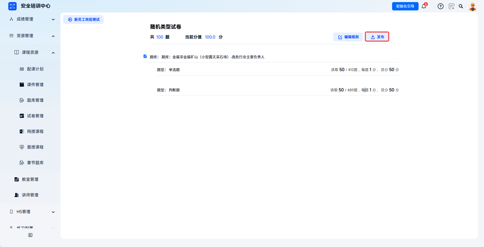

---
title: 试卷自定义
sidebar_position: 3
---

# 试卷自定义

支持灵活配置培训科目、合格分数、答题时长等核心参数，实现“题库→试卷→考试→成绩”闭环管理，为线下考核、线上测评提供标准化试卷支撑。

本文档通常用于以下场景：

- 新增试卷；
- 配置随机试卷抽题规则；
- 发布试卷供考试计划或课程引用；
- 管理已有试卷。

 
 

## 操作流程

### 新增试卷

点击【资源管理】-【课程资源】-【试卷管理】，点击【新增】，打开【新增试卷】弹窗。

在弹窗内填写配置信息。

| 字段 | 填写说明 |
| --- | --- |
| 培训科目 | 必填，下拉选择对应培训工种/资格类型，决定试卷可引用的题库范围，保存后不可修改。 |
| 试卷名称 | 必填，输入唯一试卷名称，建议包含科目+用途+版本便于识别。 |
| 试卷类型 | 随机指设置抽题规则，系统自动从题库中随机抽题组卷。 |
| 培训类型 | 下拉选择初训/复训/换证等类型。 |
| 试卷用途 | 可选课件、考试、取证、章节。 |
| 合格分数 | 必填，设置考试通过分数线，默认80.00分，可通过"+/-"按钮或手动输入调整。 |
| 答题时间 | 必填，设置考试时长（分钟），默认120分钟，可通过"+/-"按钮或手动输入调整。 |

点击【保存】则新建试卷成功。

 

### 配置试卷规则

#### 试卷配置

点击【资源管理-课程资源-试卷管理】，在试卷列表中找到目标试卷，点击试卷名称进入试卷详情页。

#### 抽题配置

点击页面中央的【添加规则】按钮，弹出"随机规则设置"引导弹窗，指引通过“抽题规则-添加子规则-保存抽题规则”步骤进行抽题。点击【确认】进入规则配置界面。

#### 选择题库

支持通过"分类"下拉框和"题库名称"搜索框快速筛选目标题库；在题库列表中勾选所需题库（可单选或多选），列表显示题库名称、题目数量、创建时间和创建人。

点击【确认】完成题库选择，返回规则配置界面。

---

在随机规则设置界面，系统根据所选题库自动列出可用题型，以题库为单位进行题目抽取。每类题型配置包含：

| 配置项 | 说明 |
| --- | --- |
| 题型 | 显示单选题、判断题等类型。 |
| 选取 | 设置从该题型中抽取的题目数量，可通过“-”减少、“+”增加，或直接手动输入数字；右侧显示“/XXX题”表示题库中该题型可用总量。 |
| 每题分值 | 设置该题型每道题的分值，可通过“-”减少、“+”增加，或直接手动输入数字，单位为分。 |
| 总分 | 系统自动计算该题型总分，计算方式为题数×单题分值。 |

---

操作按钮：题型右侧"+"新增子规则（根据难易度抽题规则）、"编辑"修改规则、"删除"移除规则。

---

如需添加新题型规则，点击右侧【+】按钮，在"抽题规则"弹窗中勾选目标题型（单选题/多选题/判断题/填空题/简答题）后点击【确认】。

---

如需添加新题库，点击【选择题库】进行补充勾选。

#### 保存规则

确认各题型题量、分值配置无误后，点击底部【保存】按钮，系统保存抽题规则，返回试卷详情页。

页面顶部"当前分值"实时更新为配置后的试卷总分，请核对是否有误。发布前抽题规则可进行编辑。

 

### 发布试卷

确认试卷总分、合格分数、答题时间等配置无误后，点击右上角【发布】按钮。

发布成功后试卷状态变更为"已发布"，可用于后续考试使用。

 

### 试卷管理

支持对现有试卷进行查看、编辑、发布、删除等操作。

- 【编辑】：点击可编辑试卷基本信息。
- 【试卷规则】：配置试卷抽题规则。
- 【发布】：未发布试卷配置完毕后点击【发布】，状态变为"已发布"，发布后可用于考试分配。空白试卷不可发布。
- 【删除】：点击删除试卷，删除后无法恢复。

 
 

## 常见问题

**Q：删除试卷前需要检查哪些事项？删除后数据能否恢复？**

A：删除前需确认无已安排的考试场次引用该试卷，删除后无法恢复，请谨慎操作。

---

**Q：随机试卷抽题数大于题库题数，题库题量不足怎么办？**

A：前往【资源管理】-【题库管理】补充对应科目的题目数量，确保题库中该科目题目数不小于随机抽题规则设定的题量要求。

---

**Q：试卷发布后想修改题目怎么办？**

A：已发布试卷不支持直接修改题目。建议新增试卷、进行试卷配置并发布，引用新试卷进行考试，原试卷场次不受影响。

---

**Q：固定试卷和随机试卷的区别是什么？**

A：固定试卷由管理员手动从题库选题，所有考生试卷内容一致；随机试卷设定抽题规则，系统为每位考生生成不同试卷。
