---
title: 课程自定义
sidebar_position: 2
---

# 课程自定义

用于维护课件、网授课程包与面授课程资源。管理员可上传视频、文档等课件，创建网授课程包，也可创建面授课程并关联讲师与课时信息，满足线上线下混合式教学的资源需求。

本文档通常用于以下场景：

- 新增课件资源；
- 创建网授课程包；
- 创建面授课程；
- 将课程资源关联到培训任务。

 
 

## 操作流程

### 新增课件

点击左侧菜单【资源管理-课程资源团-课件管理】，进入课件列表页面。点击【新增】按钮，打开新增课件弹窗。

---

#### 上传课件

在弹窗内直接上传文件，系统将自动解析课件名称、课件类型信息，可进行自定义调整。

| 字段 | 说明 |
| --- | --- |
| 课件名称 | 系统解析课件标题，支持修改，建议包含课程主题及版本信息。 |
| 课件类型 | 课件格式类型，系统识别为文本/视频。 |
| 培训科目 | 课件所属培训科目，与课件教学内容强关联。 |
| 培训类型 | 选择适用的培训类型，如初训、复训、换证等，可多选。 |
| 讲师姓名 | 下拉选择或输入讲师姓名。 |
| 课件介绍 | 补充说明课件内容摘要、适用对象等，限200字。 |

如上传视频课件，需选择视频上传平台。视频文件大小不超过5GB，上传前建议检查网络稳定性。

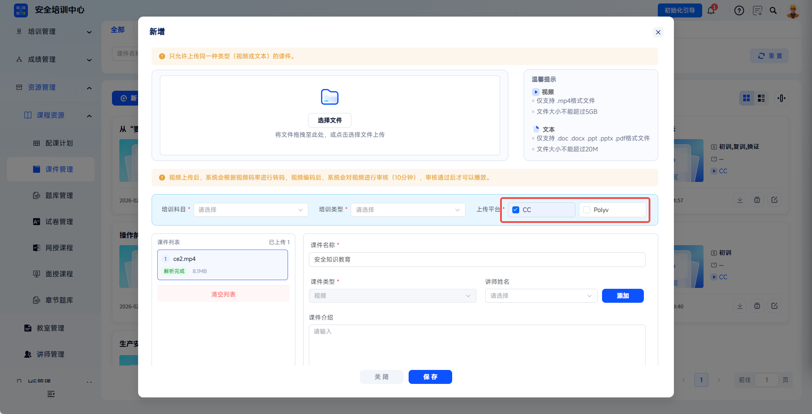

点击【保存】即可保存并上传课件。

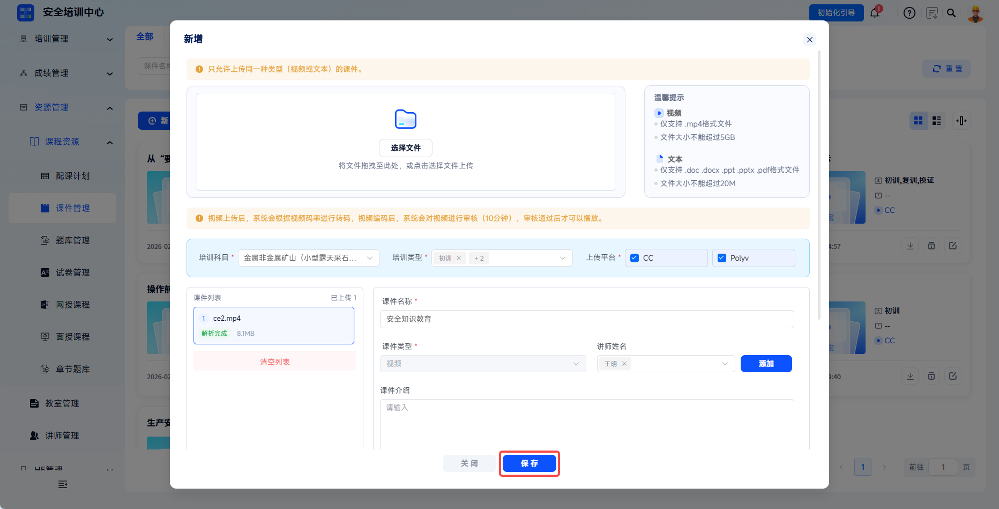

---

点击【保存】后视频课件将上传至平台，请注意未上传完成前不要关闭弹窗。完成上传且通过平台审核的课件即可正常使用。

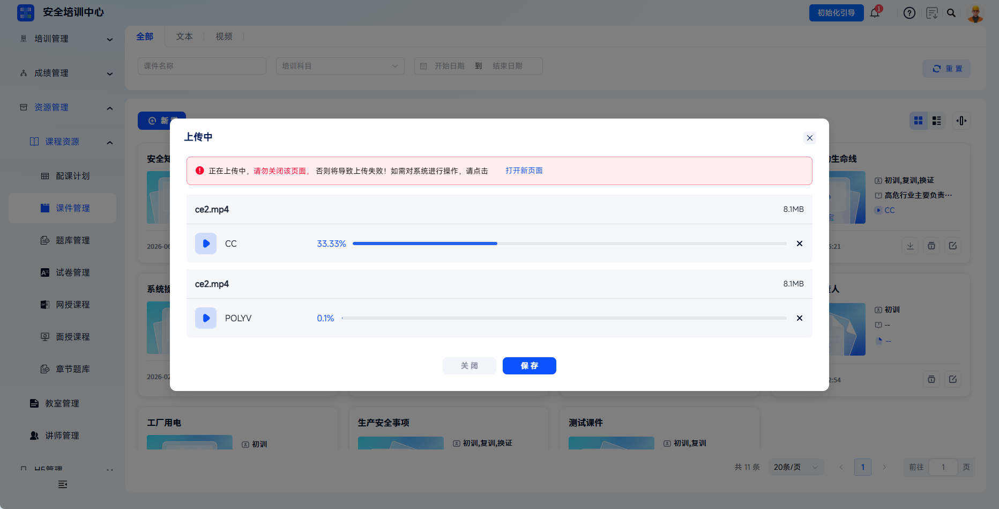

课件上传成功后，可在【网授课程】中引用（课程包目录配置）。关联后学员可在学习过程中查看该课件，系统自动记录学习时长。

 

### 管理课件

支持通过课件名称、培训科目、日期对课件进行筛选。

---

文本/视频类型课件支持分类查看。

---

课件支持切换卡片、列表展示形式。

---

【下载】：视频课件支持下载视频到本地。

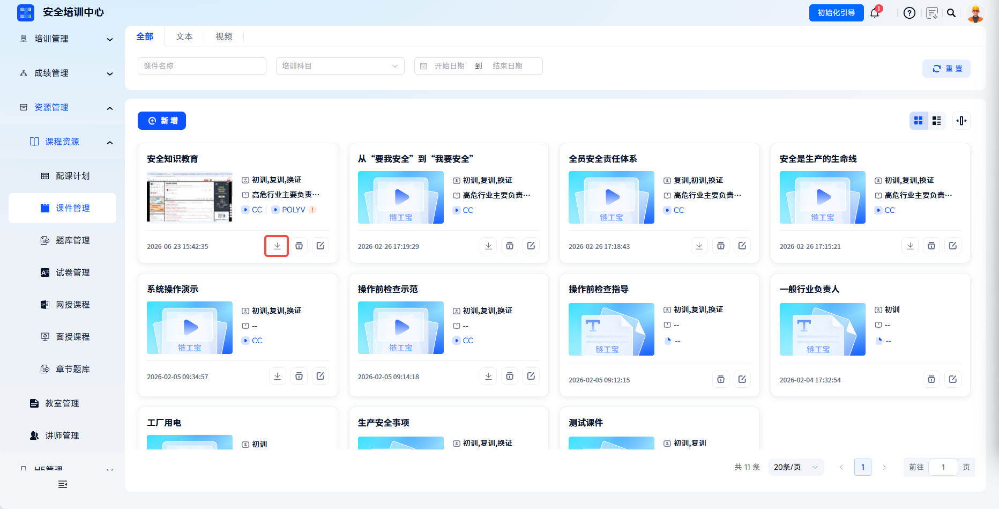

---

【编辑】：修改课件名称、分类、讲师、介绍等基础信息。

---

【删除】：删除课件基础信息及关联文件，已关联课程的课件谨慎删除。

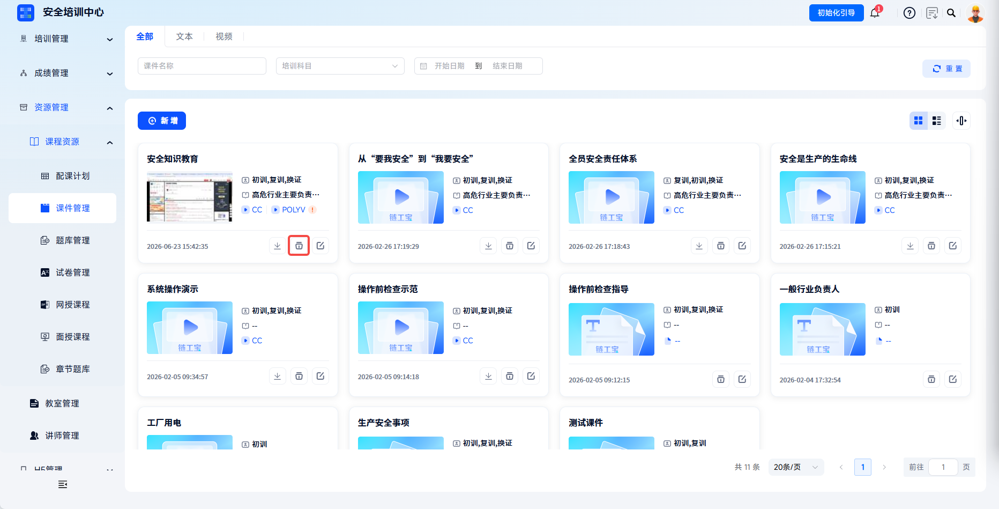

 

### 新增网授课程包

点击左侧菜单【资源管理-课程资源-网授课程】，进入课程包列表页面。点击【新增】按钮，打开【编辑课程包】弹窗，按步骤完成配置。

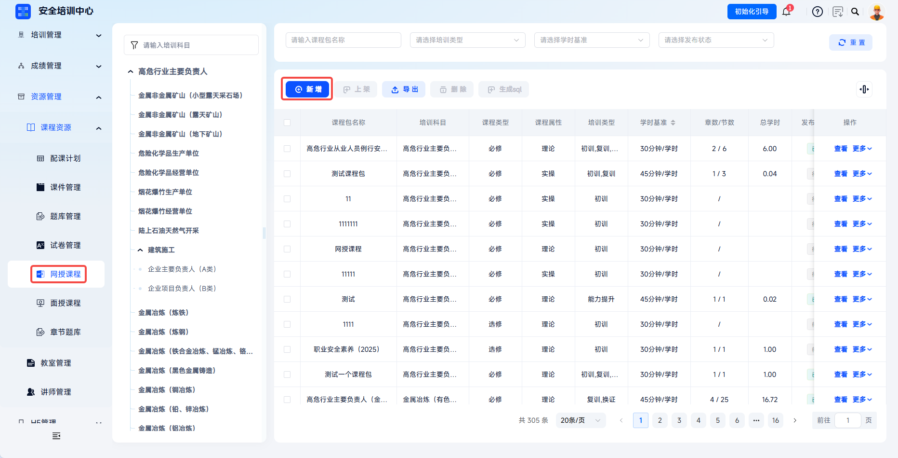

---

填写基本信息，需优先完善基本信息中的必填内容才能进行进一步编辑（如新增课程题库等）。

| 字段 | 填写说明 |
| --- | --- |
| 课程名称 | 输入课程标题，如“职业安全素养（2025）”。 |
| 培训类型 | 选择适用培训类型，如初训、复训、换证等，可多选。 |
| 培训科目 | 下拉选择所属科目，如高危行业主要负责人、金属非金属矿山等。 |
| 学时基准 | 选择“30分钟/学时”或“45分钟/学时”，决定学时计算标准，保存后不可更改。 |
| 课程属性 | 选择理论或实操，标注课程性质。 |
| 课程类型 | 选择必修或选修，标注是否为必须完成课程。 |
| 课程介绍 | 补充课程简介、学习目标等说明。 |
| 封面照片 | 上传课程封面图，提升课程辨识度。 |

---

添加题库/试卷：点击课程题库/课程试卷处【添加】可选择题库/试卷绑定至此课程包。

> 题库需事先在【资源管理-课程资源-章节题库】配置才可勾选，请参考学习中心-资源管理-题库自定义部分;
> 试卷需事先在【资源管理-课程资源-试卷管理】进行配置才可勾选，请参考学习中心-资源管理-试卷自定义部分。

---

添加章节：点击教学大纲处【添加】可新增一章，支持输入章名称、绑定章节题库与试卷。

> 题库需事先在【资源管理-课程资源-章节题库】配置才可勾选，请参考学习中心-资源管理-题库自定义部分;
> 试卷需事先在【资源管理-课程资源-试卷管理】进行配置才可勾选，请参考学习中心-资源管理-试卷自定义部分。

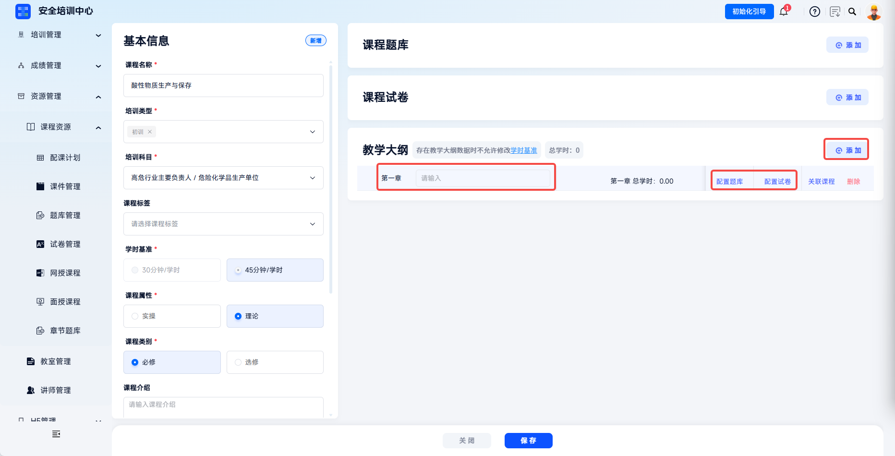

点击当前章操作栏【关联课程】，按顺序勾选本章内容课件并点击保存，即可在本章内按顺序添加完整。

> 课件需事先在【资源管理-课程资源-课件管理】配置，请参考学习中心-资源管理-课程自定义部分。

编辑操作：

- 支持自定义章节名称；
- 支持预览节课件与讲义；
- 支持【修改】单节课件内容，需在本章新增节可点击【编辑关联】继续勾选内容；
- 支持拖拽节排序。

点击【保存】保存网授课程包。

 

### 发布、上架、编辑课程包

课程包创建后支持：

- 【编辑】：修改课程包内容，已发布课程部分字段编辑受限；
- 【发布】：课程状态变更为已发布，发布后的课程可被培训任务引用；
- 【撤销发布】：已发布但未上架的课程可回退为未发布；
- 【上架】：已发布课程上架至学员端课程超市；
- 【删除】：仅支持删除未发布状态的课程，已发布课程需先撤销发布并下架后才能删除。

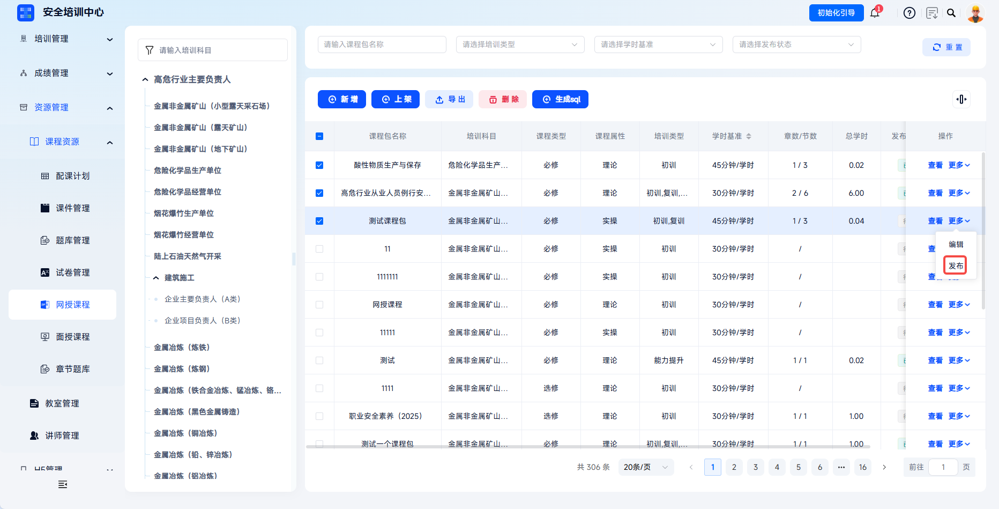

 

### 新增面授课程

点击【资源管理】-【课程资源】-【面授课程】，点击【新增】出现新增面授课程弹窗。

---

填写课程信息：

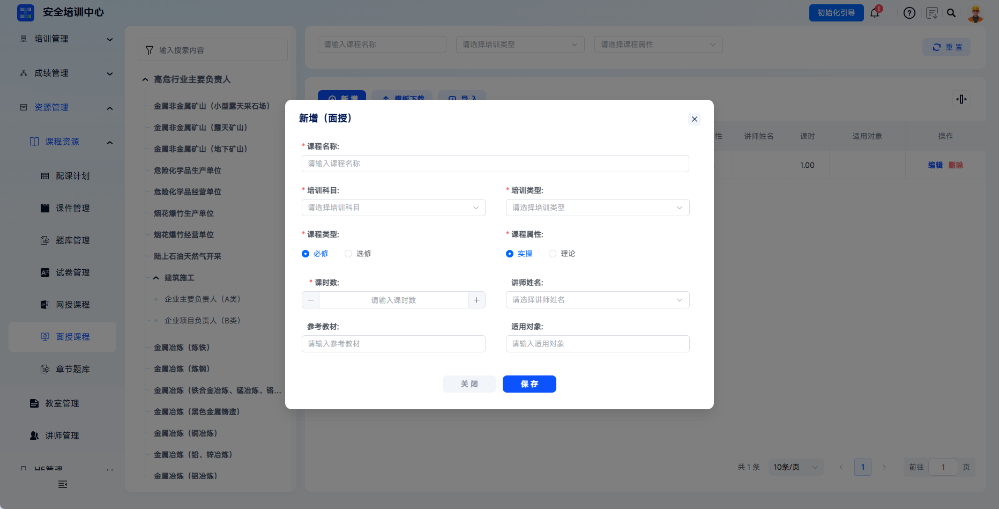

| 字段 | 填写说明 |
| --- | --- |
| 课程名称 | 输入面授课程标题。 |
| 培训科目 | 下拉选择所属科目，如金属非金属矿山、高处安装维护拆除作业等。 |
| 培训类型 | 选择适用培训类型，如初训、复训、换证等。 |
| 课程类型 | 选择必修或选修，决定学员是否必须完成。 |
| 课程属性 | 选择理论或实操。理论适用于集中授课、知识讲解类课程；实操适用于现场操作、技能训练类课程。 |
| 课时数 | 输入课程课时。 |
| 讲师姓名 | 下拉选择授课讲师，关联【讲师管理】中的讲师档案。 |
| 参考教材 | 填写课程使用的教材或参考资料名称。 |
| 适用对象 | 填写该课程的适用学员范围，如“高处作业人员”“企业安全管理人员”等。 |

---
#### 管理面授课程
  - 【编辑】：修改课程名称、讲师、课时等基础信息；
  - 【删除】：删除该面授课程，已被培训班引用的课程谨慎删除。

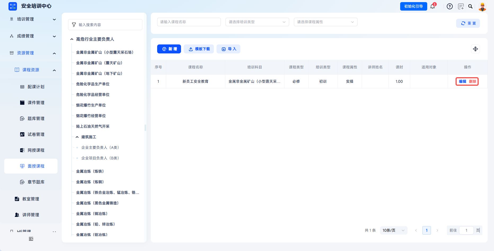

 

### 批量导入面授课程

点击【模板下载】获取 Excel 导入模板。

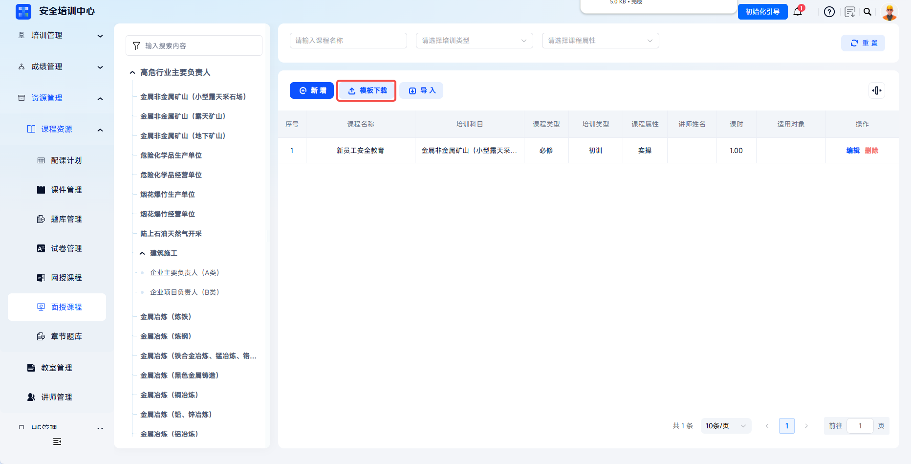

按模板格式填写课程信息（课程名称、培训类型、课程类型、课程属性、课时、讲师姓名等）。

---

点击【导入】，选择培训科目并上传填写好的Excel文件，批量创建课程；导入后系统返回导入结果。

 
 

## 常见问题

**Q：课件可以关联到多个课程吗？**

A：可以，一个课件可关联至多个网授课程或面授课程。

---

**Q：为什么已上架的课程不能撤销发布？**

A：已上架课程意味着学员可能正在学习中，为保障学员学习连续性，系统限制已上架课程直接撤销发布。如需修改，请先下架，再撤销发布，修改完成后重新发布并上架。

---

**Q：一个课程包可以关联多个试卷吗？**

A：不可以，一个课程包仅可选择关联一套试卷。

---

**Q：为什么有些讲师在“讲师姓名”下拉框中找不到？**

A：请检查该讲师是否已在【讲师管理】中建档，且讲师状态是否为启用。
