---
title: 题库自定义
sidebar_position: 1
---

# 题库自定义

支持按培训科目、培训类型、地区等多维度创建专属题库，实现题目资源的分类管理与版本控制。管理员可通过系统内置题库同步官方标准题库，或自主创建企业内部题库，满足取证考试、日常练习、专项训练等多场景考核需求。

本文档通常用于以下场景：

- 新建企业自定义题库；
- 单题录入或批量导入题目；
- 查看、编辑、删除题库中的题目；
- 保存并发布题库至学员端。

 
 

## 操作流程

### 创建题库

点击【资源管理】-【课程资源】-【题库管理】，进入题库列表页面。

左侧为培训科目分类树，右侧列表展示题库名称、培训类型、题库用途、题库描述、培训科目、题目数量、创建时间等信息。

支持通过"题库名称"、"题库状态"、"创建时间"筛选目标题库。

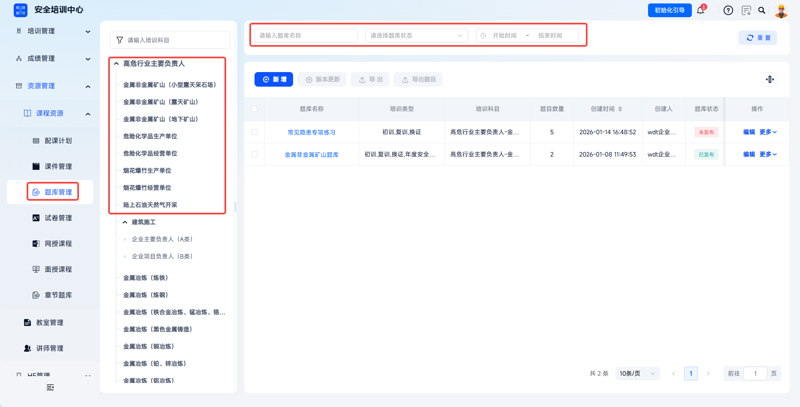

---

点击【新增】按钮，打开【新增题库】弹窗。

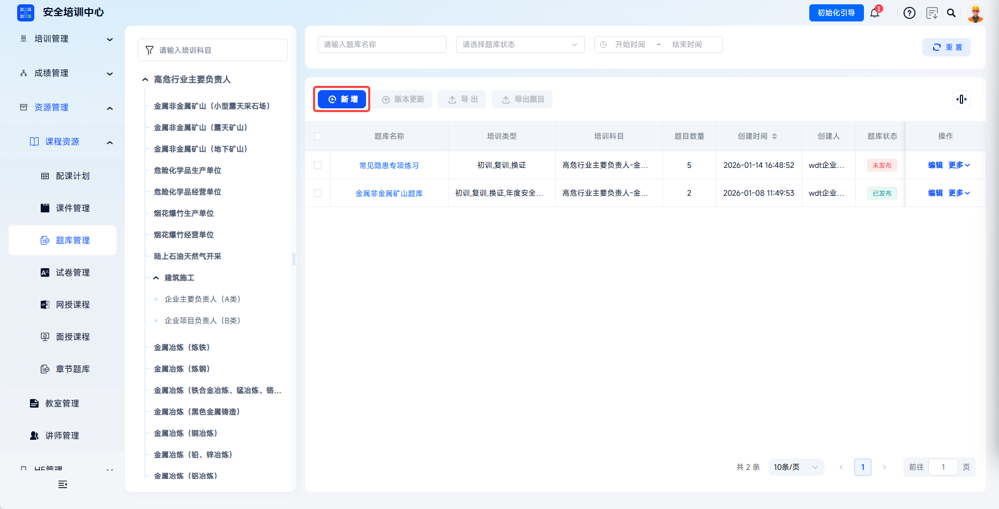
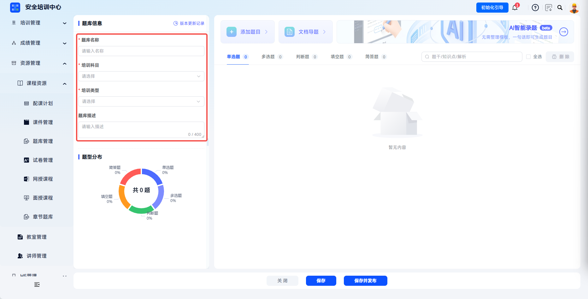

| 字段 | 填写说明 |
| --- | --- |
| 题库名称 | 必填，建议使用“题库：XXX（新大纲）”格式，便于识别。 |
| 培训科目 | 必填，下拉选择题库所属培训科目。 |
| 培训类型 | 选择适用的培训类型，如初训、复训、换证、技师、中级、初级等。 |
| 题库描述 | 补充说明题库来源、用处、抽题规则、版本号等。 |

 

### 单题导入

点击【添加题目】，选择对应题型（单选题/多选题/判断题/填空题/简答题录入）选项。

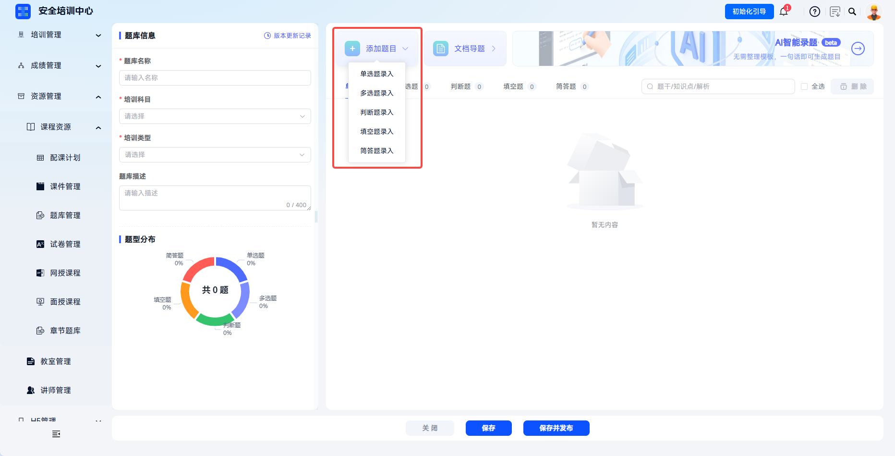

---

题干：在文本框中输入题目描述，支持插入图片或视频（点击图片图标上传）。

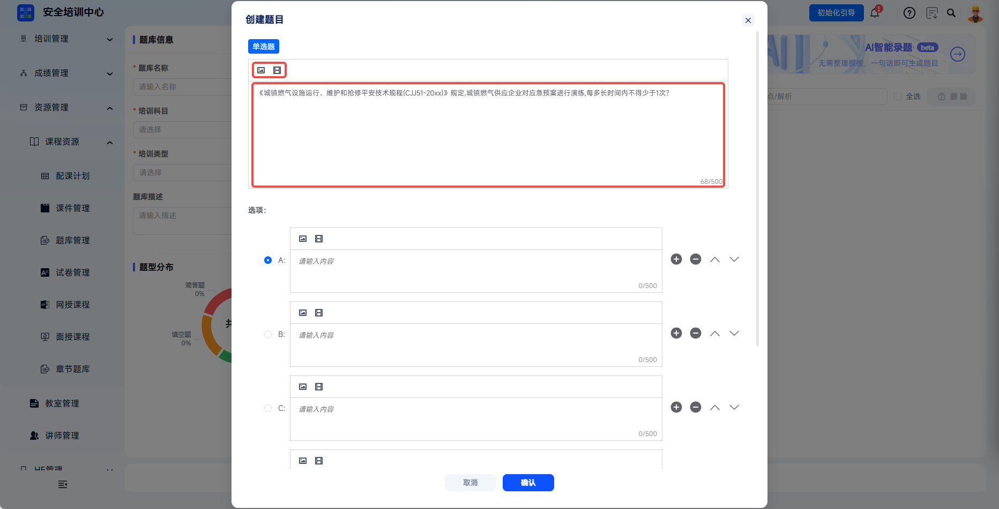

---

单选题：默认为ABCD四个选项，可在选项框中输入答案，点击选项前单选按钮设置正确答案。点击【+】添加选项，点击【-】删除选项，点击上下箭头调整选项顺序。

---

多选题：默认为ABCD四个选项，可在选项框中输入答案，勾选选项前多选框设置正确答案。点击【+】添加选项，点击【-】删除选项，点击上下箭头调整选项顺序。

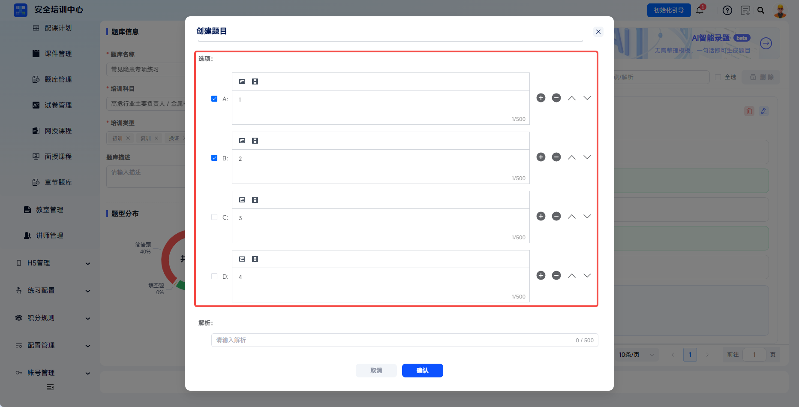

---

判断题：仅需设置"正确"或"错误"两个选项。

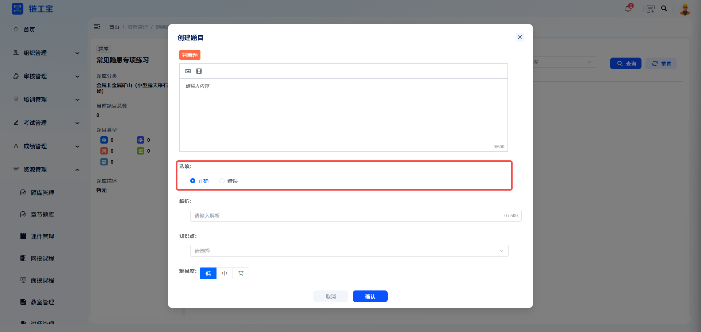

---

填空题：需输入空缺处正确答案。

---

简答题：需输入简答题参考答案，踩点即可给分。

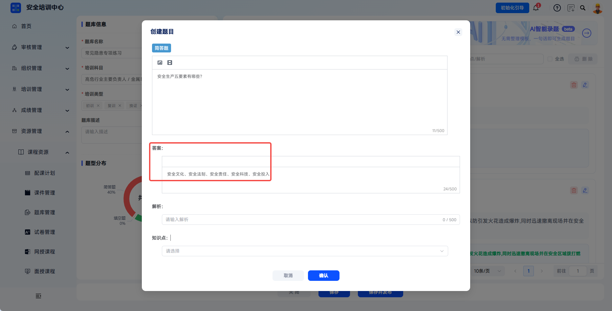

---
解析：输入答案解析说明，帮助学员理解知识点。

知识点：下拉选择该题关联的知识点标签。

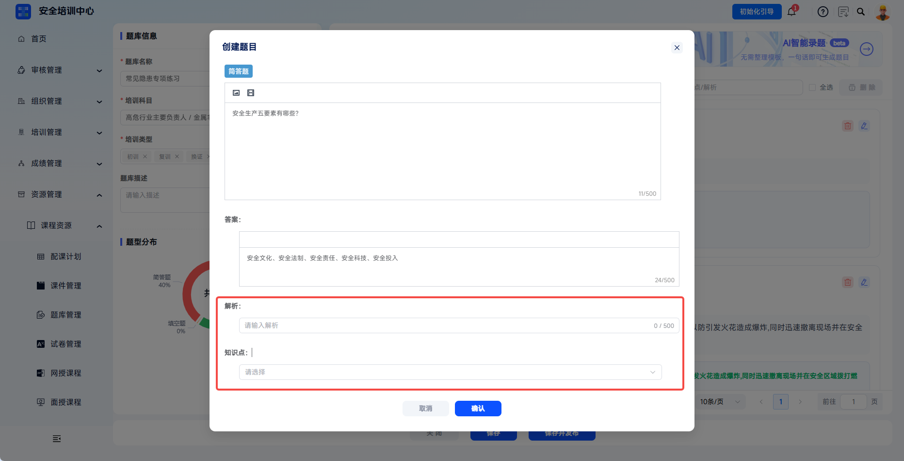

---

点击【确认】保存后题目成功录入到题库中。

 

### 批量导题

点击【文档导题】，进入录题页面。

---

参考输入规范与示例在编辑框中编辑题目，编辑框上方操作栏支持插入图片与视频。

---

点击【模板下载】下载word或excel模板编辑后再上传可快速批量导入题目。

---

检查并导题：题目需按照输入规范输入才可被正确解析，根据解析情况在右侧显示解析结果；如有解析错误情况，则显示解析失败提示并在预览区高亮标出错误题目，操作者可根据提示定位题目，并对输入题目。

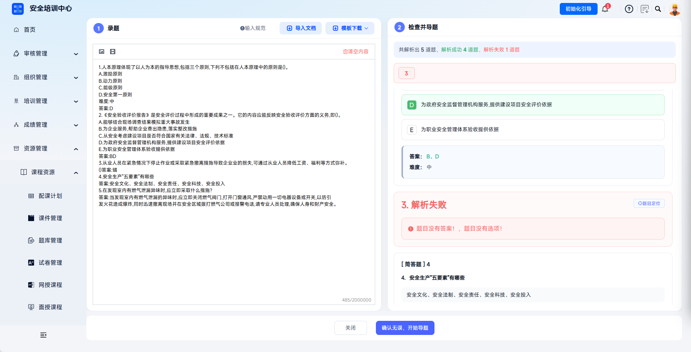

---

确认所有题目无误后点击【确认无误，开始导题】即可成功将所有题目导入题库。

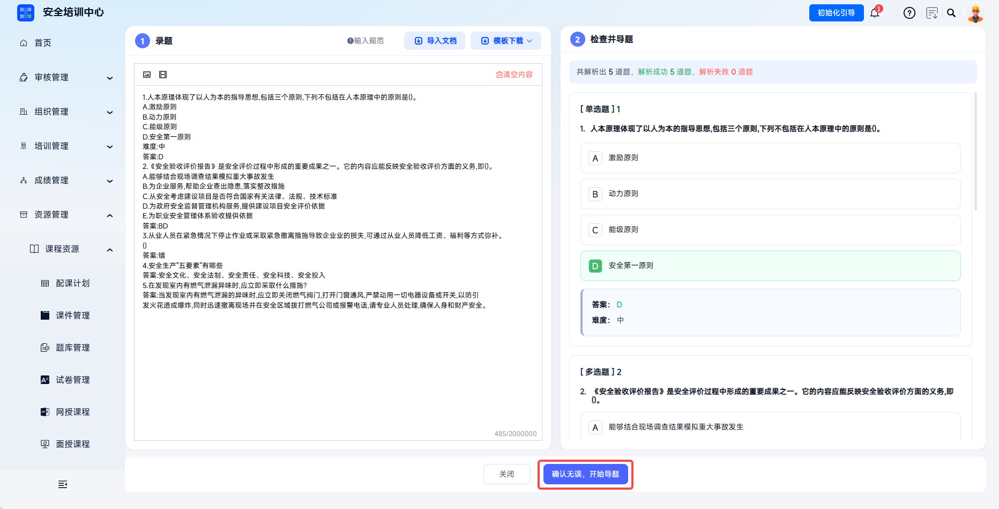

 

### 管理题目并发布

支持单题型分类展示（单选题/多选题/判断题/填空题/简答题），通过题干、知识点、解析搜索筛选题目；左侧提供题库题型分布情况展示。

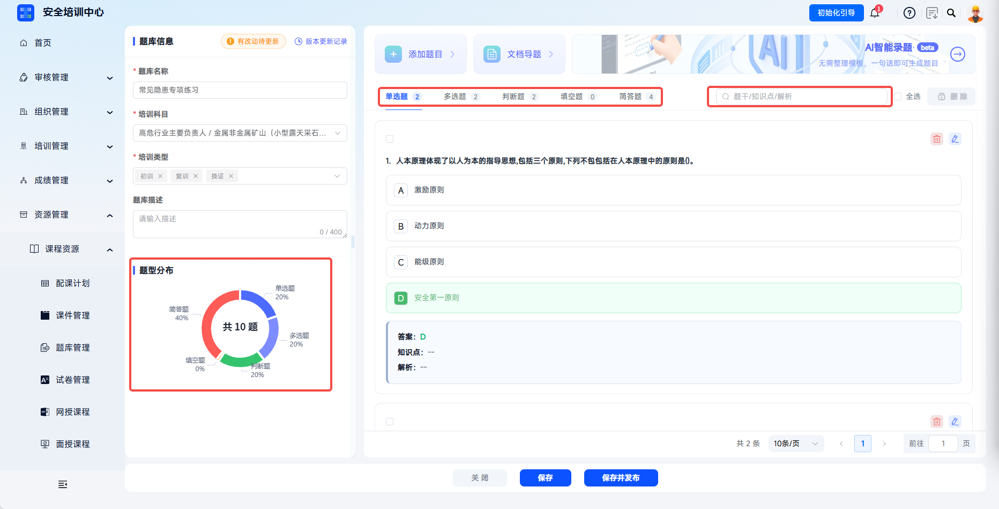

---

操作功能：
- 【编辑】：修改题目内容、答案、解析等信息；
- 【删除】：删除该题目（已用于考试的题目谨慎删除）；
- 勾选多题或【全选】后点击【删除】可批量移除题目；
- 点击【保存】即保存题库改动内容，点击【保存并发布】即保存内容并发布最新版至学员端。

 
 

## 常见问题

**Q：已发布的题库可以删除吗？**

A：已发布且已被考试引用的题库不支持直接删除，避免影响历史成绩追溯。如需停用，可撤销发布使题库不再被新考试引用。

---

**Q：单题录入时如何插入图片？**

A：可在单题录入页面按题目编辑区支持的图片入口上传图片。

---

**Q：批量导入时提示“题型格式错误”如何处理？**

A：请检查 Excel 模板中题型值必须为单选题、多选题、判断题、填空题、简答题之一，注意不要有多余空格或特殊符号。

---

**Q：多选题的正确答案如何填写？**

A：按照模板要求填写多个正确选项，避免多余空格或特殊符号。
