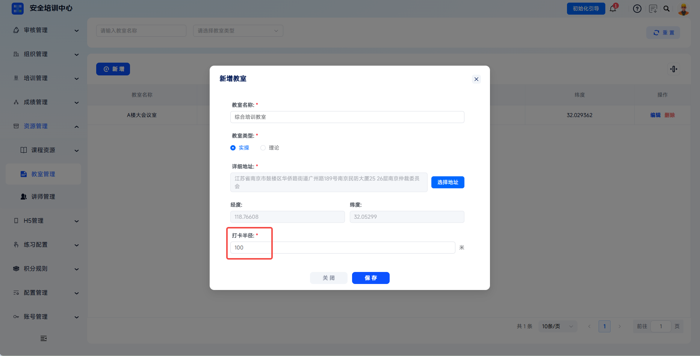

# 教室管理

支持线下培训教室的数字化管理，实现教室类型、地理位置、打卡范围等信息的精准配置。管理员可通过地图选址自动获取经纬度坐标，设置电子围栏打卡半径，确保面授培训的签到位置真实有效，满足培训过程可追溯的合规要求。

> 《安全生产培训管理办法》第十五条规定，安全培训应当建立培训档案，如实记录培训的时间、内容、参加人员等情况。平台通过教室管理功能，结合 GPS 定位与电子围栏技术，保障培训过程的真实性与可追溯性。

本文档通常用于以下场景：

- 新增线下面授教室；
- 配置教室类型、地址与打卡半径；
- 编辑或删除教室；
- 在培训任务中引用教室作为上课地点。

 
 

## 操作流程

### 新增教室

点击左侧菜单【资源管理】-【教室管理】，进入教室列表页面。点击【新增】按钮，打开【新增教室】弹窗。

 

### 填写教室信息

按照页面要求填写教室名称、教室类型、详细地址与打卡半径。

| 字段 | 填写说明 |
| --- | --- |
| 教室名称 | 必填，输入教室标识名称。 |
| 教室类型 | 必填，可选择实操或理论；实操适用于现场操作、技能训练、模拟演练，理论适用于集中授课、视频教学、理论考试。 |
| 详细地址 | 必填，点击【选择地址】搜索教室具体位置，也可拖动地图定位点锁定位置。 |

---

在地图上搜索或拖动定位点至教室实际位置，系统自动获取该位置的经度、纬度坐标，并支持手动微调。

---

根据实际场景设置打卡半径，点击【保存】完成教室配置。

| 场景 | 建议打卡半径 |
| --- | --- |
| 室内教室 | 50-100 米 |
| 室外训练场 | 100-200 米 |
| 大型厂房 | 200-500 米 |

 

### 管理教室

教室创建后，可在列表中编辑或删除。已被培训班引用的教室建议谨慎删除。

| 操作 | 说明 |
| --- | --- |
| 编辑 | 修改教室名称、类型、地址、坐标、打卡半径等信息。 |
| 删除 | 删除该教室配置，已被培训班引用的教室谨慎删除。 |

 

### 关联培训任务

配置完成后，创建面授课程或培训任务选择上课地点时，可从已配置的教室列表中选择。学员在该任务进行签到时，系统会校验 GPS 定位是否在教室打卡半径内。

 
 

## 常见问题

**Q：地图选址时无法定位到准确位置怎么办？**

A：请检查网络连接是否正常、浏览器是否允许获取位置权限。如室内地图精度不足，可先在室外获取大致坐标，再手动微调经纬度数值。

---

**Q：一个教室可以关联多个任务吗？**

A：可以。一个教室可同时被多个培训班引用，但需注意时间安排避免冲突。系统仅校验签到位置，不限制同一时间段内多个任务使用同一教室。

---

**Q：修改教室坐标会影响历史签到记录吗？**

A：不会影响已完成的签到记录。修改坐标后，仅对后续签到生效。

---

**Q：删除教室后学员还能签到吗？**

A：不能。删除教室后，关联该教室的培训班将无法进行位置校验签到。
