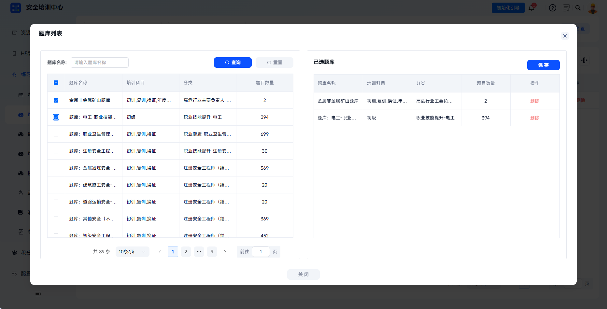
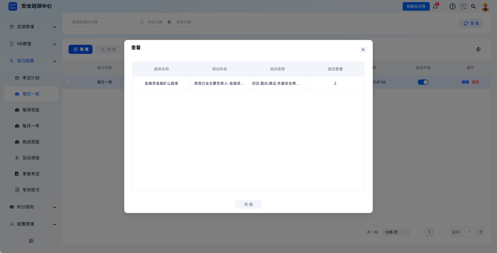
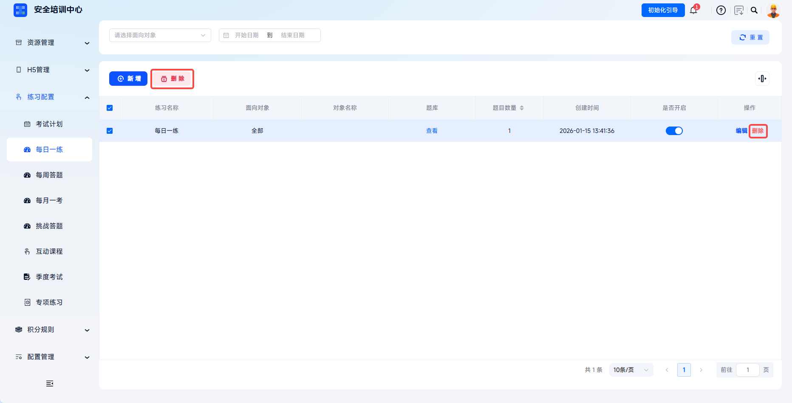

# 练习配置

支持按岗位维度配置每日答题练习，通过题库关联与参数设置实现个性化学习推送。管理员可自定义题目数量、答题次数等规则，帮助学员利用碎片化时间巩固安全知识，形成持续学习习惯，提升培训效果。

本文档以【每日一练】为例说明配置流程。每周答题、挑战答题、每月一考、专项答题、互动答题、季度考试等功能操作流程相似，可参照本文配置。

 
 

## 操作流程

### 新增每日一练

点击左侧菜单【练习配置】-【每日一练】，进入每日一练列表页面。点击【新增】按钮，打开【新增】弹窗。

 

### 设置面向对象

根据业务需要选择练习适用范围。选择【全部】时，所有学员均可参与；选择【岗位】时，需进一步选择具体岗位分类。

| 字段 | 填写说明 |
| --- | --- |
| 面向对象 | 必填，可选择全部或岗位。 |
| 岗位 | 当面向对象选择岗位时必填，用于限定参与练习的岗位人员。 |

 

### 关联题库

点击【关联题库】按钮，打开题库选择弹窗。左侧展示所有已发布的题库列表，包含题库名称、培训科目、分类、题目数量等信息，并支持通过题库名称搜索。

---

勾选目标题库后点击【保存】完成关联，右侧“已选题库”区域展示已选择的题库。

 

### 设置练习规则

根据页面字段设置题目数量、答题次数等参数，点击【保存】完成每日一练配置。

| 字段 | 填写说明 |
| --- | --- |
| 题目数量 | 必填，输入每日推送的题目数量。 |
| 答题次数 | 必填，设置学员每日可答题次数；必须为正整数或 -1，-1 代表无限次。 |

 

### 启用每日一练

在列表页找到新建的每日一练配置，点击【是否开启】列的开关，将状态切换为开启。开启后，此每日一练可投入学员端使用。

 

### 管理每日一练

配置创建后，可在列表中查看、编辑或删除。

---

点击【编辑】可修改面向对象、岗位、题库、题目数量、答题次数等配置。

---

点击【删除】可删除该每日一练配置，已参与学员的历史记录保留。勾选多个配置后点击【删除】，可批量移除。

| 操作 | 说明 |
| --- | --- |
| 查看 | 查看每日一练配置的题库详情。 |
| 编辑 | 修改面向对象、岗位、题库、题目数量、答题次数等配置。 |
| 删除 | 删除配置，已参与学员的历史记录保留。 |

 
 

## 常见问题

**Q：可以关联多个题库吗？**

A：可以。在【关联题库】弹窗中支持勾选多个题库，系统会从所有关联题库中随机抽取题目组成每日练习。

---

**Q：修改每日一练配置会影响已答题学员吗？**

A：不会影响历史记录。修改配置（如更换题库、调整题目数量）后，仅对后续推送的题目生效，学员已完成的答题记录和成绩保持不变。
