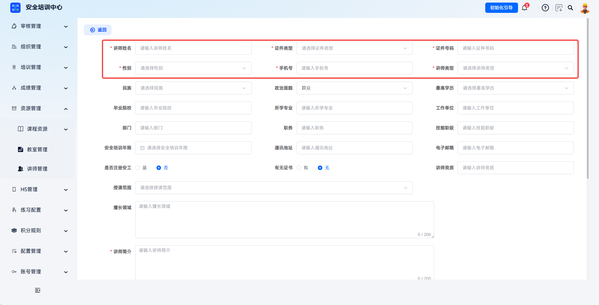
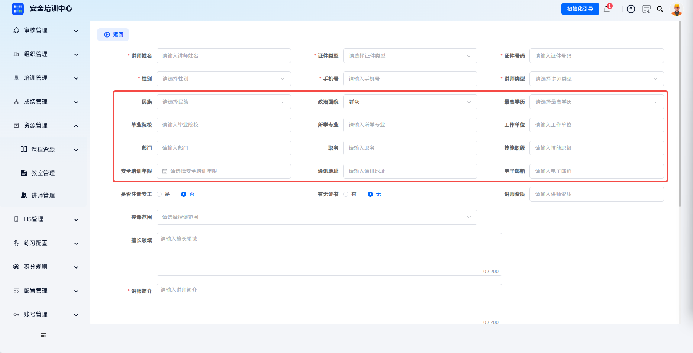
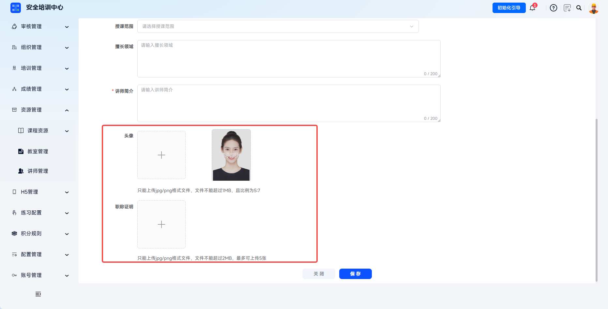

# 讲师管理

支持培训讲师的全生命周期数字化管理，实现讲师资质、授课范围、专业领域等信息的规范化维护。

> 《安全生产培训管理办法》等文件规定，安全培训教师应当具有相应的专业知识、实践经验和教学能力，并经考核合格。平台通过讲师管理功能建立讲师资质档案，支持对“谁培训、培训谁、培训什么”的全程追溯。

本文档通常用于以下场景：

- 新增讲师档案；
- 维护讲师资质、授课范围和简介；
- 启用、停用、查看、编辑或删除讲师；
- 在课件管理或面授课程中引用讲师。

 
 

## 操作流程

### 新增讲师

点击左侧菜单【资源管理】-【讲师管理】，进入讲师列表页面。点击【新增】按钮，进入【新增讲师】详情页。

 

### 填写基本信息

按照页面要求填写讲师姓名、证件类型、证件号码、性别、手机号、讲师类型等基本信息。

| 字段 | 填写说明 |
| --- | --- |
| 讲师姓名 | 必填，填写真实姓名。 |
| 证件类型 | 必填，可选择身份证、护照等。 |
| 证件号码 | 必填，填写对应证件的唯一编号。 |
| 性别 | 必填，选择男或女。 |
| 手机号 | 必填，填写联系方式。 |
| 讲师类型 | 必填，区分全职与兼职讲师。 |

---

继续填写民族、政治面貌、最高学历、毕业院校、所学专业、工作单位、部门、职务、技能职级、安全培训年限、通讯地址、电子邮箱等详细信息。

 

### 填写专业资质信息

填写是否注册安工、有无证书、讲师资质、授课范围、擅长领域与讲师简介等信息。

| 字段 | 填写说明 |
| --- | --- |
| 是否注册安工 | 标识讲师是否为注册安全工程师。 |
| 有无证书 | 选择有或无；选择有时需上传证书。 |
| 讲师资质 | 填写资质证书名称及编号。 |
| 授课范围 | 下拉选择可授课的培训科目范围。 |
| 擅长领域 | 填写专业特长描述，限 200 字。 |
| 讲师简介 | 必填，详细介绍讲师背景、经历等，限 200 字。 |

 

### 上传附件并保存

上传讲师头像与职称证明。确认信息无误后点击【保存】完成讲师建档，默认状态为启用。

| 附件 | 上传说明 |
| --- | --- |
| 头像 | 上传讲师照片，支持 jpg/png 格式，不超过 1MB，比例 5:7。 |
| 职称证明 | 上传资质证书扫描件，支持 jpg/png 格式，单张不超过 2MB，最多 5 张。 |

 

### 管理讲师

讲师创建后可启用或停用，也可查看、编辑或删除讲师档案。停用后，该讲师不再出现在课程配置的可选列表中。

| 操作 | 说明 |
| --- | --- |
| 状态开关 | 快速启用或停用讲师。 |
| 查看 | 预览讲师完整档案信息。 |
| 编辑 | 修改讲师各项信息，更新资质证书等。 |
| 删除 | 删除讲师档案，已有授课记录的讲师建议保留。 |

 

### 关联课程使用

讲师信息配置完成后，可在【课件管理】配置课程章节时设置讲师，也可在【面授课程】创建面授课程时选择授课讲师。

 
 

## 常见问题

**Q：为什么新增讲师后，需引用时找不到该讲师？**

A：请检查讲师状态是否为启用、讲师授课范围是否包含目标课程所属科目、讲师类型是否符合课程要求。如刚保存，请刷新页面或等待系统同步。

---

**Q：讲师的授课范围如何设置？**

A：在新增或编辑讲师时，通过【授课范围】下拉框选择该讲师可授课的培训科目，支持多选。

---

**Q：讲师信息变更如何更新？**

A：在讲师列表点击【编辑】更新信息。如讲师获得新的资质证书，需在【职称证明】处补充上传，并在【讲师资质】字段更新证书信息。

---

**Q：停用讲师会影响已关联的课程吗？**

A：停用讲师后，该讲师不再出现在新建课程的可选列表中，但已关联该讲师的历史课程信息保持不变。
