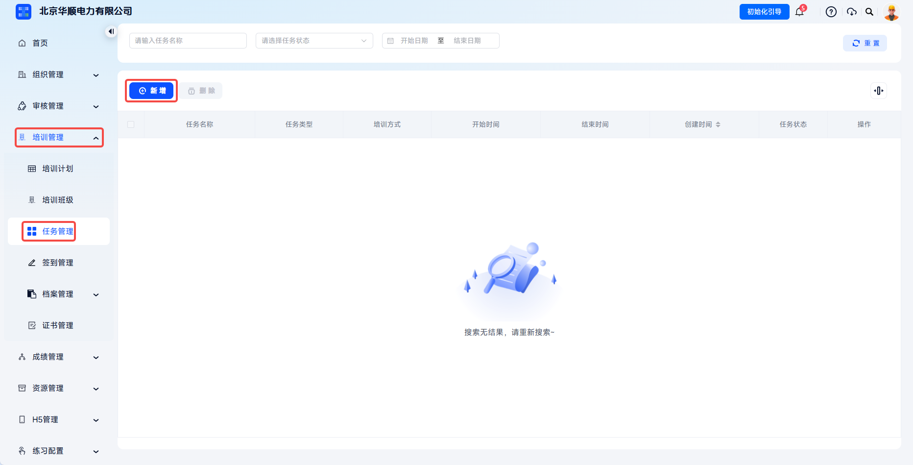
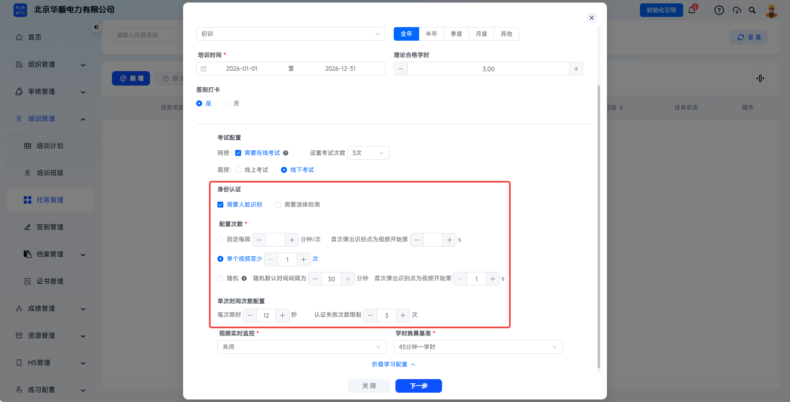
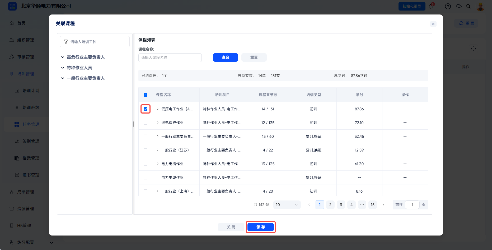
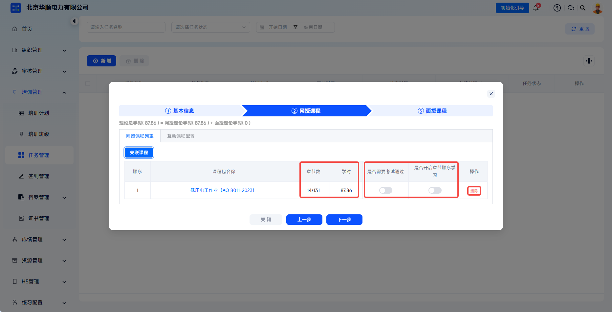
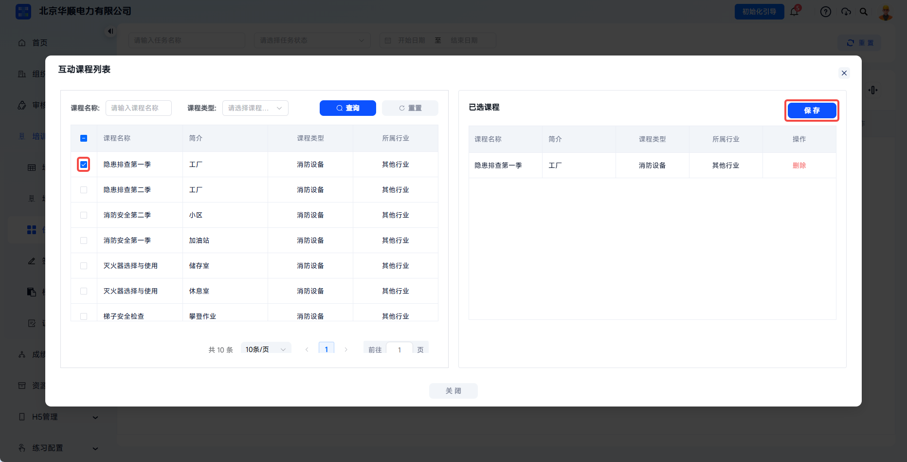
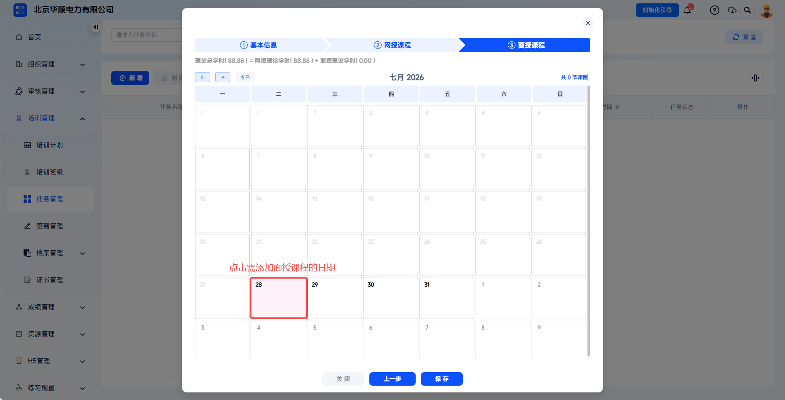
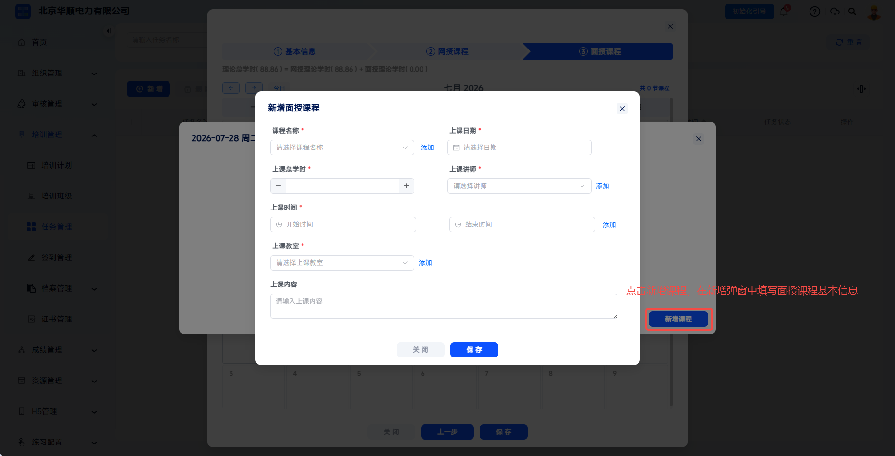
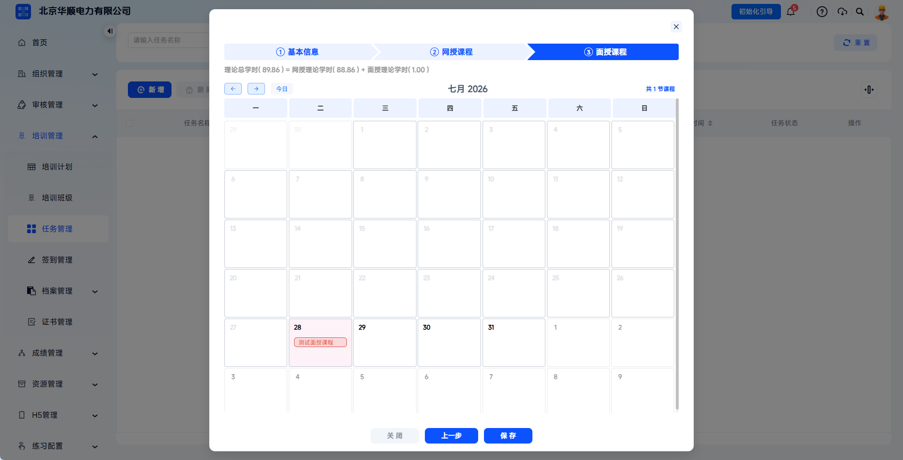

# 创建培训任务

培训任务是面向企业或组织下发的培训指令，用于实现规模化、周期性的培训统筹管理，支持网授、面授、混合三种教学模式，一键关联计划、讲师、教室、考试及证书规则。

本文档通常用于以下场景：

- 创建新的培训任务；
- 配置网授课程、面授课程或互动课程；
- 配置签到、考试、身份认证等培训规则；
- 将任务保存并下发至学员端。

 
 

## 操作流程

### 进入任务管理

点击左侧菜单【培训管理】-【任务管理】，进入任务列表页。页面展示历史任务项与相关信息，包含任务名称、任务类型、培训方式、开始时间、结束时间、创建时间、任务状态等信息。点击【新增】按钮可创建新任务。

 

### 填写基本信息

根据页面要求填写培训任务的目标人群、培训类型、时间周期及考核标准。

| 字段 | 填写说明 |
| --- | --- |
| 任务名称 | 必填，输入任务名称，例如“2026年度全员安全再培训”。 |
| 培训方式 | 必填，可选择网授、面授、网授+面授等。 |
| 培训类型 | 必填，选择初训、复训、年度安全再培训等培训性质。 |
| 培训周期 | 可快捷选择全年、半年、季度、月度；选择其他时可自定义开始与结束时间。 |
| 培训时间 | 必填，设定任务开始日期和结束日期，决定任务有效期。 |
| 理论合格学时 | 设定完成本任务所需的理论学时总数，作为任务创建参考标准。 |

 

### 配置任务规则

可根据需要设置签到打卡、考试、身份认证等规则。

签到打卡用于选择是否要求学员在培训开始前或培训过程中签到打卡。

---

网授考试用于选择是否需要在线考试，并设置考试次数。

---

面授考试支持选择线上考试或线下考试。选择线上考试时，需搜索选择相应试卷并设置考试次数；如无可选试卷，需先进行试卷配置。

---

身份认证配置可选择人脸识别或活体检测。可按固定间隔、单个视频至少次数或随机策略触发验证，并设置每次限时与认证失败次数限制。

| 配置项 | 说明 |
| --- | --- |
| 固定每隔 | 按时间间隔强制验证，适用于长时间挂机监控。 |
| 单个视频至少 | 按视频维度设置最低验证次数，系统会在随机时间点触发。 |
| 随机 | 在默认时间间隔范围内随机触发，并指定首次弹出时间点。 |
| 每次限时 | 每次身份验证限时，超时判定为失败。 |
| 认证失败次数限制 | 超过认证失败次数后判定为身份有误。 |
| 视频实时监控 | 开启或关闭学习过程中的实时视频抓拍。 |
| 学时换算基准 | 选择 30 分钟一学时或 45 分钟一学时。 |

 

### 配置网授课程

点击【展开学习配置】并进入课程配置后，页面显示理论总学时计算公式：理论总学时 = 网授理论学时 + 面授理论学时，数值随课程选择实时变化。

在【网授课程列表】标签页，点击【关联课程】按钮可勾选所需课程。

---

在弹窗中勾选需要纳入本任务的网授课程。

---

课程包学习设置可控制是否需要考试通过、是否开启章节顺序学习。开启章节顺序学习后，学员需按课程包目录顺序学习，不可跳过未学课程。

---

切换到【互动课程配置】标签页，点击【关联互动课程】可勾选所需互动课程。若无可选互动课程，请确认课程权限或资源配置。

 

### 配置面授课程

面授课程配置以日历形式展示培训时间范围内的日期。

---

点击具体日期，弹出【课程安排】弹窗，可勾选目标课程。如无可选择课程或需要选择自定义课程，可点击【新增课程】或先在【资源管理-面授课程】中配置。

---

点击【新增课程】后，填写课程名称、上课日期、上课总学时、讲师、上课时间、教室与上课内容等信息。

| 字段 | 填写说明 |
| --- | --- |
| 课程名称 | 必填，下拉选择或添加新课程。 |
| 上课日期 | 必填，在日历中选择固定日期。 |
| 上课总学时 | 必填，设定该面授课程的学时数。 |
| 上课讲师 | 必填，选择已维护的讲师或添加新讲师。 |
| 上课时间 | 必填，设置开始时间与结束时间。 |
| 上课教室 | 必填，选择已维护的教室或添加新教室。 |
| 上课内容 | 填写该课程的具体教学内容备注。 |

---

任务列表操作栏支持查看、编辑、复制、删除等后续管理动作。

| 操作 | 说明 |
| --- | --- |
| 查看 | 查看任务详情、关联计划、人员完成进度统计。 |
| 编辑 | 任务未开始时可编辑全部信息；进行中时可更改部分信息；已结束时不可编辑。 |
| 复制 | 复制新任务并保留被复制对象所有信息，时间默认从明天开始。 |
| 删除 | 仅可删除状态为未开始的任务。 |

 

### 保存任务

确认基本信息、学习配置、课程内容与考试配置无误后，点击【保存】提交任务。

---

任务创建成功后返回列表页，状态根据当前时间自动判定，可继续进入【学员管理】添加参训人员。

 
 

## 常见问题

**Q：任务创建时必须配置网授和面授课程吗？**

A：根据培训方式决定。如培训方式选“网授”，则必须配置网授课程；如选“面授”，则必须配置面授课程；如选“网授+面授”，则两者都需配置。

---

**Q：培训时间跨度可以超过一年吗？**

A：可以，但建议合理规划，过长周期不利于培训管理和学员学习动力保持。

---

**Q：任务创建后还能修改课程配置吗？**

A：可以，修改后课程配置将实时更新至学员 H5 端，不影响已开任务的课程安排。

---

**Q：为什么有任务没有删除选项？**

A：只有未开始的任务支持删除；已结束任务不支持编辑或删除。
