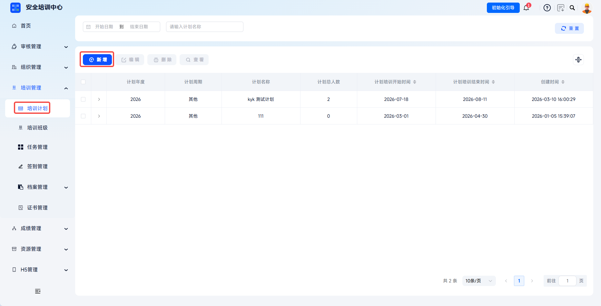
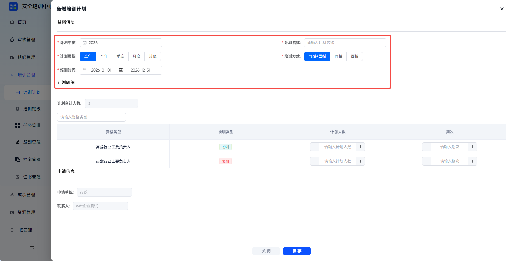
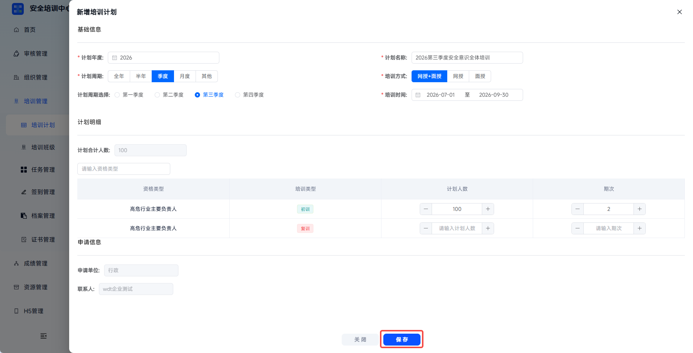
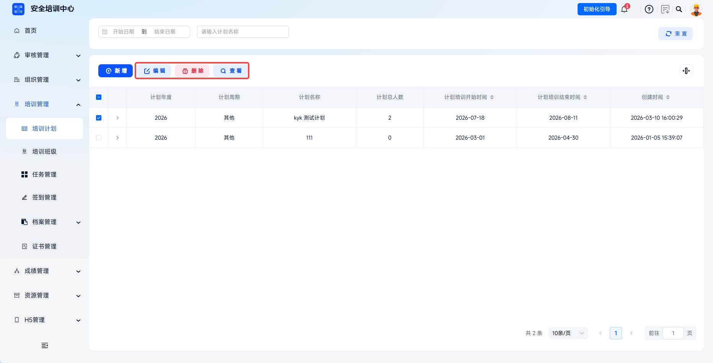

# 培训计划

用于统一管理企业各类培训计划的创建与发布。管理员可配置培训内容、参与人员及完成要求，系统将自动下发学习任务，培训执行过程全程留痕，作为安全生产培训的重要合规凭证。

本文档通常用于以下场景：

- 新建培训计划；
- 维护计划年度、周期、人数与期次；
- 查看、编辑或删除已有培训计划；
- 将培训计划作为后续培训任务的上级统筹。

 
 

## 操作流程

### 新增计划

点击【培训管理】-【培训计划】，点击【新增】，打开新增培训计划页面。

 

### 填写基础信息

按照页面要求填写计划年度、计划名称、计划周期、培训方式和培训时间。培训计划用于宏观统筹，向下可关联一个或多个培训任务，可视作被关联任务的上级计划。

培训时间默认按年度区间生成，可根据实际安排手动缩短。

| 字段 | 填写说明 |
| --- | --- |
| 计划年度 | 必填，选择对应年份，不支持跨年计划。 |
| 计划名称 | 必填，建议简洁描述计划对象或培训主题。 |
| 计划周期 | 必填，可选择全年、半年、季度、月度；不属于快捷区间时选择【其他】并自定义培训时间。 |
| 培训方式 | 必填，可选择网授+面授、网授或面授，请与实际资源匹配。 |
| 培训时间 | 必填，选择起止日期，系统默认年度区间，可手动缩短。 |

---

### 填写计划人数明细

计划人数明细为选填项，可根据组织可培训的资格类型与培训类型分别输入计划人数与期次。左上角支持搜索相关资格类型并进行填写。

 

### 保存计划

填写完成后点击【保存】，即新建计划成功。

 

### 管理计划

选中目标计划后，可在列表中进行查看、编辑或删除等操作。删除计划不会影响已经关联的任务。

| 操作 | 说明 |
| --- | --- |
| 查看 | 弹出详情页，显示计划详细信息。 |
| 编辑 | 允许修改计划年度、名称、周期、时间、培训方式、计划人数与期次。 |
| 删除 | 可直接删除，不会影响到关联的任务。 |

 
 

## 常见问题

**Q：计划与任务的关系是什么？**

A：培训计划为宏观统筹性方案，向下可关联一个或多个任务，可以视作被关联任务的上级计划。

---

**Q：培训计划可以关联多个任务吗？任务之间有什么关系？**

A：可以。任务之间为平行关系，计划用于统一管理。

---

**Q：计划发布后还能增加期次吗？**

A：可以进入计划【编辑】增加期次。

---

**Q：计划人数与实际报名不一致怎么办？**

A：可以进入计划【编辑】调整人数。

---

**Q：培训计划的发布和撤销有什么影响？**

A：培训计划发布后可以关联任务，撤销与删除不会影响已经关联的任务。
