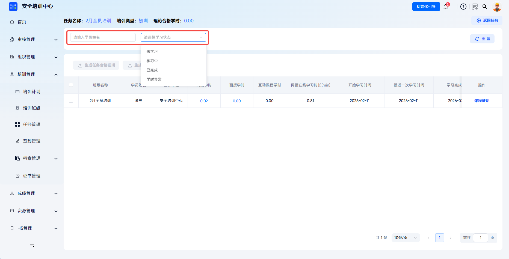
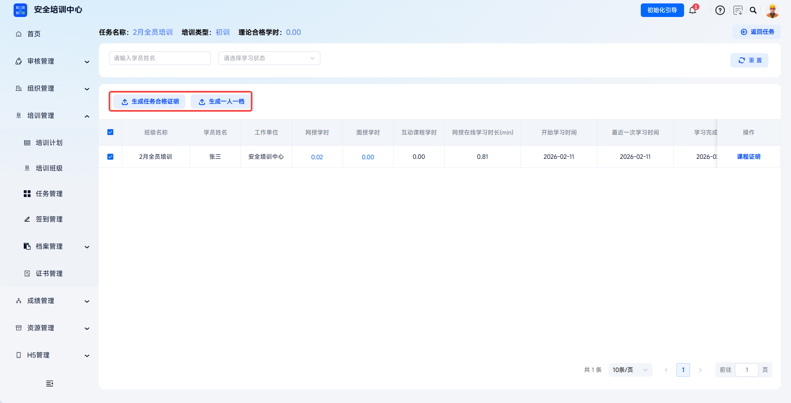

# 学习情况追踪

支持按任务维度实时追踪学员网授学时、互动课程学时及在线学习时长，通过可视化数据监控学习进度，精准识别未达标人员。管理员可下钻查看学员个人学时明细，包括课程包、章节、节级的学习记录，并支持批量生成培训证明与个人档案。

> 《安全生产培训管理办法》第十五条要求企业建立健全从业人员安全培训档案，如实记录培训时间、内容、参加人员及考核结果。平台通过学时数字化留痕，确保培训过程有迹可查、有据可依。

本文档通常用于以下场景：

- 查看任务学员学习进度；
- 核对网授学时、互动课程学时和在线学习时长；
- 按学习状态筛选未开始、学习中、已完成或学时异常学员；
- 为达标学员生成证明或档案。

 
 

## 操作流程

### 进入学时管理

在【培训管理】-【任务管理】中找到目标任务，点击【更多】-【学时管理】，进入任务学时管理页面。

 

### 查看学习统计

页面顶部显示当前任务关键信息，包括任务名称、培训类型、理论合格学时；右侧【返回任务】按钮支持快速返回任务列表页。

| 数据项 | 说明 |
| --- | --- |
| 基本信息 | 任务名称、学员姓名、工作单位。 |
| 学时数据 | 网授学时、互动课程学时、网授在线学习时长（分钟）。 |
| 时间记录 | 开始学习时间、最近一次学习时间、学习完成时间。 |

---

### 筛选与搜索

支持通过“学员姓名”搜索目标学员，也可通过“学习状态”下拉筛选未开始、学习中、已完成、学时异常等状态。点击【重置】清空条件。

 

### 生成任务证明与档案

勾选学员后，可点击【生成任务合格证明】或【生成一人一档】。生成一人一档会生成该学员本次培训的完整档案包，包含报名表、学习记录、考试成绩、证书等内容，用于纸质档案留存或监管备案。

 

### 生成课程证明

点击【课程证明】，弹出【生成课程证明】弹窗，可查看课程信息、章节数、总学时，并按需生成课程学时证明或课程考试证明。

| 证明类型 | 说明 |
| --- | --- |
| 生成课程学时证明 | 按课程包维度生成学时完成证明。 |
| 生成课程考试证明 | 按课程包维度生成考试合格证明。 |

 
 

## 常见问题

**Q：为什么学员的“网授在线学习时长”大于“网授学时”？**

A：在线学习时长是实际播放视频的累计时间，而网授学时是系统根据完播率、防挂机规则等计算后换算得到的有效学时。学员拖动进度条、暂停过久或人脸识别未通过时，实际时长可能计入在线时长，但不计入有效学时。

---

**Q：生成任务合格证明时为什么会下载失败？**

A：请检查勾选的学员是否达成证明生成条件，仅满足全部条件的学员才能生成合格证明。

---

**Q：学时明细中的人脸比对记录有什么作用？**

A：用于验证学员本人真实参与学习，防止代学、挂机等违规行为。记录包括验证时间、验证结果、抓拍照片比对相似度等信息，是应对监管检查的重要依据。
