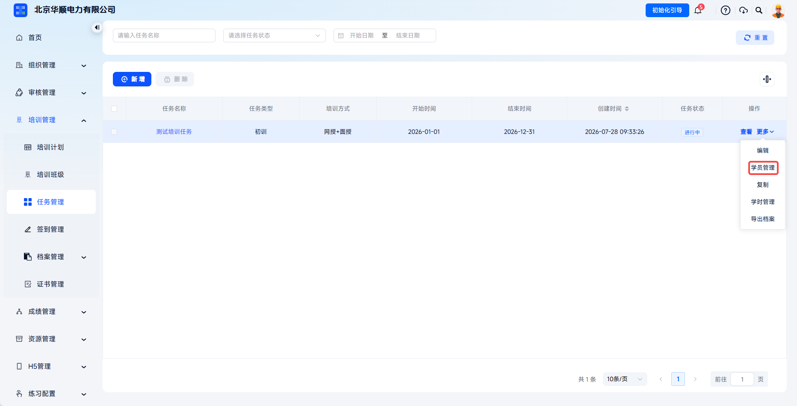
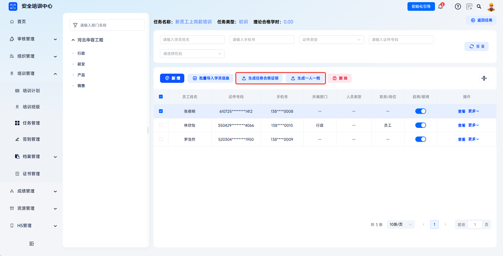
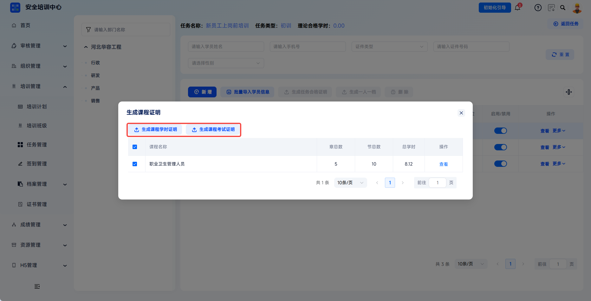

# 学员导入

支持单个新增、批量导入两种方式添加学员，实现培训任务与参训人员的精准绑定。管理员可按部门架构快速筛选目标人员并添加到任务，方便后续任务培训开展。

本文档通常用于以下场景：

- 已创建并发布培训任务后添加参训学员；
- 按部门、岗位或人员信息筛选并单个新增学员；
- 通过模板批量导入任务学员；
- 启用或禁用学员参与本次培训任务；
- 为任务内学员生成培训证明或个人档案。

 
 

## 操作流程

### 进入学员管理

在【培训管理】-【任务管理】中找到目标任务，点击对应任务【更多】-【学员管理】，进入任务学员管理页面。

页面顶部显示当前任务关键信息，包括任务名称、任务类型、理论合格学时等；左侧为部门架构树，支持按组织架构筛选学员来源。

 

### 单个新增学员

点击【新增】按钮，打开学员选择弹窗。勾选目标人员（支持多选），弹窗右侧显示已选择学员名单，确认无误后点击【确定】完成添加。

 

### 批量导入学员

点击【批量导入学员信息】，点击【下载模板】下载系统提供的 Excel 模板，按模板要求填写并上传。系统校验通过后，点击【确认导入】完成批量学员添加。

 

### 查看与管理学员

学员列表显示员工姓名、性别、证件类型、证件号码、手机号、所属部门、人员类型、职务岗位、启用状态等信息。管理员可通过学员姓名、手机号、证件类型、证件号码、性别等字段搜索筛选。

| 操作 | 说明 |
| --- | --- |
| 查看 | 预览学员详细档案。 |
| 删除 | 将学员移出本任务，仅删除关联关系，不删除人员档案。 |
| 启用/禁用 | 控制学员是否参与本次培训任务；禁用后学员端不再显示该任务。 |

---

### 生成培训档案

学员添加后，可在同一页面继续生成任务合格证明、一人一档、课程学时证明与课程考试证明。

点击【生成一人一档】可导出学员个人培训档案 PDF。

---

点击【更多】-【课程证明】可生成课程学时证明与课程考试证明。

| 证明类型 | 说明 |
| --- | --- |
| 生成任务合格证明 | 为达标学员批量生成培训合格证明。 |
| 生成一人一档 | 导出学员个人培训档案 PDF。 |
| 课程证明 | 生成课程学时证明与课程考试证明。 |

 
 

## 常见问题

**Q：为什么有些学员在新增列表中搜索不到？**

A：请检查该人员是否已在【组织管理-员工管理】中建档、是否已添加至本任务，以及当前账号是否有该部门的查看权限。

---

**Q：批量导入时提示“证件号码重复”如何处理？**

A：表示该证件号已存在于本任务中，或表格内存在重复记录。请检查学员是否已添加，以及证件号是否与其他人员冲突。

---

**Q：误删学员后能否恢复？学员可否继续进行学习？**

A：删除仅解除任务关联，不会删除学员本身信息。重新添加后，学员可以正常继续学习。

---

**Q：学员禁用与删除有什么区别？**

A：禁用学员无法使用学员 H5 端进行学习，但依然在任务中保存个人信息与学习历史记录，并可随时改为【启用】；删除学员会将其从此任务中移除。
