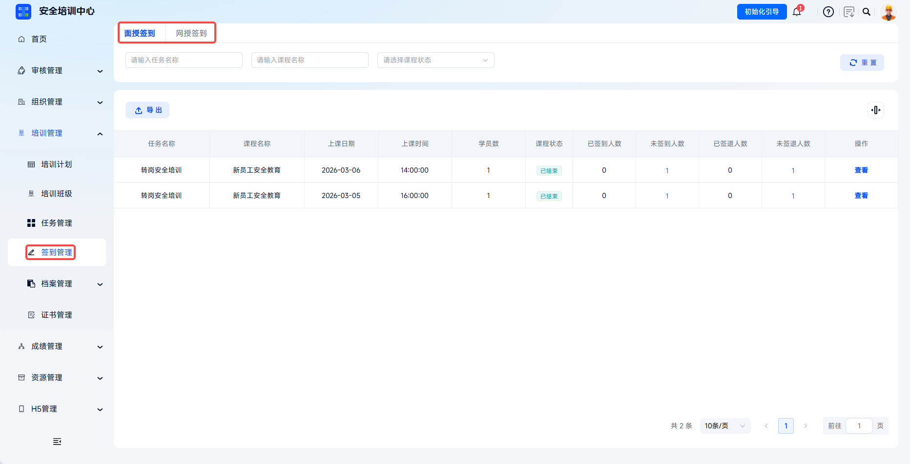
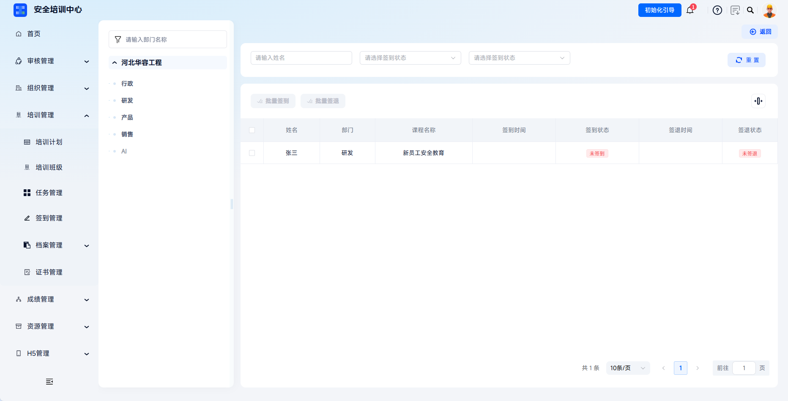

# 签到管理

支持按任务维度统一管理学员面授与网授签到记录，实现培训过程的全流程数字化留痕。管理员可快速查看任务级签到统计、学员个人签到天数及详细签到时间轴，并支持导出签到报表用于内部审计及监管报备。

> 《安全生产培训管理办法》第十五条规定，安全培训应当建立培训档案，如实记录培训的时间、内容、参加人员及考核结果等情况。平台通过签到管理功能，确保培训出勤有迹可查、有图可依。

本文档通常用于以下场景：

- 查看面授签到或网授签到记录；
- 查看任务签到统计；
- 查看学员签到、签退状态；
- 导出签到报表或进行补签处理。

 
 

## 操作流程

### 进入签到管理

点击【培训管理】-【签到管理】，默认进入【面授签到】标签页。系统提供【面授签到】与【网授签到】两个维度，可点击标签页切换查看。

 

### 查看签到数据列表

列表展示所有包含面授课程的任务信息。支持通过任务名称、任务类型、任务状态筛选目标任务，点击【导出】可批量导出当前列表的任务签到统计报表。

| 字段 | 说明 |
| --- | --- |
| 任务名称 | 培训任务名称。 |
| 任务类型 | 初训、复训、换证等。 |
| 学员数 | 该任务下参训学员总数。 |
| 任务开始时间/任务结束时间 | 培训周期。 |
| 今日签到人数 | 当日已完成签到的学员数量。 |
| 任务状态 | 学习中、已学完等。 |

 

### 查看任务签到详情

在目标任务操作栏点击【查看】，进入【签到详情】页面。页面展示该任务下所有学员的签到汇总数据，并支持通过姓名、签到状态、签退状态筛选学员。

| 字段 | 说明 |
| --- | --- |
| 姓名 | 学员姓名。 |
| 任务名称 | 当前签到记录所属培训任务。 |
| 任务总天数 | 任务内应签到天数。 |
| 部门 | 学员所属部门。 |
| 签到、签退时间 | 最近一次签到和签退时间。 |
| 签到、签退状态 | 展示学员当前签到与签退结果。 |

可勾选目标学员进行批量签到或签退操作。

 
 

## 常见问题

**Q：发现学员有缺勤记录，如何补签？**

A：系统支持管理员在【签到详情】页面为学员进行补签操作。点击目标任务、目标学员操作栏处【查看】，可选择日期进行补签。

---

**Q：签到数据能否作为执法检查的证明材料？**

A：可以。平台签到数据包含签到时间戳和人脸识别照片等防篡改记录，符合培训档案真实性要求。建议定期导出备份，保存期限不少于 3 年。
