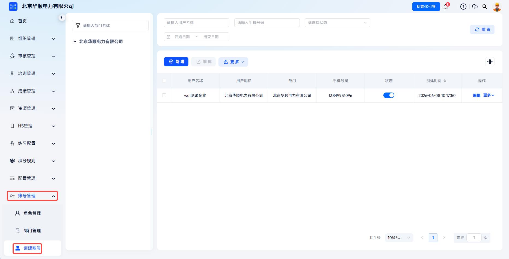
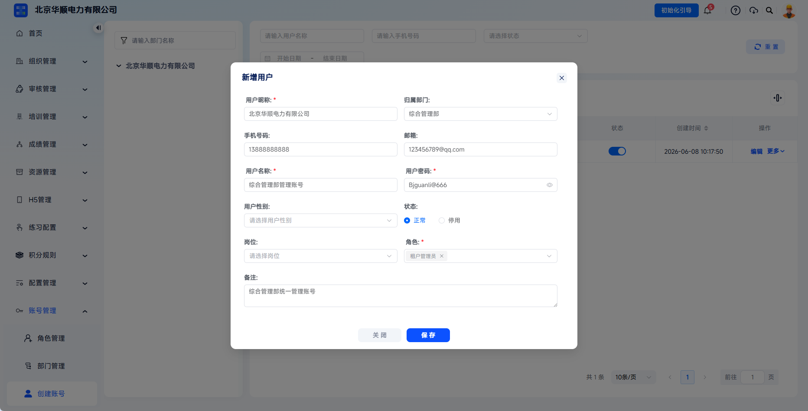
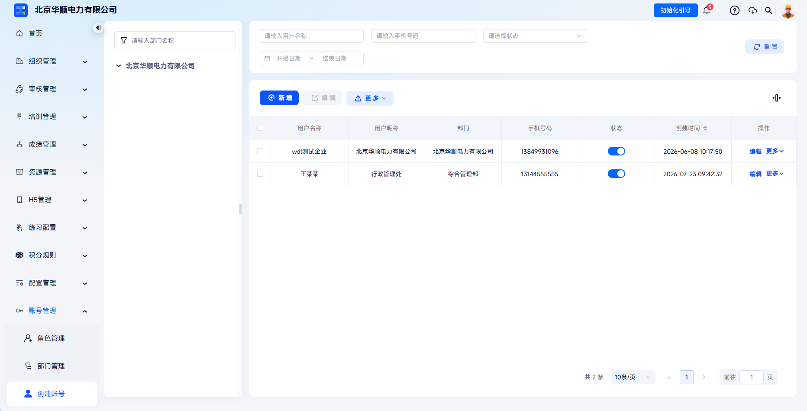

# Create Account

This function is used to maintain login identities for internal enterprise users. Administrators can create accounts for employees and configure their department, contact information, position, account status, and role permissions to build a complete account system.

This document is typically used in the following scenarios:

- Creating an account for a new administrator;
- Granting backend permissions for business roles such as training, exams, and organization management.
 
 

## Workflow

### Open The Create Account Page

In the left navigation bar, choose **Account Management** - **Create Account** to open the account list page.

 

### Add A User

Click **Add** on the page to open the **Add User** dialog.

 

### Fill In Account Information

Fill in the account information as required on the page:

<table className="account-info-table">
  <colgroup>
    <col className="account-info-table__field" />
    <col className="account-info-table__required" />
    <col />
  </colgroup>
  <thead>
    <tr>
      <th>Field</th>
      <th>Required</th>
      <th>Instructions</th>
    </tr>
  </thead>
  <tbody>
    <tr>
      <td>User Nickname</td>
      <td>Yes</td>
      <td>The display name shown in the upper-left corner of the system, such as "Administration Office".</td>
    </tr>
    <tr>
      <td>Department</td>
      <td>No</td>
      <td>Select the user's department. This affects the scope of subsequent data permissions.</td>
    </tr>
    <tr>
      <td>Mobile Number</td>
      <td>No</td>
      <td>Enter an 11-digit mobile number. It can be used for login verification and password recovery.</td>
    </tr>
    <tr>
      <td>Email</td>
      <td>No</td>
      <td>Enter the user's email address as an optional contact method.</td>
    </tr>
    <tr>
      <td>Username</td>
      <td>Yes</td>
      <td>The login account name. It cannot be modified after creation and must be unique.</td>
    </tr>
    <tr>
      <td>Password</td>
      <td>Yes</td>
      <td>Set the initial password. It is recommended to include uppercase and lowercase letters, numbers, and special characters.</td>
    </tr>
    <tr>
      <td>Gender</td>
      <td>No</td>
      <td>Select according to the actual situation.</td>
    </tr>
    <tr>
      <td>Status</td>
      <td>Yes</td>
      <td>Select **Normal** or **Disabled**. Accounts in normal status can log in; disabled accounts cannot log in.</td>
    </tr>
    <tr>
      <td>Position</td>
      <td>No</td>
      <td>Select a position. Position information must be maintained in the position tree under **Organization Management** - **Employee Management**.</td>
    </tr>
    <tr>
      <td>Role</td>
      <td>Yes</td>
      <td>Select a configured role to determine the features the user can access.</td>
    </tr>
    <tr>
      <td>Remarks</td>
      <td>No</td>
      <td>Enter additional notes for future management.</td>
    </tr>
  </tbody>
</table>

 

### Save The Account

After confirming that the information is correct, click **Save**. The system creates the account and returns to the user list.

After successful creation, administrators are advised to notify the user of:

- Login URL
- Login account
- Initial password
- The need to update the account password after first login
 

### Configuration Recommendations

- The username cannot be modified after creation. Use a unified naming convention, such as mobile number, employee ID, or enterprise unified account;
- Configure roles according to job responsibilities. Avoid granting unnecessarily high permissions indiscriminately;
- For temporary accounts or external collaboration accounts, add clear remarks and check their status regularly;
- If a user does not need to log in for the time being, prefer **Disabled** instead of deletion.

 
 

## FAQ

**Q: Can the username be modified after creation?**

A: No. The username is the login account name and is fixed after creation. If it needs to be changed, create a new account and disable the old one.

---

**Q: Why can't a newly created account see menus after logging in?**

A: Check whether the account status is **Normal**, whether a role has been assigned, whether the role is enabled, and whether the role has the corresponding menu permissions configured.

---

**Q: Can one account be assigned multiple roles?**

A: Yes. One account can have multiple roles, and system permissions take effect as the union of all assigned roles. Avoid unclear permission boundaries across multiple roles.

---
