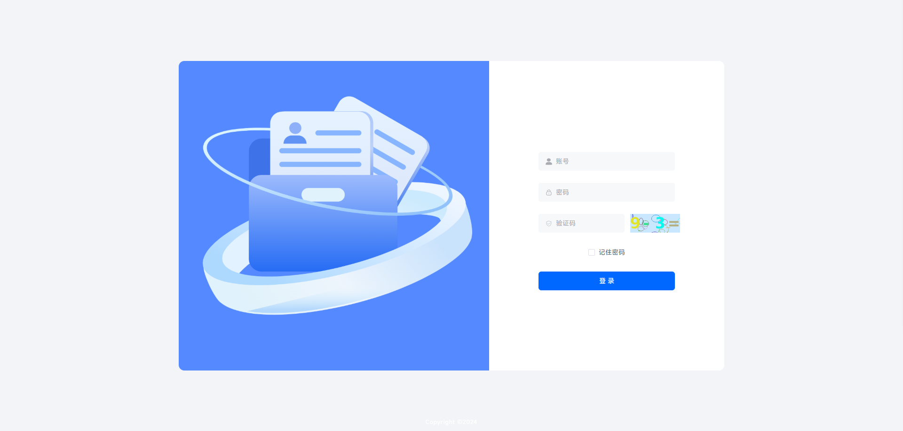
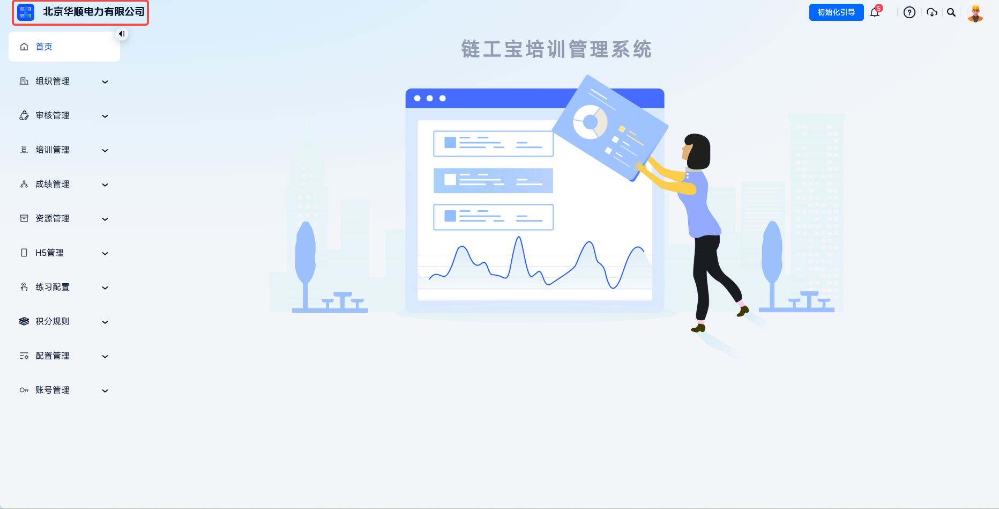
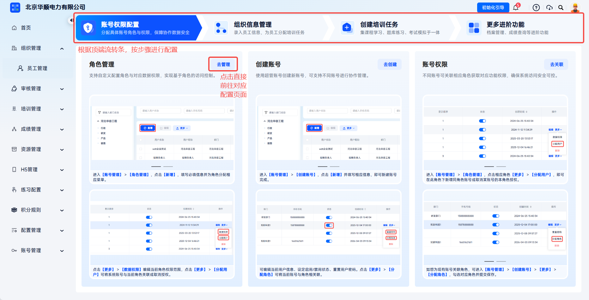
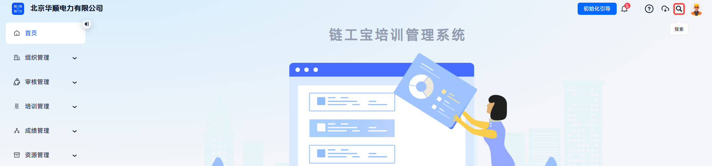
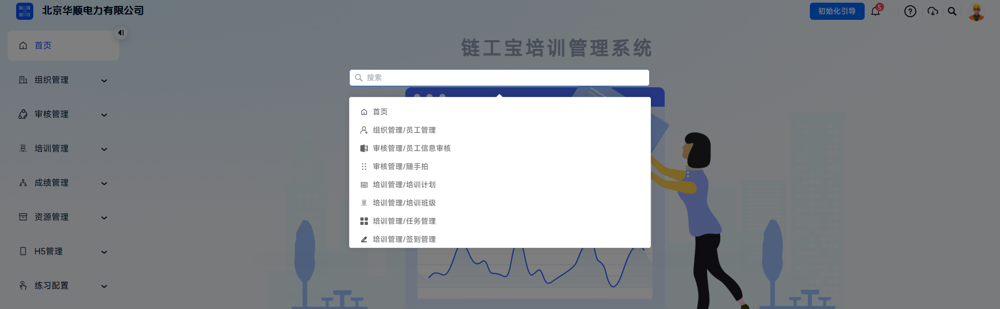

# Log In

The All-Staff Training admin console is designed for enterprise administrators and business managers. After identity verification with an account, password, and verification code, administrators can enter the backend system and access feature menus and data scopes according to the permissions of the logged-in account.

This document applies to the following scenarios:

- Entering the All-Staff Training admin console for the first time;
- Daily maintenance of training, exams, accounts, and permission configurations;
- Logging in again after the login session expires, the browser is changed, or cookies are cleared.

 
 

## Workflow

### Open The Admin Console

Open the All-Staff Training admin console URL in a browser:

[https://qypxb.guangl.cn/](https://qypxb.guangl.cn/)

The system opens the login page.

The admin console login page is used to enter the enterprise administrator account, password, and verification code.

 

### Enter Login Information

On the login page, fill in:

| Field | Instructions |
| --- | --- |
| Account | Enter the administrator login account. |
| Password | Enter the password for the account. |
| Verification Code | Enter the verification code shown on the page. |

After filling in the information, click **Log In**.

Pay attention to the following when entering login information:

- The account is the administrator login account, usually the super administrator account, or an account created by the system administrator under **Account Management** - **Create Account**;
- The password must match the account. If you forget the password, contact an administrator to reset it in the account list;
- The verification code must match the content shown on the page. An incorrect verification code will cause login failure.

 

### Enter The Admin Homepage

After successful login, the system opens the All-Staff Training admin homepage.

After entering the homepage, first confirm the feature scope accessible to the current account through the left menu. If you need to maintain organization structure, employees, training, exams, accounts, or permissions, make sure the current account has the corresponding menu permissions and data permissions.

---

The left side is the core feature navigation bar. Administrators can click the navigation bar to enter corresponding feature modules.

The left navigation bar displays the feature menus accessible to the account. The actual menu scope is controlled by role permissions.

---

The upper-left corner displays the account username. The logo supports custom upload by clicking.

---

If this is your first time using the Liangongbao training platform, or if this account lacks initial configuration, click **Initialization Guide** to enter the guide page and complete basic configuration and core feature tutorials step by step.

---

To search for a feature, click **Search** in the upper-right corner and enter keywords in the search box.

The list filter area supports querying target data by keywords or conditions.

---

Click the avatar in the upper-right corner to enter the personal center, where you can view account information, edit basic profile details, change the password, and update the avatar.

The personal center entry is used to view current login account information and basic settings.

 

### Log Out

To log out of the current account, click the avatar in the upper-right corner and choose **Log Out**. After logout, the system returns to the login page.

 
 

## FAQ

**Q: What should I do if I cannot log in after entering the account and password?**

A: Check whether the account, password, and verification code are entered correctly. If you still cannot log in, contact an administrator to confirm whether the account status is **Enabled**, or try again after resetting the password.

---

**Q: Why can't I see some menus after logging in?**

A: Menu visibility is determined by the role permissions associated with the account. Confirm that the account has been assigned a role, and that the role is enabled and configured with the corresponding menu permissions.

---

**Q: Can a disabled account still log in?**

A: No. When the account status is **Disabled**, the account cannot log in to the system. It must be restored to **Enabled** by an administrator before use.
