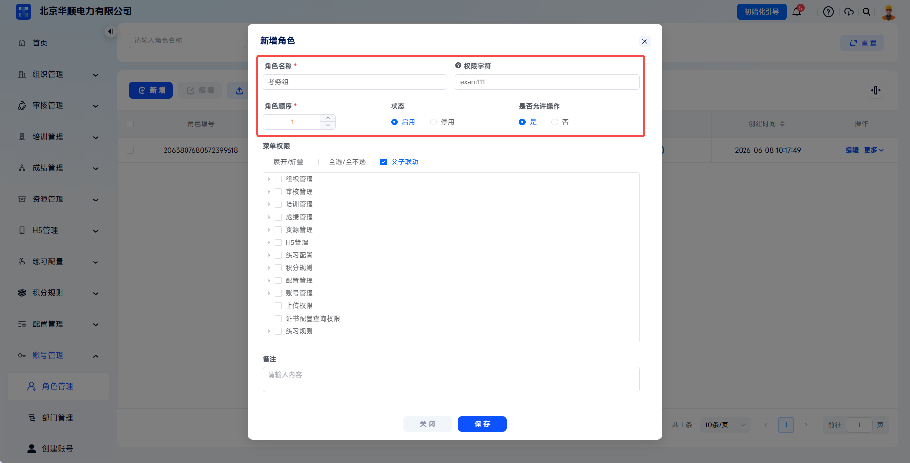
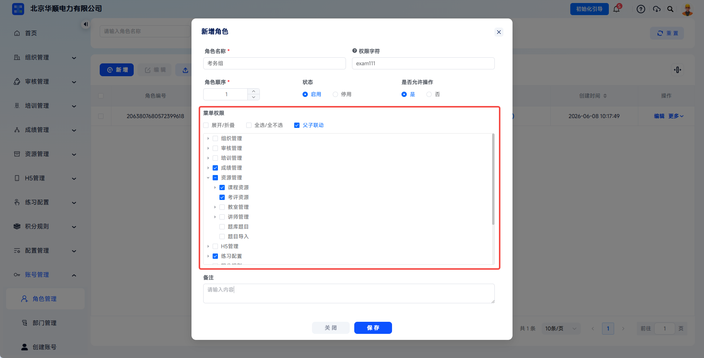
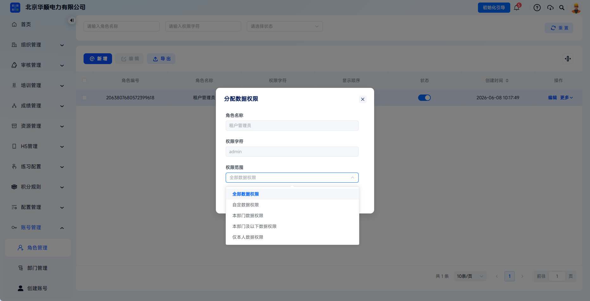
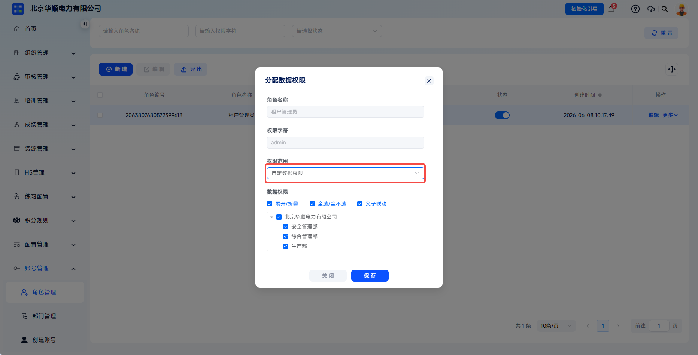
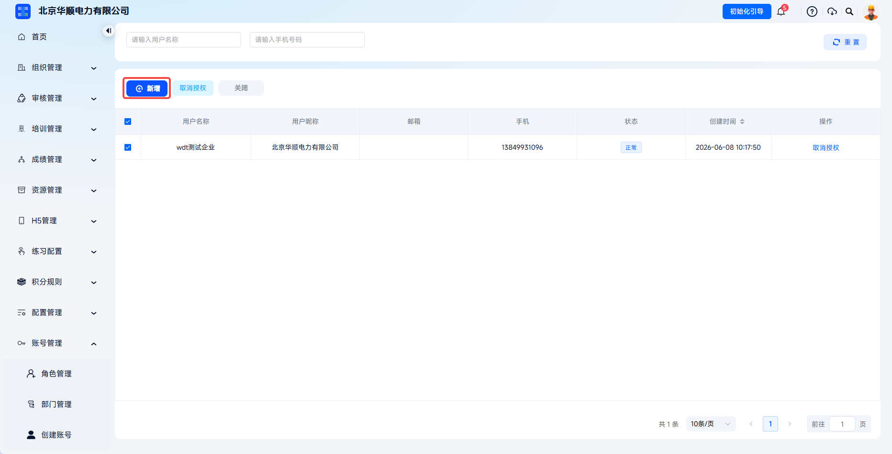
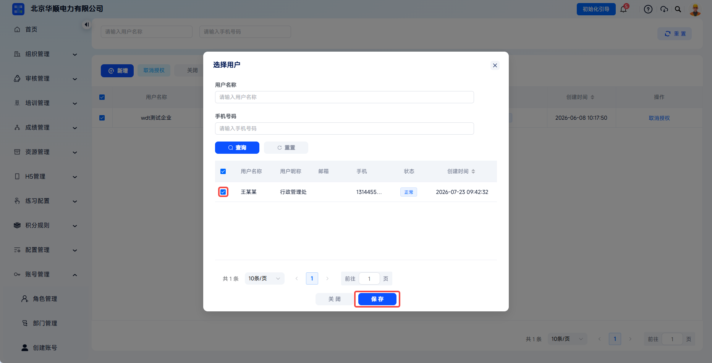
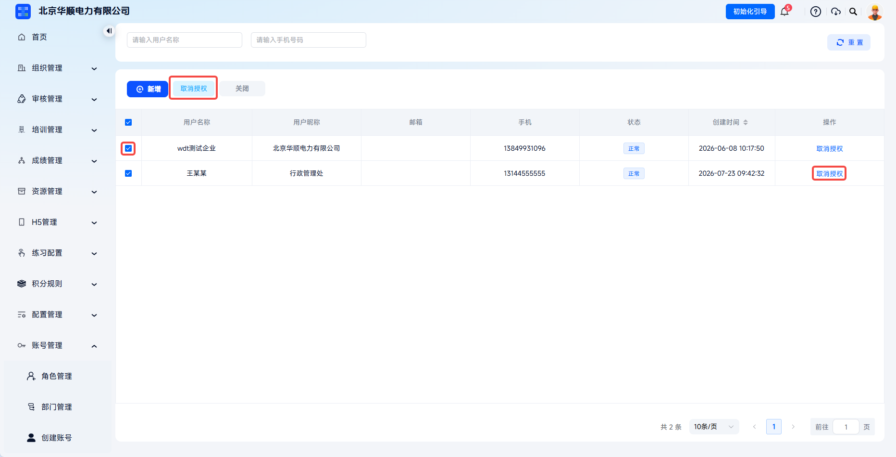
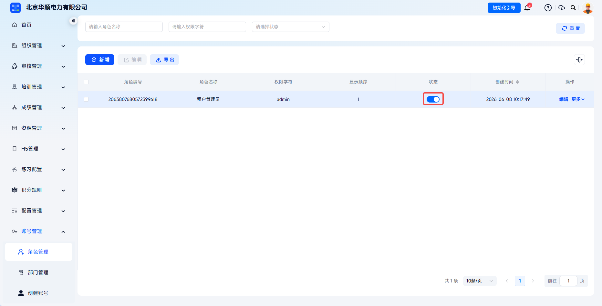
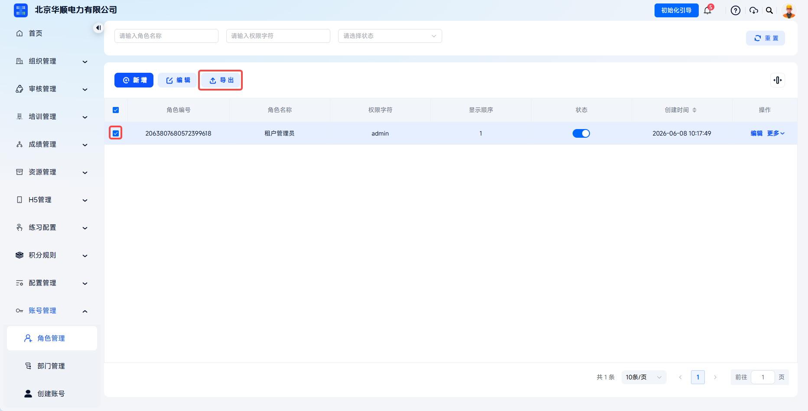
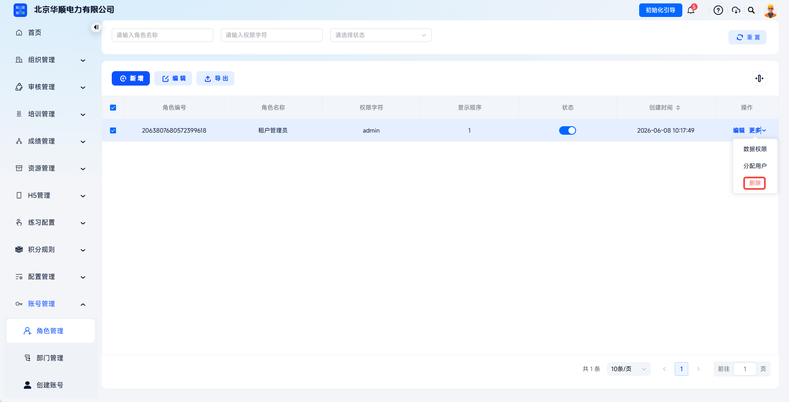

# Role Management

The system supports custom role configuration. Through the four-step process of role definition, menu authorization, data authorization, and user assignment, it implements role-based access control. The system supports assigning menu permissions by feature module and data permissions by organization structure, meeting enterprise needs for hierarchical management, permission isolation, security, and compliance.

This document is typically used in the following scenarios:

- Adding system roles;
- Configuring menu permissions;
- Configuring data permissions;
- Assigning roles to users;
- Editing, exporting, or deleting existing roles.

 
 

## Workflow

### Enter Role Management

Click **Account Management** - **Role Management** to enter the role list page. The list displays existing role information, including role ID, role name, permission key, display order, status, and creation time.

The role management list displays existing roles and statuses and is the entry for adding roles and maintaining permissions.

 

### Add A Role

Click **Add** to open the **Add Role** dialog and fill in role name, permission key, role order, status, whether operations are allowed, remarks, and other information.

After clicking **Add**, enter the add role page and begin configuring basic role information.

---

| Field | Instructions |
| --- | --- |
| Role Name | Use a name that reflects specific job responsibilities, such as "Training Administrator" or "Exam Invigilator". |
| Permission Key | System code-level permission identifier, such as `admin` or `training_mgr`. It must be unique. |
| Role Order | Controls the order of roles in the list. Smaller numbers appear earlier. |
| Status | Select **Enabled** or **Disabled**. After disabling, users under this role cannot use the corresponding permissions. |
| Allow Operations | Controls whether this role is allowed to perform business operations. |
| Remarks | Enter the role purpose, applicable positions, or permission boundaries for later auditing. |

 

### Configure Menu Permissions

In the **Menu Permissions** area, select the feature modules accessible to this role. The menu tree supports expand/collapse, select all/clear all, parent-child linkage, and module-based selection.

Follow the principle of least privilege and select only the feature modules required by the position.

---

Menu permissions can be configured by feature module, such as approval management, training management, exam management, score management, resource management, statistical analysis, configuration management, and account management. Click the expand arrow in the menu tree to continue selecting lower-level features.

When **Parent-Child Linkage** is enabled, selecting a parent menu automatically selects all child menus, and clearing a parent menu automatically clears all child menus. This is suitable for quickly maintaining a group of permissions.

 

### Save The Role

After confirming that the basic role information and menu permissions are correct, click **Save** to create the role.

Click **Save** after confirming the role's basic information and menu permissions.

 

### Configure Data Permissions

Click **More** - **Data Permissions** for the target role to open the data permission assignment dialog.

The system provides five scopes: all data permissions, custom data permissions, department data permissions, department and subordinate data permissions, and self-only data permissions. Assign them according to account management information permissions.

Data permission configuration controls the data scope visible to this role.

---

For custom data permissions, select the manageable departments from all current departments.

---

Applicable scopes for the five data permissions:

| Data Permission | Description |
| --- | --- |
| All Data Permissions | Can view and operate all data without organization structure restrictions. Recommended only for super administrators. |
| Custom Data Permissions | Custom-select the department scope that can be viewed. |
| Department Data Permissions | Can view only data from the account's department. |
| Department And Subordinate Data Permissions | Can view data from the account's department and all subordinate departments. Suitable for department heads. |
| Self-Only Data Permissions | Can view only data created by or associated with the user. Suitable for highly sensitive positions. |

 

### Assign Users

Click **More** - **Assign Users** in the target role action column to enter the user assignment page.

Click **Add**, select the target accounts, and click **Save** to assign the current role to the accounts.

---

Click **Add** to open the user selection dialog and prepare to add accounts to the role.

---

In the role account list, select accounts or directly click **Cancel Authorization**. The corresponding accounts will no longer belong to the current role and will lose the role permissions.

---

After confirming the user selection, click save to complete the binding between role and account.

 

### Manage Existing Roles

Existing roles support:

- Role status: choose enabled or disabled;

- Edit role: modify role name, permission key, menu permissions, and other configurations;

- Export role: download a role information list;

Role status switching affects whether accounts under this role can continue using the corresponding permissions.

---

- Delete role: remove the role. If assigned users exist under the role, cancel all user authorizations first or transfer users to another role.

After editing a role, permissions for assigned users are automatically updated and take effect immediately. Exporting roles downloads a role information list for audit and backup. Before deleting a role, cancel all user authorizations first; otherwise, users will lose the menu permissions and data permissions corresponding to the role, which may cause feature access issues.

 
 

## FAQ

**Q: Why can't users see some menus after logging in?**

A: Check whether the user has been assigned a role, whether the role is enabled, and whether the role's menu permissions include the corresponding feature module.

---

**Q: What is the difference between menu permissions and data permissions?**

A: Menu permissions control which feature pages can be seen. Data permissions control which department data can be seen. Both take effect together.

---

**Q: Can one user have multiple roles at the same time?**

A: Yes. One user can be assigned multiple roles, and permissions take effect as the union.

---

**Q: What happens to originally assigned users after a role is deleted?**

A: All user authorizations must be canceled before deleting the role. After deletion, users lose all permissions corresponding to that role.
