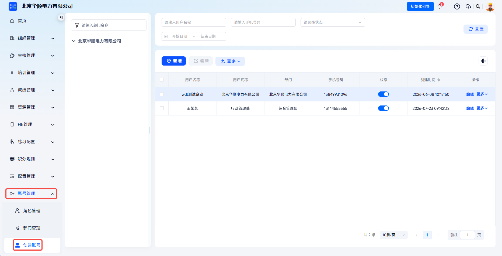
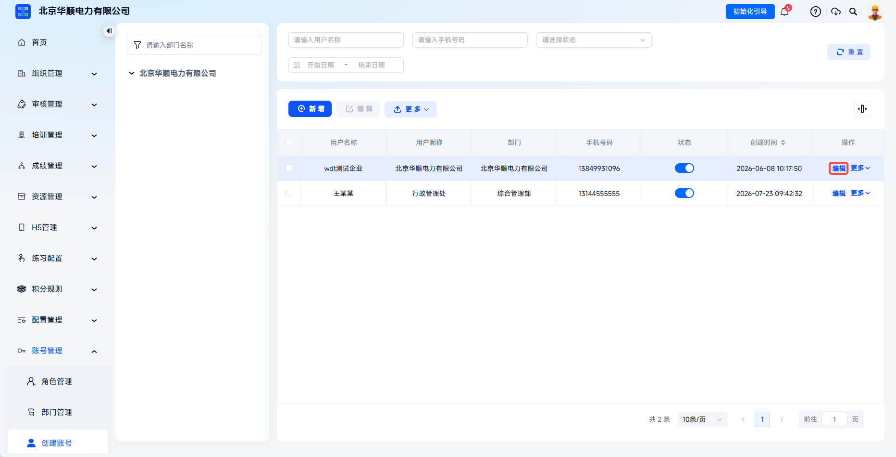
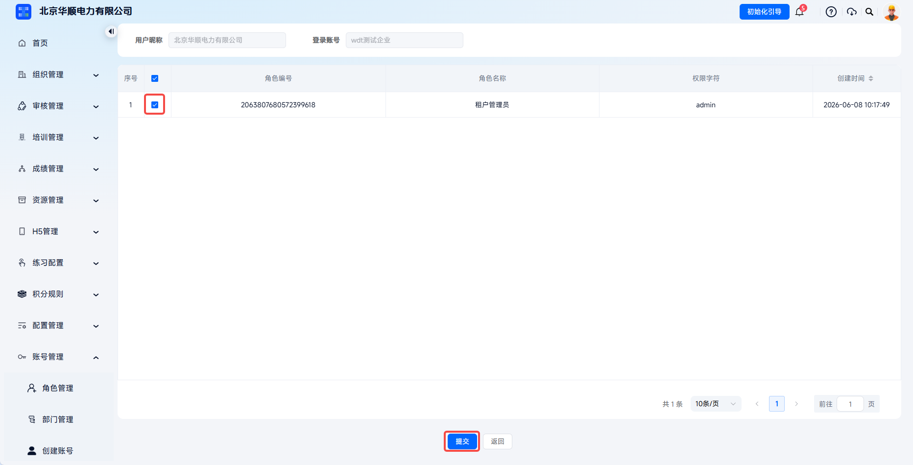
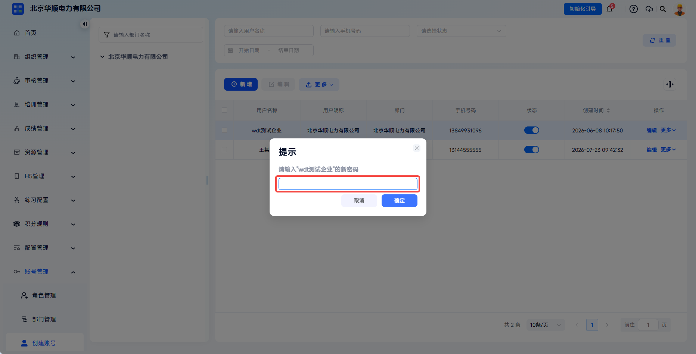
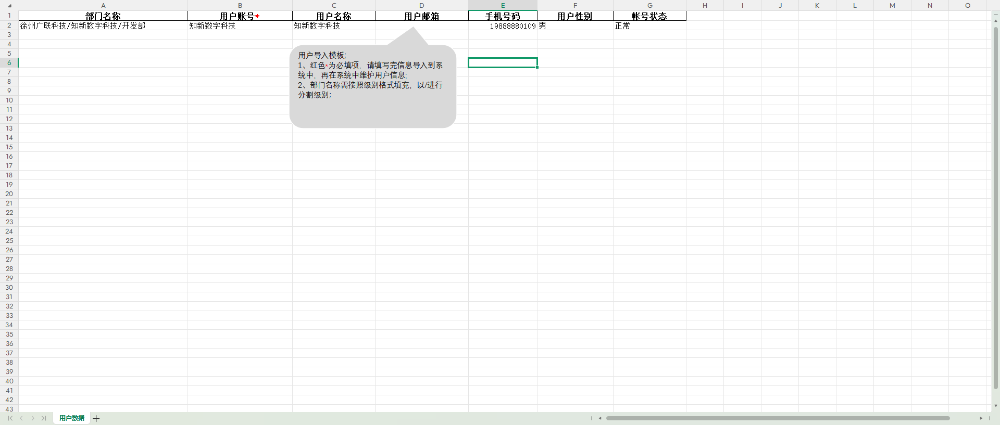

# Account Management

Through the linkage between accounts and roles, administrators can precisely control each login account's feature access scope and data viewing scope. This meets enterprise requirements for hierarchical management, permission isolation, security, and compliance, ensuring that system access remains secure and controllable.

This document is typically used in the following scenarios:

- Viewing and creating login accounts;
- Editing basic account information;
- Resetting passwords;
- Assigning roles;
- Importing or deleting accounts in batches.

 
 

## Workflow

### View Accounts

Click **Account Management** - **Create Account** to view the current organization user list. Click the status column to switch an account between enabled and disabled. Click **Add** to create a new account.

The account list is usually used to view information such as user ID, username, user nickname, department, mobile number, email, status, position, role, and creation time. The user ID is automatically generated by the system and cannot be edited. The creation time can be used for later audit tracing.

 

### Edit An Account

Click **Edit** for the target account to open the **Edit User** dialog. You can modify the user nickname, department, mobile number, email, gender, status, position, role, and remarks. The username cannot be modified.

Click **Edit** in the account action column to open the edit user dialog.

---

After changing the **Department** through **Edit**, the account's data permissions take effect again based on the new department. For example, if the original role is configured as **Department Data Permission**, after saving, the account will view data within the new department scope.

 

### Assign Roles

Click **More** - **Assign Roles** in the target account action column to enter the role assignment page. The page displays the currently assigned roles and available roles. Select the target roles and click **Submit** to assign new roles to the account. Clear selected roles and click **Submit** to remove those roles from the account.

The role assignment page displays the roles currently assigned to the account and the available role list.

---

After selecting or clearing roles and clicking submit, account permissions take effect again according to the role configuration.

 

### Reset Password

Click **More** - **Reset Password** for the target account, enter a new password, and save.

After clicking **Reset Password**, the password setting dialog opens.

---

Password reset applies when a user forgets the password or the password is suspected to be leaked. After an administrator resets the password, the original password does not need to be verified. It is recommended to remind the user to log in with the new password as soon as possible and keep it safe.

 

### Import Account Data

Click **More** - **Download Template** at the top to download and fill in the template. Then click import data and upload the file to import account information in batches.

Use **More** - **Download Template** to obtain the account import template.

---

Account data can also be downloaded through **More** - **Export Data** for permission audits, account inventory, and backup. Before batch import, confirm that template fields, department names, and role names match the existing configuration in the system.

### Delete An Account

Click **More** - **Delete** to remove the account.

Deletion permanently removes the account and associated data, and the operation cannot be undone. For resigned, temporarily suspended, or currently unused accounts, it is recommended to switch them to **Disabled** first to retain historical data and operation records.

 
 

## FAQ

**Q: Can the username be modified after creation?**

A: No. The username is the login account name and is fixed after creation. If it needs to be changed, create a new account and disable the old one.

---

**Q: Can one account be assigned multiple roles?**

A: Yes. Select multiple roles on the **Assign Roles** page, and permissions take effect as the union of all selected roles.

---

**Q: How do I recover a forgotten password?**

A: Contact the super administrator, find the user in the **Create Account** list, and click **Reset Password** to set a new password.

---

**Q: What is the difference between disabling and deleting an account?**

A: After disabling, the account cannot log in, but the account data and operation records are retained and can be restored at any time. Deletion permanently clears the account and associated data and cannot be recovered. Disabling accounts is recommended first.

---

**Q: Why can't a newly created account see menus after logging in?**

A: Check whether the account status is normal, whether a role has been assigned, whether the role is enabled, and whether the role's menu permissions have been configured.
