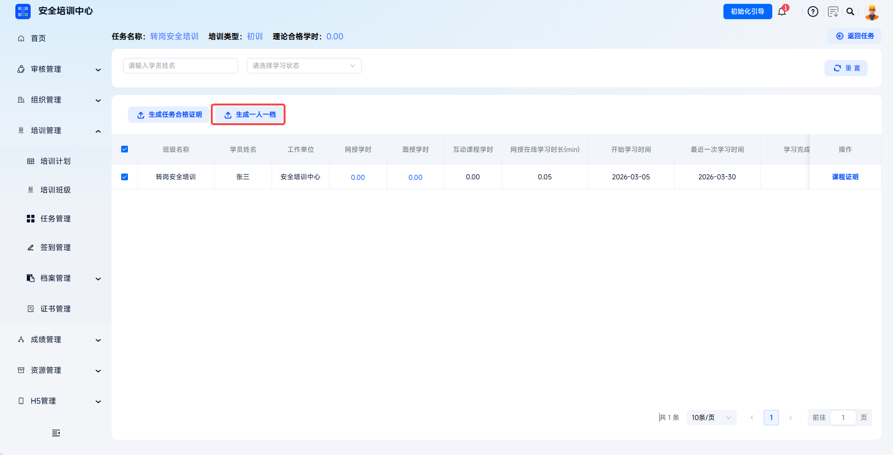
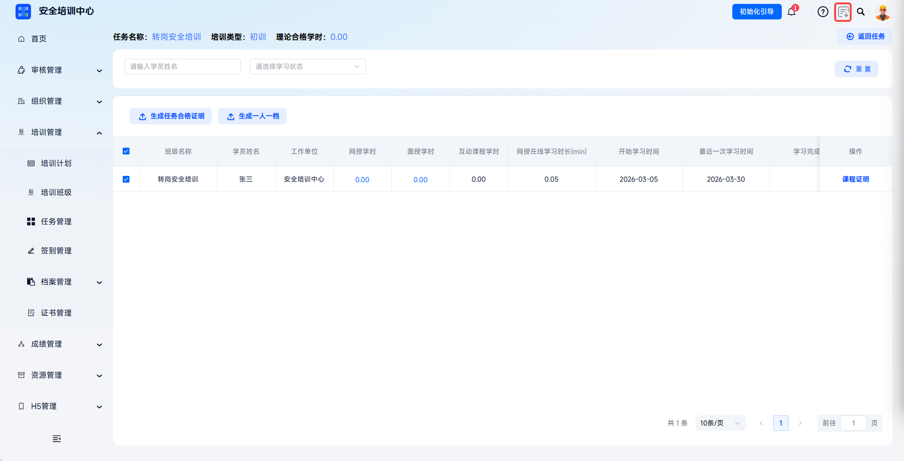
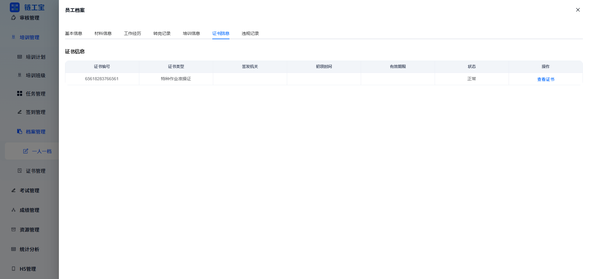

# One Person, One Archive

The platform supports generating a complete training archive for each learner by integrating full-lifecycle data such as basic learner information, training records, learning paths, exam results, certificate information, reward and penalty records, and more into a standardized electronic archive.

> Articles 28 and 30 of the Work Safety Law require production and business units to establish safety production education and training archives, truthfully recording the time, content, participants, and assessment results of safety production education and training.

This document is typically used in the following scenarios:

- Generating a learner's one-person-one-archive file in task study-hour management;
- Viewing employee archives in archive management;
- Exporting employee one-person-one-archive files in batches;
- Keeping paper archives or filing records for regulatory purposes.

 
 

## Workflow

First confirm the one-person-one-archive content you need to generate.

If you need archive information for an employee within a specific task, see **Task One Person, One Archive**.

If you need a summary of an employee's training information, see **One Person, One Archive Management**.

 

### Task One Person, One Archive

Enter the study-hour management page for the target task, select the target learners, and click the **Generate One Person, One Archive** dropdown button at the top. The system automatically generates training archives in batches for all selected learners in the current task.

Enter task management: click **Training Management - Task Management** to enter the task management list page. In the target task action column, click the **More** dropdown and choose **Study-Hour Management** to enter the learner study-hour management page for that task.

---

Generate one person, one archive: on the study-hour management page, select the target learners and click the **Generate One Person, One Archive** dropdown button at the top. The system automatically generates training archives in batches for all selected learners in the current task.

---

The document generation task will appear under **Downloads** in the upper-right corner. Successful tasks can be downloaded locally by clicking **Download**.

---

For failed tasks, click **View Details** to view the error description.

 

### One Person, One Archive Management

Click **Training Management** - **Archive Management**, then click **One Person, One Archive** to view the archive summary list.

#### View Archive Content

Employee archives include materials information, work experience, transfer records, training information, and more. Materials information can display ID photos, front and back sides of ID cards, education certificates, professional qualification certificates, physical examination reports, work injury insurance proof, recent photos, and more. Training information displays employee training task records and subscribed course learning status.

Basic information: view an employee's basic personal information, including name, ID number, contact information, ethnicity, education, graduation institution, major, and other basic HR information.

---

Materials information: view electronic versions of employee documents and materials, including ID photos, front and back sides of ID cards, education certificates, professional qualification certificates, physical examination reports, work injury insurance proof, recent photos, and more.

---

Work experience: display the employee's historical employers, employment period, department, job responsibilities, and other career history information in a table.

---

Transfer records: display the employee's position change history as a timeline, including onboarding time and each transfer record, with original position, new position, and operation time.

---

Training information: display the employee's training task records, including course name, training type, start and end time, task status, and operation entry, as well as subscribed course learning status.

---

Certificate information: display various professional qualification certificates held by the employee, including certificate number, type, issuing authority, initial issue time, validity period, and status, with support for viewing certificate details.

---

Violation records: record employee violation information, including violation name, occurrence date, description, handling result, and related image evidence.

 

### Export Archives

In archive management, select the target employees and click **Export Archive** to download all selected employees' one-person-one-archive files locally.

 
 

## FAQ

**Q: Why does the export task status show failure after clicking Generate One Person, One Archive?**

A: Check whether the learner has related task data and learning records.

---

**Q: Which page should I use when I need to export an employee's one-person-one-archive file?**

A: It is recommended to generate and export it from archive management. If you need more detailed information for this employee in a specific task, you can generate and export the one-person-one-archive file from the target task.

---

**Q: Can archive content be directly modified?**

A: Archive content comes from system learning records and cannot be directly modified. To correct it, first correct the learner's learning records, then regenerate the archive.
