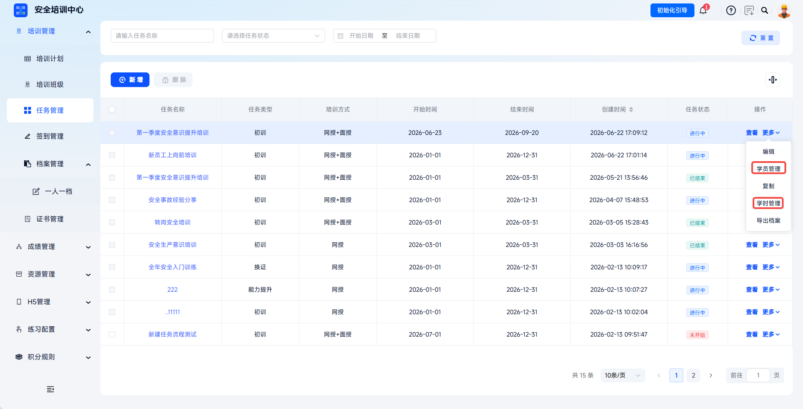
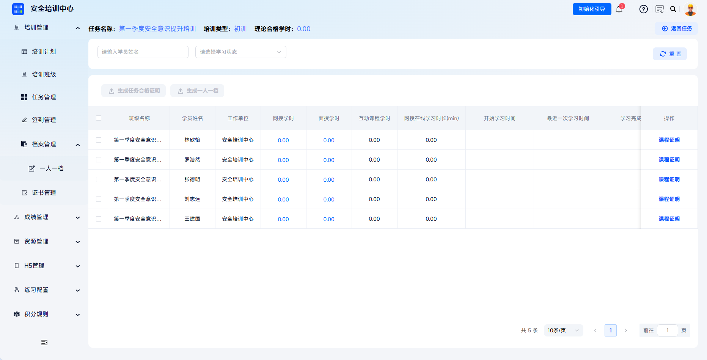
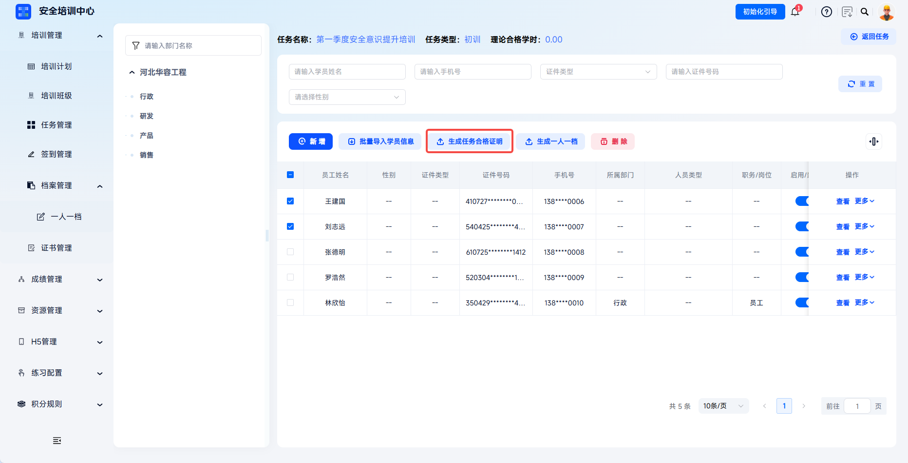
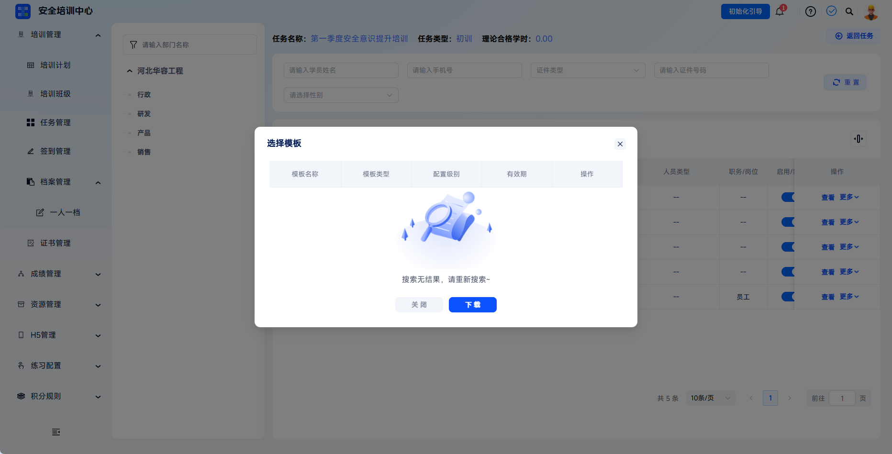
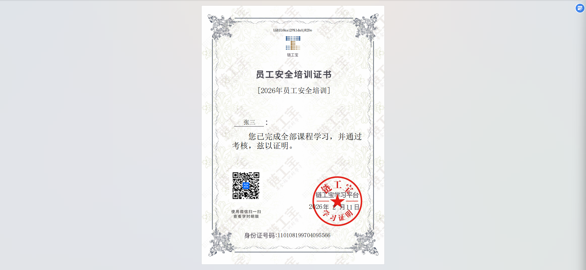

# Task Qualification Certificate

The platform supports generating qualification certificates for learners who have completed training tasks. It covers task-level qualification certificates and course-level certificates, forming closed-loop management from task, learning, assessment, to certificate.

This document is typically used in the following scenarios:

- Generating task qualification certificates for learners who have completed training and met assessment requirements;
- Generating certificates in batches;
- Downloading successfully generated certificate files;
- Generating certificates from study-hour management for ended tasks.

 
 

## Workflow

### Generate Task Qualification Certificates

Click **Training Management - Task Management**, then click **Learner Management** or **Study-Hour Management** for the target task.

---

Filter and select the learners who need certificates, then click **Generate Task Qualification Certificate**. The system automatically generates task-level qualification certificates in batches for the selected learners.

---

If a local template is required, configure it in advance under **Configuration Management - Certificate Template Management**. Select it in the **Select Template** dialog, and the system will generate certificates according to the selected template.

 

### Export Task Qualification Certificates

The system begins generating files. Depending on the data volume, this may take a few seconds to several minutes. The downloaded archive content can be found under **Downloads** in the upper-right corner of the platform.

---

For successfully generated export tasks, click **Download** to download the task qualification certificate locally.

 

### Generate Certificates For Ended Tasks

Ended tasks do not have **Learner Management** in the action column. Task qualification certificates can only be generated through **Study-Hour Management**.

 
 

## FAQ

**Q: Why does the export task list show failure after clicking Generate Task Qualification Certificate?**

A: Click **View Details** in the failed export task action column to view the failure reason. If the system has no learner task data, it does not allow qualification certificates to be generated.

---

**Q: What is the difference between a task qualification certificate and a course certificate?**

A: A task qualification certificate covers the entire training task and includes the overall conclusion for all courses and assessments in the task. A course certificate targets a single course and can separately certify course study hours or exam status.

---

**Q: Can certificate content be modified after generation?**

A: Certificate content comes from system learning records and cannot be directly modified.

---

**Q: Can certificates still be generated for ended tasks?**

A: Yes. After a task ends, learners' historical learning records are still retained. Administrators can still generate certificates for learners who completed learning from the **Study-Hour Management** page.
