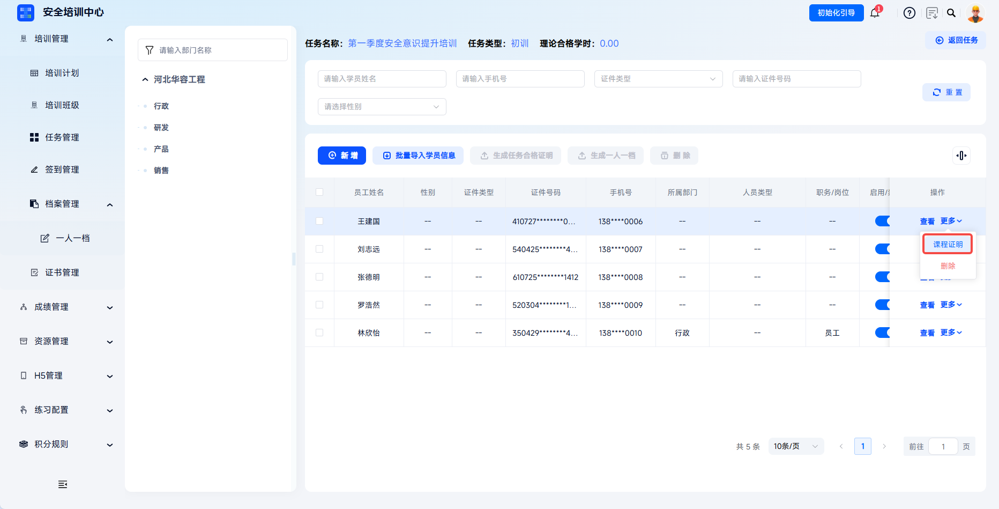
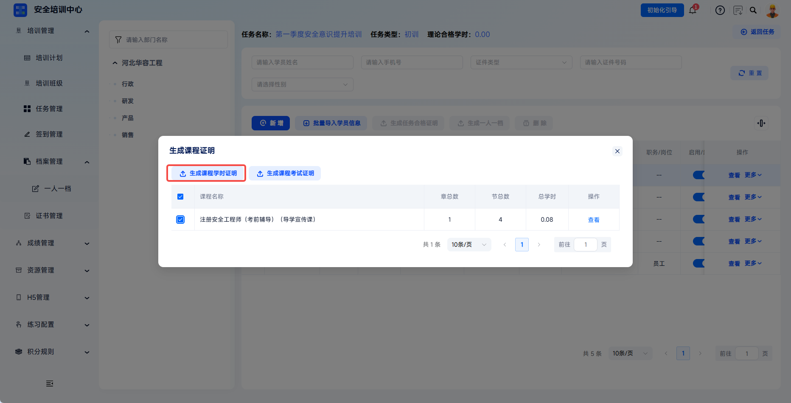
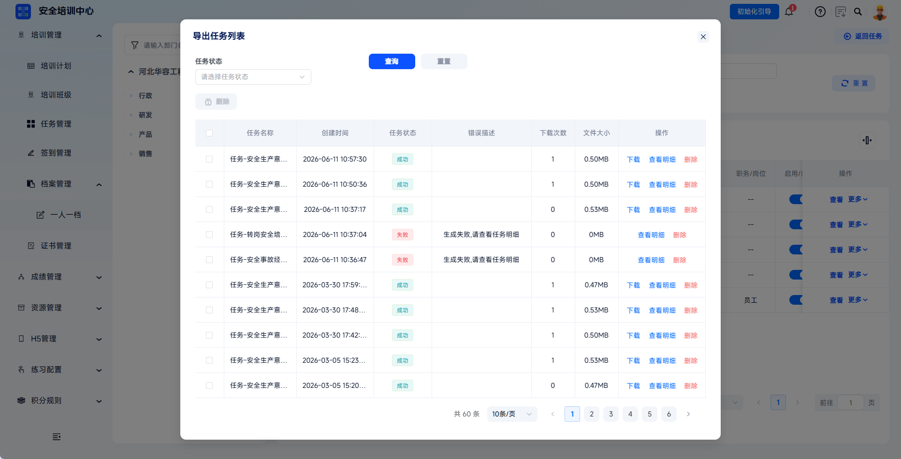
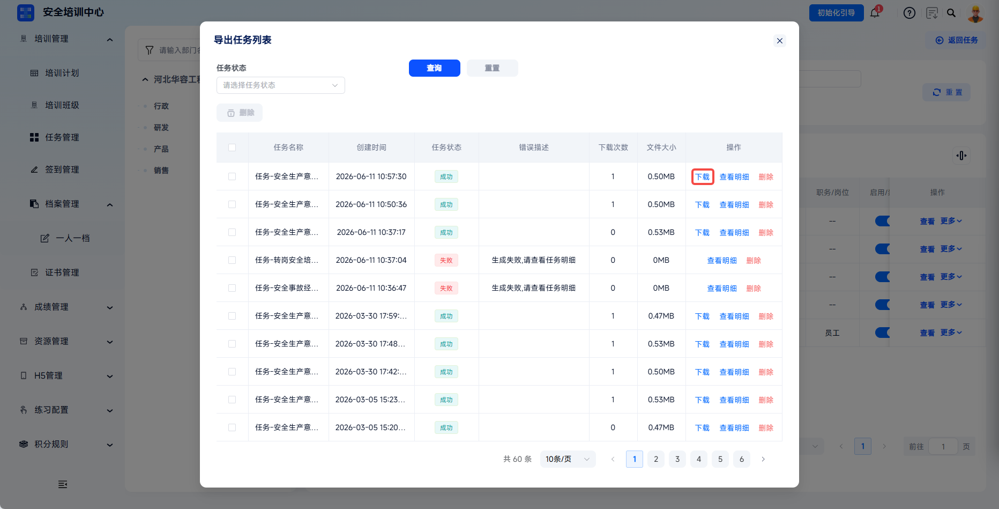
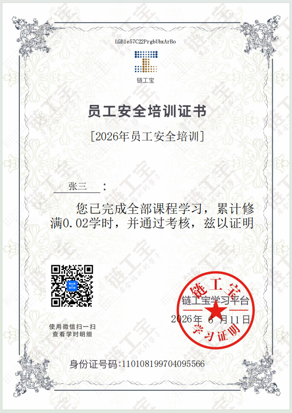

# Study-Hour Certificate

A study-hour certificate is an important credential that records the duration of training courses completed by a learner. It proves that the learner has completed the required study hours for safety training. The platform supports generating study-hour certificates from training tasks to meet compliance archiving needs in safety training scenarios.

This document is typically used in the following scenarios:

- Generating course-level study-hour certificates for learners;
- Downloading successfully generated certificate files.

 
 

## Workflow

### Generate A Certificate

Enter task management: click **Training Management - Task Management** to enter the task list page.

---

Select the target task: find the training task for which a study-hour certificate needs to be generated, click **More - Learner Management** in the action column, and enter the task learner management page. If the task has ended and the task learner management page cannot be opened, click **More - Study-Hour Management** to generate it from the study-hour management page.

---

In the learner list, find the learner who needs a certificate, click **More** - **Course Certificate** in the action column, and open the **Generate Course Certificate** dialog.

---

Export study-hour certificate: select the courses that require certificates (multiple selection is supported), click **Generate Course Study-Hour Certificate**, and the system starts creating a new export task.

---

If a local template is required, configure it in advance under **Configuration Management - Certificate Template Management**. Select it in the **Select Template** dialog, and the system will generate the certificate according to the selected template. Click **Download** to complete certificate generation.

 

### Download The Certificate

The downloaded archive content can be found under **Downloads** in the upper-right corner of the platform. For successfully generated export tasks, click **Download** to download the certificate locally.

---

For successfully generated export tasks, click **Download** to download the task qualification certificate locally.

 
 

## FAQ

**Q: Which learners can generate study-hour certificates?**

A: The target training task must contain learner learning records, and the learner must have completed the corresponding course learning task.

---

**Q: Can study-hour certificates still be generated after a task ends?**

A: Yes. Use **More** - **Study-Hour Management** to enter the study-hour management page and generate them.

---

**Q: Can study-hour certificate content be directly modified?**

A: Certificate content comes from system learning records and cannot be directly modified.
