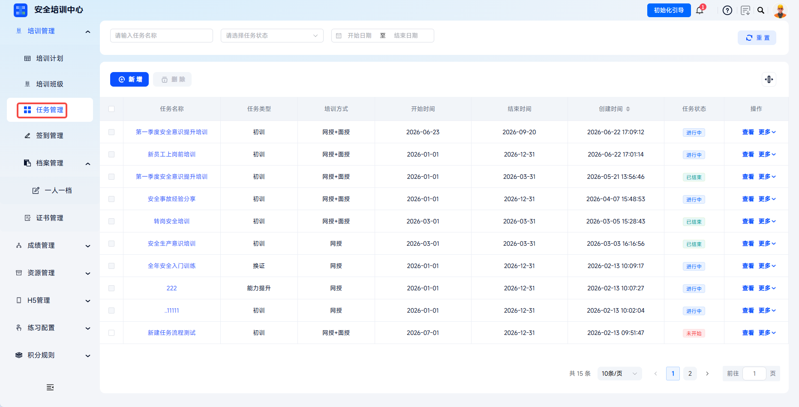
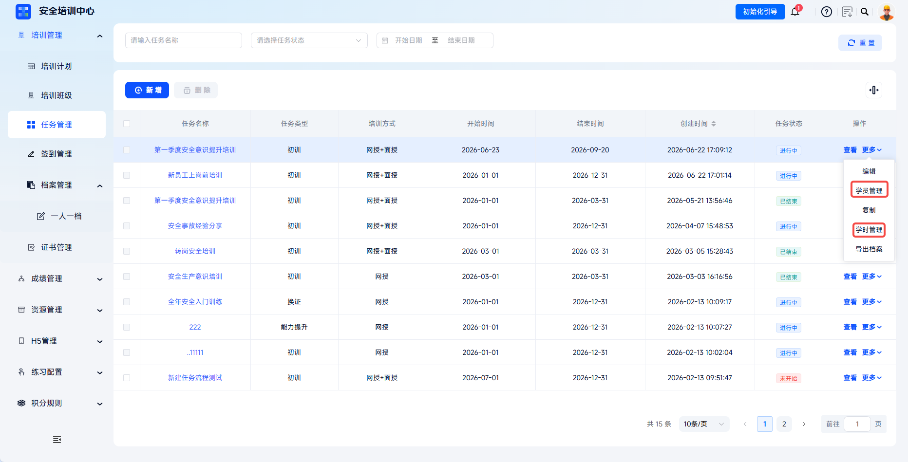
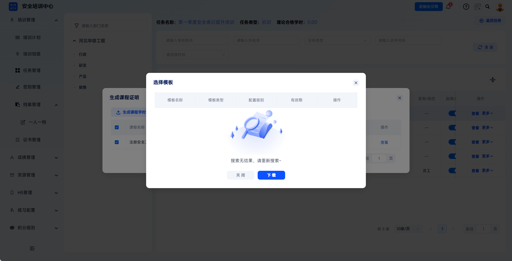
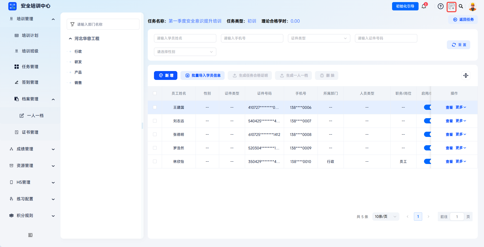
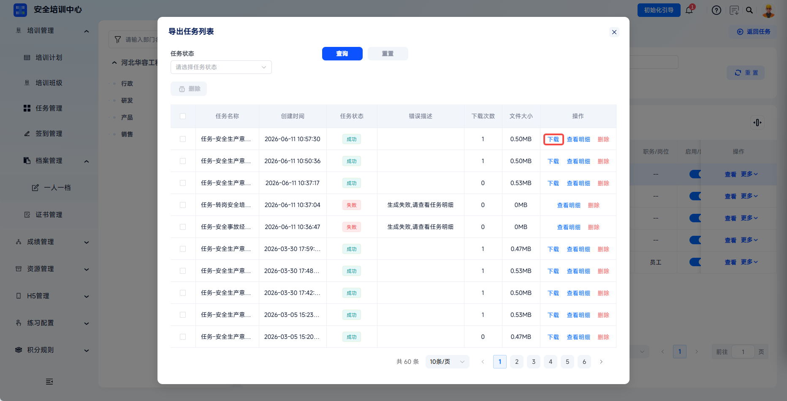
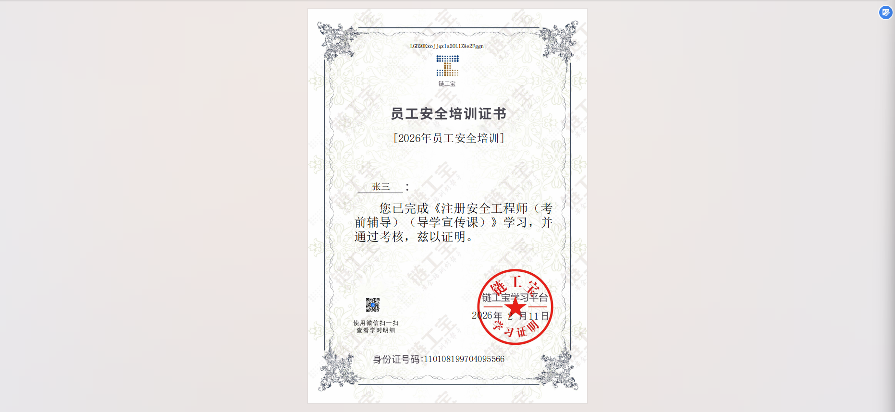

# Course Exam Certificate

The course exam certificate records a learner's exam pass status at the course level and is one type of supporting material in the learner's related archive. The platform can generate exam certificates by course from task learner management or study-hour management.

This document is typically used in the following scenarios:

- Generating course-level exam certificates for learners;
- Downloading successfully generated course exam certificates.

 
 

## Workflow

### Generate A Certificate

Enter task management: click **Training Management - Task Management** to enter the task list page.

---

Select the target task: find the training task for which archives need to be generated, click **More - Learner Management** in the action column, and enter the task learner management page. If the task has ended and the task learner management page cannot be opened, click **More - Study-Hour Management** to generate it from the study-hour management page.

---

Select the target learner: in the learner list, find the learner who needs a certificate, click **More - Course Certificate** in the action column, and open the **Generate Course Certificate** dialog.

---

Export exam certificate: select the courses that require certificates (multiple selection is supported), click **Generate Course Exam Certificate**, and the system successfully creates a new export task.

If a local template is required, configure it in advance under **Configuration Management - Certificate Template Management**. Select it in the **Select Template** dialog, and the system will generate the certificate according to the selected template.

 

### Download The Certificate

The downloaded archive content can be found under **Downloads** in the upper-right corner of the platform.

---

For successfully generated export tasks, click **Download** to download the task qualification certificate locally.

 
 

## FAQ

**Q: What is the difference between a course exam certificate and a task qualification certificate?**

A: A course exam certificate targets the exam pass status of a single course. A task qualification certificate covers the entire training task and includes the overall conclusion for all courses and assessments in the task.

---

**Q: Which learners can generate course exam certificates?**

A: The target training task must contain learner study/exam training records, and the learner must have completed the corresponding course exam.

---

**Q: Can certificate content be modified after generation?**

A: Certificate content comes from system learning records and cannot be directly modified. To correct it, first correct the learner's learning records, then regenerate the certificate.
