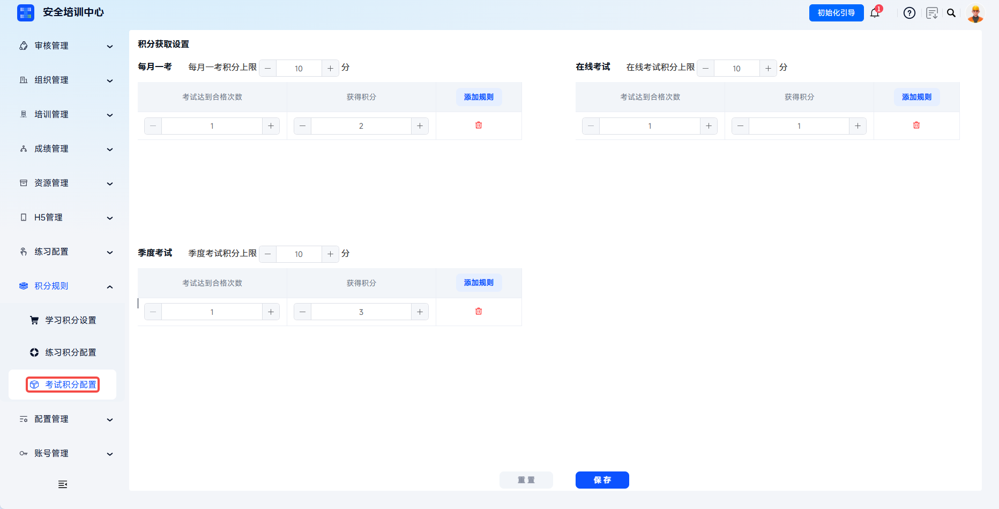

# Point Rule Configuration

Points are an important mechanism for motivating learners to participate in learning, exams, and practice. Through a closed-loop design of behavior, points, and incentives, they improve learner engagement and training completion rates. The system supports three dimensions: learning points, practice points, and exam points, covering scenarios such as check-in, video learning, reading articles, subscribed courses, daily practice, weekly practice, challenge quizzes, monthly exams, online exams, and quarterly exams.

This document is typically used to configure learning, practice, and exam points, and to set point caps and earning rules.

 

## Workflow

### Point System Overview

| Point Type | Scenario | Point Dimensions |
| --- | --- | --- |
| **Learning Points** | Incentives for daily learning behavior | Check-in, video learning, article reading, subscribed course learning |
| **Practice Points** | Incentives for daily practice behavior | Daily practice, weekly practice, challenge quizzes |
| **Exam Points** | Incentives for passing exams | Monthly exams, online exams, quarterly exams |

Learners can view point details and rankings in the personal center. Points can be used for lucky draws, rankings, and more. Administrators can view point rankings and learner ranking analysis under **Statistical Analysis**.

### Configure Learning Points

Click **Point Rules - Learning Point Settings** to enter the learning point configuration page.

Set point caps:

- Check-in point cap: set the maximum points a learner can earn through check-in ("-" decreases, "+" increases, manual input supported)
- Video learning point cap: set the maximum points a learner can earn by watching videos
- Article reading point cap: set the maximum points a learner can earn by reading articles
- Subscribed course learning point cap: set the maximum points a learner can earn by studying subscribed courses

---

Add point rules: click **Add Rule** under each module to configure rule parameters.

Rule: defines the behavior conditions that trigger points

- Check-in: daily check-in, consecutive check-in
- Video learning: valid video viewing duration, number of videos watched
- Article reading: read safety news, notices, and learning materials
- Subscribed course learning: number of valid subscribed videos, valid subscribed video duration

---

Quantity: set the number of occurrences or duration of the behavior

Points earned: set the point value awarded after the condition is met

 

### Configure Practice Points

Click **Point Rules - Practice Point Configuration** to enter the practice point configuration page.

Set point caps:

- Daily practice point cap: set the maximum points available from daily question practice
- Weekly practice point cap: set the maximum points available from weekly question practice
- Challenge quiz point cap: set the maximum points available from challenge quiz mode

---

Add point rules: click **Add Rule** under each module to configure rule parameters.

- Rule: answer __ questions correctly to earn __ points

 

### Configure Exam Points

Click **Point Rules** - **Exam Point Configuration** to enter the exam point configuration page.

Set point caps:

- Monthly exam point cap: set the maximum points available from monthly exams
- Online exam point cap: set the maximum points available from online exams
- Quarterly exam point cap: set the maximum points available from quarterly exams

---

Add point rules: click **Add Rule** under each module to configure rule parameters.

- Rule: pass the exam __ times to earn __ points

 
 

## FAQ

**Q: When do point rules take effect after configuration?**

A: They take effect immediately after clicking **Save**. Subsequent learner behavior will be calculated according to the new rules. Points already earned historically will not be recalculated.

---

**Q: Can learner points be manually modified?**

A: The system generally does not support administrators manually modifying learner points in order to ensure fairness.

---

**Q: Why did a learner not receive points after point rules were configured?**

A: Check whether the rule has been saved, whether the learner behavior meets the rule conditions, whether the point cap has been reached, and whether the learner account status is normal.

---

**Q: Are exam points calculated by exam attempts or passing attempts?**

A: According to the attachment content, exam points are calculated based on the number of times an exam reaches passing status.
