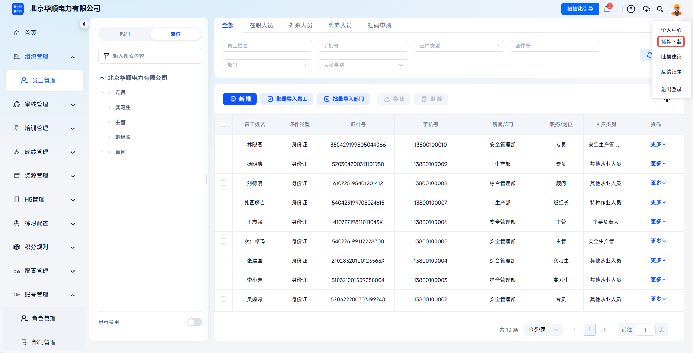
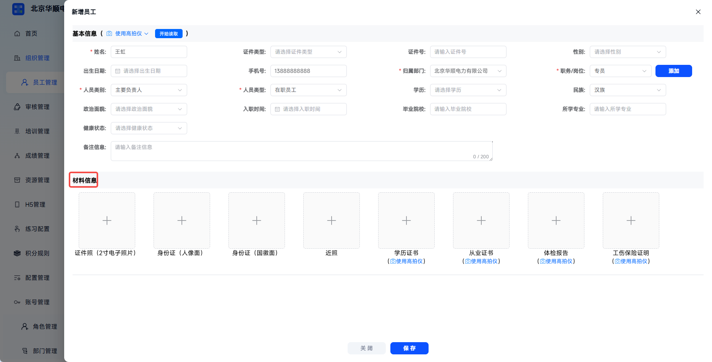
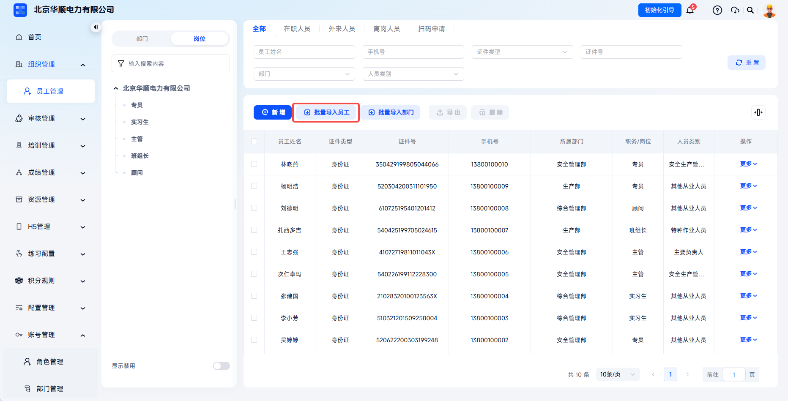
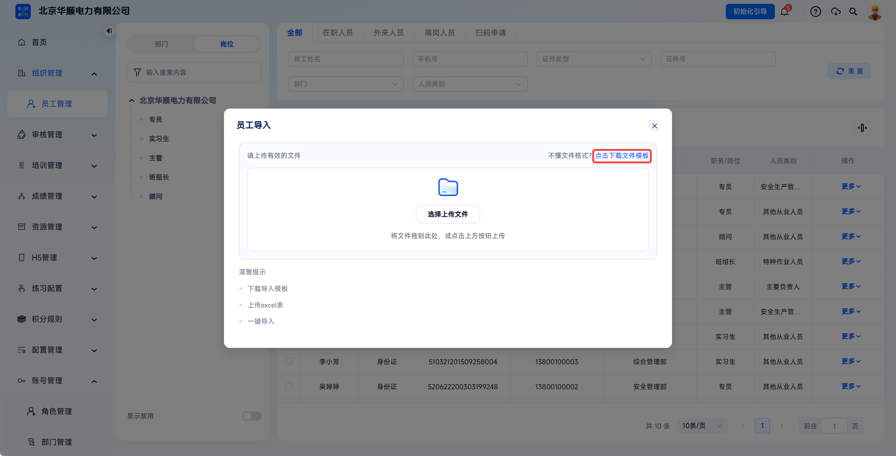
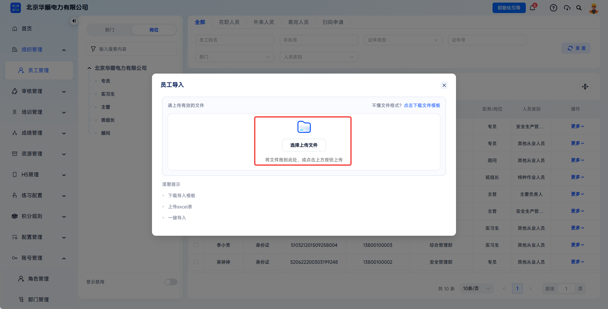
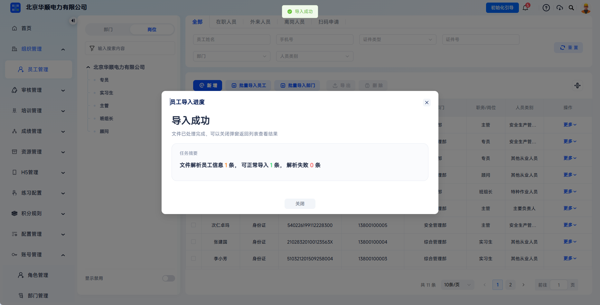
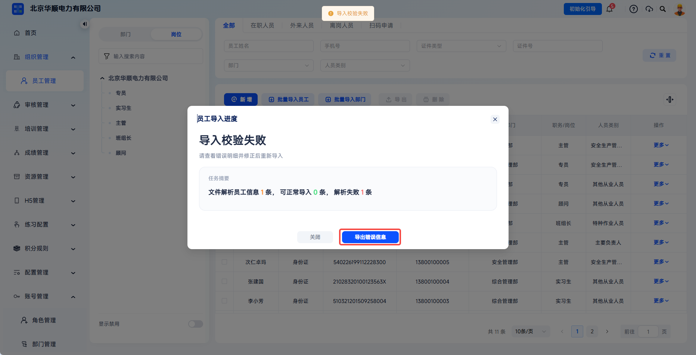
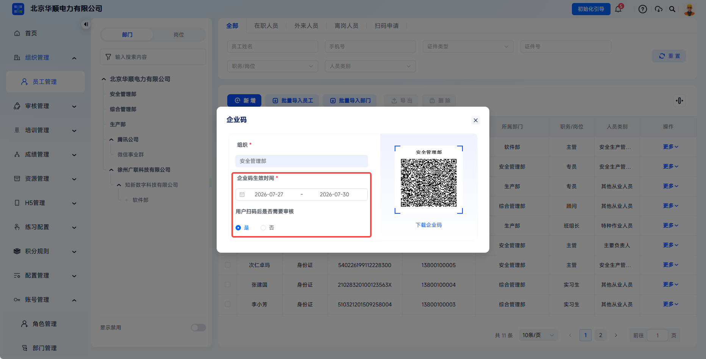
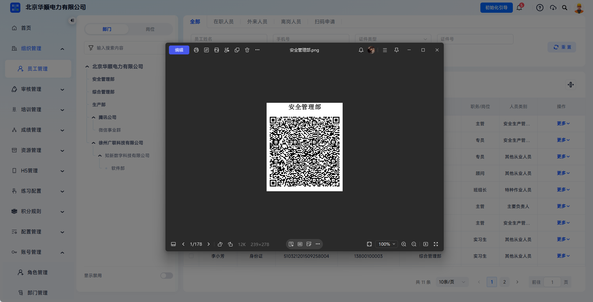

# Employee Import

This function is used to maintain employee information through single additions, batch import, or enterprise-code scan applications. Employee information is the core basis for training task assignment, study-hour statistics, and archive generation, so accuracy and timeliness must be ensured.

This document is typically used in the following scenarios:

- Sporadic onboarding, supplementary entry, or temporary employment that requires entering employees one by one;
- Importing a large number of employees at once through an Excel template;
- Employees filling in information by scanning a code and joining after administrator review.

 
 

## Workflow

### Add A Single Employee

Click **Organization Management** - **Employee Management**, then click **Add** to open the add employee dialog.

Enter basic information as required on the page, including name, gender, date of birth, ethnicity, political affiliation, education, graduation institution, major, health status, ID document type, ID number, mobile number, department, job/position, personnel category, personnel type, and more.

| Field | Instructions |
| --- | --- |
| Name | Should match the identity document. |
| Document Type / Document Number | Supports ID card, military officer certificate, passport, other, and more. After selecting the document type, enter the corresponding valid number. |
| Mobile Number | Enter an 11-digit number. The mobile number must be unique. |
| Department | Select an enabled department. This affects training task assignment scope and statistical dimensions. |
| Job / Position | Linked with position management. Select an enabled position. |
| Personnel Type | Select by employment dimension, such as employee management, new employee, external employee, and more. |
| Personnel Category | Select by responsibility dimension, such as principal person in charge, safety production manager, special operation personnel, team leader, other employee, and more. |

---

If a card reader is needed, click the account avatar in the upper-right corner and click **Plugin Download**. Download the user manual and plugin according to the required card reader type. Installing the card reader plugin in advance makes employee information entry more convenient.

If a card reader is needed, enter the plugin download entry from the account avatar.

---

Download and install the corresponding plugin or user manual according to the card reader type.

---

Materials information can be uploaded as needed, including ID photo, portrait side of ID card, national emblem side of ID card, recent photo, education certificate, professional certificate, physical examination report, work injury insurance proof, and more. A document camera is supported, and local images can also be uploaded manually.

When using a document camera, click **Use Document Camera** to automatically take photos and recognize text. The system fills recognition results back into the corresponding basic information fields. For manual upload, click the **Upload** icon in each material slot to select a local image, then crop or rotate as needed.

 

### Import Employees In Batches

Click **Organization Management** - **Employee Management**, then click **Batch Import Employees** to save the employee import template locally.

Click **Batch Import Employees** to enter the employee batch import process.

---

Pay attention to the following when filling in the template:

- Do not modify template header names, order, or merge cells;
- Columns marked with `*` are required, and others are optional;
- Mobile numbers and ID numbers must not be duplicated.

| Field | Requirement | Common Error |
| --- | --- | --- |
| Name | Match the ID document and contain no spaces. | Leading or trailing spaces cause the system to report name mismatch. |
| Document Type | Select ID card, military officer certificate, passport, or other from the dropdown. | Manually entering "resident ID card" may not be recognized. |
| Document Number | Match the document type. The final `X` of an ID card number must be uppercase. | Not entering the correct document number for the selected document type. |
| Mobile Number | 11 digits and globally unique. | Entering two numbers in one row or separating them with commas. |
| Department Name | Must exactly match the name in the department tree. Use `/` for multiple levels, such as "Headquarters/Production Department/Team 1". | Department name does not exactly match the system. |
| Job / Position | Must already exist and be enabled in the position tree. | Entering a position that has not been created or has been disabled. |
| Personnel Type, Personnel Category | Fill in according to template options. These are required. | Entering content outside the option range. |

After filling in the template, upload it from the dialog. The system validates the file after upload.

When all employee information is imported successfully, the system displays an import success message and refreshes the employee list. New employee information appears on the employee management page.

---

If some or all rows fail, error-free rows are imported normally. Failure information can be exported by clicking **Export Error Information** in the dialog and viewed in detail. Modify the data according to the error information and import again.

---

When import fails, view the error information and locate the data that needs correction.

---

After import is complete, it is recommended to spot-check 5 to 10 records to confirm that department, position, and related information are correct. The import process currently does not support interruption or rollback. Check the template content before batch operations.

 

### Enterprise Code Scan Application

Find the target department in the left department tree, click the corresponding **Enterprise Code** button, and set parameters such as enterprise code effective time and review mode.

The enterprise code entry is used to generate an employee scan-to-join QR code for a specified department.

---

Enterprise codes apply to scenarios such as batch onboarding for new employees, quick registration for temporary personnel, and distributed onboarding across multiple branches. Pay attention to the following when configuring:

| Configuration Item | Description |
| --- | --- |
| Enterprise Code Effective Time | Select the QR code validity period. After expiration, scanning shows that the QR code is invalid and it must be regenerated. |
| Review Mode | Review is enabled by default. When enabled, administrators must confirm under **Review Management** - **Employee Information Review**. When disabled, the employee is automatically added to the employee list after submission. |
| Usage Scope | Clarify the distribution targets according to department, validity period, and review requirements to prevent employees from joining the wrong department. |

After configuration, click **Download Enterprise Code**. The system generates a QR code image.

After review is enabled, information submitted by employees through scanning must be approved by an administrator before it enters the database.

---

Employees scan the enterprise code with WeChat or a browser to enter the H5 information form. They fill in position, name, document type, document number, mobile number, SMS verification code, personnel type, personnel category, and other information, then submit.

---

When review is enabled, after employees submit information, administrators must review it under **Review Management** - **Employee Information Review**. When review is disabled, the system automatically approves the submission and adds the employee to the employee list.

After an employee submits by scanning the code, the system displays either "Submitted successfully, waiting for review" or "Joined successfully" depending on whether review is enabled. When review is enabled, administrators can check and adjust fields such as employee department and position on the review page before approving.

 
 

## FAQ

**Q: Can custom columns be added to the template?**

A: No. The system recognizes only preset headers. Added columns are ignored. To save additional information, use **Edit** after import.

---

**Q: If one import is partially successful and partially failed, will incorrect data be created?**

A: No. Successful rows are written immediately, and failed rows are rejected entirely. No incorrect records are left.

---

**Q: How can I ensure employees join the correct department when scanning a code?**

A: Administrators can generate a department-specific enterprise code, or manually assign the final department during review after enabling review mode.

---

**Q: What should I do if an employee sees "QR code expired" when scanning?**

A: The enterprise code may have exceeded its validity period. Contact an administrator to regenerate the enterprise code.

---

**Q: Why can't I find a newly added employee in a training task?**

A: After successful addition, the employee must be active, and the department/position scope associated with the task must include the employee. After confirming these conditions, click **Add Learner** in task **Learner Management** to search and add the employee.
