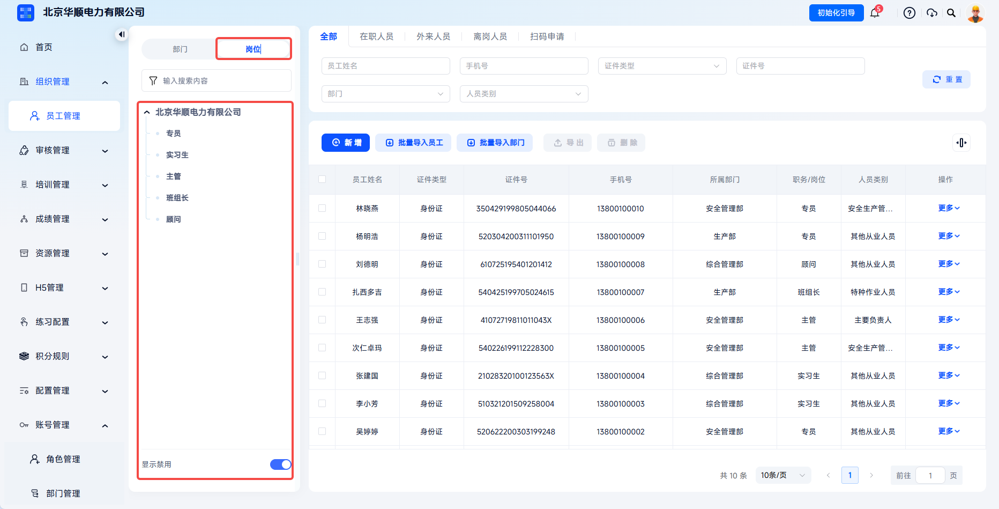
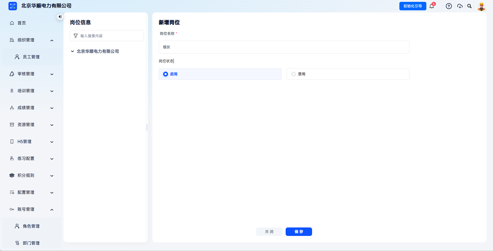
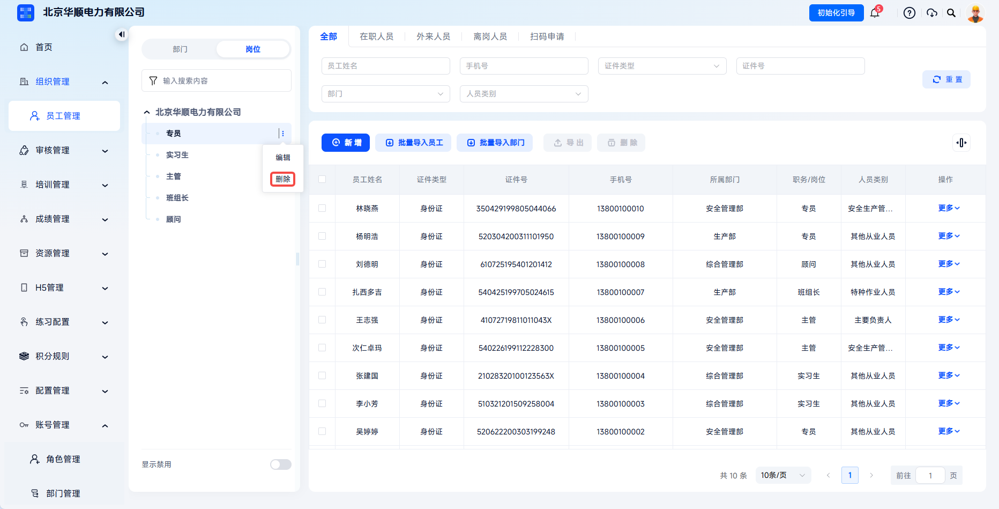

# Position

This function is used to maintain a unified and standardized enterprise position dictionary. It is one of the key dimensions for course assignment, statistics, certificate review, and safety responsibility tracing. Once maintained, it takes effect across the platform.

> Articles 4, 21, and 22 of the Work Safety Law require production and business units to establish an all-staff safety production responsibility system and break down safety responsibilities to positions. The platform meets emergency management authorities' inspection requirements for position-based hierarchical training and responsibility assignment to individuals.

This document is typically used in the following scenarios:

- Adding enterprise positions;
- Editing position names or enabled status;
- Disabling positions not currently in use;
- Deleting positions not referenced by employees.

 
 

## Workflow

### Enter Position Management

Click **Organization Management** - **Employee Management**, switch the left-side display to positions, and the page shows the current position list.

The position list displays maintained positions in a tree structure and is the entry for adding and managing positions.

 

### Add A Position

Click **Add** next to the enterprise, fill in position information on the add page, and click **Save**. The position takes effect immediately.

After selecting the parent node, click add to create a new position category or position.

---

| Field | Instructions |
| --- | --- |
| Position Name | Required and must remain globally unique. |
| Position Status | Select enabled or disabled. Disabled positions cannot be selected when adding employees. |

The position takes effect immediately after creation. When adding employees, job/position usually links with the selected department and displays only currently available positions. If the target position does not exist or has been disabled, maintain it in position management first.

 

### Manage Positions

After a position is created, it can be maintained according to actual needs:

- **Edit**: modify name and status. If the position is already referenced by employees, name changes synchronize in real time;

- **Disable**: existing employees continue retaining the position, but the dropdown no longer shows it when adding employees;

- **Show Disabled**: display disabled positions in the position tree;

- **Delete**: before removing a position, ensure no employees reference it.

When a position is referenced by employees, the system restricts deletion to avoid historical data loss. After disabling a position, use **Show Disabled** to view it in the position tree, and re-enable it as needed.

 
 

## FAQ

**Q: Can position names be duplicated?**

A: No. Position names must remain globally unique.

---

**Q: What happens to associated employees after a position is disabled?**

A: Employees continue retaining the original position and can train and take exams normally. During the next transfer or edit, an enabled position must be selected.

---

**Q: Why does position deletion fail?**

A: As long as any employee references the position, the system prohibits deletion to avoid historical data loss. Transfer the related personnel first, then delete the position.

---

**Q: What is the difference between position, personnel category, and personnel type?**

A: Position describes job duties and is used to clarify work assignment and responsibility tracing. Personnel category is a compliance responsibility dimension and includes principal persons in charge, safety production managers, special operation personnel, team leaders, and other employees.
