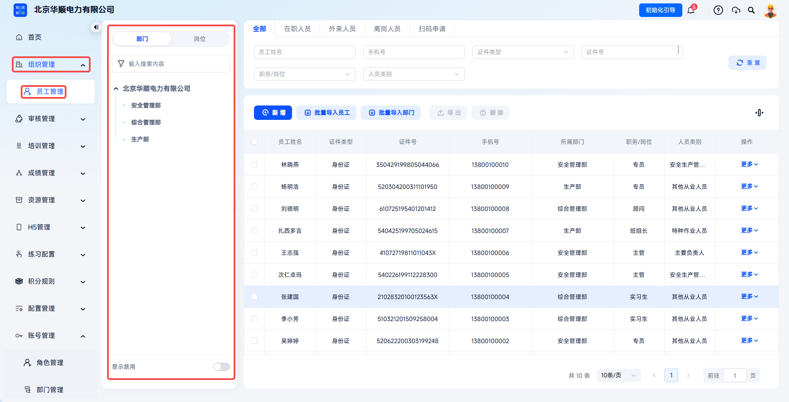
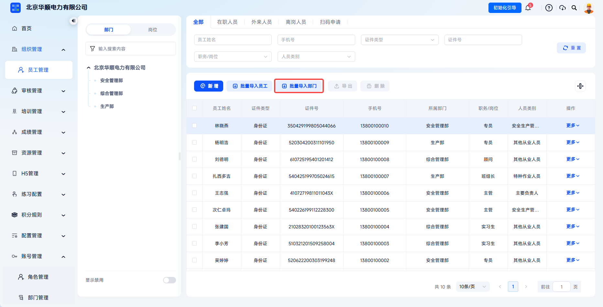
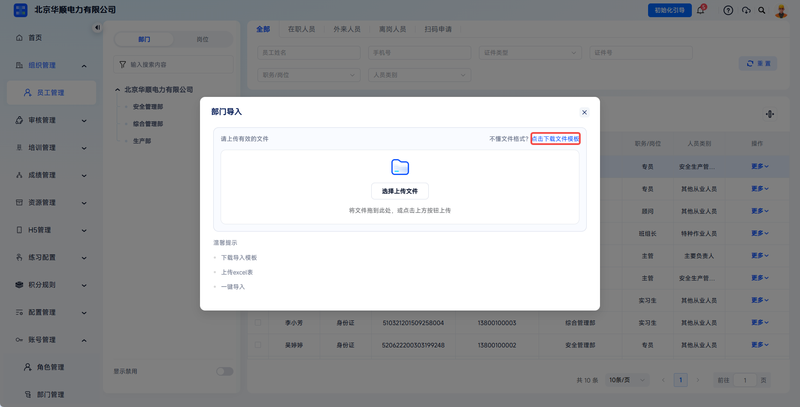
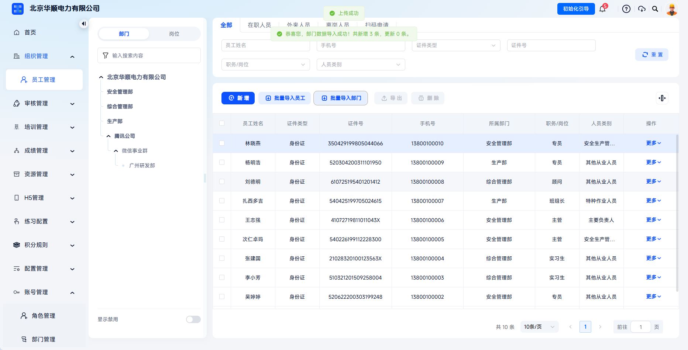
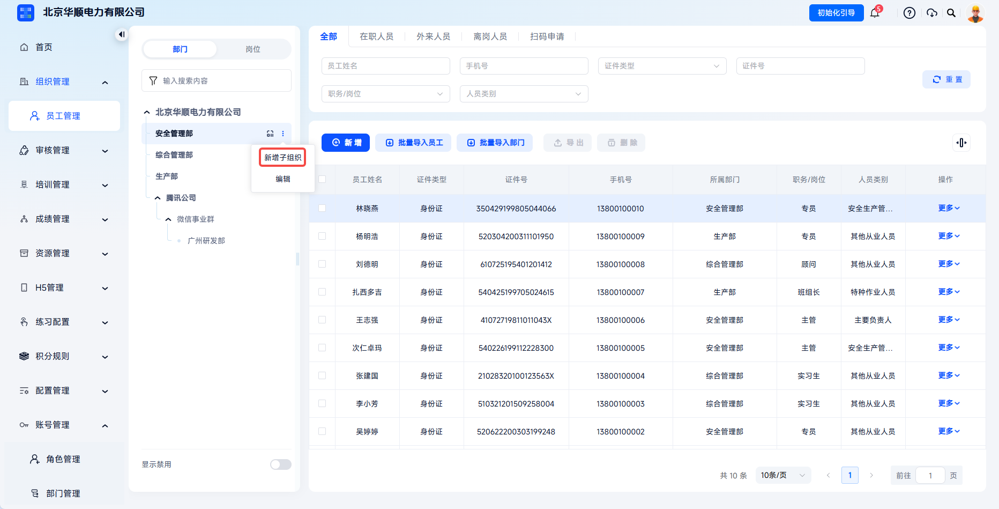
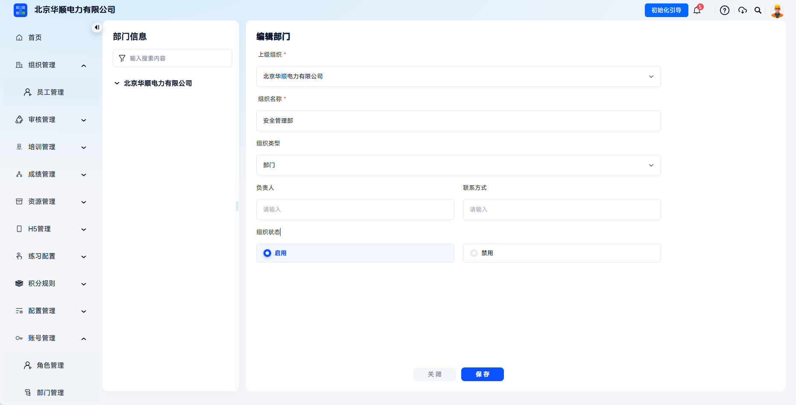
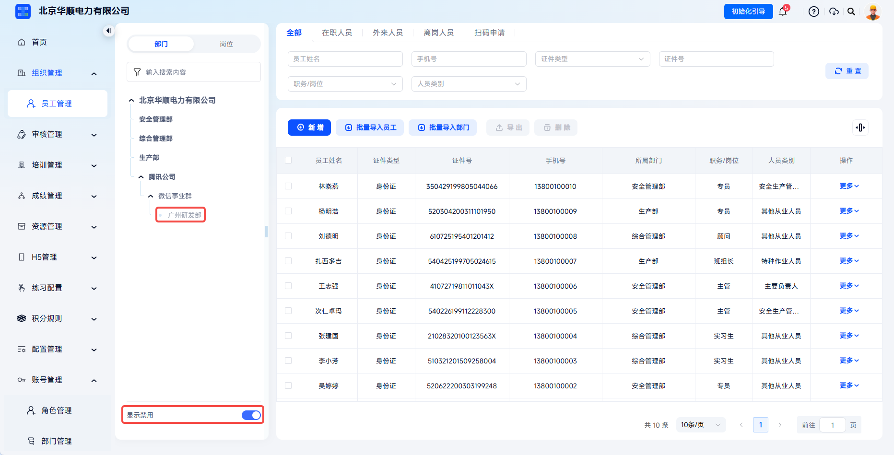

# Department

This function is used to customize the enterprise's multi-level hierarchy, such as group, company, department, and team. It generates a unique enterprise code for each department, supports quick employee onboarding by QR code scanning, and provides organization dimensions for subsequent training, exams, and statistics.

> Articles 4 and 28 of the Work Safety Law clearly require production and business units to establish an all-staff safety production responsibility system and implement "business managers must manage safety" across all positions and departments. The platform uses a visual organization tree to break down safety responsibilities level by level to departments and positions, meeting regulatory requirements for verifying responsibility by department and position.

This document is typically used in the following scenarios:

- Building the enterprise organization structure for the first time;
- Adding, editing, or deleting departments;
- Importing department information in batches through a template;
- Generating department enterprise codes for employees to scan and onboard.

 
 

## Workflow

### Enter Employee Management

Click **Organization Management** - **Employee Management** to enter the organization structure maintenance page. The department tree on the left is used to view and maintain enterprise organization levels.

| Field | Description |
| --- | --- |
| Organization Name | Name of an enterprise department or branch. Multi-level hierarchy is supported. |
| Organization Type | Select types such as **Group**, **Unit**, or **Department** according to enterprise scale and affiliation. |
| Parent Organization | Determines the department's level in the structure tree. When added through **Add Sub-Organization**, the parent organization is automatically determined. |
| Person In Charge / Contact | Stores the person in charge and contact information for advance communication. |
| Organization Status | Controls whether the organization is enabled. After disabling, it can no longer be selected when adding employees or joining by enterprise code. |
| Enterprise Code | A QR code generated based on the organization. Employees can scan it within the validity period to fill in and submit personal information. |

 

### Import Departments In Batches

Click **Batch Import Departments** and download the template in the dialog.

Click **Batch Import Departments** to enter the department template download and upload process.

---

After downloading, fill in department information strictly according to the template format.

---

Batch import is suitable for initial large-scale creation of the organization structure. When filling in the template, keep header names, order, and hierarchy unchanged, and ensure department names match the enterprise's actual internal hierarchy.

---

Upload the template file in the dialog. After successful upload, department information appears in the department tree on the left.

Upload the completed department template, and the system first validates the format and fields.

---

If upload fails, the system displays the failure reason. Modify the file and upload it again.

---

When import fails, view the failure reason, modify the template, and upload it again.

 

### Add A Department

To add a department or sub-department separately, find the target parent department in the left department tree and click **Add Sub-Organization**.

Fill in the fields on the page. Fields marked with `*` are required. After completing the form, click **Save** to add the department.

---

Enabled organizations can continue adding employees, generating enterprise codes, and serving as organization dimensions for training, exams, and statistics. If a department needs to be paused later, disable it by editing the organization status.

 

### Edit Information

Click **Organization Management** - **Employee Management**, then click **Edit** for the department that needs modification. Enter the required changes in the edit dialog and click **Confirm** to complete the modification.

Click **Edit** in the target department action column to modify basic department information.

---

After adjusting department information in the edit dialog, click **Confirm** to save changes.

 

### Disable A Department

Click **Organization Management** - **Employee Management**, click **Edit** for the department to modify, and switch organization status to **Disabled**. Disabled departments are displayed in the department tree only when **Show Disabled** below the department tree is enabled. After disabling, the department will no longer appear in department information boxes.

Note: if there are employees under the department or enabled sub-departments, the disable operation cannot be completed.

To disable a department, enter department edit and switch organization status to disabled.

---

If employees or enabled sub-departments exist under the department, disabling may not be completed.

 

### Delete A Department

After disabling a department, click **Delete** for the target department to delete it.

After a department is disabled, deletion can be performed. Before deletion, confirm that there are no active employees or enabled sub-departments.

 
 

## FAQ

**Q: Why can't I delete a department?**

A: To ensure data security, the department must first be disabled before deletion. If employees or enabled sub-departments exist under the department, the system prevents disabling. Migrate personnel and disable related items before deletion.

---

**Q: Will previous training records be affected after a department name changes?**

A: No. The system tracks departments by unique ID. Name changes affect only display and do not affect historical data statistics or compliance certificate generation.

---

:::info Additional Content
**Q: How can I ensure employees join the correct department when scanning a code?**

A: Administrators can generate a department-specific enterprise code, or manually assign the employee's final department during review after enabling review mode.
:::
