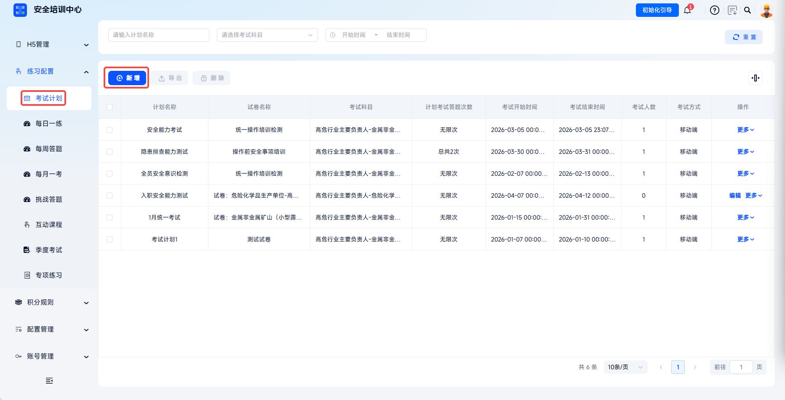
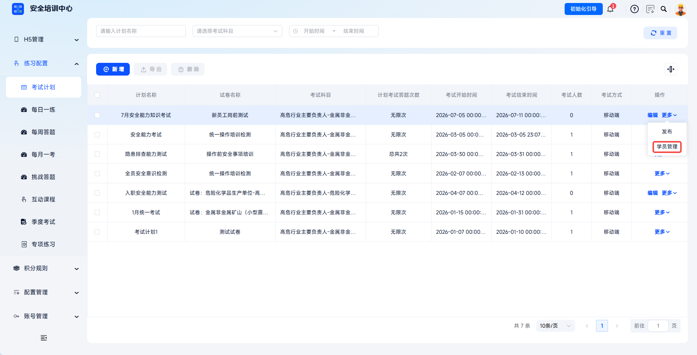
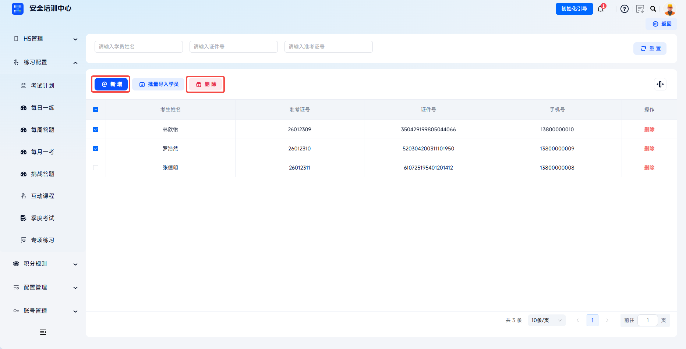
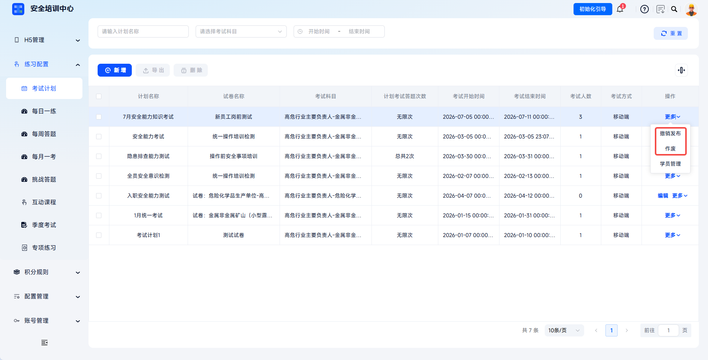
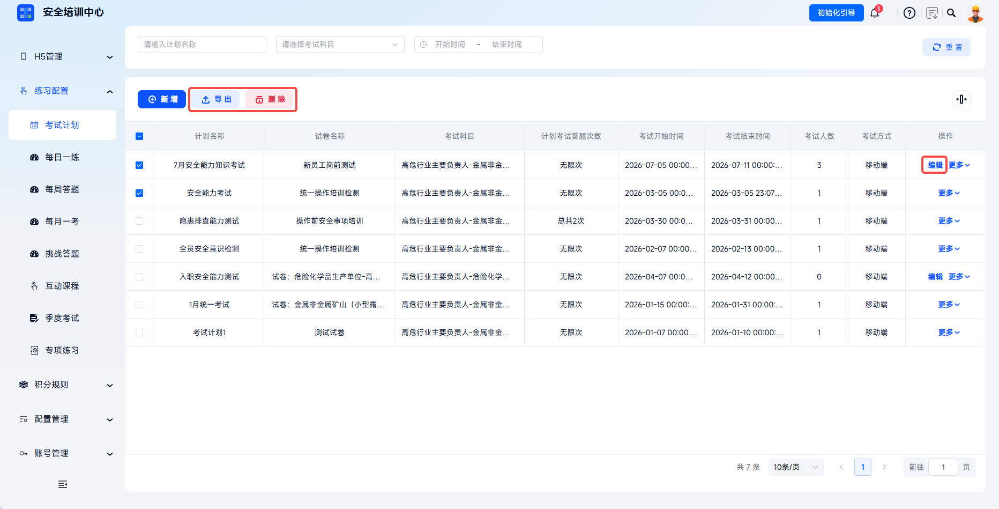

# Create Exam Plan

The platform supports two exam methods, mobile exams and computer-based exams. It flexibly configures exam time, answer attempts, anti-cheating rules, and point earning strategies, enabling closed-loop management from plan, learners, exam, to results. Through exam plans, administrators can precisely control exam opening time, participants, and answer permissions, meeting enterprise needs for regular assessment, onboarding evaluation, special-topic testing, and more.

> Article 28 of the Work Safety Law requires production and business units to provide safety production education and training for employees, and employees may not start work without passing training. The exam plan function ensures the assessment process is controllable and results are traceable.

This document is typically used in the following scenarios:

- Adding exam plans;
- Configuring mobile or computer-based exam methods;
- Setting anti-screen-switching, face verification, and point rules;
- Adding exam learners and publishing exam plans.

 
 

## Workflow

### Add An Exam Plan

Click **Practice Configuration** - **Exam Plan**, then click **Add** to open the **Add Exam Plan** dialog.

 

### Fill In Basic Information

Fill in plan name, exam time, exam subject, exam method, and other information as required.

| Field | Instructions |
| --- | --- |
| Plan Name | Required. Include exam type and time range for easy identification. |
| Exam Time | Required. Set the exam plan start and end time. Candidates can enter the exam only during this period. |
| Exam Subject | Required. Select the corresponding work type or training subject from the dropdown. This determines the range of papers that can be associated. |
| Exam Method | Required. Select mobile or computer-based exam. Mobile supports phone app/mini-program exams. Computer-based exams require exam room management. |

 

### Configure Mobile Exam

Mobile exams support configuring answer attempts, cancellation rules, anti-screen-switching, face verification, and point earning.

| Configuration Item | Description |
| --- | --- |
| Answer Attempts | Select unlimited, limited, or daily exam. |
| Cancellation Rule | Set how many hours before plan start publication can be canceled. The minimum is 1 hour before plan start. |
| Anti-Screen-Switching | After enabled, leaving the exam page is counted as screen-switching behavior. Maximum screen-switch count and maximum screen-switch time can be set. |
| Maximum Screen Switch Count | Exceeding the count limit is judged as cheating. |
| Maximum Screen Switch Time | Exceeding the time limit is judged as cheating. |
| Face Verification | When taking an exam on PC with face verification enabled, identity verification uniformly uses learner mobile phone scan mode. |
| Verification Mode | Select active or passive verification. |
| Verification Count | Set the number of face verifications during the exam. |
| Point Earning | Set the exam plan point cap, and add rules for points based on correct question count or earned points. |

Click **Save** to create a new exam plan.

 

### Add Learners

In the exam plan list, click **More** - **Learner Management** for the corresponding plan to enter learner management.

---

Click **Add** to select and add exam learners. Click **Delete** to remove learners.

---

The learner list supports filtering assigned learners by candidate name, document number, and admission ticket number, and displays candidate name, admission ticket number, document number, mobile number, and other information.

 

### Save And Publish

Click **Save** to save the exam plan. Its status is unpublished. After returning to the list page, click **Publish** for the corresponding plan to officially publish it. A plan can be published only when learners exist under it.

After publication, the exam plan takes effect and is pushed to the learner side. Candidates can participate in the exam during the configured exam time.

 

### Manage Exam Plans

Published plans can be unpublished within the time range allowed by the cancellation rule. After a plan expires or **Void** is clicked, the status changes to voided. Candidates can no longer participate, and the plan can no longer be edited.

---

Unpublished plans can have all information edited. Published plans must be unpublished before editing. Click **Export** to export basic information for selected exam plans. **Delete** only supports deleting unpublished plans with no associated learners.

| Action | Description |
| --- | --- |
| Unpublish | Published plans can be canceled within the cancellation rule range and return to unpublished status. |
| Void | After the plan expires or is voided, status becomes voided and candidates can no longer participate. |
| Edit | Unpublished plans can have all information edited. Published plans must be unpublished first. |
| Export | Export basic information related to selected exam plans. |
| Delete | Only unpublished plans with no learner association can be deleted. |

 
 

## FAQ

**Q: Why can't candidates see the exam after publication?**

A: Check whether the exam plan status is published, whether the current time is within the configured exam time range, and whether the candidate is in the **Learner Management** list.

---

**Q: How do I modify the time of a published exam plan?**

A: Within the time range allowed by the cancellation rule, click **Unpublish**, modify the exam time, and publish again. If the cancellation time has passed, it is recommended to void the original plan and create a new one.

---

**Q: What is the difference between computer-based and mobile exams?**

A: Computer-based exams require **Exam Room Management** to assign computer rooms or seats. Candidates answer on computers at designated locations, suitable for centralized monitoring. Mobile exams allow candidates to participate independently on phones without location restrictions, suitable for flexible assessment.

---

**Q: What happens when anti-screen-switching and face verification are both enabled?**

A: Candidates must pass face verification before entering the exam. During the exam, switching screens triggers the anti-screen-switching mechanism. Face verification requires that candidate face information has already been entered.

---

**Q: Can an exam plan be associated with multiple papers?**

A: One exam plan supports association with only one paper. For multi-subject assessment, create multiple exam plans separately.
