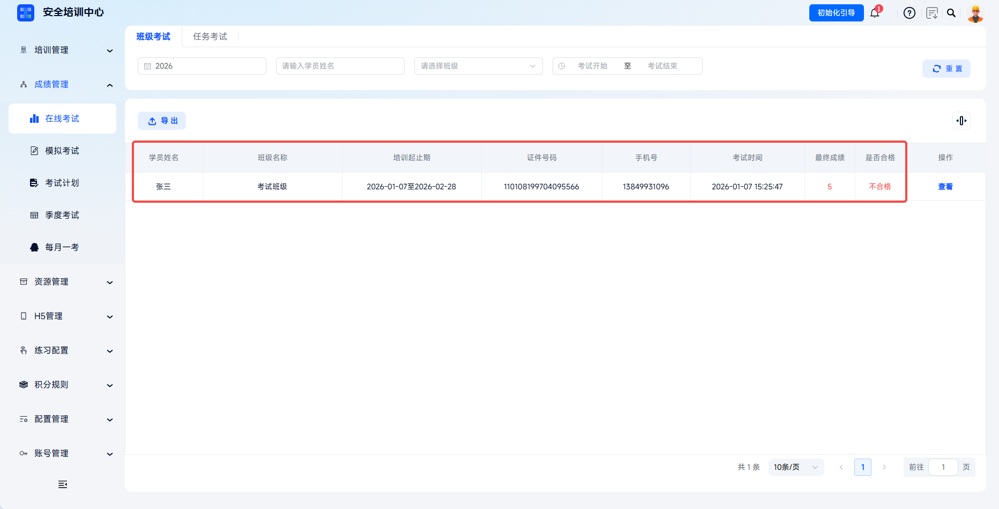
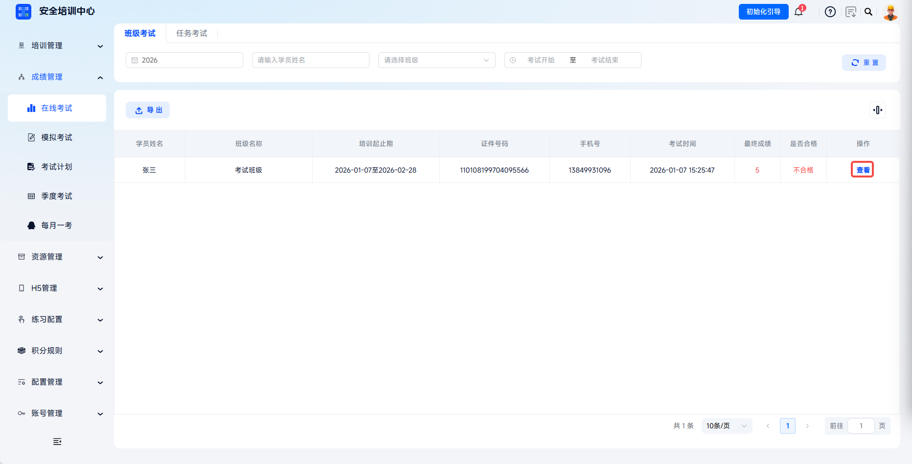
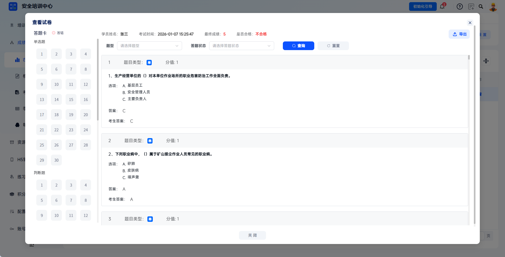
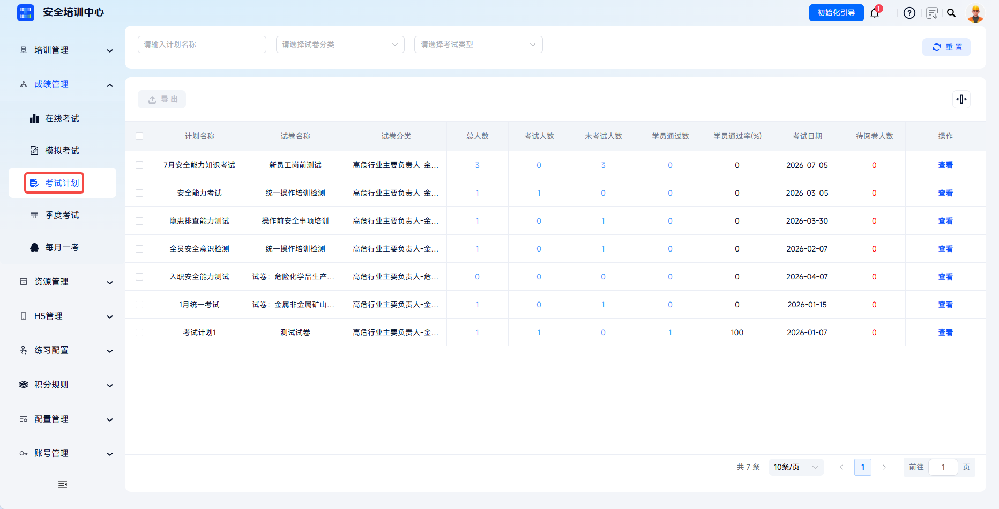
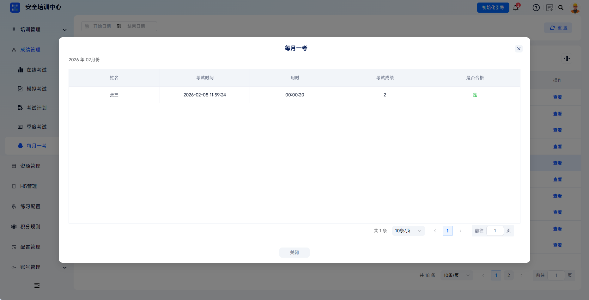
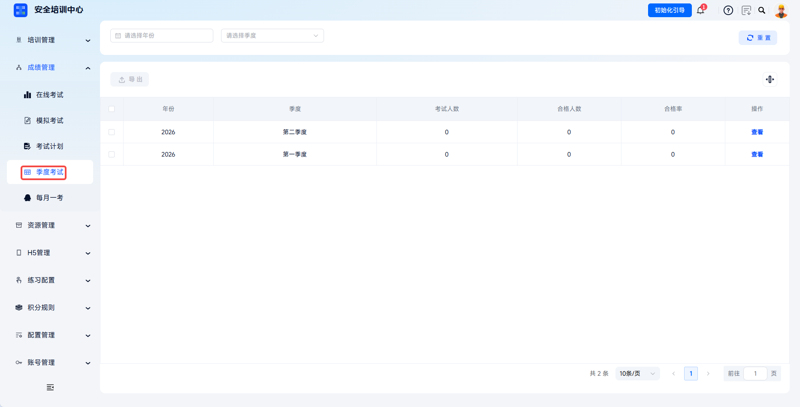

# View Exam Results

The platform supports multi-dimensional and multi-level querying of learner exam results, covering online exams, mock exams, exam plans, monthly exams, quarterly exams, and other result summaries. It enables a full-process loop from exam, grading, results, to analysis. Administrators can quickly locate target results through filters, view detailed answer records, and export result reports to meet internal assessment, compliance inspection, training effectiveness evaluation, and other needs.

This document is typically used in the following scenarios:

- Viewing online exam or mock exam results;
- Viewing exam plan results;
- Viewing monthly exam and quarterly exam results;
- Exporting result reports or paper details.

 
 

## Workflow

### Enter Result Management

Exam results for online exams, mock exams, exam plans, quarterly exams, and monthly exams are all summarized under **Result Management**.

 

### View Online Exam Results

Click **Online Exam** to view the exam result list, and select the target list according to task. Use filters such as year, learner name, task name, training start date, training end date, and exam time to quickly locate target learner information.

| Filter | Description |
| --- | --- |
| Year | Select statistical year. |
| Learner Name | Enter the candidate learner name for precise query. |
| Task Name | Select the training class from the dropdown. |
| Training Start Date / Training End Date | Set the training time range. |
| Exam Time | Set the specific exam date range. |

---

The list displays learner name, task name, training start and end period, document number, mobile number, exam time, final score, pass status, and other information. Pass status is automatically determined according to the passing score set for the paper.

---

Click **View** in the action column to open the **View Paper** dialog.

| Area | Description |
| --- | --- |
| Answer Card | The left side shows question number navigation. Red indicates incorrect answers. |
| Question Type Switch | Quickly locate by question type, such as single-choice or true/false. |
| Answer Details | The right side displays question content, options, correct answer, and candidate answer. |
| Filter Function | Filter questions by question type and answer status. |

---

Click **Export** in the upper-right corner to download the learner's paper details.

---

Click **Export** above the list to export current list result data in batches.

 

### View Mock Exam Results

Click **Mock Exam** to view the exam result list, and select the target list according to task. The query method is the same as online exams and supports filtering by year, learner name, task name, date, and other dimensions.

---

The list displays learner mock exam records. Click **View** to query the target learner's exam result in the target task.

---

Click **Export** above the list to export current list result data in batches.

 

### View Exam Plan Results

Click **Exam Plan** to view the exam result list, and select the target list according to plan name.

| Summary Field | Description |
| --- | --- |
| Plan Name, Paper Name, Paper Category | Displays basic information about the exam plan and paper. |
| Number Of Candidates, Number Passed, Pass Rate | Displays overall exam results for the plan. |
| Exam Date, Exam Method, Number Waiting For Grading | Displays exam arrangement and grading status. |

---

Click **View** in the action column to enter the candidate details page and view all candidate learners under the plan. The list includes name, document number, mobile number, answer start time, submission time, exam score, face comparison, grading status, and other information. Click **View** under face comparison to view captured photos and comparison results during the exam. Click **View** under paper to view the learner's answer details.

---

The page supports **Export** for selected learner result lists and **Export Paper** to batch download selected candidates' answer papers. Click **Export** above the list to export selected plan result data in batches.

 

### View Monthly Exams

Click **Monthly Exam** to view the exam result list, and select target information by year and month. Use the date filter to select start and end months. The list displays year, month, number of candidates, number passed, and pass rate.

---

Click **View** for the target year and month to view monthly exam participant detail information. Click **Export** above the list to export selected plan result data in batches.

 

### View Quarterly Exams

Click **Quarterly Exam** to view the exam result list, and select target information by year and quarter. The list displays year, month, number of candidates, number passed, and pass rate. Click **View** to enter participant details.

 
 

## FAQ

**Q: Why do some exams show "Waiting For Grading"?**

A: The exam paper requires administrators or examiners to complete manual scoring in grading management before results update to graded and display final scores.

---

**Q: How should abnormal results be reviewed?**

A: Click **View** for the learner in the result list to enter paper details and check answer records question by question. If system scoring is confirmed to be incorrect, contact technical support and provide the exam ID and learner information for verification.

---

**Q: Why can't I find a learner's result?**

A: Check whether the learner actually participated in the exam, whether the exam has ended, whether filter conditions are set correctly, and whether the learner used the correct document information to log in to the exam.
