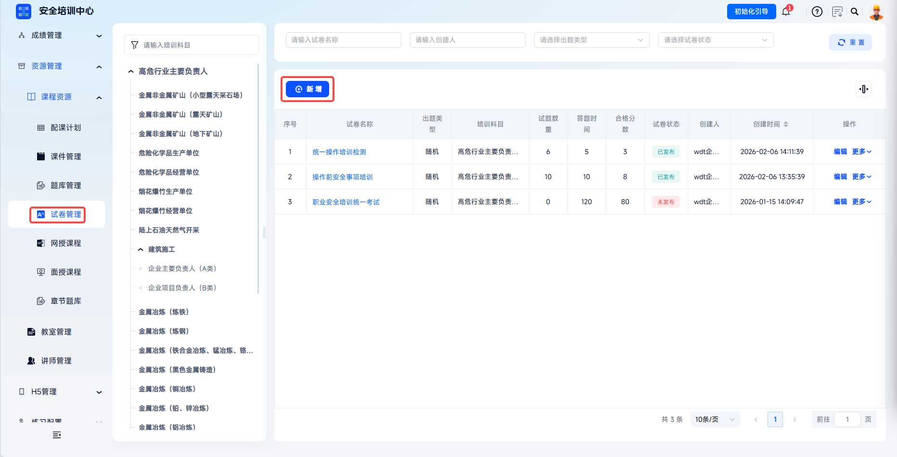
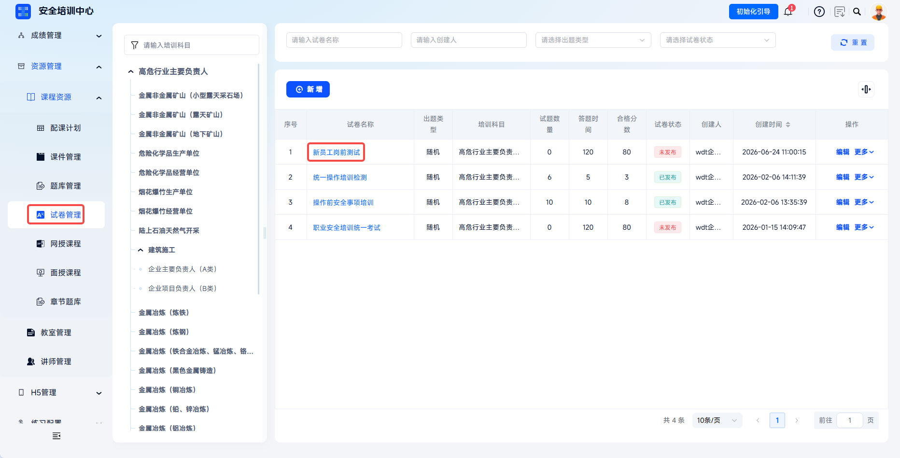
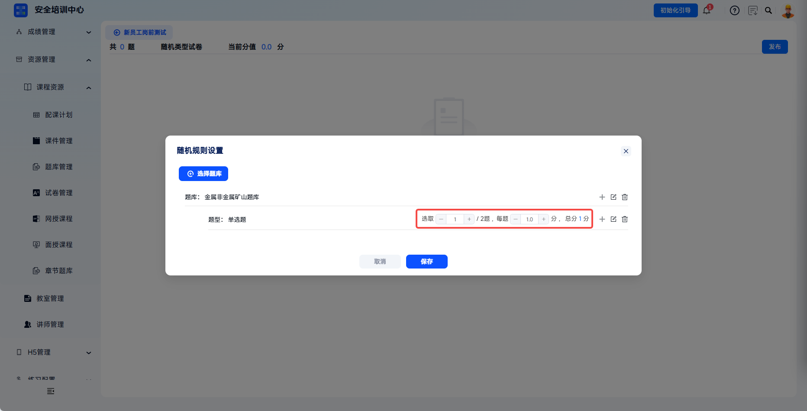
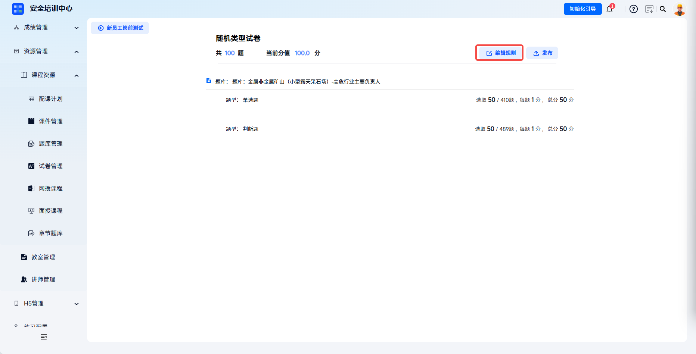
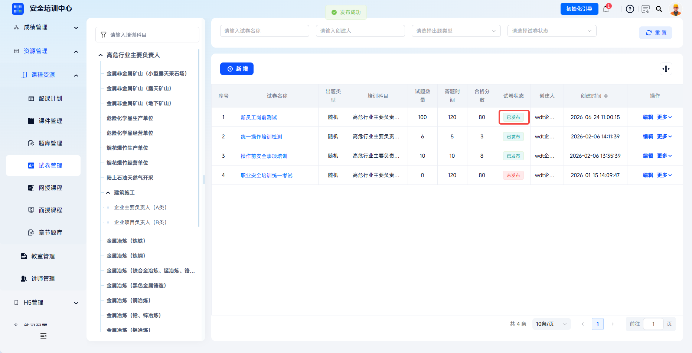
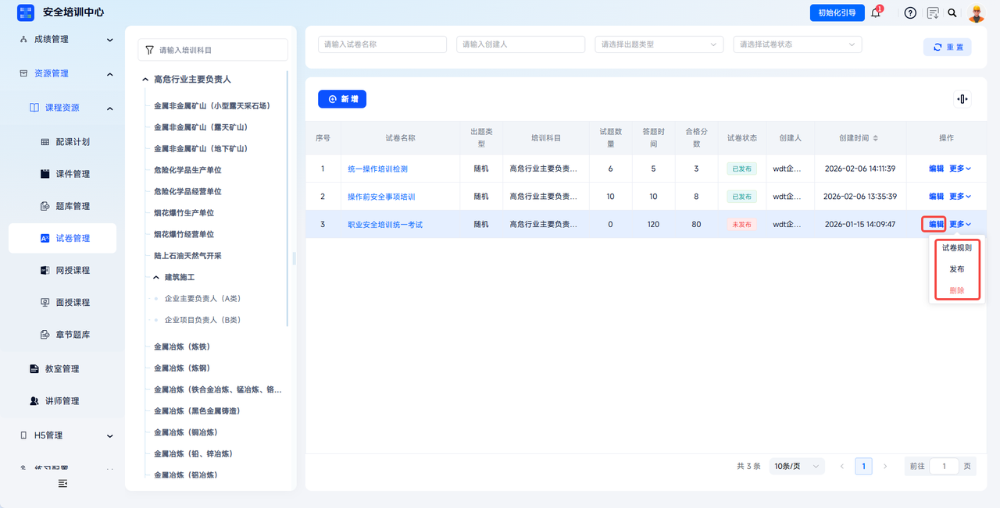

# Paper Customization

The platform supports flexible configuration of training subjects, passing scores, answer duration, and other core parameters, enabling closed-loop management from question bank, paper, exam, to results. It provides standardized paper support for offline assessment and online evaluation.

This document is typically used in the following scenarios:

- Adding papers;
- Configuring random paper question-drawing rules;
- Publishing papers for exam plans or courses to reference;
- Managing existing papers.

 
 

## Workflow

### Add A Paper

Click **Resource Management** - **Course Resources** - **Paper Management**, then click **Add** to open the **Add Paper** dialog.

Fill in configuration information in the dialog.

| Field | Instructions |
| --- | --- |
| Training Subject | Required. Select the corresponding training work type/qualification type from the dropdown. This determines the question bank range that the paper can reference and cannot be modified after saving. |
| Paper Name | Required. Enter a unique paper name. Include subject + purpose + version for easy identification. |
| Paper Type | Random means setting question-drawing rules, and the system randomly draws questions from the question bank to form papers. |
| Training Type | Select initial training, retraining, certificate renewal, and other types from the dropdown. |
| Paper Purpose | Options include courseware, exam, certification, and chapter. |
| Passing Score | Required. Set the passing score, default 80.00. Adjust with +/- buttons or manual input. |
| Answer Duration | Required. Set exam duration in minutes, default 120 minutes. Adjust with +/- buttons or manual input. |

Click **Save** to create the paper.

 

### Configure Paper Rules

#### Paper Configuration

Click **Resource Management - Course Resources - Paper Management**, find the target paper in the paper list, and click the paper name to enter the paper details page.

#### Question Drawing Configuration

Click **Add Rule** in the center of the page to open the **Random Rule Settings** guide dialog. It guides question drawing through the steps of question drawing rule, add sub-rule, and save question drawing rule. Click **Confirm** to enter the rule configuration interface.

#### Select Question Banks

Use the **Category** dropdown and **Question Bank Name** search box to quickly filter target question banks. Select required question banks in the list (single or multiple selection supported). The list displays question bank name, question count, creation time, and creator.

Click **Confirm** to complete question bank selection and return to the rule configuration interface.

---

In the random rule settings interface, the system automatically lists available question types according to selected question banks and draws questions by question bank. Each question type configuration includes:

| Configuration Item | Description |
| --- | --- |
| Question Type | Displays types such as single-choice and true/false. |
| Select | Set the number of questions drawn from this type. Decrease with "-", increase with "+", or enter a number manually. The right side displays "/XXX questions", indicating the total available quantity of this type in the question bank. |
| Score Per Question | Set the score for each question of this type. Decrease with "-", increase with "+", or enter a number manually. Unit: points. |
| Total Score | The system automatically calculates the total score for the question type as question count x score per question. |

---

Action buttons: **+** on the right of a question type adds a sub-rule based on difficulty, **Edit** modifies the rule, and **Delete** removes the rule.

---

To add a new question type rule, click **+** on the right. In the **Question Drawing Rule** dialog, select target question types (single-choice, multiple-choice, true/false, fill-in-the-blank, short-answer), then click **Confirm**.

---

To add a new question bank, click **Select Question Bank** and select additional question banks.

#### Save Rules

After confirming question counts and score configuration for each question type, click **Save** at the bottom. The system saves the question drawing rules and returns to the paper details page.

The **Current Score** at the top of the page updates in real time to the configured paper total score. Check that it is correct. Question drawing rules can be edited before publication.

 

### Publish The Paper

After confirming that paper total score, passing score, answer duration, and other configurations are correct, click **Publish** in the upper-right corner.

After successful publication, the paper status changes to **Published** and it can be used for subsequent exams.

 

### Paper Management

Existing papers support view, edit, publish, delete, and other operations.

- **Edit**: edit basic paper information.
- **Paper Rules**: configure paper question-drawing rules.
- **Publish**: after an unpublished paper is configured, click **Publish**. Status changes to **Published**, and the paper can be assigned for exams. Blank papers cannot be published.
- **Delete**: delete the paper. Deleted papers cannot be restored.

 
 

## FAQ

**Q: What should be checked before deleting a paper? Can data be restored after deletion?**

A: Before deletion, confirm that no scheduled exam session references the paper. Deleted papers cannot be restored, so proceed cautiously.

---

**Q: What should I do if the random paper question count is greater than the number of questions in the question bank?**

A: Go to **Resource Management** - **Question Bank Management** to supplement the number of questions for the corresponding subject, ensuring that the question count in the question bank is not less than the quantity required by the random drawing rules.

---

**Q: What should I do if I want to modify questions after a paper is published?**

A: Published papers do not support directly modifying questions. Create a new paper, configure and publish it, then reference the new paper for exams. Original paper sessions are not affected.

---

**Q: What is the difference between fixed papers and random papers?**

A: Fixed papers are manually selected by administrators from the question bank, and all candidates receive the same paper. Random papers set drawing rules, and the system generates different papers for each candidate.
