# Course Customization

This function is used to maintain courseware, online course packages, and offline course resources. Administrators can upload videos, documents, and other courseware, create online course packages, and create offline courses associated with instructors and class-hour information, meeting resource needs for blended online and offline teaching.

This document is typically used in the following scenarios:

- Adding courseware resources;
- Creating online course packages;
- Creating offline courses;
- Associating course resources with training tasks.

 
 

## Workflow

### Add Courseware

Click **Resource Management - Course Resource Group - Courseware Management** in the left menu to enter the courseware list page. Click **Add** to open the add courseware dialog.

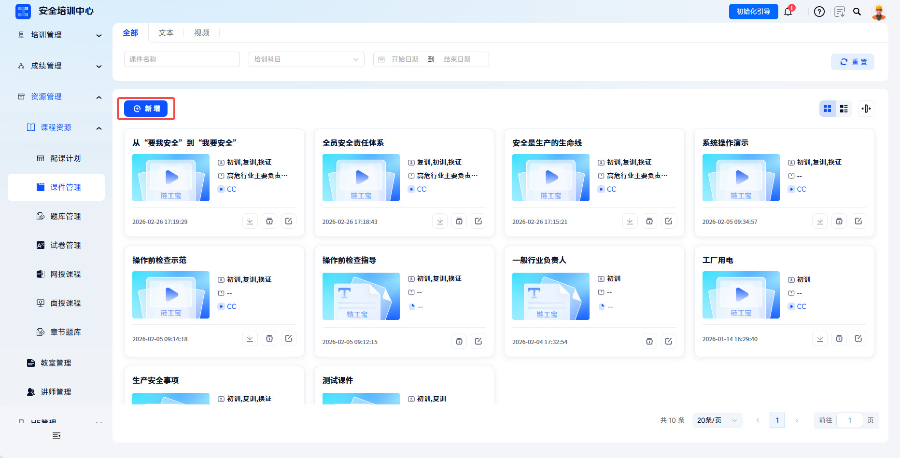

---

#### Upload Courseware

Upload a file directly in the dialog. The system automatically parses courseware name and courseware type information, which can then be adjusted manually.

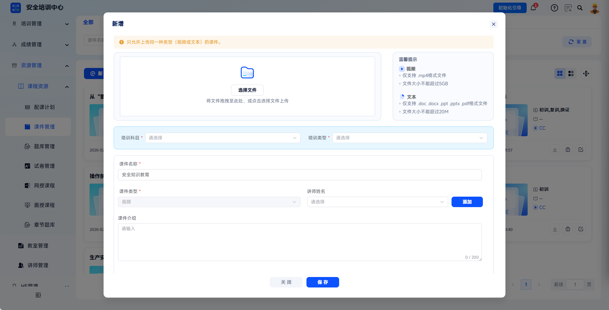

| Field | Description |
| --- | --- |
| Courseware Name | The system parses the courseware title. Modification is supported. Include course topic and version information. |
| Courseware Type | Courseware format type, identified by the system as text/video. |
| Training Subject | The training subject to which the courseware belongs, strongly associated with courseware teaching content. |
| Training Type | Select applicable training types, such as initial training, retraining, certificate renewal, and more. Multiple selection is supported. |
| Instructor Name | Select from dropdown or enter instructor name. |
| Courseware Introduction | Add a summary of courseware content, applicable audience, and more, limited to 200 characters. |

If uploading video courseware, select the video upload platform. Video files must not exceed 5 GB. Check network stability before upload.

Click **Save** to save and upload the courseware.

---

After clicking **Save**, the video courseware will be uploaded to the platform. Do not close the dialog before upload is complete. Courseware that has completed upload and passed platform review can be used normally.

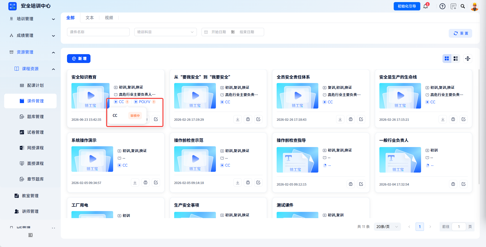

After courseware is uploaded successfully, it can be referenced in **Online Course** for course package catalog configuration. After association, learners can view the courseware during learning, and the system automatically records learning duration.

 

### Manage Courseware

Courseware can be filtered by courseware name, training subject, and date.

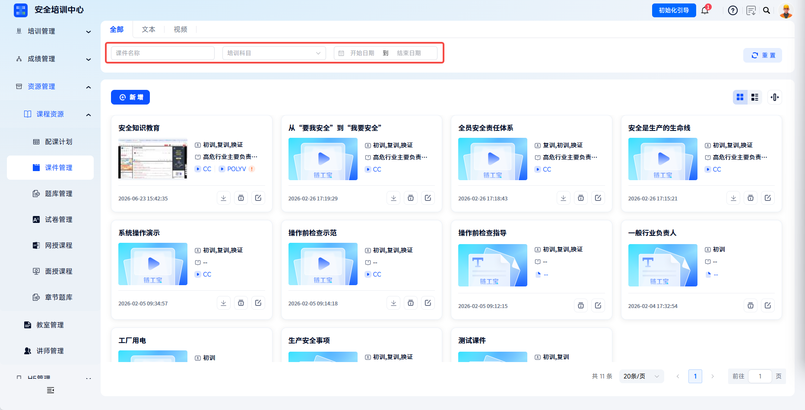

---

Text/video courseware supports categorized viewing.

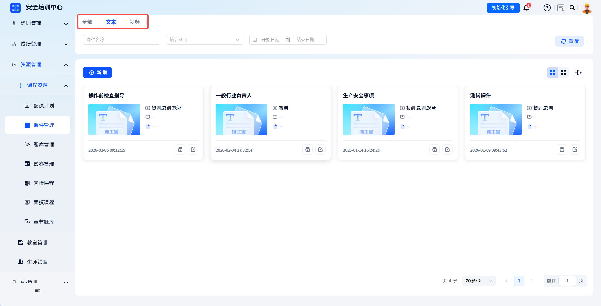

---

Courseware supports switching between card and list display modes.

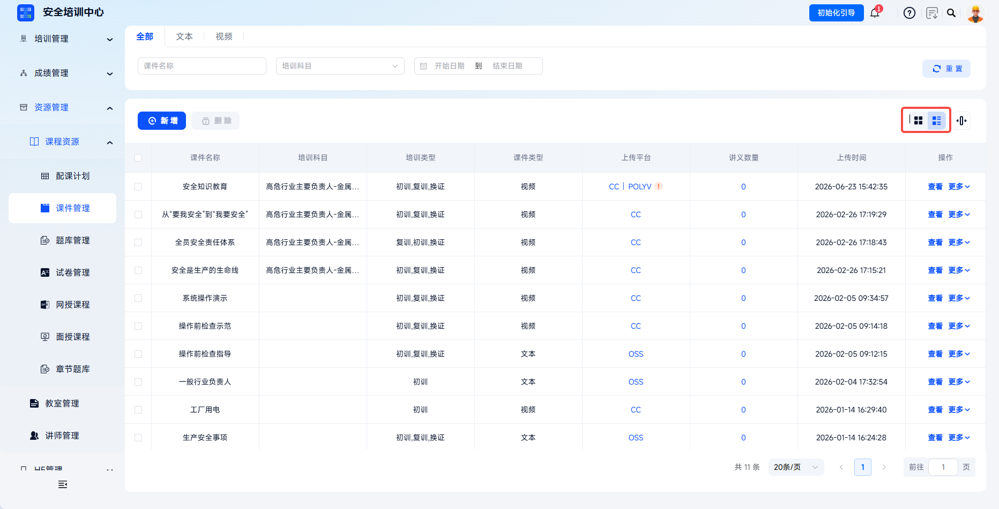

---

**Download**: video courseware can be downloaded locally.

---

**Edit**: modify basic information such as courseware name, category, instructor, and introduction.

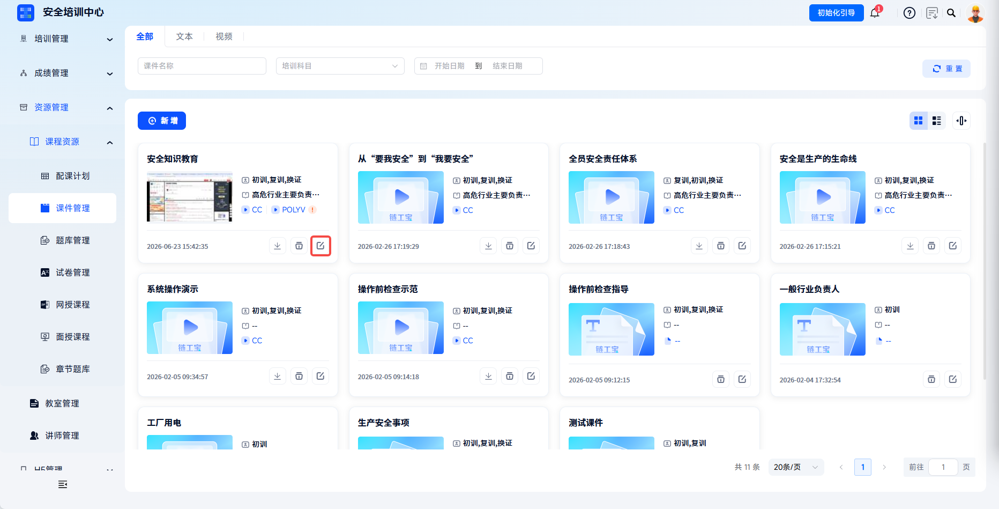

---

**Delete**: delete courseware basic information and associated files. Delete courseware already associated with courses cautiously.

 

### Add An Online Course Package

Click **Resource Management - Course Resources - Online Course** in the left menu to enter the course package list page. Click **Add** to open the **Edit Course Package** dialog and complete configuration step by step.

---

Fill in basic information. Required fields in basic information must be completed first before further editing, such as adding course question banks.

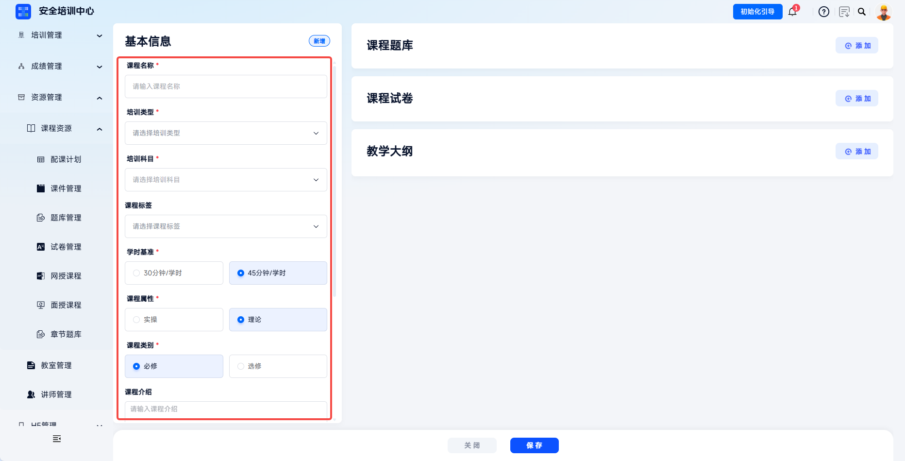

| Field | Instructions |
| --- | --- |
| Course Name | Enter the course title, such as "Occupational Safety Literacy (2025)". |
| Training Type | Select applicable training types, such as initial training, retraining, certificate renewal, and more. Multiple selection is supported. |
| Training Subject | Select the subject from the dropdown, such as high-risk industry principal person in charge or metal/non-metal mine. |
| Study-Hour Basis | Select "30 minutes/study hour" or "45 minutes/study hour". This determines study-hour calculation standard and cannot be changed after saving. |
| Course Attribute | Select theory or practical to mark course nature. |
| Course Type | Select required or elective to mark whether the course must be completed. |
| Course Introduction | Add course overview, learning objectives, and other descriptions. |
| Cover Image | Upload a course cover image to improve recognition. |

---

Add question bank/paper: click **Add** under course question bank/course paper to select a question bank or paper and bind it to this course package.

> Question banks must be configured in advance under **Resource Management - Course Resources - Chapter Question Bank** before they can be selected. See Learning Center - Resource Management - Question Bank Customization.
> Papers must be configured in advance under **Resource Management - Course Resources - Paper Management** before they can be selected. See Learning Center - Resource Management - Paper Customization.

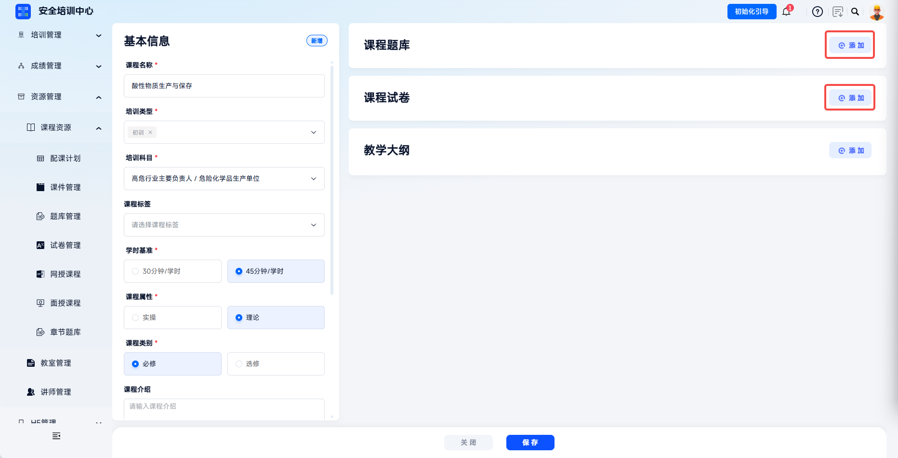

---

Add chapters: click **Add** under teaching syllabus to add a chapter. Chapter name input and binding chapter question banks and papers are supported.

> Question banks must be configured in advance under **Resource Management - Course Resources - Chapter Question Bank** before they can be selected. See Learning Center - Resource Management - Question Bank Customization.
> Papers must be configured in advance under **Resource Management - Course Resources - Paper Management** before they can be selected. See Learning Center - Resource Management - Paper Customization.

Click **Associate Course** in the current chapter action column, select this chapter's courseware content in order, and click save. The full content can then be added to this chapter in order.

> Courseware must be configured in advance under **Resource Management - Course Resources - Courseware Management**. See Learning Center - Resource Management - Course Customization.

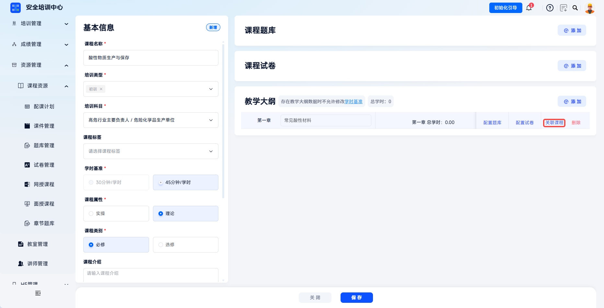
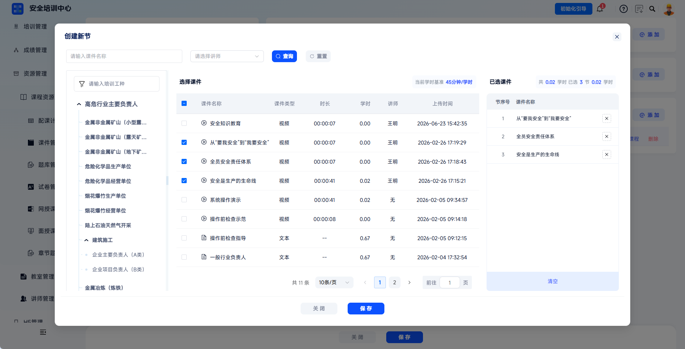
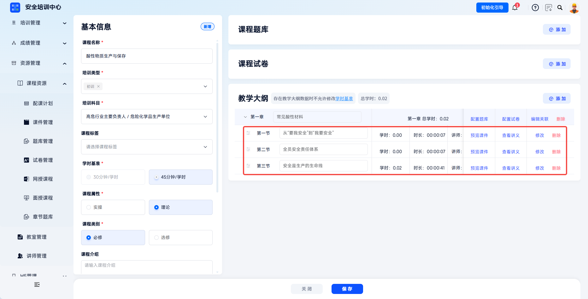

Editing actions:

- Supports custom chapter names;
- Supports previewing section courseware and handouts;
- Supports **Modify** for single-section courseware content. To add sections in this chapter, click **Edit Association** to continue selecting content;
- Supports dragging sections to sort.

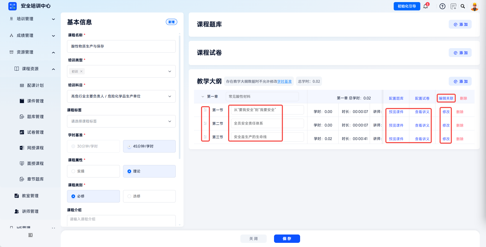

Click **Save** to save the online course package.

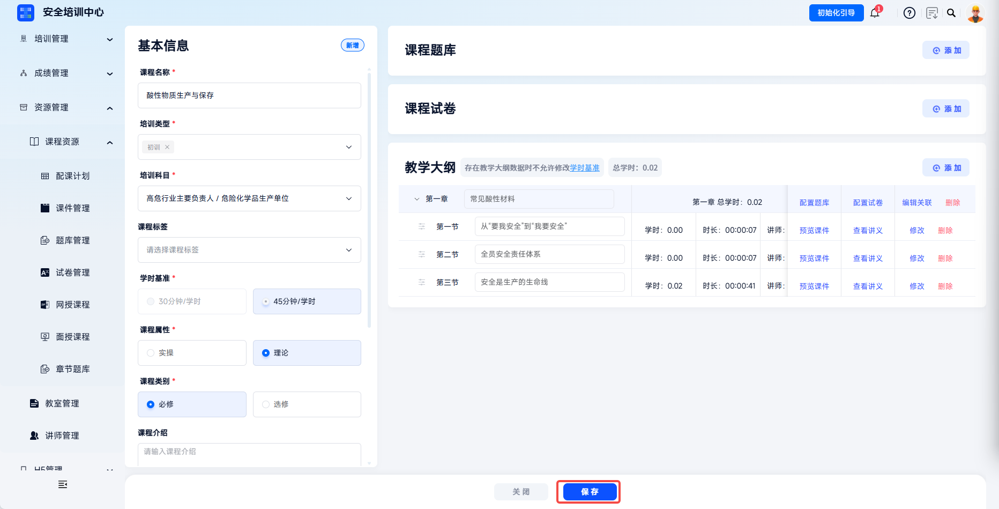

 

### Publish, List, And Edit Course Packages

After a course package is created, the following actions are supported:

- **Edit**: modify course package content. Some fields are restricted for published courses;
- **Publish**: change course status to published. Published courses can be referenced by training tasks;
- **Unpublish**: published but not listed courses can be rolled back to unpublished;
- **List**: list published courses in the learner-side course marketplace;
- **Delete**: only unpublished courses can be deleted. Published courses must be unpublished and delisted before deletion.

 

### Add An Offline Course

Click **Resource Management** - **Course Resources** - **Offline Course**, then click **Add** to open the add offline course dialog.

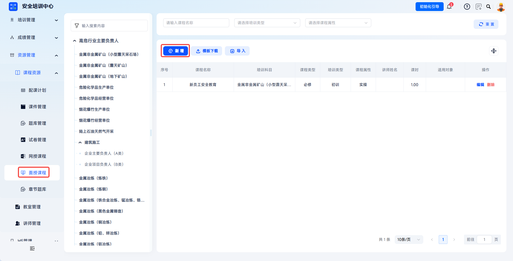

---

Fill in course information:

| Field | Instructions |
| --- | --- |
| Course Name | Enter the offline course title. |
| Training Subject | Select the subject from the dropdown, such as metal/non-metal mine, high-place installation/maintenance/removal operations, and more. |
| Training Type | Select applicable training types, such as initial training, retraining, certificate renewal, and more. |
| Course Type | Select required or elective to determine whether learners must complete it. |
| Course Attribute | Select theory or practical. Theory applies to centralized lectures and knowledge explanation courses. Practical applies to on-site operation and skill training courses. |
| Class Hours | Enter the course class hours. |
| Instructor Name | Select the teaching instructor from the dropdown, associated with instructor archives in **Instructor Management**. |
| Reference Materials | Enter the textbook or reference material name used by the course. |
| Applicable Audience | Enter the applicable learner scope for the course, such as "high-place operation personnel" or "enterprise safety managers". |

---

#### Manage Offline Courses

- **Edit**: modify basic information such as course name, instructor, and class hours;
- **Delete**: delete the offline course. Delete courses already referenced by training classes cautiously.

 

### Import Offline Courses In Batches

Click **Download Template** to obtain the Excel import template.

Fill in course information according to the template format, including course name, training type, course type, course attribute, class hours, instructor name, and more.

---

Click **Import**, select the training subject, and upload the completed Excel file to create courses in batches. After import, the system returns the import result.

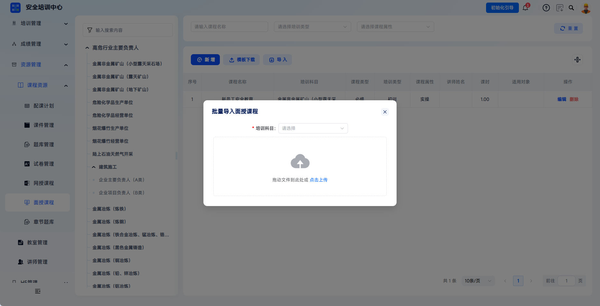

 
 

## FAQ

**Q: Can courseware be associated with multiple courses?**

A: Yes. One courseware item can be associated with multiple online or offline courses.

---

**Q: Why can't a listed course be unpublished?**

A: A listed course means learners may already be learning it. To ensure continuity of learner progress, the system restricts directly unpublishing listed courses. To modify it, delist it first, then unpublish it, make changes, and publish and list it again.

---

**Q: Can one course package be associated with multiple papers?**

A: No. One course package can be associated with only one paper.

---

**Q: Why can't some instructors be found in the Instructor Name dropdown?**

A: Check whether the instructor has been archived in **Instructor Management** and whether the instructor status is enabled.
