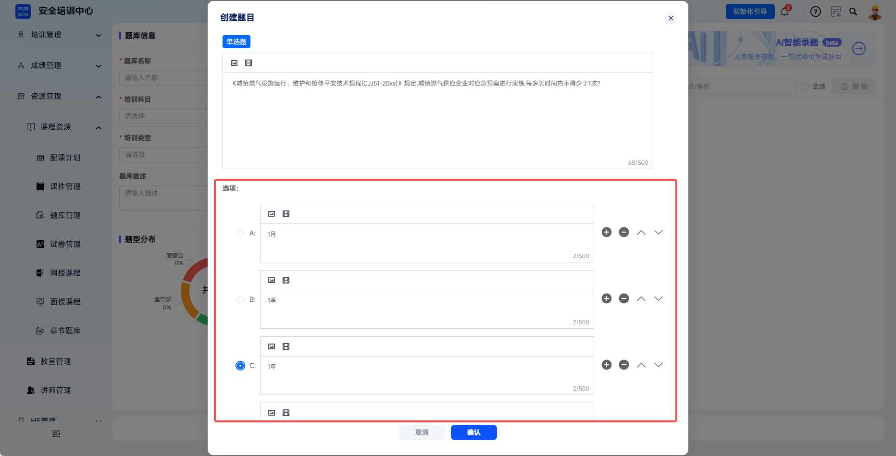
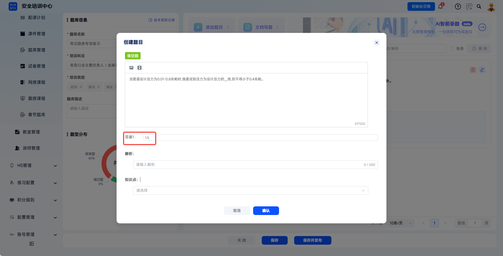
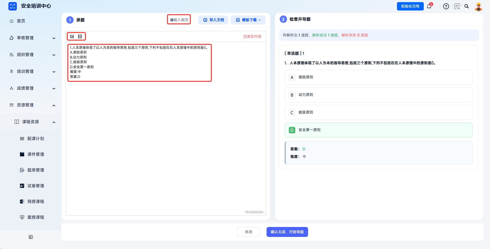
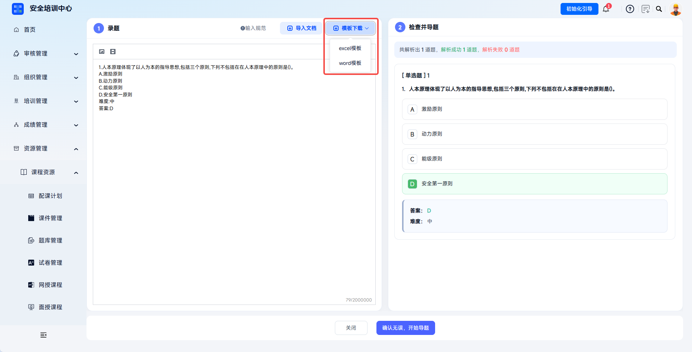

# Question Bank Customization

The platform supports creating dedicated question banks by training subject, training type, region, and other dimensions, enabling classified management and version control of question resources. Administrators can synchronize official standard question banks through system built-in question banks, or independently create internal enterprise question banks to meet multi-scenario assessment needs such as certification exams, daily practice, and special-topic training.

This document is typically used in the following scenarios:

- Creating enterprise custom question banks;
- Entering single questions or importing questions in batches;
- Viewing, editing, or deleting questions in a question bank;
- Saving and publishing question banks to the learner side.

 
 

## Workflow

### Create A Question Bank

Click **Resource Management** - **Course Resources** - **Question Bank Management** to enter the question bank list page.

The left side is the training subject category tree, and the right list displays question bank name, training type, question bank purpose, question bank description, training subject, question count, creation time, and other information.

Target question banks can be filtered by **Question Bank Name**, **Question Bank Status**, and **Creation Time**.

---

Click **Add** to open the **Add Question Bank** dialog.

| Field | Instructions |
| --- | --- |
| Question Bank Name | Required. Use a format such as "Question Bank: XXX (New Syllabus)" for easy identification. |
| Training Subject | Required. Select the training subject to which the question bank belongs from the dropdown. |
| Training Type | Select applicable training types, such as initial training, retraining, certificate renewal, technician, intermediate, junior, and more. |
| Question Bank Description | Add information such as source, purpose, drawing rules, version number, and more. |

 

### Import A Single Question

Click **Add Question** and select the corresponding question type option, such as single-choice, multiple-choice, true/false, fill-in-the-blank, or short-answer.

---

Question stem: enter the question description in the text box. Images or videos can be inserted by clicking the image icon to upload.

---

Single-choice question: ABCD are provided as default options. Enter answers in the option boxes and click the radio button before an option to set the correct answer. Click **+** to add an option, **-** to delete an option, and the up/down arrows to adjust option order.

---

Multiple-choice question: ABCD are provided as default options. Enter answers in the option boxes and select checkboxes before options to set correct answers. Click **+** to add an option, **-** to delete an option, and the up/down arrows to adjust option order.

---

True/false question: only **Correct** or **Incorrect** needs to be set.

---

Fill-in-the-blank question: enter the correct answer for the blank.

---

Short-answer question: enter the reference answer. Points can be awarded based on key points.

---

Explanation: enter answer explanation to help learners understand the knowledge point.

Knowledge point: select the related knowledge point tag from the dropdown.

---

Click **Confirm** to save, and the question is successfully entered into the question bank.

 

### Import Questions In Batches

Click **Document Import** to enter the question entry page.

---

Edit questions in the editor according to the input specifications and examples. The toolbar above the editor supports inserting images and videos.

---

Click **Download Template** to download a Word or Excel template. Edit it and upload it to quickly import questions in batches.

---

Check and import: questions must be entered according to the input specifications to be parsed correctly. Parsing results are displayed on the right according to parsing status. If parsing errors occur, an error prompt is shown and incorrect questions are highlighted in the preview area. Operators can locate and correct questions based on the prompt.

---

After confirming all questions are correct, click **Confirm Correct, Start Import** to successfully import all questions into the question bank.

 

### Manage Questions And Publish

Questions can be displayed by type, including single-choice, multiple-choice, true/false, fill-in-the-blank, and short-answer. Questions can be searched and filtered by question stem, knowledge point, and explanation. The left side displays the question type distribution of the question bank.

---

Actions:

- **Edit**: modify question content, answers, explanations, and other information;
- **Delete**: delete the question. Delete questions already used in exams cautiously;
- Select multiple questions or **Select All**, then click **Delete** to remove questions in batches;
- Click **Save** to save question bank changes. Click **Save And Publish** to save the content and publish the latest version to the learner side.

 
 

## FAQ

**Q: Can a published question bank be deleted?**

A: A published question bank that has been referenced by exams cannot be directly deleted, to avoid affecting historical result traceability. To stop using it, unpublish it so it is no longer referenced by new exams.

---

**Q: How do I insert images when entering a single question?**

A: Upload images using the image entry supported in the question editor on the single-question entry page.

---

**Q: How should I handle "question type format error" during batch import?**

A: Check that the question type value in the Excel template is one of single-choice, multiple-choice, true/false, fill-in-the-blank, or short-answer. Avoid extra spaces or special characters.

---

**Q: How should correct answers for multiple-choice questions be entered?**

A: Enter multiple correct options according to template requirements and avoid extra spaces or special characters.
