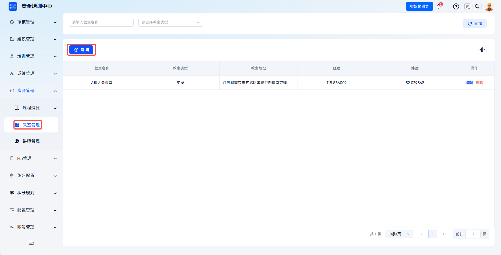
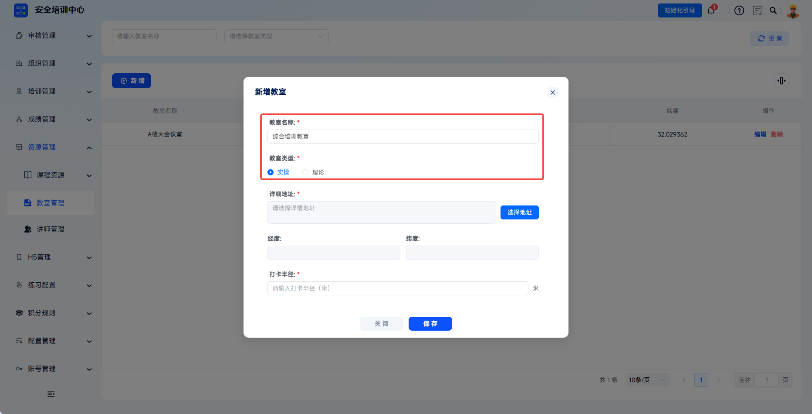
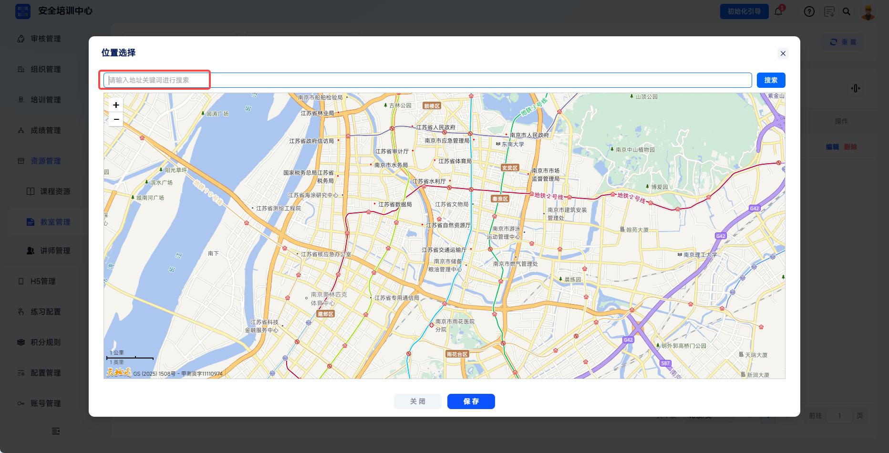
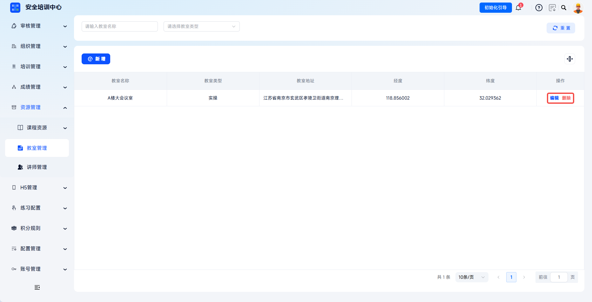

# Classroom Management

The platform supports digital management of offline training classrooms, enabling precise configuration of classroom type, geographic location, check-in range, and other information. Administrators can automatically obtain longitude and latitude coordinates through map-based location selection and set electronic fence check-in radius to ensure offline training check-in locations are authentic and valid, meeting compliance requirements for traceable training processes.

> Article 15 of the Measures for the Administration of Safety Production Training requires safety training archives to truthfully record training time, content, participants, and other information. Through classroom management, combined with GPS positioning and electronic fence technology, the platform ensures training authenticity and traceability.

This document is typically used in the following scenarios:

- Adding offline classrooms;
- Configuring classroom type, address, and check-in radius;
- Editing or deleting classrooms;
- Referencing classrooms as class locations in training tasks.

 
 

## Workflow

### Add A Classroom

Click **Resource Management** - **Classroom Management** in the left menu to enter the classroom list page. Click **Add** to open the **Add Classroom** dialog.

 

### Fill In Classroom Information

Fill in classroom name, classroom type, detailed address, and check-in radius as required on the page.

| Field | Instructions |
| --- | --- |
| Classroom Name | Required. Enter the classroom identifier name. |
| Classroom Type | Required. Select practical or theoretical. Practical applies to on-site operation, skill training, and simulation drills. Theoretical applies to centralized lectures, video teaching, and theoretical exams. |
| Detailed Address | Required. Click **Select Address** to search for the classroom location, or drag the map pin to lock the position. |

---

Search on the map or drag the location pin to the actual classroom location. The system automatically obtains the longitude and latitude coordinates and supports manual fine-tuning.

---

Set the check-in radius according to the actual scenario, then click **Save** to complete classroom configuration.

| Scenario | Recommended Check-In Radius |
| --- | --- |
| Indoor classroom | 50-100 meters |
| Outdoor training ground | 100-200 meters |
| Large factory building | 200-500 meters |

 

### Manage Classrooms

After a classroom is created, it can be edited or deleted in the list. Delete classrooms referenced by training classes cautiously.

| Action | Description |
| --- | --- |
| Edit | Modify classroom name, type, address, coordinates, check-in radius, and other information. |
| Delete | Delete the classroom configuration. Delete classrooms referenced by training classes cautiously. |

 

### Associate With Training Tasks

After configuration is complete, when creating offline courses or training tasks and selecting class location, choose from the configured classroom list. When learners check in for the task, the system verifies whether GPS location is within the classroom check-in radius.

 
 

## FAQ

**Q: What should I do if map location selection cannot locate accurately?**

A: Check whether the network connection is normal and whether the browser allows location permissions. If indoor map accuracy is insufficient, obtain approximate coordinates outdoors first, then manually fine-tune longitude and latitude values.

---

**Q: Can one classroom be associated with multiple tasks?**

A: Yes. One classroom can be referenced by multiple training classes at the same time, but scheduling conflicts should be avoided. The system only verifies check-in location and does not restrict multiple tasks from using the same classroom during the same time period.

---

**Q: Will modifying classroom coordinates affect historical check-in records?**

A: No. Completed check-in records are not affected. Coordinate changes apply only to subsequent check-ins.

---

**Q: Can learners still check in after a classroom is deleted?**

A: No. After a classroom is deleted, training classes associated with that classroom cannot perform location verification check-in.
