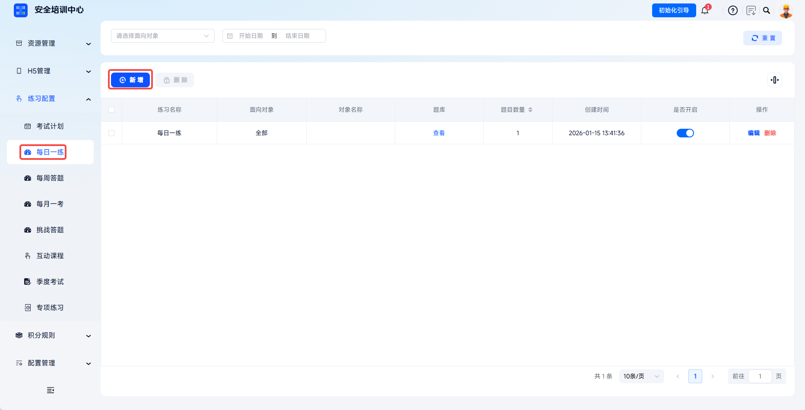
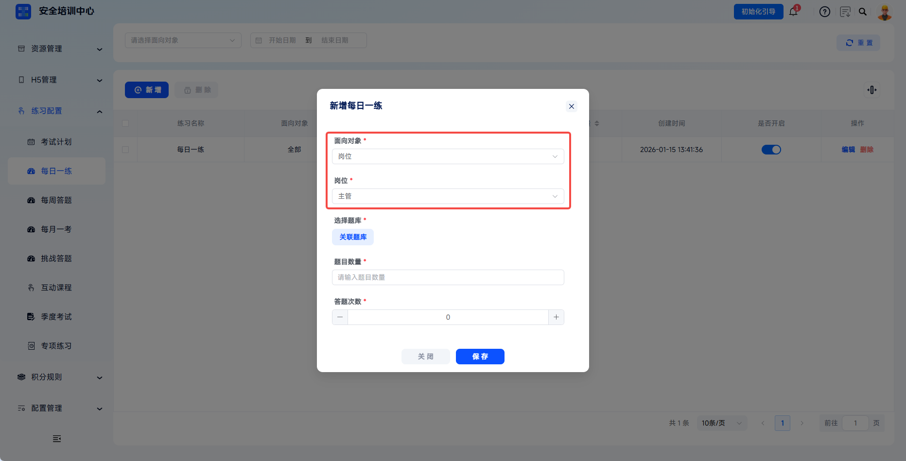
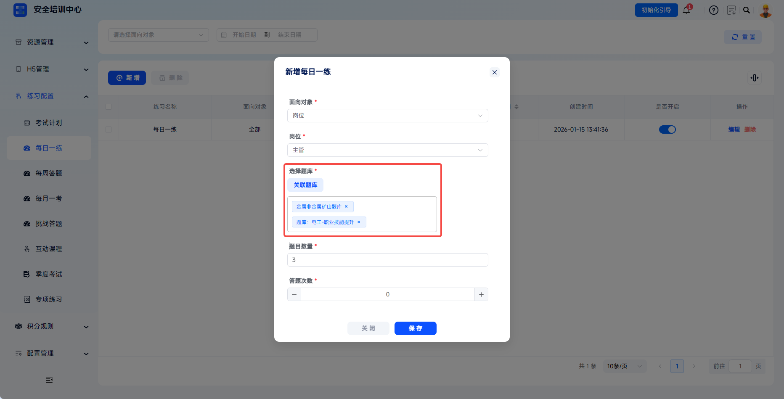
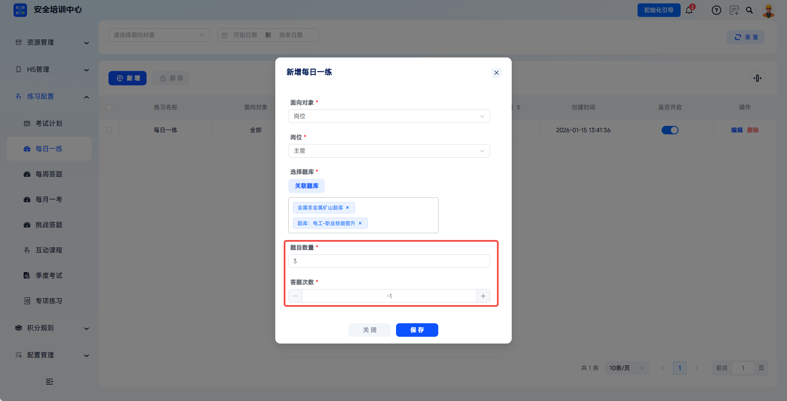
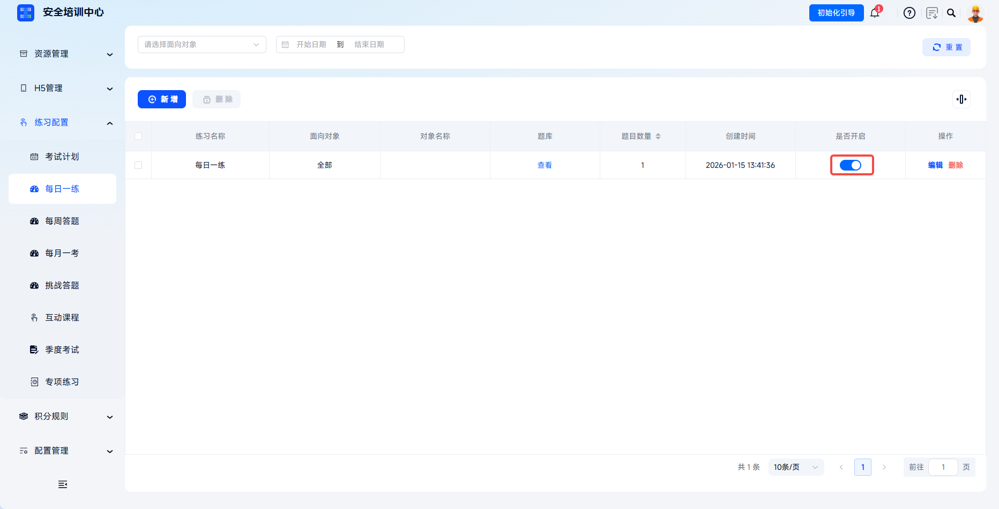
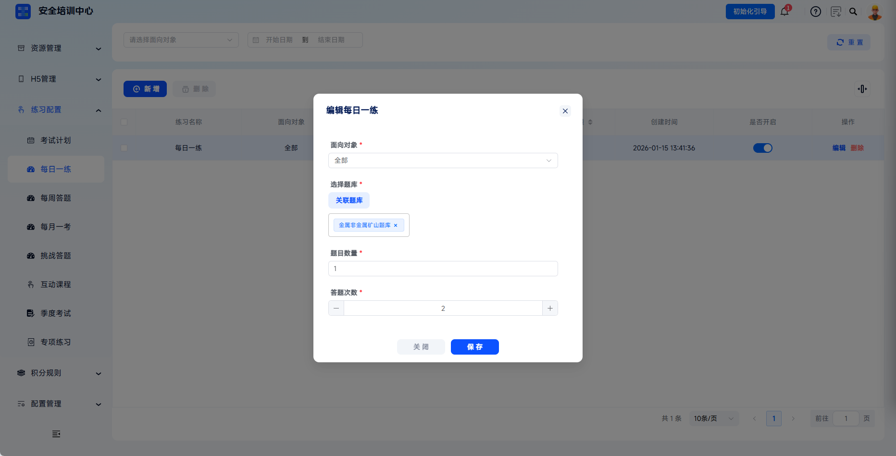

# Practice Configuration

The platform supports configuring daily question practice by position. Through question bank association and parameter settings, it enables personalized learning pushes. Administrators can customize rules such as question count and answer attempts, helping learners use fragmented time to consolidate safety knowledge, form continuous learning habits, and improve training effectiveness.

This document uses **Daily Practice** as an example to explain the configuration process. Weekly practice, challenge quizzes, monthly exams, special-topic answering, interactive answering, quarterly exams, and other features follow similar workflows and can be configured by referring to this document.

 
 

## Workflow

### Add Daily Practice

Click **Practice Configuration** - **Daily Practice** in the left menu to enter the daily practice list page. Click **Add** to open the **Add** dialog.

 

### Set Target Audience

Select the applicable practice scope according to business needs. When **All** is selected, all learners can participate. When **Position** is selected, specific position categories must be selected further.

| Field | Instructions |
| --- | --- |
| Target Audience | Required. Select all or position. |
| Position | Required when target audience is position. Used to limit personnel who can participate in the practice. |

 

### Associate Question Banks

Click **Associate Question Bank** to open the question bank selection dialog. The left side displays all published question banks, including question bank name, training subject, category, question count, and other information. Search by question bank name is supported.

---

After selecting target question banks, click **Save** to complete association. The selected question banks are displayed in the **Selected Question Banks** area on the right.

 

### Set Practice Rules

Set question count, answer attempts, and other parameters according to page fields, then click **Save** to complete daily practice configuration.

| Field | Instructions |
| --- | --- |
| Question Count | Required. Enter the number of questions pushed daily. |
| Answer Attempts | Required. Set the number of attempts a learner can answer daily. Must be a positive integer or -1. -1 means unlimited attempts. |

 

### Enable Daily Practice

Find the newly created daily practice configuration on the list page and click the switch in the **Enabled** column to turn it on. After it is enabled, this daily practice can be used on the learner side.

 

### Manage Daily Practice

After configuration is created, it can be viewed, edited, or deleted in the list.

---

Click **Edit** to modify target audience, position, question banks, question count, answer attempts, and other configurations.

---

Click **Delete** to delete the daily practice configuration. Historical records of participating learners are retained. Select multiple configurations and click **Delete** to remove them in batches.

| Action | Description |
| --- | --- |
| View | View question bank details for the daily practice configuration. |
| Edit | Modify target audience, position, question banks, question count, answer attempts, and other configurations. |
| Delete | Delete the configuration. Historical records of participating learners are retained. |

 
 

## FAQ

**Q: Can multiple question banks be associated?**

A: Yes. Multiple question banks can be selected in the **Associate Question Bank** dialog. The system randomly draws questions from all associated question banks to form daily practice.

---

**Q: Will modifying daily practice configuration affect learners who have already answered questions?**

A: No. Historical records are not affected. After modifying configuration, such as changing question banks or adjusting question count, only subsequent pushed questions are affected. Completed answer records and scores remain unchanged.
