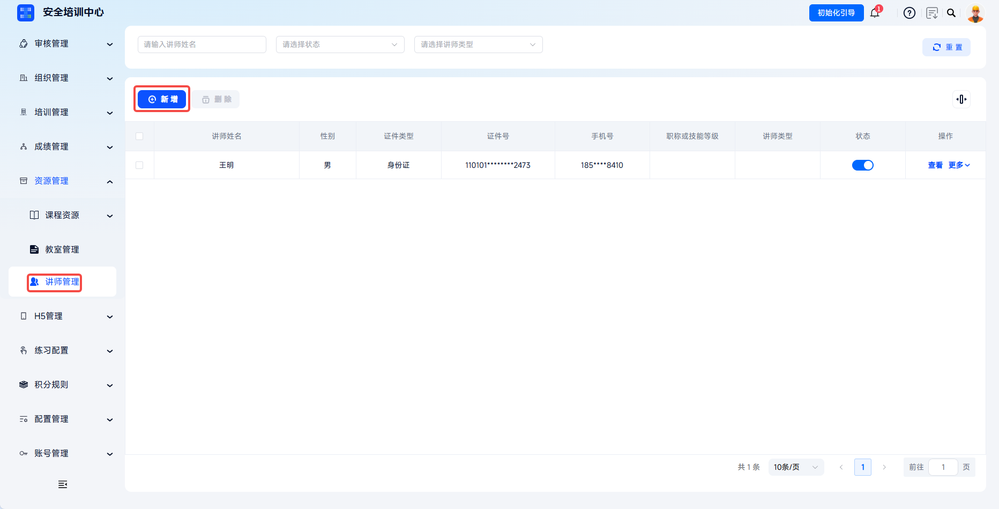
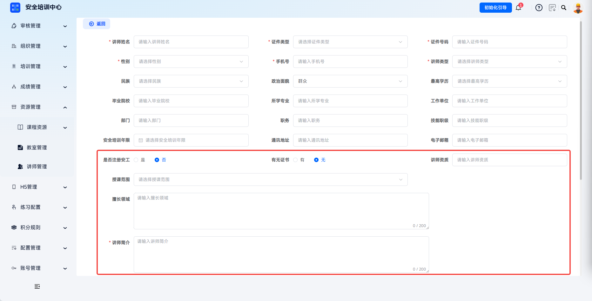
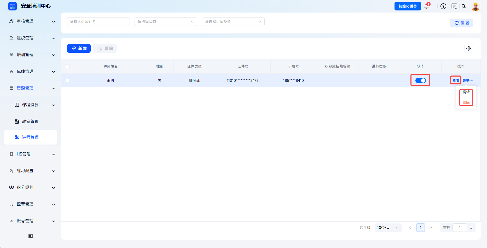

# Instructor Management

The platform supports full-lifecycle digital management of training instructors, enabling standardized maintenance of instructor qualifications, teaching scope, professional fields, and other information.

> Documents such as the Measures for the Administration of Safety Production Training stipulate that safety training instructors should have corresponding professional knowledge, practical experience, and teaching ability, and should pass assessment. Through instructor management, the platform establishes instructor qualification archives and supports full traceability of who trained, whom they trained, and what they trained.

This document is typically used in the following scenarios:

- Creating instructor archives;
- Maintaining instructor qualifications, teaching scope, and profile;
- Enabling, disabling, viewing, editing, or deleting instructors;
- Referencing instructors in courseware management or offline courses.

 
 

## Workflow

### Add An Instructor

Click **Resource Management** - **Instructor Management** in the left menu to enter the instructor list page. Click **Add** to enter the **Add Instructor** details page.

 

### Fill In Basic Information

Fill in basic information as required, including instructor name, document type, document number, gender, mobile number, instructor type, and more.

| Field | Instructions |
| --- | --- |
| Instructor Name | Required. Enter the real name. |
| Document Type | Required. Select ID card, passport, or other. |
| Document Number | Required. Enter the unique number of the corresponding document. |
| Gender | Required. Select male or female. |
| Mobile Number | Required. Enter contact information. |
| Instructor Type | Required. Distinguish between full-time and part-time instructors. |

---

Continue filling in detailed information such as ethnicity, political affiliation, highest education level, graduation institution, major, employer, department, position, skill level, years of safety training, mailing address, and email.

 

### Fill In Professional Qualification Information

Fill in whether the instructor is a registered safety engineer, whether certificates are available, instructor qualifications, teaching scope, areas of expertise, and instructor profile.

| Field | Instructions |
| --- | --- |
| Registered Safety Engineer | Indicates whether the instructor is a registered safety engineer. |
| Certificate Available | Select yes or no. If yes is selected, upload the certificate. |
| Instructor Qualification | Enter the qualification certificate name and number. |
| Teaching Scope | Select the training subject scope that can be taught from the dropdown. |
| Areas Of Expertise | Enter a description of professional strengths, limited to 200 characters. |
| Instructor Profile | Required. Describe the instructor's background and experience in detail, limited to 200 characters. |

 

### Upload Attachments And Save

Upload the instructor avatar and title certificate. After confirming the information is correct, click **Save** to complete instructor archiving. The default status is enabled.

| Attachment | Upload Instructions |
| --- | --- |
| Avatar | Upload an instructor photo. jpg/png format is supported, no more than 1 MB, 5:7 ratio. |
| Title Certificate | Upload qualification certificate scans. jpg/png format is supported, each no more than 2 MB, up to 5 images. |

 

### Manage Instructors

After an instructor is created, the instructor can be enabled or disabled, and the instructor archive can be viewed, edited, or deleted. After disabling, the instructor no longer appears in course configuration option lists.

| Action | Description |
| --- | --- |
| Status Switch | Quickly enable or disable the instructor. |
| View | Preview complete instructor archive information. |
| Edit | Modify instructor information and update qualification certificates. |
| Delete | Delete the instructor archive. Instructors with existing teaching records are recommended to be retained. |

 

### Reference In Courses

After instructor information is configured, instructors can be set when configuring course chapters in **Courseware Management**, or selected as teaching instructors when creating offline courses under **Offline Course**.

 
 

## FAQ

**Q: Why can't I find an instructor when referencing them after adding the instructor?**

A: Check whether the instructor status is enabled, whether the instructor's teaching scope includes the target course subject, and whether the instructor type matches the course requirements. If it was just saved, refresh the page or wait for system synchronization.

---

**Q: How should an instructor's teaching scope be set?**

A: When adding or editing an instructor, use the **Teaching Scope** dropdown to select the training subjects the instructor can teach. Multiple selection is supported.

---

**Q: How do I update changed instructor information?**

A: Click **Edit** in the instructor list to update information. If the instructor obtains a new qualification certificate, upload it under **Title Certificate** and update certificate information in the **Instructor Qualification** field.

---

**Q: Does disabling an instructor affect courses already associated with the instructor?**

A: After disabling, the instructor no longer appears in option lists for new courses, but historical course information already associated with the instructor remains unchanged.
