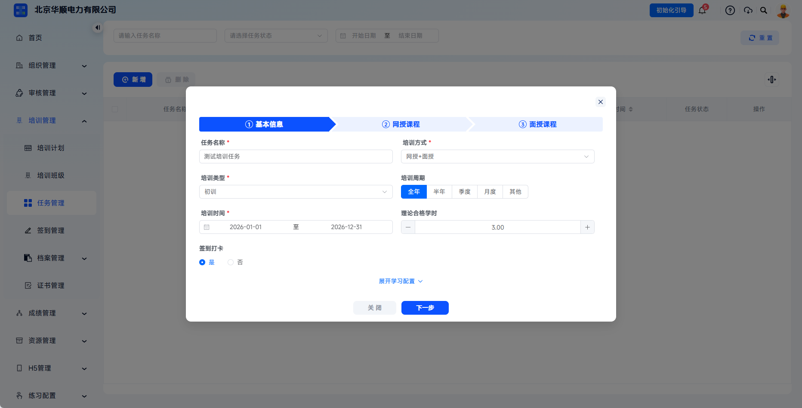
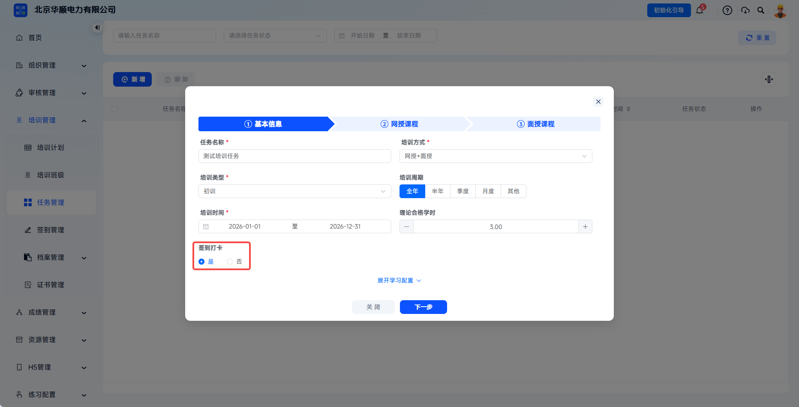
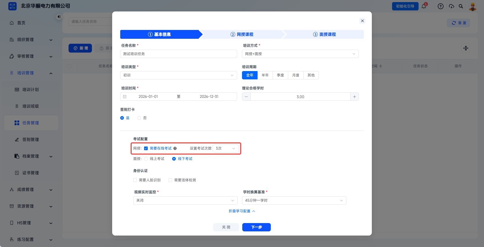
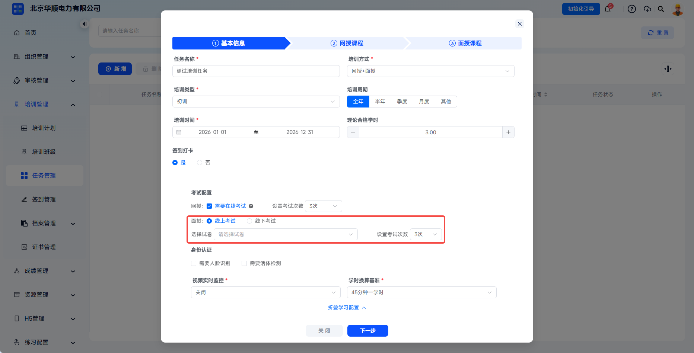
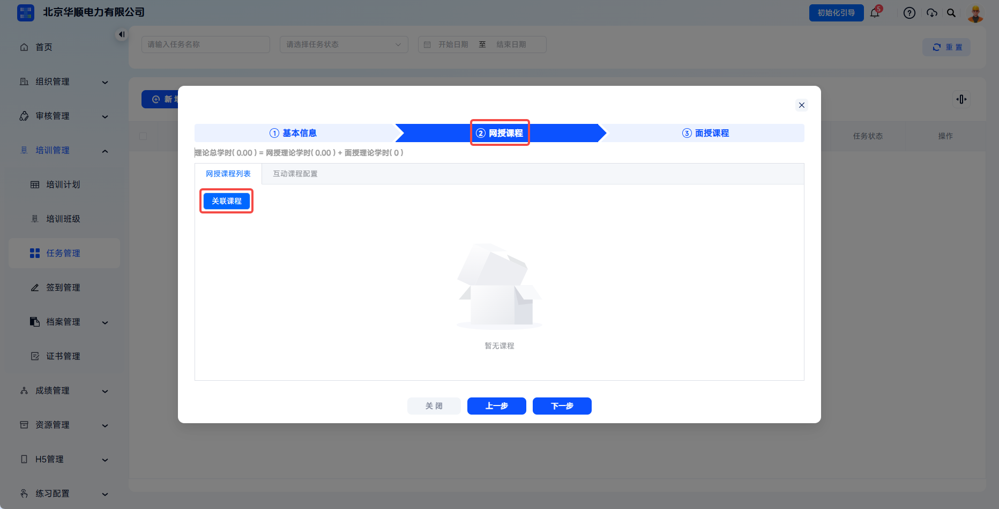
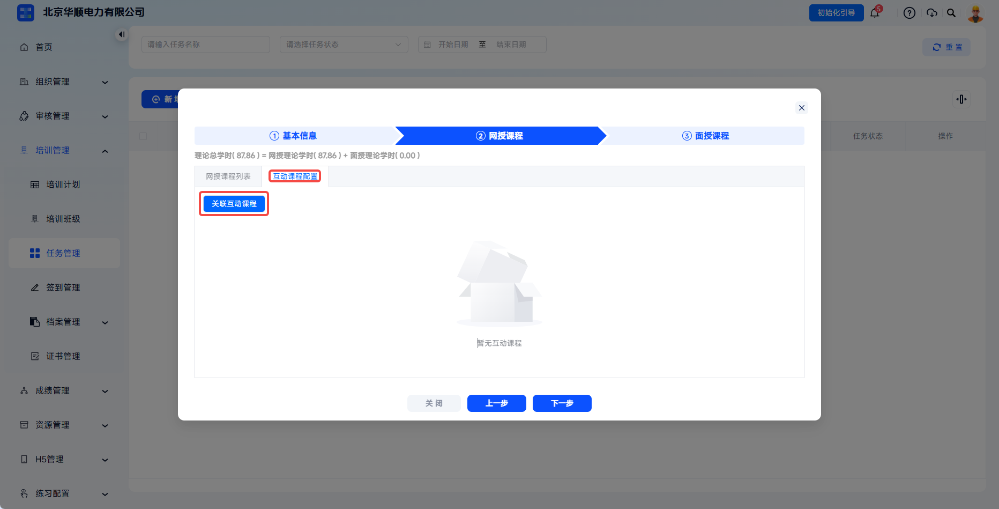
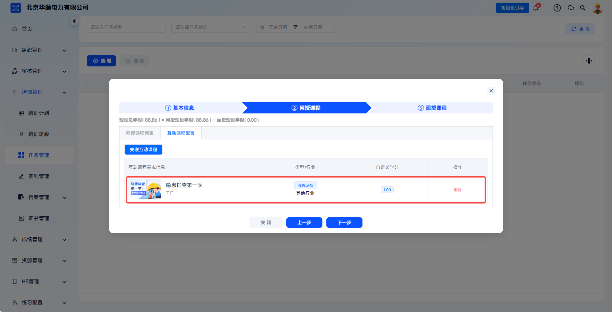
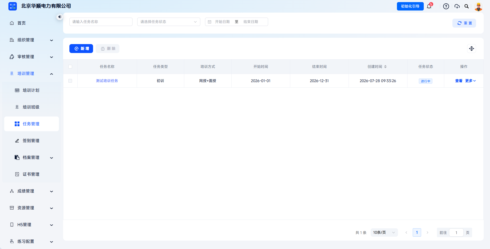

# Create Training Task

A training task is a training instruction issued to an enterprise or organization. It supports large-scale and periodic training coordination, including online, offline, and blended teaching modes, and can associate plans, instructors, classrooms, exams, and certificate rules with one click.

This document is typically used in the following scenarios:

- Creating a new training task;
- Configuring online courses, offline courses, or interactive courses;
- Configuring training rules such as check-in, exams, and identity verification;
- Saving the task and issuing it to the learner side.

 
 

## Workflow

### Enter Task Management

Click **Training Management** - **Task Management** in the left menu to enter the task list page. The page displays historical tasks and related information, including task name, task type, training method, start time, end time, creation time, task status, and more. Click **Add** to create a new task.

 

### Fill In Basic Information

Fill in the target audience, training type, time period, and assessment standards for the training task as required on the page.

| Field | Instructions |
| --- | --- |
| Task Name | Required. Enter a task name, such as "2026 Annual All-Staff Safety Retraining". |
| Training Method | Required. Options include online training, offline training, online + offline, and more. |
| Training Type | Required. Select the training nature, such as initial training, retraining, annual safety retraining, and more. |
| Training Period | Quickly select full year, half year, quarter, or month. Select other to customize start and end times. |
| Training Time | Required. Set task start date and end date, determining the task validity period. |
| Required Theory Study Hours | Set the total theory study hours required to complete this task as a reference standard for task creation. |

 

### Configure Task Rules

Set check-in, exams, identity verification, and other rules as needed.

Check-in is used to choose whether learners must check in before or during training.

---

Online training exams are used to choose whether online exams are required and to set the number of exam attempts.

---

Offline training exams support online exams or offline exams. When online exams are selected, search for and select the corresponding test paper and set the number of exam attempts. If no test paper is available, configure test papers first.

---

Identity verification can use face recognition or liveness detection. Verification can be triggered by fixed intervals, minimum attempts per single video, or random strategy, with time limits and authentication failure limits configured for each attempt.

| Configuration Item | Description |
| --- | --- |
| Fixed Interval | Force verification at time intervals. Suitable for long-duration idle monitoring. |
| Minimum Per Video | Set the minimum number of verification attempts by video. The system triggers verification at random time points. |
| Random | Trigger randomly within the default time interval range and specify the first popup time point. |
| Time Limit Per Attempt | Time limit for each identity verification. Timeout is judged as failure. |
| Authentication Failure Limit | After exceeding the allowed failure count, identity is judged incorrect. |
| Real-Time Video Monitoring | Enable or disable real-time video snapshots during learning. |
| Study-Hour Conversion Basis | Select 30 minutes per study hour or 45 minutes per study hour. |

 

### Configure Online Courses

After clicking **Expand Learning Configuration** and entering course configuration, the page displays the formula for total theory study hours: total theory study hours = online theory study hours + offline theory study hours. The value changes in real time as courses are selected.

On the **Online Course List** tab, click **Associate Course** to select required courses.

---

In the dialog, select the online courses that need to be included in this task.

---

Course package learning settings control whether passing an exam is required and whether chapter-sequence learning is enabled. After chapter-sequence learning is enabled, learners must study according to the course package catalog order and cannot skip unlearned courses.

---

Switch to the **Interactive Course Configuration** tab and click **Associate Interactive Course** to select required interactive courses. If no interactive course is available, confirm course permissions or resource configuration.

 

### Configure Offline Courses

Offline course configuration displays dates within the training time range in calendar form.

---

Click a specific date to open the **Course Schedule** dialog and select target courses. If no course is available or a custom course needs to be selected, click **Add Course** or first configure it under **Resource Management - Offline Course**.

---

After clicking **Add Course**, fill in course name, class date, total class study hours, instructor, class time, classroom, class content, and other information.

| Field | Instructions |
| --- | --- |
| Course Name | Required. Select from dropdown or add a new course. |
| Class Date | Required. Select a fixed date in the calendar. |
| Total Class Study Hours | Required. Set the study hours for the offline course. |
| Instructor | Required. Select a maintained instructor or add a new instructor. |
| Class Time | Required. Set start time and end time. |
| Classroom | Required. Select a maintained classroom or add a new classroom. |
| Class Content | Enter notes for the specific teaching content of the course. |

---

The task list action column supports follow-up management actions such as view, edit, copy, and delete.

| Action | Description |
| --- | --- |
| View | View task details, associated plans, and personnel completion progress statistics. |
| Edit | All information can be edited before the task starts; some information can be changed while in progress; ended tasks cannot be edited. |
| Copy | Copy a new task and keep all information from the copied object. The time defaults to starting tomorrow. |
| Delete | Only tasks in not-started status can be deleted. |

 

### Save The Task

After confirming basic information, learning configuration, course content, and exam configuration, click **Save** to submit the task.

---

After the task is created successfully, the system returns to the list page. The status is automatically determined according to the current time. You can continue to **Learner Management** to add participants.

 
 

## FAQ

**Q: Must online and offline courses be configured when creating a task?**

A: It depends on the training method. If the training method is "online", online courses must be configured. If it is "offline", offline courses must be configured. If it is "online + offline", both must be configured.

---

**Q: Can the training time span exceed one year?**

A: Yes, but reasonable planning is recommended. Excessively long cycles are not conducive to training management or learner motivation.

---

**Q: Can course configuration still be modified after task creation?**

A: Yes. After modification, course configuration is updated to the learner H5 side in real time and does not affect course arrangements for already-started tasks.

---

**Q: Why do some tasks not have a delete option?**

A: Only not-started tasks can be deleted. Ended tasks do not support editing or deletion.
