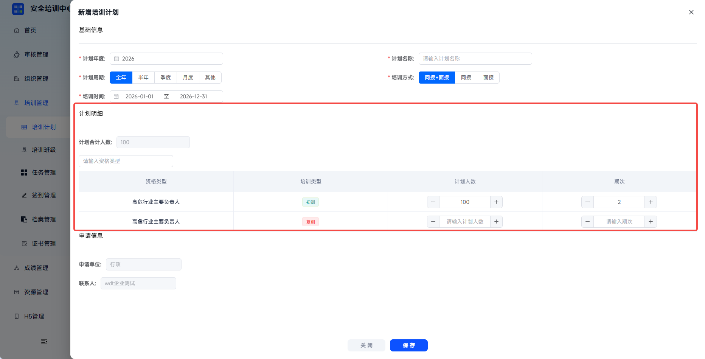

# Training Plan

This function is used to centrally manage the creation and release of various enterprise training plans. Administrators can configure training content, participants, and completion requirements. The system automatically issues learning tasks, and the full training execution process is traceable, serving as an important compliance credential for safety production training.

This document is typically used in the following scenarios:

- Creating a training plan;
- Maintaining plan year, cycle, participant count, and sessions;
- Viewing, editing, or deleting existing training plans;
- Using the training plan as the upper-level coordination plan for subsequent training tasks.

 
 

## Workflow

### Add A Plan

Click **Training Management** - **Training Plan**, then click **Add** to open the add training plan page.

 

### Fill In Basic Information

Fill in plan year, plan name, plan cycle, training method, and training time as required on the page. A training plan is used for macro-level coordination and can be associated downward with one or more training tasks. It can be regarded as the upper-level plan of associated tasks.

Training time is generated by default according to the yearly interval and can be manually shortened according to actual arrangements.

| Field | Instructions |
| --- | --- |
| Plan Year | Required. Select the corresponding year. Cross-year plans are not supported. |
| Plan Name | Required. Use a concise description of the plan target or training topic. |
| Plan Cycle | Required. Select full year, half year, quarter, or month. If it does not belong to a quick interval, select **Other** and customize training time. |
| Training Method | Required. Select online + offline, online, or offline. Match the actual resources. |
| Training Time | Required. Select start and end dates. The system defaults to the yearly interval and can be manually shortened. |

---

### Fill In Planned Participant Details

Planned participant details are optional. Enter planned participant count and sessions separately according to trainable qualification types and training types in the organization. The upper-left corner supports searching related qualification types and filling them in.

 

### Save The Plan

After completing the form, click **Save** to create the plan.

 

### Manage Plans

After selecting a target plan, you can view, edit, or delete it in the list. Deleting a plan does not affect already associated tasks.

| Action | Description |
| --- | --- |
| View | Open the detail page and display detailed plan information. |
| Edit | Modify plan year, name, cycle, time, training method, planned participant count, and sessions. |
| Delete | Delete directly without affecting associated tasks. |

 
 

## FAQ

**Q: What is the relationship between plans and tasks?**

A: A training plan is a macro-level coordination plan. It can be associated downward with one or more tasks and can be regarded as the upper-level plan of associated tasks.

---

**Q: Can a training plan be associated with multiple tasks? What is the relationship between tasks?**

A: Yes. Tasks are parallel to each other, and the plan is used for unified management.

---

**Q: Can sessions be added after a plan is released?**

A: Yes. Enter plan **Edit** to add sessions.

---

**Q: What if the planned participant count does not match actual enrollment?**

A: Enter plan **Edit** to adjust the number.

---

**Q: What impact do release and cancellation of a training plan have?**

A: After a training plan is released, it can be associated with tasks. Cancellation and deletion do not affect already associated tasks.
