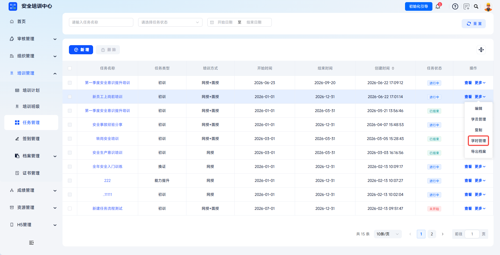
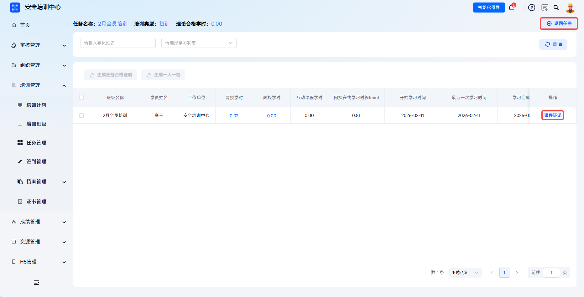
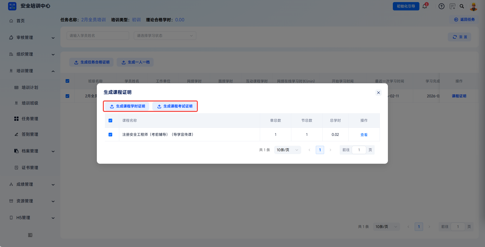

# Learning Progress Tracking

The platform supports real-time tracking of learners' online training study hours, interactive course study hours, and online learning duration by task. Visualized data monitors learning progress and precisely identifies learners who have not met requirements. Administrators can drill down to view individual learner study-hour details, including learning records at course package, chapter, and section levels, and can generate training certificates and personal archives in batches.

> Article 15 of the Measures for the Administration of Safety Production Training requires enterprises to establish and improve safety training archives for employees, truthfully recording training time, content, participants, and assessment results. Through digital study-hour traceability, the platform ensures the training process is traceable and evidence-based.

This document is typically used in the following scenarios:

- Viewing task learner progress;
- Checking online training study hours, interactive course study hours, and online learning duration;
- Filtering learners by learning status, such as not started, learning, completed, or abnormal study hours;
- Generating certificates or archives for qualified learners.

 
 

## Workflow

### Enter Study-Hour Management

In **Training Management** - **Task Management**, find the target task and click **More** - **Study-Hour Management** to enter the task study-hour management page.

 

### View Learning Statistics

The top of the page displays key information for the current task, including task name, training type, and required theory study hours. The **Return To Task** button on the right supports quickly returning to the task list page.

| Data Item | Description |
| --- | --- |
| Basic Information | Task name, learner name, employer. |
| Study-Hour Data | Online training study hours, interactive course study hours, online training learning duration (minutes). |
| Time Records | Learning start time, most recent learning time, learning completion time. |

---

### Filter And Search

Search target learners by **Learner Name**, or use the **Learning Status** dropdown to filter statuses such as not started, learning, completed, and abnormal study hours. Click **Reset** to clear conditions.

 

### Generate Task Certificates And Archives

After selecting learners, click **Generate Task Qualification Certificate** or **Generate One Person, One Archive**. Generating one person, one archive creates a complete archive package for the learner's current training, including registration form, learning records, exam results, certificates, and other content for paper archive retention or regulatory filing.

 

### Generate Course Certificates

Click **Course Certificate** to open the **Generate Course Certificate** dialog, where you can view course information, chapter count, total study hours, and generate course study-hour certificates or course exam certificates as needed.

| Certificate Type | Description |
| --- | --- |
| Generate Course Study-Hour Certificate | Generate a study-hour completion certificate by course package. |
| Generate Course Exam Certificate | Generate an exam qualification certificate by course package. |

 
 

## FAQ

**Q: Why is a learner's "online learning duration" greater than "online training study hours"?**

A: Online learning duration is the accumulated actual video playback time, while online training study hours are effective study hours converted by the system after calculating completion rate, anti-idling rules, and more. If a learner drags the progress bar, pauses too long, or fails face recognition, actual duration may be counted in online duration but not effective study hours.

---

**Q: Why does downloading fail when generating a task qualification certificate?**

A: Check whether the selected learners meet the certificate generation conditions. Only learners who meet all conditions can generate qualification certificates.

---

**Q: What is the purpose of face comparison records in study-hour details?**

A: They verify that the learner personally participated in learning and prevent violations such as proxy learning or idling. Records include verification time, verification result, captured photo comparison similarity, and other information, and are important evidence for regulatory inspections.
